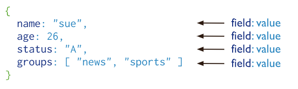

[TOC]


# [MongoDB简单介绍](https://docs.mongodb.com/manual/introduction/#introduction-to-mongodb)

​		介绍了MongoDB中的关键概念，介绍了查询语言，并提供了操作和管理方面的考虑和过程，以及全面的参考部分。


> 粗略记录一些信息，详细信息看官方文档

## [MongoDB概论](https://docs.mongodb.com/manual/introduction/#introduction-to-mongodb)

​		MongoDB中的记录是一个文档，它是由字段和值对组成的数据结构。MongoDB文档类似于JSON对象。字段的值可以包括其他文档、数组和文档数组。



​		使用文档的优点是:

1. 在许多编程语言中，文档(即对象)对应于本地数据类型。

2. 嵌入式文档和数组减少了对昂贵连接的需求。

3. 动态模式支持流畅的多态性。		

## [数据库和集合](https://docs.mongodb.com/manual/core/databases-and-collections/#databases-and-collections)

### [数据库](https://docs.mongodb.com/manual/core/databases-and-collections/#databases)

​		在MongoDB中，数据库保存一个或多个文档集合。为了选择要使用的数据库，在mongo shell中，发出use \<db>语句，如下例所示:

```bash
use myDB
```

#### [Create a Database](https://docs.mongodb.com/manual/core/databases-and-collections/#create-a-database)

​		当选择的数据库不存在时，MongoDB会在第一次存储该数据库的数据时创建该数据库：

```bash
use myDB

db.myNewCollection1.insertOne( { x: 1 } )
```

​		insertOne()操作创建数据库myNewDB和集合myNewCollection1(如果它们不存在的话)。确保数据库和集合的名称都遵循MongoDB的[命名限制](https://docs.mongodb.com/manual/reference/limits/#naming-restrictions)。

### [Collections](https://docs.mongodb.com/manual/core/databases-and-collections/#collections)

​		MongoDB以集合的形式存储文档。集合类似于关系数据库中的表

#### [Create a Collection](https://docs.mongodb.com/manual/core/databases-and-collections/#create-a-collection)

​		如果一个集合不存在，MongoDB会在您第一次存储该集合的数据时创建该集合。

```bash
db.myNewCollection2.insertOne( { x: 1 } )
db.myNewCollection3.createIndex( { y: 1 } )
```

​		insertOne()和createIndex()操作都创建它们各自的集合(如果它们不存在的话)。确保集合名称遵循MongoDB命名限制。

#### [显式创建](https://docs.mongodb.com/manual/core/databases-and-collections/#explicit-creation)

​		MongoDB提供db.createCollection()方法来显式地创建带有各种选项的集合，比如设置最大大小或文档验证规则。如果您没有指定这些选项，则不需要显式地创建集合，因为MongoDB在您第一次存储集合数据时创建了新的集合。

```bash
db.createCollection('testCollections')
```


#### [collMod](https://docs.mongodb.com/manual/reference/command/collMod/#collmod)

​		通过collMod可以向集合添加选项或修改视图定义。

> 3.2版本新增。
>
> 
>
> 默认情况下，集合不要求其文档具有相同的模式;也就是说，单个集合中的文档不需要有相同的字段集，并且一个字段的数据类型可能在一个集合中的不同文档中不同。
>
> 要更改集合中文档的结构，例如添加新字段、删除现有字段或将字段值更改为新类型，请将文档更新为新结构。


获取数据库的集合信息：

```bash
db.getCollectionInfos()
```


#### [修改文档结构](https://docs.mongodb.com/manual/core/databases-and-collections/#modifying-document-structure)

​		要更改集合中文档的结构，例如添加新字段、删除现有字段或将字段值更改为新类型，请将文档更新为新结构。

#### 唯一标识符

​		集合被分配一个不可变UUID。在一个分片集群中，复制集的所有成员和分片的集合UUID保持相同。

​		要检索集合的UUID，可以运行listCollections命令或db.getCollectionInfos()方法。

## [Documents](https://docs.mongodb.com/manual/core/document/#documents)

On this page

- [文档结构](https://docs.mongodb.com/manual/core/document/#document-structure)
- [Dot Notation](https://docs.mongodb.com/manual/core/document/#dot-notation)
- [文档的局限性](https://docs.mongodb.com/manual/core/document/#document-limitations)
- [文档结构的其他用途](https://docs.mongodb.com/manual/core/document/#other-uses-of-the-document-structure)
- [Further Reading](https://docs.mongodb.com/manual/core/document/#further-reading)

​		MongoDB将数据记录存储为BSON文档。BSON是JSON文档的二进制表示，尽管它包含比JSON更多的数据类型。有关BSON规范，请参阅[bsonspec.org](http://bsonspec.org/)。参见[BSON类型](http://bsonspec.org/)。

### [文档结构](https://docs.mongodb.com/manual/core/document/#document-structure)

​		MongoDB文档由字段和值对组成，结构如下:

```json
{
   field1: value1,
   field2: value2,
   field3: value3,
   ...
   fieldN: valueN
}
```

​		字段的值可以是BSON数据类型中的任何一种，包括其他文档、数组和文档数组。例如，以下文档包含不同类型的值:

```javascript
var mydoc = {
               _id: ObjectId("5099803df3f4948bd2f98391"),
               name: { first: "Alan", last: "Turing" },
               birth: new Date('Jun 23, 1912'),
               death: new Date('Jun 07, 1954'),
               contribs: [ "Turing machine", "Turing test", "Turingery" ],
               views : NumberLong(1250000)
            }
```

​		上述字段具有以下数据类型:

- `_id` 包含一个 [ObjectId](https://docs.mongodb.com/manual/reference/bson-types/#objectid).
- `name` 包含一个 `first` 和 `last`字段的嵌入文档.
- `birth` 和 `death` 是一个日期类型
- `contribs` 是字符串数组类型
- `views` NumberLong类型

#### [字段名称](https://docs.mongodb.com/manual/core/document/#field-names)

​		字段名是字符串。

​		文档对字段名有以下限制:

+ 字段名`_id`被保留用作主键;它的值在集合中必须是唯一的，不可变的，并且可以是除数组以外的任何类型。
+ 字段名不能包含空字符。
+ 顶级字段名称不能以美元符号（$）开头。从MongoDB 3.6开始，服务器允许包含点(即.)和美元符号(即$)的字段名。

#### [字段值限制](https://docs.mongodb.com/manual/core/document/#field-value-limit)

​		MongoDB 2.6 through MongoDB versions with [featureCompatibilityVersion](https://docs.mongodb.com/manual/reference/command/setFeatureCompatibilityVersion/#view-fcv) (fCV) set to `"4.0"` or earlier

For [indexed collections](https://docs.mongodb.com/manual/indexes/), the values for the indexed fields have a [`Maximum Index Key Length`](https://docs.mongodb.com/manual/reference/limits/#Index-Key-Limit). See [`Maximum Index Key Length`](https://docs.mongodb.com/manual/reference/limits/#Index-Key-Limit) for details.

### [点符号](https://docs.mongodb.com/manual/core/document/#dot-notation)

​		MongoDB使用点表示法来访问数组元素和内嵌文档的字段。

#### Arrays

​		要通过从0开始的索引位置指定或访问数组元素，请将数组名称与点(.)和从0开始的索引位置连接起来，并将其括在引号中:

```bash
"<array>.<index>"
```

​		例如，给定文档中的以下字段:

```bash
{
   ...
   contribs: [ "Turing machine", "Turing test", "Turingery" ],
   ...
}
```

​		要指定contribs数组中的第三个元素：

```bash
"contribs.2”
```


### [嵌入文档](https://docs.mongodb.com/manual/core/document/#embedded-documents)

​		要用点表示法指定或访问内嵌文档的字段，请将内嵌文档名与点(.)和字段名连接起来，然后用引号括起来:

```bash
"<embedded document>.<field>"
```

​		例如，给定文档中的以下字段:

```json
{
   ...
   name: { first: "Alan", last: "Turing" },
   contact: { phone: { type: "cell", number: "111-222-3333" } },
   ...
}
```

+ 要在name字段中指定名为last的字段，请使用点符号“name.last”。
+ 要在 “contact”文档中指定“phone”文档内的“number”，请使用点符号"contact.phone.number"。

查询嵌入式文档的示例，请参见:

- [Query on Embedded/Nested Documents](https://docs.mongodb.com/manual/tutorial/query-embedded-documents/)
- [Query an Array of Embedded Documents](https://docs.mongodb.com/manual/tutorial/query-array-of-documents/)

### [文档的局限性](https://docs.mongodb.com/manual/core/document/#document-limitations)

​		文档有以下属性:

1. 文件大小限制
2. 文档字段顺序
3. _id字段

#### 文件大小限制

​		最大BSON文档大小为16MB。

​		最大文档大小有助于确保单个文档不会占用过多的RAM或传输期间占用过多的带宽。为了存储大于最大大小的文档，MongoDB提供了GridFS API。有关GridFS的更多信息，请参阅mongofiles和驱动程序文档。

#### 文档字段顺序

​		MongoDB会在写操作之后保持文档字段的顺序，但以下情况除外:

1. _id字段始终是文档中的第一个字段。

2. 包括字段名称重命名的更新可能会导致文档中字段的重新排序。

#### _id字段

​		在MongoDB中，每个存储在集合中的文档都需要一个唯一的`_id`字段，该字段充当主键。如果插入的文档省略了`_id`字段，MongoDB驱动程序会自动为`_id`字段生成一个ObjectId。

​		这也适用于通过[upsert: true](https://docs.mongodb.com/manual/reference/method/db.collection.update/#upsert-parameter)的更新操作插入的文档。

​		`_id`字段有以下行为和约束:

1. 默认情况下，MongoDB在创建一个集合时在`_id`字段上创建一个唯一的索引。
2. `_id`字段始终是文档中的第一个字段。如果服务器首先收到一个不包含`_id`字段的文档，那么服务器将把该字段移到开头。
3. `_id`字段可以包含除数组以外的任何[BSON数据类型](https://docs.mongodb.com/manual/reference/bson-types/)的值。

> 警告:
>
> 为了确保功能复制，不要在_id字段中存储BSON正则表达式类型的值。

​		下面是为`_id`存储值的常见选项:

1. 使用一个ObjectId。
2. 如果可能的话，使用自然唯一标识符。这节省了空间并避免了额外的索引。
3. 生成一个自动递增的数字。
4. 在应用程序代码中生成UUID。为了在集合和`_id`索引中更有效地存储UUID值，将UUID存储为BSON BinData类型的值。
5. 使用驱动程序的BSON UUID功能来生成UUID。请注意，驱动程序实现UUID序列化和反序列化逻辑的方式可能不同，这可能与其他驱动程序不完全兼容。有关UUID互操作性的信息，请参阅驱动程序文档。

> 大多数MongoDB驱动客户端在发送insert操作到MongoDB之前会包含`_id`字段并生成一个ObjectId;但是，如果客户端发送了一个没有`_id`字段的文档，mongod将添加`_id`字段并生成ObjectId。

### [文档结构的其他用途](https://docs.mongodb.com/manual/core/document/#other-uses-of-the-document-structure)

​		除了定义数据记录之外，MongoDB还在整个过程中使用文档结构，包括但不限于:查询过滤器、更新规范文档和索引规范文档

#### 查询过滤文档

​		查询筛选器文档指定确定为读取、更新和删除操作选择哪些记录的条件。

​		您可以使用`<字段>:<value>`表达式来指定相等条件和查询操作符表达式。

```bash
{
  <field1>: <value1>,
  <field2>: { <operator>: <value> },
  ...
}
```

[查询文档](https://docs.mongodb.com/manual/tutorial/query-documents/)

#### 更新文档

​		更新规范文档使用更新操作符指定在db.collection.update()操作期间要在特定字段上执行的数据修改。

```bash
{
  <operator1>: { <field1>: <value1>, ... },
  <operator2>: { <field2>: <value2>, ... },
  ...
}
```

[更新文档](https://docs.mongodb.com/manual/tutorial/update-documents/#update-documents-modifiers)


#### 索引规范文档

​		索引规范文档定义了要索引的字段和索引类型:

```bash
{ <field1>: <type1>, <field2>: <type2>, ...  }
```

