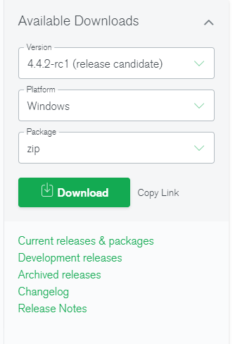
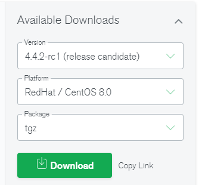
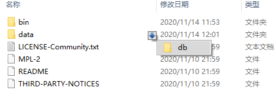
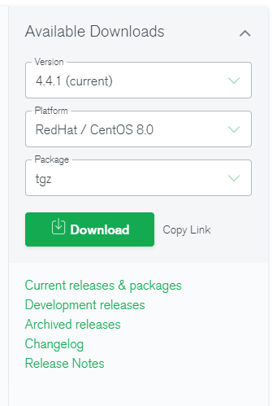
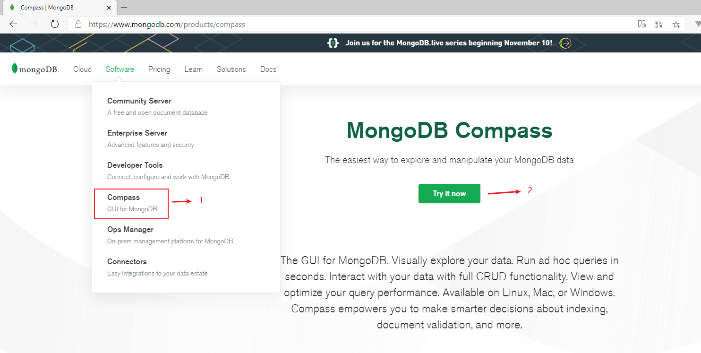
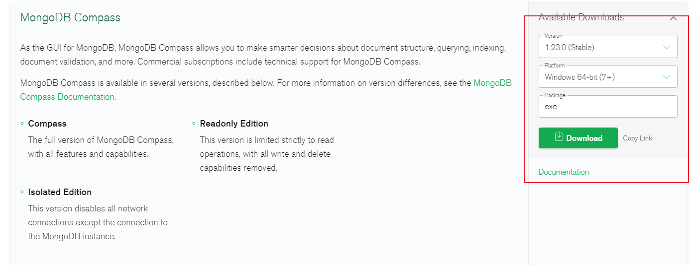
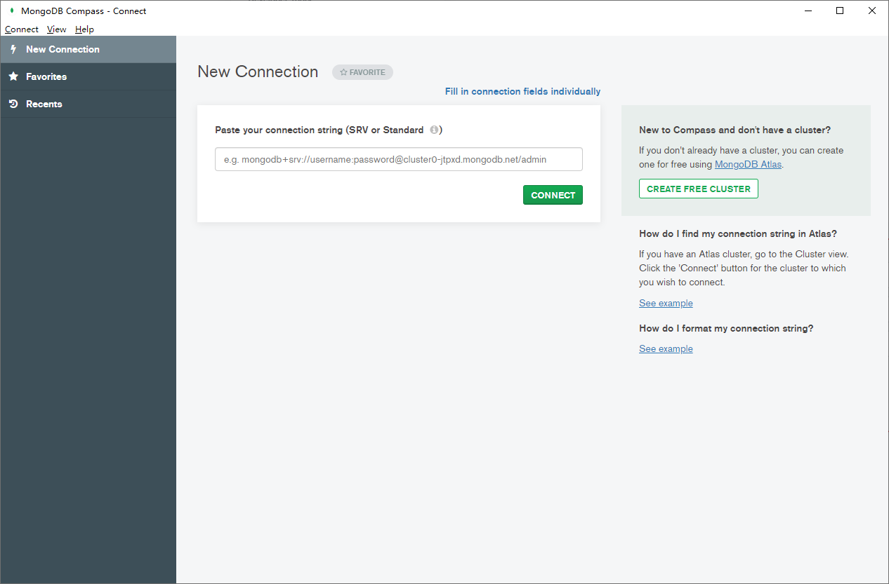
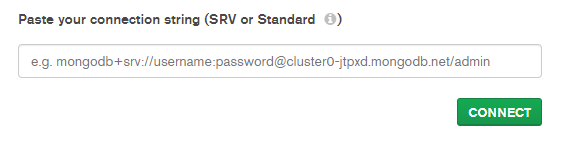
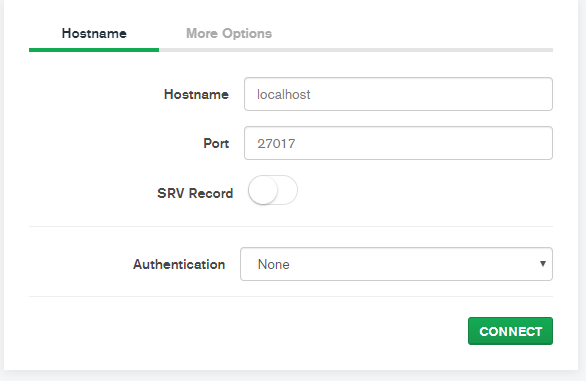

## 安装MongoDB

### 下载MongoDB

​		[进入MongoDB官网 ：](https://www.mongodb.com/) 


​		点击进去后会有好几个菜单，我们选择 MongoDB Community Server（MongoDB 社区服务器，免费），打开后，可以看到右侧有选择 version，操作系统，和下载包类型。

>MongoDB的版本命名规范如：x.y.z；
>y为奇数时表示当前版本为开发版，如：1.5.2、4.1.13；
>y为偶数时表示当前版本为稳定版，如：1.6.3、4.0.10；
>z是修正版本号，数字越大越好。  

#### Windows

​		选择合适的版本、操作系统、下载包的类型，下面是我们最后完成的选择：



#### Centos

​		选择合适的版本、操作系统、下载包的类型，下面是我们最后完成的选择：




### [Windows 安装](https://docs.mongodb.com/manual/tutorial/install-mongodb-on-windows/#install-mongodb-community-edition-on-windows)

> 这里我没有依照官网进行书写，本人使用的是解压版，感兴趣的朋友可以依照官网根据其他类型进行安装

#### 安装

​		根据上面的示例，我们下载后会得到一个文件 `mongodb-windows-x86_64-4.4.2-rc1.zip`。

​		第一步：将压缩包解压到指定目录：

​		第二步：在解压目录中，手动建立一个目录用于存放数据文件，如 data/db  



#### 启动 MongoDB Serve：

方式一：命令行参数方式启动服务
在 bin 目录中打开命令行提示符，输入如下命令：  

```bash
D:\work\databases\mongodb-windows-x86_64-4.4.2-rc1\mongodb-win32-x86_64-windows-4.4.2-rc1\bin>mongod --dbpath=..\data\db
```

​		我们在启动信息中可以看到，MongoDB的默认端口是27017，如果我们想改变默认的启动端口，可以通过--port来指定端口。
​		为了方便我们每次启动，可以将安装目录的bin目录设置到环境变量的path中， bin 目录下是一些常用命令，比如 mongod 启动服务用的，mongo 客户端连接服务用的。  

方式2：配置文件方式启动服务  

在解压目录中新建 config 文件夹，该文件夹中新建配置文件 mongod.conf ，内如参考如下（文件内容格式是yaml）： 

```yaml
storage:
  #The directory where the mongod instance stores its data.Default Value is "\data\db" on Windows.
  dbPath: D:\work\databases\mongodb-windows-x86_64-4.4.2-rc1\mongodb-win32-x86_64-windows-4.4.2-rc1\data
```

[Configuration File Options 配置文件配置](https://docs.mongodb.com/manual/reference/configuration-options/index.html#configuration-file-options)

> 注意：
>
> 1）配置文件中如果使用双引号，比如路径地址，自动会将双引号的内容转义。如果不转义，则会报错：
>
> error-parsing-yaml-config-file-yaml-cpp-error-at-line-3-column-15-unknown-escape-character-d  
>
> 解决：
> a. 对 \ 换成 / 或 \\\
> b. 如果路径中没有空格，则无需加引号。  
>
> 2）配置文件中不能以Tab分割字段  
>
> 解决：
> 将其转换成空格。  

  启动方式：

```bash
# 方式1 mongod --config ../config/mongod.conf
D:\work\databases\mongodb-windows-x86_64-4.4.2-rc1\mongodb-win32-x86_64-windows-4.4.2-rc1\bin>mongod --config ../config/mongod.conf

# 方式2 mongos --config ../config/mongod.conf
D:\work\databases\mongodb-windows-x86_64-4.4.2-rc1\mongodb-win32-x86_64-windows-4.4.2-rc1\bin>mongos --config ../config/mongod.conf

# 方式3 mongod -f ../config/mongod.conf
D:\work\databases\mongodb-windows-x86_64-4.4.2-rc1\mongodb-win32-x86_64-windows-4.4.2-rc1\bin>mongod -f ../config/mongod.conf

# 方式4 mongos -f ../config/mongod.conf
D:\work\databases\mongodb-windows-x86_64-4.4.2-rc1\mongodb-win32-x86_64-windows-4.4.2-rc1\bin>mongos -f ../config/mongod.conf
```

更多参数配置：  

```yaml
systemLog:
  destination: file
  path: "D:/work/databases/mongodb-windows-x86_64-4.4.2-rc1/mongodb-win32-x86_64-windows-4.4.2-rc1/log/mongod.log"
  logAppend: true
storage:
  journal:
    enabled: true
  dbPath: "D:/work/databases/mongodb-windows-x86_64-4.4.2-rc1/mongodb-win32-x86_64-windows-4.4.2-rc1/data"
net:
  bindIp: 127.0.0.1
  port: 27018
setParameter:
  enableLocalhostAuthBypass: false
```


#### Shell连接(mongo命令)  

```bash
# 方式一 mongo
D:\work\databases\mongodb-windows-x86_64-4.4.2-rc1\mongodb-win32-x86_64-windows-4.4.2-rc1\bin>mongo
MongoDB shell version v4.4.2-rc1
connecting to: mongodb://127.0.0.1:27017/?compressors=disabled&gssapiServiceName=mongodb
Implicit session: session { "id" : UUID("66829c0e-9448-4f0b-b2ca-52b7d4a18a48") }
MongoDB server version: 4.4.2-rc1
...

# 方式二 mongo --host=127.0.0.1 --port=27017
D:\work\databases\mongodb-windows-x86_64-4.4.2-rc1\mongodb-win32-x86_64-windows-4.4.2-rc1\bin>mongo --host=127.0.0.1 --port=27017
MongoDB shell version v4.4.2-rc1
connecting to: mongodb://127.0.0.1:27017/?compressors=disabled&gssapiServiceName=mongodb
Implicit session: session { "id" : UUID("c1295bad-6be3-4bd7-8760-1db05530c155") }
MongoDB server version: 4.4.2-rc1
...
```

查看已经有的数据库 

```bash
> show databases
admin   0.000GB
config  0.000GB
local   0.000GB
```

退出mongodb  

```bash
> exit
bye
```

更多参数可以通过帮助查看：

```bash
D:\work\databases\mongodb-windows-x86_64-4.4.2-rc1\mongodb-win32-x86_64-windows-4.4.2-rc1\bin>mongo --help
MongoDB shell version v4.4.2-rc1
usage: mongo [options] [db address] [file names (ending in .js)]
db address can be:
  foo                   foo database on local machine
  192.168.0.5/foo       foo database on 192.168.0.5 machine
  192.168.0.5:9999/foo  foo database on 192.168.0.5 machine on port 9999
  mongodb://192.168.0.5:9999/foo  connection string URI can also be used
Options:
  --ipv6                               enable IPv6 support (disabled by
                                       default)
  --host arg                           server to connect to
  --port arg                           port to connect to
  -h [ --help ]                        show this usage information
  --version                            show version information
  --verbose                            increase verbosity
  --shell                              run the shell after executing files
  --nodb                               don't connect to mongod on startup - no
                                       'db address' arg expected
  --norc                               will not run the ".mongorc.js" file on
                                       start up
  --quiet                              be less chatty
  --eval arg                           evaluate javascript
  --disableJavaScriptJIT               disable the Javascript Just In Time
                                       compiler
  --enableJavaScriptJIT                enable the Javascript Just In Time
                                       compiler
  --disableJavaScriptProtection        allow automatic JavaScript function
                                       marshalling
  --retryWrites                        automatically retry write operations
                                       upon transient network errors
  --disableImplicitSessions            do not automatically create and use
                                       implicit sessions
  --jsHeapLimitMB arg                  set the js scope's heap size limit
  --idleSessionTimeout arg (=0)        Terminate the Shell session if it's been
                                       idle for this many seconds
  --logv2                              logging gets directed to the logv2
                                       backend

FLE AWS Options:
  --awsAccessKeyId arg                 AWS Access Key for FLE Amazon KMS
  --awsSecretAccessKey arg             AWS Secret Key for FLE Amazon KMS
  --awsSessionToken arg                Optional AWS Session Token ID
  --keyVaultNamespace arg              database.collection to store encrypted
                                       FLE parameters
  --kmsURL arg                         Test parameter to override the URL for
                                       KMS

TLS Options:
  --tls                                use TLS for all connections
  --tlsCertificateKeyFile arg          PEM certificate/key file for TLS
  --tlsCertificateKeyFilePassword arg  Password for key in PEM file for TLS
  --tlsCAFile arg                      Certificate Authority file for TLS
  --tlsCRLFile arg                     Certificate Revocation List file for TLS
  --tlsAllowInvalidHostnames           Allow connections to servers with
                                       non-matching hostnames
  --tlsAllowInvalidCertificates        Allow connections to servers with
                                       invalid certificates
  --tlsFIPSMode                        Activate FIPS 140-2 mode at startup
  --tlsCertificateSelector arg         TLS Certificate in system store
  --tlsDisabledProtocols arg           Comma separated list of TLS protocols to
                                       disable [TLS1_0,TLS1_1,TLS1_2]

AWS IAM Options:
  --awsIamSessionToken arg             AWS Session Token for temporary
                                       credentials

Authentication Options:
  -u [ --username ] arg                username for authentication
  -p [ --password ] arg                password for authentication
  --authenticationDatabase arg         user source (defaults to dbname)
  --authenticationMechanism arg        authentication mechanism
  --gssapiServiceName arg (=mongodb)   Service name to use when authenticating
                                       using GSSAPI/Kerberos
  --gssapiHostName arg                 Remote host name to use for purpose of
                                       GSSAPI/Kerberos authentication

file names: a list of files to run. files have to end in .js and will exit after unless --shell is specified
```

> 提示：
> MongoDB javascript shell是一个基于javascript的解释器，故是支持js程序的。  


### [Read Hat 安装](https://docs.mongodb.com/manual/tutorial/install-mongodb-on-red-hat/#install-mongodb-community-edition-on-red-hat-or-centos)  

#### [使用tgz方式解压安装](https://docs.mongodb.com/manual/tutorial/install-mongodb-on-red-hat-tarball/#install-mongodb-community-on-red-hat-or-centos-using-tgz-tarball)

​		安装所需依赖

```bash
sudo yum install libcurl openssl xz-libs
```

​		

​		1. 在Version下拉菜单中，选择要下载的MongoDB版本。

​		2.在Platform下拉列表中，选择您的操作系统版本和架构。

​		3.在Package下拉菜单中，选择tgz。

​		4.点击下载。



解压

```bash
tar -zxvf mongodb-linux-*-4.4.1.tgz
```

将解压后的bin目录添加到PATH环境变量

```bash
vim ~/.bash_profile
PATH=/apps/mongodb4.4/mongodb-linux-x86_64-rhel80-4.4.1/bin:$PATH
source ~/.bash_profile
```

创建目录（解压后的根目录）：

```bash
# 数据库目录
 mkdir -p data/db
# 日志目录
mkdir log
# 配置文件目录
mkdir config
# pid文件目录
mkdir pid
```

默认情况下，MongoDB运行使用mongod用户帐户。设置这些目录的所有者和组为mongod:

```bash
# 创建用户和组
useradd mongod -M -s /sbin/nologin
# 添加文件夹的用户和用户组 sudo chown -R mongod:mongod <directory>
chown -R  mongod:mongod mongodb-linux-x86_64-rhel80-4.4.1
```

设置配置文件 mongod.conf （config/mongod.conf）

[Configuration File Options 配置文件配置](https://docs.mongodb.com/manual/reference/configuration-options/index.html#configuration-file-options)

```bash
# where to write logging data.
systemLog:
  destination: file
  logAppend: true
  path: /apps/mongodb4.4/mongodb-linux-x86_64-rhel80-4.4.1/log/mongod.log

# Where and how to store data.
storage:
  dbPath: /apps/mongodb4.4/mongodb-linux-x86_64-rhel80-4.4.1/data/db
  journal:
    enabled: true
#  engine:
#  wiredTiger:

# how the process runs
processManagement:
  fork: true  # fork and run in background
  pidFilePath: /apps/mongodb4.4/mongodb-linux-x86_64-rhel80-4.4.1/pid/mongod.pid  # location of pidfile
  timeZoneInfo: /usr/share/zoneinfo
# network interfaces
net:
  port: 27017
  # 此时其他机器连不上本机，需要将127.0.0.1 替换成 0.0.0.0
  #bindIp: 127.0.0.1  # Enter 0.0.0.0,:: to bind to all IPv4 and IPv6 addresses or, alternatively, use the net.bindIpAll setting.
  bindIp: 0.0.0.0  # Enter 0.0.0.0,:: to bind to all IPv4 and IPv6 addresses or, alternatively, use the net.bindIpAll setting.

#security:
#operationProfiling:
#replication:
#sharding:
## Enterprise-Only Options
#auditLog:
#snmp:
```

启动：

```bash
# 方式一：
mongod --dbpath ../data/db --logpath ../log/mongod.log -fork
# 方式二([mongod | mongos] [-f | --config] mongod.conf)：
mongod --config ../config/mongod.conf
```

连接：

```bash
mongo
```

关闭mongod

```bash
# 先连接MongoDB
mongo
# 关闭
> use admin
switched to db admin
> db.shutdownServer()
server should be down...
```

##### 生成systemctl 服务

1）在/usr/lib/systemd/system 下创建一个mongod.service 文件，内容如下：

```bash
[Unit]
Description=Mongodb
Documentation=https://docs.mongodb.com/manual/
After=network.target remote-fs.target nss-lookup.target

[Service]
Type=forking
PIDFile=/apps/mongodb4.4/mongodb-linux-x86_64-rhel80-4.4.1/pid/mongod.pid
ExecStart=mongod --config /apps/mongodb4.4/mongodb-linux-x86_64-rhel80-4.4.1/config/mongod.conf
ExecReload=/bin/kill -s HUP $MAINPID
ExecStop=/apps/mongodb4.4/mongodb-linux-x86_64-rhel80-4.4.1/bin/mongod --shutdown --config /apps/mongodb4.4/mongodb-linux-x86_64-rhel80-4.4.1/config/mongod.conf
PrivateTmp=true
Restart=always
RestartSec=1 #1s后重启

[Install]
WantedBy=multi-user.target
```

2）服务使用命令

​	启动服务

```bash
systemctl start mongod.service
```

​	重启服务

```bash
systemctl restart mongod.service
```

​	关闭服务

```bash
systemctl stop mongod.service
```

​	开机启动

```bash
systemctl enable mongodb.service
```


#### [yum 安装](https://docs.mongodb.com/manual/tutorial/install-mongodb-on-red-hat/#install-mongodb-community-edition-on-red-hat-or-centos)

1）配置包管理系统

> Create a `/etc/yum.repos.d/mongodb-org-4.4.repo` file so that you can install MongoDB directly using `yum`:
>
> [mongodb-org-4.4]
> name=MongoDB Repository
> baseurl=https://repo.mongodb.org/yum/redhat/$releasever/mongodb-org/4.4/x86_64/
> gpgcheck=1
> enabled=1
> gpgkey=https://www.mongodb.org/static/pgp/server-4.4.asc

 ```bash
# 将上面的内容复制进 mongodb-org-4.4.repo
[root@iZ2vc28obhvfh8zjqb9lc9Z apps]# vim /etc/yum.repos.d/mongodb-org-4.4.repo
 ```

2）安装MongoDB 包

需要执行下面的命令

```bash
sudo yum install -y mongodb-org
```

> 文档中提示了 以防系统自动升级MongoDB，将在配置文件 /etc/yum.conf 添加一条指令
>
> You can specify any available version of MongoDB. However `yum` upgrades the packages when a newer version becomes available. To prevent unintended upgrades, pin the package. To pin a package, add the following `exclude` directive to your `/etc/yum.conf` file:
>
> exclude=mongodb-org,mongodb-org-server,mongodb-org-shell,mongodb-org-mongos,mongodb-org-tools


##### [文件路径](https://docs.mongodb.com/manual/tutorial/install-mongodb-on-red-hat/#directory-paths)

###### [使用默认目录](https://docs.mongodb.com/manual/tutorial/install-mongodb-on-red-hat/#to-use-default-directories)

默认情况下，MongoDB运行使用mongod用户帐户，并使用以下默认目录:

- `/var/lib/mongo` (the data directory)
- `/var/log/mongodb` (the log directory)

配置文件 /etc/mongod.conf ：

```bash
# where to write logging data.
systemLog:
  destination: file
  logAppend: true
  path: /var/log/mongodb/mongod.log

# Where and how to store data.
storage:
  dbPath: /var/lib/mongo
  journal:
    enabled: true
#  engine:
#  wiredTiger:

# how the process runs
processManagement:
  fork: true  # fork and run in background
  pidFilePath: /var/run/mongodb/mongod.pid  # location of pidfile
  timeZoneInfo: /usr/share/zoneinfo

# network interfaces
net:
  port: 27017
  # 此时其他机器连不上本机，需要将127.0.0.1 替换成 0.0.0.0
  bindIp: 127.0.0.1  # Enter 0.0.0.0,:: to bind to all IPv4 and IPv6 addresses or, alternatively, use the net.bindIpAll setting.

#security:
#operationProfiling:
#replication:
#sharding:
## Enterprise-Only Options
#auditLog:
#snmp:
```


由于我们使用的是yum 包管理安装的，所以会创建默认的目录，并将这些目录的所有者和组设置为mongod。

```bash
[root@iZ2vc28obhvfh8zjqb9lc9Z lib]# ll /var/lib/ | grep mongo
drwxr-xr-x   2 mongod         mongod            6 Sep  8 23:07 mongo
```

> 使用默认目录以外的数据目录和/或日志目录:
>
> 1.创建一个或多个新目录。
>
> 2.编辑配置文件/etc/mongod.conf，修改以下字段:
>
> - [`storage.dbPath`](https://docs.mongodb.com/manual/reference/configuration-options/#storage.dbPath) to specify a new data directory path (e.g. `/some/data/directory`)
> - [`systemLog.path`](https://docs.mongodb.com/manual/reference/configuration-options/#systemLog.path) to specify a new log file path (e.g. `/some/log/directory/mongod.log`)
>
> 确保运行MongoDB的用户能够访问一个或多个目录:
>
> sudo chown -R mongod:mongod <directory>
>
> 
>
> 如果是使用解压安装的，需要自己创建默认的MongoDB目录，创建MongoDB数据和日志目录:
>
> sudo mkdir -p /var/lib/mongo
> sudo mkdir -p /var/log/mongodb
>
> 默认情况下，MongoDB运行使用mongod用户帐户。一旦创建，设置这些目录的所有者和组为mongod:
>
> sudo chown -R mongod:mongod <directory>


##### [初始化程序](https://docs.mongodb.com/manual/tutorial/install-mongodb-on-red-hat/#procedure)

1）启动MongoDB

```bash
sudo systemctl start mongod
```

2）验证MongoDB启动成功

```bash
sudo systemctl status mongod
```

3）设置开机自动启动

```bash
sudo systemctl enable mongod
```

4）停止MongoDB

```bash
sudo systemctl stop mongod
```

5）重启MongoDB

```bash
sudo systemctl restart mongod
```

> 您可以通过观察/var/log/mongodb/mongod.log文件中的输出来跟踪进程的错误或重要消息的状态。

6）连接MongoDB

在启动了MongoDB的主机上运行命令：

```bash
mongo
```

> 有关使用mongo shell连接的更多信息，例如连接到运行在不同主机和/或端口上的mongod实例，请参阅mongo shell。
>
> 为了帮助你开始使用MongoDB, MongoDB提供了各种驱动版本的入门指南。有关驱动程序文档，请参见Start development with MongoDB
>
> For more information on connecting using the [`mongo`](https://docs.mongodb.com/manual/reference/program/mongo/#bin.mongo) shell, such as to connect to a [`mongod`](https://docs.mongodb.com/manual/reference/program/mongod/#bin.mongod) instance running on a different host and/or port, see [The mongo Shell](https://docs.mongodb.com/manual/mongo/).
>
> To help you start using MongoDB, MongoDB provides [Getting Started Guides](https://docs.mongodb.com/manual/tutorial/getting-started/#getting-started) in various driver editions. For the driver documentation, see [Start Developing with MongoDB](https://docs.mongodb.com/drivers/).


### [Centos 卸载](https://docs.mongodb.com/manual/tutorial/install-mongodb-on-red-hat/#uninstall-mongodb-community-edition)

1）Stop MongoDB

```bash
sudo service mongod stop
```

2）删除包

删除之前安装的所有MongoDB包。

```bash
sudo yum erase $(rpm -qa | grep mongodb-org)
```

3）删除数据目录

删除MongoDB数据库和日志文件。

```bash
sudo rm -r /var/log/mongodb
sudo rm -r /var/lib/mongo
```


## [Compass 客户端](https://docs.mongodb.com/compass/current/) 


### [下载安装](https://docs.mongodb.com/compass/master/install#download-and-install-compass)

​		官网中，在 Software下拉选中选择 Compass，然后点击Try it now。

​		选择合适的版本的文件类型，然后点击download下载。



> 注意：
>
> 根据文档 https://docs.mongodb.com/compass/current/ 可以知道Compass 包含四个版本
>
> 1.**Compass** ：MongoDB Compass的完整版本，具有所有功能。
>
> 2.**Compass Readonly**：严格限制读操作，删除所有写和删除功能。
>
> 3.**Compass Isolated**：除了Compass连接到的MongoDB服务器之外，不初始化任何网络请求。这个版本是为高度安全的环境设计的。
>
> 4.**Compass Community**：专为MongoDB开发而设计，包括Compass的一个子集功能。（此版本已被弃用。）




安装后的界面：



### [连接MongoDB](https://docs.mongodb.com/compass/master/connect#connect-to-mongodb)

​		有两种方式，一种是使用字符串，另一种是填写连接的必填项（点击首页的 Fill in connection fields individually）

​		方式一（默认， [Standard Connection String Format](https://docs.mongodb.com/manual/reference/connection-string/#connections-standard-connection-string-format) ）：



​		例如：

```bash
mongodb://127.0.0.1:27017
```

​		方式二：

​	

