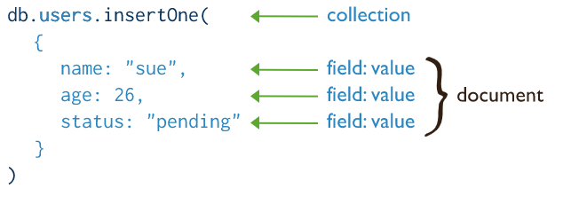
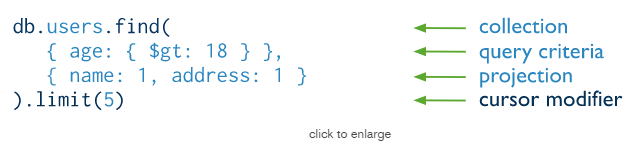
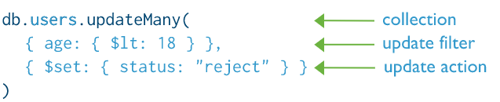
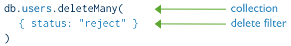
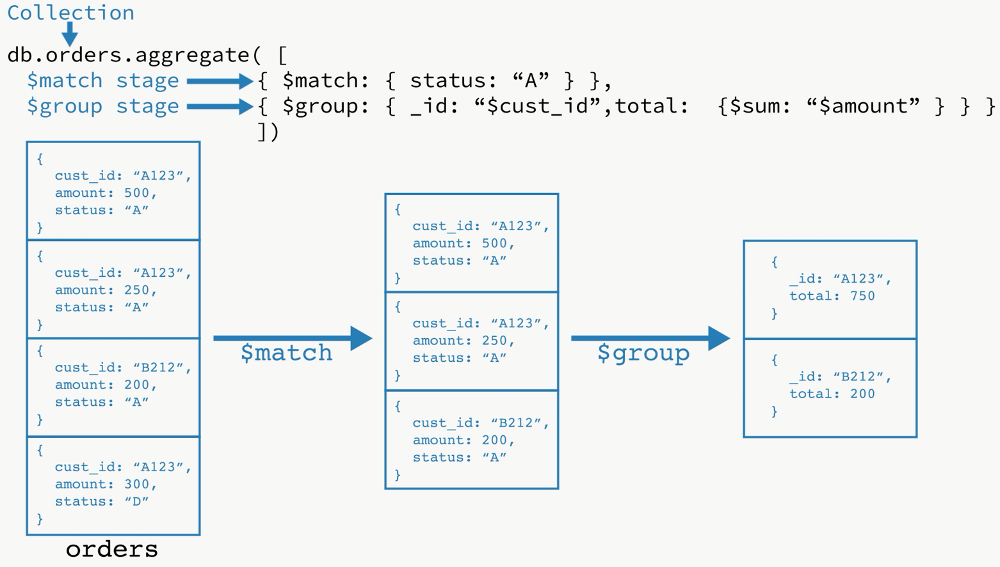
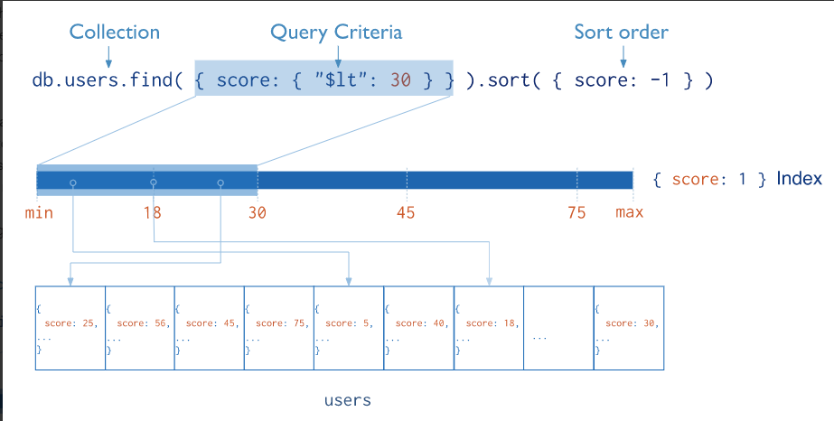
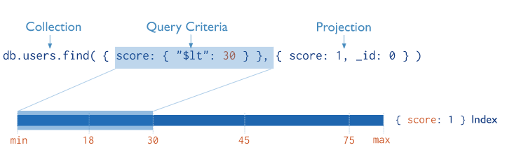

# **[Developers](https://docs.mongodb.com/manual/crud/#mongodb-crud-operations)**

[TOC]

# CRUD Operations

1. 创建操作

2. 读操作

3. 更新操作

4. 删除操作

5. 大部分写

   ​	CRUD操作创建、读取、更新和删除文档。

## 创建操作

​		创建或插入操作向集合添加新文档。如果集合当前不存在，插入操作将创建集合。

​		MongoDB提供了以下方法将文档插入到集合中:

- [`db.collection.insertOne()`](https://docs.mongodb.com/manual/reference/method/db.collection.insertOne/#db.collection.insertOne) *New in version 3.2*
- [`db.collection.insertMany()`](https://docs.mongodb.com/manual/reference/method/db.collection.insertMany/#db.collection.insertMany) *New in version 3.2*

​        在MongoDB中，insert操作针对单个集合。MongoDB中的所有写操作都是单个文档级别的原子操作。



### [插入文档](https://docs.mongodb.com/manual/tutorial/insert-documents/#insert-documents)

#### 插入单个文档

​		db.collection.insertOne() 将单个文档插入到集合中。

​		下面的示例将新文档插入到库存集合中。如果文档没有指定`_id`字段，MongoDB会将带有ObjectId值的`_id`字段添加到新文档中。

```bash
db.inventory.insertOne(
   { item: "canvas", qty: 100, tags: ["cotton"], size: { h: 28, w: 35.5, uom: "cm" } }
)
```

​		insertOne()返回一个包含新插入文档的_id字段值的文档。有关返回文档的示例，请参见[db.collection.insertOne()引用](https://docs.mongodb.com/manual/reference/method/db.collection.insertOne/#insertone-examples)。

​		要检索您刚才插入的文档，请查询集合:

```bash
db.inventory.find( { item: "canvas" } )
```

#### 插入多个文档

​		[`db.collection.insertMany()`](https://docs.mongodb.com/manual/reference/method/db.collection.insertMany/#db.collection.insertMany)可以将多个文档插入一个集合中。向该方法传递一个文档数组。

​		下面的示例将三个新文档插入到inventory集合中。如果文档没有指定`_id`字段，MongoDB会将带有ObjectId值的`_id`字段添加到每个文档。看到插入行为。

```bash
db.inventory.insertMany([
   { item: "journal", qty: 25, tags: ["blank", "red"], size: { h: 14, w: 21, uom: "cm" } },
   { item: "mat", qty: 85, tags: ["gray"], size: { h: 27.9, w: 35.5, uom: "cm" } },
   { item: "mousepad", qty: 25, tags: ["gel", "blue"], size: { h: 19, w: 22.85, uom: "cm" } }
])
```

​		insertMany()返回一个包含新插入文档_id字段值的文档。

​		要检索插入的文档，查询集合:

```bash
db.inventory.find( {} )
```


## 读操作

​		读取操作从集合中检索文档;即查询文件集合。MongoDB提供了以下方法来读取集合中的文档:

+ [`db.collection.find()`](https://docs.mongodb.com/manual/reference/method/db.collection.find/#db.collection.find)

您可以指定用于标识要返回的文档的查询过滤器或条件。



> users 是一个集合
>
> { age : { $gt : 18 } } 是查询条件
>
> { { name : 1, address : 1 } } 表示只查询 name 和 address字段

### [查询文档](https://docs.mongodb.com/manual/tutorial/query-documents/#query-documents)

#### 查询集合中的所有文档

​		要选择集合中的所有文档，将一个空文档作为查询筛选器参数传递给find方法。query filter参数决定了选择条件:

```bash
db.inventory.find( {} )
```

​		这个操作对应下面的SQL语句:

```bash
SELECT * FROM inventory
```

#### 指定相等条件

​		要指定相等条件，请在查询过滤器文档中使用`<field>:<value>`表达式:

```bash
{ <field1>: <value1>, ... }
```

​		下面的例子从库存inventory集合中 status 为“D”的所有文档:

```bash
db.inventory.find( { status: "D" } )
```

​		这个操作对应下面的SQL语句:

```sql
SELECT * FROM inventory WHERE status = "D"
```

#### 使用查询运算符指定条件

​		查询筛选器文档可以使用查询运算符以以下形式指定条件:

```bash
{ <field1>: { <operator1>: <value1> }, ... }
```

​		下面的示例从库存集合inventory 中检索status 为“A”或“D”的所有文档:

```bash
db.inventory.find( { status: { $in: [ "A", "D" ] } } )
```

> 虽然您可以使用$or操作符来表达这个查询，但在对相同字段执行相等检查时，使用$in操作符而不是$or操作符。

​		该操作对应以下SQL语句:

```sql
SELECT * FROM inventory WHERE status in ("A", "D")
```

#### 指定 AND 条件

​		复合查询可以为集合文档中的多个字段指定条件。隐式地，逻辑和连接连接复合查询的子句，以便查询选择集合中符合所有条件的文档。

​		下面的示例检索库存集合中状态为“A”且数量小于($lt) 30的所有文档：

```bash
db.inventory.find( { status: "A", qty: { $lt: 30 } } )
```

​		该操作对应以下SQL语句:

```sql
SELECT * FROM inventory WHERE status = "A" AND qty < 30
```


#### 指定 OR 条件

​		使用$or操作符，您可以指定一个复合查询，用逻辑或连接符连接每个子句，以便查询选择集合中至少符合一个条件的文档。

​		下面的示例检索集合中status为“A”或qty小于($lt) 30的所有文档:

```bash
db.inventory.find( { $or: [ { status: "A" }, { qty: { $lt: 30 } } ] } )
```

​		该操作对应以下SQL语句:

```sql
SELECT * FROM inventory WHERE status = "A" OR qty < 30
```

#### 指定 AND 以及 OR 条件

​		在下面的例子中，复合查询文档选择集合中状态为“A”且qty小于($lt) 30或item以字符p开头的所有文档:

```bash
db.inventory.find( {
     status: "A",
     $or: [ { qty: { $lt: 30 } }, { item: /^p/ } ]
} )
```

​		该操作对应以下SQL语句:

```sql
SELECT * FROM inventory WHERE status = "A" AND ( qty < 30 OR item LIKE "p%")
```

> MongoDB支持正则表达式$regex查询来执行字符串模式匹配。

### [查询嵌入/嵌套文档](https://docs.mongodb.com/manual/tutorial/query-embedded-documents/#query-on-embedded-nested-documents)

​		示例文档：

```json
db.inventory.insertMany( [
   { item: "journal", qty: 25, size: { h: 14, w: 21, uom: "cm" }, status: "A" },
   { item: "notebook", qty: 50, size: { h: 8.5, w: 11, uom: "in" }, status: "A" },
   { item: "paper", qty: 100, size: { h: 8.5, w: 11, uom: "in" }, status: "D" },
   { item: "planner", qty: 75, size: { h: 22.85, w: 30, uom: "cm" }, status: "D" },
   { item: "postcard", qty: 45, size: { h: 10, w: 15.25, uom: "cm" }, status: "A" }
]);
```


#### 匹配嵌入式/嵌套文档

​		要在嵌入/嵌套文档的字段上指定相等条件，请使用查询过滤器文档{`<field>: <value>`}，其中`<value>`是要匹配的文档。

​		例如，下面的查询选择字段 size 等于文档{h: 14, w: 21, uom: "cm"}的所有文档:

```bash
db.inventory.find( { size: { h: 14, w: 21, uom: "cm" } } )
```

​		在整个嵌入式文档上的相等匹配要求指定的<值>文档的精确匹配，包括字段顺序。例如，以下查询不匹配库存集合中的任何文档:

```bash
db.inventory.find(  { size: { w: 21, h: 14, uom: "cm" } }  )
```

#### 嵌套字段查询

​		要在嵌入/嵌套文档中的字段上指定查询条件，请使用点表示法(“field.nestedField”)。

> 当使用点表示法查询时，字段和嵌套字段必须在引号内。

##### 指定嵌套字段上的相等匹配

​		下面的例子选择所有size字段下 uom字段等于“in”的文档:

```bash
db.inventory.find( { "size.uom": "in" } )
```

##### 使用查询运算符指定匹配

​		查询筛选器文档可以使用查询运算符以以下形式指定条件:

```bash
{ <field1>: { <operator1>: <value1> }, ... }
```

​		下面的查询在size字段中嵌入的字段h上使用小于操作符($lt):

```bash
db.inventory.find( { "size.h": { $lt: 15 } } )
```

##### 指定和条件

​		下面的查询选择嵌套字段h小于15、嵌套字段uom等于“in”、状态字段等于“D”的所有文档:

```bash
db.inventory.find( { "size.h": { $lt: 15 }, "size.uom": "in", status: "D" } )
```

#### [查询数组](https://docs.mongodb.com/manual/tutorial/query-arrays/#query-an-array)

**模拟数据**

```bash
db.inventory.insertMany([
   { item: "journal", qty: 25, tags: ["blank", "red"], dim_cm: [ 14, 21 ] },
   { item: "notebook", qty: 50, tags: ["red", "blank"], dim_cm: [ 14, 21 ] },
   { item: "paper", qty: 100, tags: ["red", "blank", "plain"], dim_cm: [ 14, 21 ] },
   { item: "planner", qty: 75, tags: ["blank", "red"], dim_cm: [ 22.85, 30 ] },
   { item: "postcard", qty: 45, tags: ["blue"], dim_cm: [ 10, 15.25 ] }
]);
```


**匹配数组**

​		要指定数组上的相等条件，请使用查询文档{`<field>: <value>`}，其中`<value>`是要匹配的精确数组，包括元素的顺序。

​		下面的例子查询所有文档，其中字段 tags 的值是一个数组，恰好有两个元素，“red”和“blank”，按照指定的顺序:

```bash
db.inventory.find( { tags: ["red", "blank"] } )
```

> 注意： {  tags: ["blank", "red"]}, 这条结果没有选中。就是因为顺序的问题

​		相反，如果你希望找到一个既包含元素“red”又包含元素“blank”的数组，而不考虑数组中的顺序或其他元素，使用$all操作符:

```bash
db.inventory.find( { tags: { $all: ["red", "blank"] } } )
```

###### [查询一个元素数组](https://docs.mongodb.com/manual/tutorial/query-arrays/#query-an-array-for-an-element)

​		要查询数组字段是否包含至少一个具有指定值的元素，使用过滤器{`<field>: <value>`}，其中`<value>`是元素值。

​		下面的例子查询所有文档，其中tags是一个包含字符串“red”作为其元素之一的数组:

```bash
db.inventory.find( { tags: "red" } )
```

​		要指定数组字段中元素的条件，请在[query filter](https://docs.mongodb.com/manual/core/document/#document-query-filter)文档中使用[query operators](https://docs.mongodb.com/manual/reference/operator/query/#query-selectors):

```bash
{ <array field>: { <operator1>: <value1>, ... } }
```

​		例如，以下操作查询数组dim_cm至少包含一个值大于25的元素的所有文档。

```bash
db.inventory.find( { dim_cm: { $gt: 25 } } )
```

###### [为数组元素指定多个条件](https://docs.mongodb.com/manual/tutorial/query-arrays/#specify-multiple-conditions-for-array-elements)

1. 当在数组元素上指定复合条件时，可以指定查询，使单个数组元素满足这些条件，或任何数组元素的组合满足这些条件。

   下面的示例查询文档，其中dim_cm数组包含以某种组合满足查询条件的元素;例如，一个元素可以满足大于15的条件，另一个元素可以满足小于20的条件，或者一个元素可以同时满足以下两个条件:

```bash
db.inventory.find( { dim_cm: { $gt: 15, $lt: 20 } } )
```

> 注意：
>
> 这里有点难理解，需要思考下
>
> dim_cm 数组中，必须存在元素 大于15 ，存在元素 小于20 则可以查询出来。 

  2. 使用$elemMatch操作符指定数组元素的多个条件，这样至少有一个数组元素满足所有指定的条件。

     下面的示例查询文档，其中dim_cm数组至少包含一个大于($gt) 22和小于($lt) 30的元素(AND):

```bash
db.inventory.find( { dim_cm: { $elemMatch: { $gt: 22, $lt: 30 } } } )
```

3.  按数组索引位置查询一个元素。
使用点表示法，可以在数组的特定索引或位置为元素指定查询条件。数组使用从零开始的索引。

> 注意：
>
> 当使用点表示法查询时，字段和嵌套字段必须在引号内。

​		下面的例子查询数组dim_cm中第二个元素大于25的所有文档:

```bash
db.inventory.find( { "dim_cm.1": { $gt: 25 } } )
```

4. 按数组长度查询数组
   使用$size操作符按元素数量查询数组。例如，下面选择数组标签中有3个元素的文档。

```bash
db.inventory.find( { "tags": { $size: 3 } } )
```


###### 查询嵌入文档的数组

```json
db.inventory.insertMany( [
   { item: "journal", instock: [ { warehouse: "A", qty: 5 }, { warehouse: "C", qty: 15 } ] },
   { item: "notebook", instock: [ { warehouse: "C", qty: 5 } ] },
   { item: "paper", instock: [ { warehouse: "A", qty: 60 }, { warehouse: "B", qty: 15 } ] },
   { item: "planner", instock: [ { warehouse: "A", qty: 40 }, { warehouse: "B", qty: 5 } ] },
   { item: "postcard", instock: [ { warehouse: "B", qty: 15 }, { warehouse: "C", qty: 35 } ] }
]);
```

​		下面的例子选择instock数组中元素与指定文档匹配的所有文档:

```shell
db.inventory.find( { "instock": { warehouse: "A", qty: 5 } } )
```

​		在整个嵌入嵌套文档上的相等匹配要求指定文档的精确匹配，包括字段顺序。例如，以下查询不匹配库存集合中的任何文档:

```bash
db.inventory.find( { "instock": { qty: 5, warehouse: "A" } } )
```


**在文档数组中嵌入的字段上指定查询条件**

​		如果不知道嵌套在数组中的文档的索引位置，将数组字段的名称与嵌套文档中的点(.)和字段名称连接。

​		下面的例子选择所有的文档，其中instock数组至少有一个包含字段qty小于或等于20的嵌入文档:

```bash
db.inventory.find( { 'instock.qty': { $lte: 20 } } )
```


###### 使用数组索引在嵌入文档中查询字段

​		数组使用从零开始的索引。

​		下面的例子选择所有的文档，其中instock数组的第一个元素是一个包含字段qty小于或等于20的文档:

```bash
db.inventory.find( { 'instock.0.qty': { $lte: 20 } } )
```


###### 为文档数组指定多个条件

​		当在文档数组中嵌套的多个字段上指定条件时，您可以指定查询，使单个文档满足这些条件，或者数组中的任何文档组合(包括单个文档)满足这些条件。

###### 单个嵌套文档满足多个查询条件嵌套字段

​		使用$elemMatch操作符可以在嵌入文档的数组上指定多个条件，这样至少有一个嵌入文档满足所有指定的条件。

​		下面的例子查询文档，其中instock数组至少有一个内嵌文档，包含字段qty等于5和字段warehouse等于A:

```bash
db.inventory.find( { "instock": { $elemMatch: { qty: 5, warehouse: "A" } } } )
```

​		下面的例子查询文档，其中instock数组至少有一个内嵌文档，包含字段qty大于10小于等于20:

```bash
db.inventory.find( { "instock": { $elemMatch: { qty: { $gt: 10, $lte: 20 } } } } )
```

###### 元素组合满足标准

​		如果数组字段上的复合查询条件不使用$elemMatch操作符，则查询将选择其数组中包含满足条件的任何元素组合的文档。

​		例如，下面的查询匹配以下文档:嵌套在instock数组中的任何文档的qty字段大于10，数组中的任何文档(但不一定是相同的嵌入文档)的qty字段小于或等于20:

```bash
db.inventory.find( { "instock.qty": { $gt: 10,  $lte: 20 } } )
```

​		下面的示例查询文档，其中instock数组至少有一个包含字段qty等于5的嵌入式文档，以及至少一个包含字段仓库等于A的嵌入式文档(但不一定是相同的嵌入式文档):

```bash
db.inventory.find( { "instock.qty": 5, "instock.warehouse": "A" } )
```

### 查询数据库

​		语法如下：

```bash
# 方式1：
show dbs
# 方式2：
show databases
```

### 查询集和

​		语法如下：

```bash
# 方式1：
show tables;
# 方式2：
show collections
```


## 更新操作

​		更新操作修改集合中的现有文档。MongoDB提供了以下方法来更新集合的文档:

- [`db.collection.updateOne()`](https://docs.mongodb.com/manual/reference/method/db.collection.updateOne/#db.collection.updateOne) *New in version 3.2*
- [`db.collection.updateMany()`](https://docs.mongodb.com/manual/reference/method/db.collection.updateMany/#db.collection.updateMany) *New in version 3.2*
- [`db.collection.replaceOne()`](https://docs.mongodb.com/manual/reference/method/db.collection.replaceOne/#db.collection.replaceOne) *New in version 3.2*

​        在MongoDB中，更新操作针对单个集合。MongoDB中的所有写操作都是单个文档级别的原子操作。

​		您可以指定标识要更新的文档的标准或筛选器。这些过滤器使用与读操作相同的语法。



> { age : { $lt : 18 } } 表示更新文档的条件
>
> { $set : { status : "reject" }} 将符合上面条件的修改status值为 “reject” 只修改第一条。

### [更新文档](https://docs.mongodb.com/manual/tutorial/update-documents/#update-documents)

​		mongo shell方法:

- [`db.collection.updateOne(, , )`](https://docs.mongodb.com/manual/reference/method/db.collection.updateOne/#db.collection.updateOne)

- [`db.collection.updateMany(, , )`](https://docs.mongodb.com/manual/reference/method/db.collection.updateMany/#db.collection.updateMany)

- [`db.collection.replaceOne(, , )`](https://docs.mongodb.com/manual/reference/method/db.collection.replaceOne/#db.collection.replaceOne)

  ​	样例数据：

```json
db.inventory.insertMany( [
   { item: "canvas", qty: 100, size: { h: 28, w: 35.5, uom: "cm" }, status: "A" },
   { item: "journal", qty: 25, size: { h: 14, w: 21, uom: "cm" }, status: "A" },
   { item: "mat", qty: 85, size: { h: 27.9, w: 35.5, uom: "cm" }, status: "A" },
   { item: "mousepad", qty: 25, size: { h: 19, w: 22.85, uom: "cm" }, status: "P" },
   { item: "notebook", qty: 50, size: { h: 8.5, w: 11, uom: "in" }, status: "P" },
   { item: "paper", qty: 100, size: { h: 8.5, w: 11, uom: "in" }, status: "D" },
   { item: "planner", qty: 75, size: { h: 22.85, w: 30, uom: "cm" }, status: "D" },
   { item: "postcard", qty: 45, size: { h: 10, w: 15.25, uom: "cm" }, status: "A" },
   { item: "sketchbook", qty: 80, size: { h: 14, w: 21, uom: "cm" }, status: "A" },
   { item: "sketch pad", qty: 95, size: { h: 22.85, w: 30.5, uom: "cm" }, status: "A" }
] );
```

#### 更新集合中的文档

​		为了更新文档，MongoDB提供了更新操作符，比如$set，来修改字段值。

​		要使用update操作符，请向update方法传递一个表单的更新文档:

```json
{
  <update operator>: { <field1>: <value1>, ... },
  <update operator>: { <field2>: <value2>, ... },
  ...
}
```

​		如果字段不存在，一些更新操作符(如$set)将创建字段。有关详细信息，请参阅个别[更新操作符参考](https://docs.mongodb.com/manual/reference/operator/update)。

> 从MongoDB 4.2开始，MongoDB可以接受一个聚合管道来指定要做的修改，而不是一个更新文档。有关详细信息，请参阅方法参考页面

#### 更新单个文档

​		下面的例子使用库存清单集合上的db.collection.updateOne()方法来更新第一个文档，其中item等于“paper”:

```bash
db.inventory.updateOne(
   { item: "paper" },
   {
     $set: { "size.uom": "cm", status: "P" },
     $currentDate: { lastModified: true }
   }
)
```

​		更新操作:

+ 使用$set操作符更新 size.uom字段为“cm”，status字段的值为“P”，

+ 使用$currentDate操作符将lastModified字段的值更新为当前日期。如果lastModified字段不存在，$currentDate将创建该字段。详情请参阅$currentDate。

#### 更新多个文档

​		下面的例子使用库存收集上的db.collection.updateMany()方法来更新qty小于50的所有文档:

```bash
db.inventory.updateMany(
   { "qty": { $lt: 50 } },
   {
     $set: { "size.uom": "in", status: "P" },
     $currentDate: { lastModified: true }
   }
)
```

#### 替换一个文档

​		要替换除`_id`字段之外的整个文档内容，可以将一个全新的文档作为第二个参数传递给`db.collection.replaceOne()`。

​		当替换文档时，替换文档必须只包含字段/值对;例如，不要包含更新操作符表达式。

​		替换文档可以具有与原始文档不同的字段。在替换文档中，您可以省略`_id`字段，因为`_id`字段是不可变的;但是，如果您确实包含`_id`字段，它必须具有与当前值相同的值。

​		下面的示例替换库存集合中的第一个文档，其中item:“paper”:

```bash
db.inventory.replaceOne(
   { item: "paper" },
   { item: "paper", instock: [ { warehouse: "A", qty: 60 }, { warehouse: "B", qty: 40 } ] }
)
```


## 删除操作

​		删除操作从集合中删除文档。MongoDB提供了以下删除集合文档的方法:

- [`db.collection.deleteOne()`](https://docs.mongodb.com/manual/reference/method/db.collection.deleteOne/#db.collection.deleteOne) *New in version 3.2*
- [`db.collection.deleteMany()`](https://docs.mongodb.com/manual/reference/method/db.collection.deleteMany/#db.collection.deleteMany) *New in version 3.2*

​       在MongoDB中，删除操作针对单个集合。MongoDB中的所有写操作都是单个文档级别的原子操作。

​		您可以指定标识要删除的文档的标准或筛选器。这些过滤器使用与读操作相同的语法。



> 删除所有 符合条件的文档

### [删除文档](https://docs.mongodb.com/manual/tutorial/remove-documents/#delete-documents)

- [`db.collection.deleteMany()`](https://docs.mongodb.com/manual/reference/method/db.collection.deleteMany/#db.collection.deleteMany)

- [`db.collection.deleteOne()`](https://docs.mongodb.com/manual/reference/method/db.collection.deleteOne/#db.collection.deleteOne)

  ​	数据样例：

```json
db.inventory.insertMany( [
   { item: "journal", qty: 25, size: { h: 14, w: 21, uom: "cm" }, status: "A" },
   { item: "notebook", qty: 50, size: { h: 8.5, w: 11, uom: "in" }, status: "P" },
   { item: "paper", qty: 100, size: { h: 8.5, w: 11, uom: "in" }, status: "D" },
   { item: "planner", qty: 75, size: { h: 22.85, w: 30, uom: "cm" }, status: "D" },
   { item: "postcard", qty: 45, size: { h: 10, w: 15.25, uom: "cm" }, status: "A" },
] );
```

#### 删除所有文档

​		若要从集合中删除所有文档，请将一个空的过滤器文档{}传递给db.collection.deleteMany()方法。

​		下面的例子从库存集合中删除所有文档:

```bash
db.inventory.deleteMany({})
```

​		该方法返回一个带有操作状态的文档。有关更多信息和示例，请参见[deleteMany()](https://docs.mongodb.com/manual/reference/method/db.collection.deleteMany/#db.collection.deleteMany)。

#### 删除所有符合条件的文档

​		您可以指定标识要删除的文档的标准或筛选器。过滤器使用与读操作相同的语法。

​		要指定相等条件，请在查询过滤器文档中使用`<field>:<value>`表达式:

```bash
{ <field1>: <value1>, ... }
```

​		查询筛选器文档可以使用查询运算符以以下形式指定条件:

```bash
{ <field1>: { <operator1>: <value1> }, ... }
```

​		若要删除符合删除条件的所有文档，请将筛选器参数传递给deleteMany()方法。

​		下面的例子从status字段等于“A”的库存集合中删除所有文档:

```bash
db.inventory.deleteMany({ status : "A" })
```

​		该方法返回一个带有操作状态的文档。有关更多信息和示例，请参见[deleteMany()](https://docs.mongodb.com/manual/reference/method/db.collection.deleteMany/#db.collection.deleteMany)。

#### 只删除一个匹配条件的文档

​		要删除与指定筛选器匹配的单个文档(即使多个文档可能与指定的筛选器匹配)，可以使用db.collection.deleteOne()方法。

​		下面的例子删除status为“D”的第一个文档:

```bash
db.inventory.deleteOne( { status: "D" } )
```

### 删除集和

​		语法如下：

```bash
db.collection.drop()
```

​		如果成功删除选定集合，则 drop() 方法返回 true，否则返回 false。

### 删除数据库

​		语法如下：

```bash
db.dropDatabase()
```

​		删除当前数据库，默认为 test。

## 大部分写

​		MongoDB提供了批量执行写操作的能力。有关详细信息，请参阅批量写入操作。


# [聚合](https://docs.mongodb.com/manual/aggregation/#aggregation)

+ 聚合管道
+ 使用映射-规约模式
+ 单一目的聚合操作
+ 附加功能和行为

​		聚合操作处理数据记录并返回计算结果。聚合操作将来自多个文档的值分组在一起，并可以对分组数据执行各种操作以返回单个结果。MongoDB提供了三种执行聚合的方法:聚合管道、map-reduce函数和单一目的聚合方法。

## 聚合管道

​		MongoDB的聚合框架基于数据处理管道的概念建模。文档进入一个多阶段管道，该管道将文档转换为聚合结果。例如:



在这个例子中,

```bash
db.orders.aggregate([
   { $match: { status: "A" } },
   { $group: { _id: "$cust_id", total: { $sum: "$amount" } } }
])
```

**第一阶段**:$match阶段通过status字段筛选文档，并将那些status等于“A”的文档传递给下一阶段。

**第二阶段**:$group阶段根据cust_id字段对文档进行分组，以计算每个唯一cust_id的金额总和。

### Pipeline

​		MongoDB聚合管道由阶段组成。每个阶段在文档通过管道时转换文档。流水线阶段不需要为每个输入文件生成一个输出文件;例如，有些阶段可能生成新文档或过滤掉文档。

​		管道阶段可以在管道中出现多次，除了$out、$merge和$geoNear阶段。有关所有可用阶段的列表，请参见[聚合管道阶段。](https://docs.mongodb.com/manual/reference/operator/aggregation-pipeline/#aggregation-pipeline-operator-reference)

​		MongoDB在mongo shell中提供[db. collections .aggregate()](https://docs.mongodb.com/manual/reference/method/db.collection.aggregate/#db.collection.aggregate)方法和[aggregate](https://docs.mongodb.com/manual/reference/command/aggregate/#dbcmd.aggregate)命令来运行聚合管道。

​		从MongoDB 4.2开始，你可以使用聚合管道进行更新:

| Command                                                      | `mongo` Shell Methods                                        |
| :----------------------------------------------------------- | :----------------------------------------------------------- |
| [`findAndModify`](https://docs.mongodb.com/manual/reference/command/findAndModify/#dbcmd.findAndModify) | [db.collection.findOneAndUpdate()](https://docs.mongodb.com/manual/reference/method/db.collection.findOneAndUpdate/#findoneandupdate-agg-pipeline)[db.collection.findAndModify()](https://docs.mongodb.com/manual/reference/method/db.collection.findAndModify/#findandmodify-agg-pipeline) |
| [`update`](https://docs.mongodb.com/manual/reference/command/update/#dbcmd.update) | [db.collection.updateOne()](https://docs.mongodb.com/manual/reference/method/db.collection.updateOne/#updateone-example-agg)[db.collection.updateMany()](https://docs.mongodb.com/manual/reference/method/db.collection.updateMany/#updatemany-example-agg)[db.collection.update()](https://docs.mongodb.com/manual/reference/method/db.collection.update/#update-example-agg)[Bulk.find.update()](https://docs.mongodb.com/manual/reference/method/Bulk.find.update/#example-bulk-find-update-agg)[Bulk.find.updateOne()](https://docs.mongodb.com/manual/reference/method/Bulk.find.updateOne/#example-bulk-find-update-one-agg)[Bulk.find.upsert()](https://docs.mongodb.com/manual/reference/method/Bulk.find.upsert/#bulk-find-upsert-update-agg-example) |

## 管道表达式

​		有些管道阶段采用管道表达式作为操作数。管道表达式指定要应用到输入文档的转换。表达式具有文档结构，可以包含其他表达式。

​		管道表达式只能对管道中的当前文档进行操作，不能引用来自其他文档的数据:表达式操作提供文档在内存中的转换。

​		通常，表达式是无状态的，只有在聚合进程看到一个例外时才会求值:累加器表达式。

​		在$group阶段中使用的累加器在文档通过管道时维护它们的状态(例如，总数、最大值、最小值和相关数据)。有些累加器在$project阶段可用;但是，在$project阶段使用累加器时，累加器不会跨文档维护它们的状态。

​		从4.4版开始，MongoDB提供了$accumulator和$function聚合操作符。这些操作符为用户提供了在JavaScript中定义自定义聚合表达式的能力。

​		有关表达式的更多信息，请参见[表达式](https://docs.mongodb.com/manual/meta/aggregation-quick-reference/#aggregation-expressions)。

## 聚合管道的行为

​		在MongoDB中，aggregate命令对单个集合进行操作，逻辑上将整个集合传递到聚合管道中。若要优化操作，请尽可能使用以下策略来避免扫描整个集合。

### 管道运营商和索引

​		MongoDB的query planner分析聚合管道，以确定是否可以使用索引来提高管道性能。例如，以下管道阶段可以利用索引:

> 下面的管道阶段并不代表可以使用索引的所有阶段的完整列表。

**$match**:$match阶段可以使用索引来过滤文档，如果它发生在管道的开头。

**$sort**:$sort阶段可以使用索引，只要它之前没有$project， $unwind，或$group阶段。

**$group**:如果满足以下所有条件，$group阶段有时可以使用索引来查找每组中的第一个文档:

1. $group stage之前有一个$sort stage，它对字段进行分组，

 	2. 在分组字段上有一个匹配排序顺序和的索引
 	3. 在$group阶段使用的唯一累加器是$first。

**$geoNear**:$geoNear管道运营商利用地理空间索引。当使用$geoNear时，$geoNear管道操作必须作为聚合管道中的第一阶段出现。

### 早期的过滤

​		如果聚合操作只需要集合中数据的一个子集，则使用$match、$limit和$skip阶段来限制在管道开头进入的文档。当将$match操作放在管道的开头时，它使用合适的索引只扫描集合中匹配的文档。

​		在管道开始处放置一个$match管道阶段，后面跟着一个$sort阶段，逻辑上相当于一个带有排序的查询，并且可以使用索引。如果可能的话，将$match操作符放在管道的开头。

# [SQL到MongoDB映射](https://docs.mongodb.com/manual/reference/sql-comparison/#sql-to-mongodb-mapping-chart)

1. 术语和概念
2. 可执行文件
3. 例子

## 术语和概念

​		下表展示了各种SQL术语和概念以及相应的MongoDB术语和概念。

| SQL术语/概念                                   | MongoDB 术语/概念                                            |
| :--------------------------------------------- | :----------------------------------------------------------- |
| database                                       | [database](https://docs.mongodb.com/manual/reference/glossary/#term-database) |
| table                                          | [collection](https://docs.mongodb.com/manual/reference/glossary/#term-collection) |
| row                                            | [document](https://docs.mongodb.com/manual/reference/glossary/#term-document) or [BSON](https://docs.mongodb.com/manual/reference/glossary/#term-bson) document |
| column                                         | [field](https://docs.mongodb.com/manual/reference/glossary/#term-field) |
| index                                          | [index](https://docs.mongodb.com/manual/reference/glossary/#term-index) |
| table joins                                    | [`$lookup`](https://docs.mongodb.com/manual/reference/operator/aggregation/lookup/#pipe._S_lookup), 嵌入的文件 |
| primary key 指定任何唯一的列或列组合作为主键。 | [primary key](https://docs.mongodb.com/manual/reference/glossary/#term-primary-key)   在MongoDB中，主键被自动设置为_id字段。 |
| aggregation (e.g. group by)                    | aggregation pipeline     See the [SQL to Aggregation Mapping Chart](https://docs.mongodb.com/manual/reference/sql-aggregation-comparison/). |
| SELECT INTO NEW_TABLE                          | [`$out`](https://docs.mongodb.com/manual/reference/operator/aggregation/out/#pipe._S_out)  See the [SQL to Aggregation Mapping Chart](https://docs.mongodb.com/manual/reference/sql-aggregation-comparison/). |
| MERGE INTO TABLE                               | [`$merge`](https://docs.mongodb.com/manual/reference/operator/aggregation/merge/#pipe._S_merge) (Available starting in MongoDB 4.2)See the [SQL to Aggregation Mapping Chart](https://docs.mongodb.com/manual/reference/sql-aggregation-comparison/). |
| UNION ALL                                      | [`$unionWith`](https://docs.mongodb.com/manual/reference/operator/aggregation/unionWith/#pipe._S_unionWith) (从MongoDB 4.4开始可用) |
| transactions                                   | [transactions](https://docs.mongodb.com/manual/core/transactions/)    对于许多场景，非规范化的数据模型(嵌入式文档和数组)将继续是数据和用例的最佳选择，而不是多文档事务。也就是说，对于许多场景，适当地建模数据将减少对多文档事务的需求。 |

## 可执行文件

​		下表给出了一些数据库可执行文件和相应的MongoDB可执行文件。这张表并非面面俱到。

|                 | MongoDB                                                      | MySQL    | Oracle    | Informix    | DB2          |
| :-------------- | :----------------------------------------------------------- | :------- | :-------- | :---------- | :----------- |
| Database Server | [`mongod`](https://docs.mongodb.com/manual/reference/program/mongod/#bin.mongod) | `mysqld` | `oracle`  | `IDS`       | `DB2 Server` |
| Database Client | [`mongo`](https://docs.mongodb.com/manual/reference/program/mongo/#bin.mongo) | `mysql`  | `sqlplus` | `DB-Access` | `DB2 Client` |

## 例子

​		下表展示了各种SQL语句和相应的MongoDB语句。表中的例子假设有以下条件:

+ SQL示例假设有一个名为people的表。

+ MongoDB的例子假设一个名为people的集合，它包含以下原型的文档:

  ```json
  {
    _id: ObjectId("509a8fb2f3f4948bd2f983a0"),
    user_id: "abc123",
    age: 55,
    status: 'A'
  }
  ```

### 创建和修改

​		下表展示了与表级操作相关的各种SQL语句和相应的MongoDB语句。

| SQL Schema Statements                                        | MongoDB Schema Statements                                    |
| :----------------------------------------------------------- | :----------------------------------------------------------- |
| `CREATE TABLE people (    id MEDIUMINT NOT NULL        AUTO_INCREMENT,    user_id Varchar(30),    age Number,    status char(1),    PRIMARY KEY (id) ) ` | 隐式创建第一个insertOne()或insertMany()操作。如果没有指定`_id`字段，则自动添加主键`_id`。<br />`db.people.insertOne( {    user_id: "abc123",    age: 55,    status: "A" } ) `<br />但是，你也可以显式地创建一个集合：<br />`db.createCollection("people") ` |
| `ALTER TABLE people ADD join_date DATETIME `                 | 集合不描述或强制其文档的结构;即在收集层面没有结构上的改变。但是，在文档级别，updateMany()操作可以使用$set操作符向现有文档添加字段。<br />`db.people.updateMany(    { },    { $set: { join_date: new Date() } } ) ` |
| `ALTER TABLE people DROP COLUMN join_date `                  | 集合不描述或强制其文档的结构;即在收集层面没有结构上的改变。但是，在文档级别，updateMany()操作可以使用$unset操作符从文档中删除字段。<br />`db.people.updateMany(    { },    { $unset: { "join_date": "" } } ) ` |
| `CREATE INDEX idx_user_id_asc ON people(user_id) `           | `db.people.createIndex( { user_id: 1 } ) `                   |
| `CREATE INDEX       idx_user_id_asc_age_desc ON people(user_id, age DESC) ` | `db.people.createIndex( { user_id: 1, age: -1 } ) `          |
| `DROP TABLE people `                                         | `db.people.drop()`                                           |

​		有关使用的方法和操作符的更多信息，请参见:

+ [`db.collection.insertOne()`](https://docs.mongodb.com/manual/reference/method/db.collection.insertOne/#db.collection.insertOne)
+ [`db.collection.insertMany()`](https://docs.mongodb.com/manual/reference/method/db.collection.insertMany/#db.collection.insertMany)
+ [`db.createCollection()`](https://docs.mongodb.com/manual/reference/method/db.createCollection/#db.createCollection)
+ [`db.collection.updateMany()`](https://docs.mongodb.com/manual/reference/method/db.collection.updateMany/#db.collection.updateMany)
+ [`db.collection.createIndex()`](https://docs.mongodb.com/manual/reference/method/db.collection.createIndex/#db.collection.createIndex)
+ [`db.collection.drop()`](https://docs.mongodb.com/manual/reference/method/db.collection.drop/#db.collection.drop)
+ [`$set`](https://docs.mongodb.com/manual/reference/operator/update/set/#up._S_set)
+ [`$unset`](https://docs.mongodb.com/manual/reference/operator/update/unset/#up._S_unset)

### 插入

​		下表展示了与向表插入记录相关的各种SQL语句以及相应的MongoDB语句。

| SQL INSERT Statements                                        | MongoDB insertOne() Statements                               |
| :----------------------------------------------------------- | :----------------------------------------------------------- |
| `INSERT INTO people(user_id,                  age,                  status) VALUES ("bcd001",        45,        "A") ` | `db.people.insertOne(   { user_id: "bcd001", age: 45, status: "A" } ) ` |

有关更多信息，请参见 [`db.collection.insertOne()`](https://docs.mongodb.com/manual/reference/method/db.collection.insertOne/#db.collection.insertOne).

### 查询

​		下表展示了与从表中读取记录相关的各种SQL语句以及相应的MongoDB语句。

> find()方法总是在返回的文档中包含_id字段，除非通过特别排除。下面的一些SQL查询可能包含一个_id字段来反映这一点，即使该字段没有包含在相应的find()查询中。


| SQL SELECT Statements                                        | MongoDB find() Statements                                    |
| :----------------------------------------------------------- | :----------------------------------------------------------- |
| `SELECT * FROM people `                                      | `db.people.find() `                                          |
| `SELECT id,       user_id,       status FROM people `        | `db.people.find(    { },    { user_id: 1, status: 1 } ) `    |
| `SELECT user_id, status FROM people `                        | `db.people.find(    { },    { user_id: 1, status: 1, _id: 0 } ) ` |
| `SELECT * FROM people WHERE status = "A" `                   | `db.people.find(    { status: "A" } ) `                      |
| `SELECT user_id, status FROM people WHERE status = "A" `     | `db.people.find(    { status: "A" },    { user_id: 1, status: 1, _id: 0 } ) ` |
| `SELECT * FROM people WHERE status != "A" `                  | `db.people.find(    { status: { $ne: "A" } } ) `             |
| `SELECT * FROM people WHERE status = "A" AND age = 50 `      | `db.people.find(    { status: "A",      age: 50 } ) `        |
| `SELECT * FROM people WHERE status = "A" OR age = 50 `       | `db.people.find(    { $or: [ { status: "A" } , { age: 50 } ] } ) ` |
| `SELECT * FROM people WHERE age > 25 `                       | `db.people.find(    { age: { $gt: 25 } } ) `                 |
| `SELECT * FROM people WHERE age < 25 `                       | `db.people.find(   { age: { $lt: 25 } } ) `                  |
| `SELECT * FROM people WHERE age > 25 AND   age <= 50 `       | `db.people.find(   { age: { $gt: 25, $lte: 50 } } ) `        |
| `SELECT * FROM people WHERE user_id like "%bc%" `            | `db.people.find( { user_id: /bc/ } ) `-<br />or-<br />`db.people.find( { user_id: { $regex: /bc/ } } ) ` |
| `SELECT * FROM people WHERE user_id like "bc%" `             | `db.people.find( { user_id: /^bc/ } ) `-or-`db.people.find( { user_id: { $regex: /^bc/ } } ) ` |
| `SELECT * FROM people WHERE status = "A" ORDER BY user_id ASC ` | `db.people.find( { status: "A" } ).sort( { user_id: 1 } ) `  |
| `SELECT * FROM people WHERE status = "A" ORDER BY user_id DESC ` | `db.people.find( { status: "A" } ).sort( { user_id: -1 } ) ` |
| `SELECT COUNT(*) FROM people `                               | `db.people.count() `*or*<br />`db.people.find().count() `    |
| `SELECT COUNT(user_id) FROM people `                         | `db.people.count( { user_id: { $exists: true } } ) `*or*<br />`db.people.find( { user_id: { $exists: true } } ).count() ` |
| `SELECT COUNT(*) FROM people WHERE age > 30 `                | `db.people.count( { age: { $gt: 30 } } ) `*or*<br />`db.people.find( { age: { $gt: 30 } } ).count() ` |
| `SELECT DISTINCT(status) FROM people `                       | `db.people.aggregate( [ { $group : { _id : "$status" } } ] ) `or, for distinct value sets that do not exceed the [BSON size limit](https://docs.mongodb.com/manual/reference/limits/#limit-bson-document-size)`db.people.distinct( "status" ) ` |
| `SELECT * FROM people LIMIT 1 `                              | `db.people.findOne() `*or*<br />`db.people.find().limit(1) ` |
| `SELECT * FROM people LIMIT 5 SKIP 10 `                      | `db.people.find().limit(5).skip(10) `                        |
| `EXPLAIN SELECT * FROM people WHERE status = "A" `           | `db.people.find( { status: "A" } ).explain() `               |

​		有关所使用的方法和操作符的更多信息，请参见

+ [`db.collection.find()`](https://docs.mongodb.com/manual/reference/method/db.collection.find/#db.collection.find)
+ [`db.collection.distinct()`](https://docs.mongodb.com/manual/reference/method/db.collection.distinct/#db.collection.distinct)
+ [`db.collection.findOne()`](https://docs.mongodb.com/manual/reference/method/db.collection.findOne/#db.collection.findOne)
+ [`limit()`](https://docs.mongodb.com/manual/reference/method/cursor.limit/#cursor.limit)
+ [`skip()`](https://docs.mongodb.com/manual/reference/method/cursor.skip/#cursor.skip)
+ [`explain()`](https://docs.mongodb.com/manual/reference/method/cursor.explain/#cursor.explain)
+ [`sort()`](https://docs.mongodb.com/manual/reference/method/cursor.sort/#cursor.sort)
+ [`count()`](https://docs.mongodb.com/manual/reference/method/cursor.count/#cursor.count)
+ [`$ne`](https://docs.mongodb.com/manual/reference/operator/query/ne/#op._S_ne)
+ [`$and`](https://docs.mongodb.com/manual/reference/operator/query/and/#op._S_and)
+ [`$or`](https://docs.mongodb.com/manual/reference/operator/query/or/#op._S_or)
+ [`$gt`](https://docs.mongodb.com/manual/reference/operator/query/gt/#op._S_gt)
+ [`$lt`](https://docs.mongodb.com/manual/reference/operator/query/lt/#op._S_lt)
+ [`$exists`](https://docs.mongodb.com/manual/reference/operator/query/exists/#op._S_exists)
+ [`$lte`](https://docs.mongodb.com/manual/reference/operator/query/lte/#op._S_lte)
+ [`$regex`](https://docs.mongodb.com/manual/reference/operator/query/regex/#op._S_regex)

### 更新记录

​		下表展示了与更新表中现有记录相关的各种SQL语句以及相应的MongoDB语句。

| SQL Update Statements                                 | MongoDB updateMany() Statements                              |
| :---------------------------------------------------- | :----------------------------------------------------------- |
| `UPDATE people SET status = "C" WHERE age > 25 `      | `db.people.updateMany(   { age: { $gt: 25 } },   { $set: { status: "C" } } ) ` |
| `UPDATE people SET age = age + 3 WHERE status = "A" ` | `db.people.updateMany(   { status: "A" } ,   { $inc: { age: 3 } } ) ` |

- [`db.collection.updateMany()`](https://docs.mongodb.com/manual/reference/method/db.collection.updateMany/#db.collection.updateMany)
- [`$gt`](https://docs.mongodb.com/manual/reference/operator/query/gt/#op._S_gt)
- [`$set`](https://docs.mongodb.com/manual/reference/operator/update/set/#up._S_set)
- [`$inc`](https://docs.mongodb.com/manual/reference/operator/update/inc/#up._S_inc)

### 删除记录

​		下表展示了与从表中删除记录相关的各种SQL语句以及相应的MongoDB语句。

| SQL Delete Statements                    | MongoDB deleteMany() Statements            |
| :--------------------------------------- | :----------------------------------------- |
| `DELETE FROM people WHERE status = "D" ` | `db.people.deleteMany( { status: "D" } ) ` |
| `DELETE FROM people `                    | `db.people.deleteMany({}) `                |

- [Delete Documents](https://docs.mongodb.com/manual/tutorial/remove-documents/)
- [`db.collection.deleteOne()`](https://docs.mongodb.com/manual/reference/method/db.collection.deleteOne/#db.collection.deleteOne)


# Index 索引

1. 默认_id索引
2. 创建一个索引
3. 索引类型
4. 索引属性
5. 索引使用
6. 索引和排序
7. 覆盖查询
8. 指数的十字路口
9. 限制
10. 额外的注意事项

​        索引支持MongoDB中查询的高效执行。如果没有索引，MongoDB必须执行集合扫描，即扫描集合中的每个文档，以选择那些匹配查询语句的文档。如果一个查询存在一个适当的索引，MongoDB可以使用索引来限制它必须检查的文档数量。

​		索引是一种特殊的数据结构，它以易于遍历的形式存储集合数据集的一小部分。索引存储特定字段或字段集的值，按字段的值排序。索引条目的排序支持有效的相等匹配和基于范围的查询操作。此外，MongoDB可以使用索引中的排序返回排序后的结果。

​		下图展示了一个使用索引选择和排序匹配文档的查询:



​		基本上，MongoDB中的索引与其他数据库系统中的索引相似。MongoDB在集合级定义索引，并支持在MongoDB集合中文档的任何字段或子字段上的索引。

## 默认_id索引

​		MongoDB在一个集合的创建过程中在`_id`字段上创建一个唯一的索引。`_id`索引可以防止客户端为`_id`字段插入两个值相同的文档。不能在`_id`字段上删除该索引。

> 在分片集群中，如果您不使用`_id`字段作为分片键，那么您的应用程序必须确保`_id`字段中值的唯一性，以防止错误。这通常通过使用标准自动生成的ObjectId来完成。

## 创建一个索引

​		要在Mongo Shell中创建索引，可以使用db.collection.createIndex()。

```bash
db.collection.createIndex( <key and index type specification>, <options> )
```

​		下面的例子在name字段上创建一个键降序索引:

```bash
db.collection.createIndex( { name: -1 } )
```

​		db.collection.createIndex() 仅在相同规范的索引不存在的情况下创建索引。

> MongoDB索引使用B-tree数据结构。

## 索引名称

​		索引的默认名称是将索引键和索引中每个键的方向(即1或-1)连接起来，使用下划线作为分隔符。例如，在{item: 1, quantity: -1}上创建的索引名为item_1_quantity_-1。

​		您可以创建具有自定义名称的索引，例如一个比默认名称更易于阅读的索引。例如，考虑一个经常查询产品集合以填充现有库存数据的应用程序。下面的createIndex()方法创建了一个名为query for inventory的商品和数量索引:

```bash
db.products.createIndex(
  { item: 1, quantity: -1 } ,
  { name: "query for inventory" }
)
```

​		您可以使用db.collection.getIndexes()方法查看索引名称。一旦创建索引，就不能重命名索引。相反，您必须删除并使用新名称重新创建索引。

## 索引类型

​		MongoDB提供了许多不同的索引类型来支持特定类型的数据和查询。

### 单个字段

​		除了MongoDB定义的_id索引之外，MongoDB还支持在文档的单个字段上创建用户定义的升序/降序索引。

> 升序值为1，降序值为-1

​		对于单字段索引和排序操作，索引键的排序顺序(即升序或降序)并不重要，因为MongoDB可以从两个方向遍历索引

​		有关单字段索引的更多信息，请参见[单字段索引](https://docs.mongodb.com/manual/core/index-single/)并使用[单字段索引进行排序](https://docs.mongodb.com/manual/tutorial/sort-results-with-indexes/#sort-results-single-field)。

### 复合索引

​		MongoDB还支持多个字段上的用户定义索引，即复合索引。

​		在复合索引中列出的字段的顺序具有重要意义。例如，如果复合索引由{userid: 1, score: -1}组成，则索引首先按userid排序，然后在每个userid值内按score排序。

### 多键索引

​		MongoDB使用多键索引来索引存储在数组中的内容。如果你索引一个包含数组值的字段，MongoDB会为数组的每个元素创建单独的索引项。这些多键索引允许查询通过匹配数组的一个或多个元素来选择包含数组的文档。如果索引字段包含数组值，MongoDB会自动决定是否创建多键索引;不需要显式指定多键类型。

### 空间索引

​		为了支持地理空间坐标数据的高效查询，MongoDB提供了两个特殊的索引:二维索引(在返回结果时使用平面几何)和二维球面索引(在返回结果时使用球面几何)。

### 文本索引

​		MongoDB提供了一个文本索引类型，支持在集合中搜索字符串内容。这些文本索引不存储特定于语言的停止词(例如“the”、“a”、“or”)，而是存储集合中的词干，只存储根词。

### 散列索引

​		为了支持基于散列的分片，MongoDB提供了散列索引类型，它对字段值的散列进行索引。这些索引在其范围内的值分布更加随机，但是只支持相等匹配，而不支持基于范围的查询。

## 索引属性

### 唯一索引

​		索引的唯一属性会导致MongoDB拒绝索引字段的重复值。除了惟一约束之外，惟一索引在功能上还可以与其他MongoDB索引互换。

### 部分索引

​		部分索引仅对满足指定筛选器表达式的集合中的文档进行索引。通过索引集合中文档的子集，部分索引具有更低的存储需求，并降低了创建和维护索引的性能成本。

​		部分索引提供了稀疏索引功能的超集，应该优于稀疏索引。

### 稀疏索引

​		索引的稀疏属性确保索引只包含具有索引字段的文档的条目。索引会跳过没有索引字段的文档。

​		您可以将sparse index选项与unique index选项结合使用，以防止插入索引字段具有重复值的文档，并跳过缺少索引字段的索引文档。

### TTL索引

​		TTL索引是MongoDB可以使用的特殊索引，可以在一段时间后自动从集合中删除文档。这对于某些类型的信息非常理想，如机器生成的事件数据、日志和会话信息，这些信息只需要在数据库中保存有限的时间。

​		参见:通过设置TTL的实现指令使集合中的数据过期。

### 隐藏的索引

​		隐藏索引对查询规划器不可见，并且不能用于支持查询。

​		通过对规划器隐藏索引，用户可以在不实际删除索引的情况下评估删除索引的潜在影响。如果影响是负面的，用户可以取消隐藏索引，而不必重新创建被删除的索引。而且，由于索引在隐藏时是完全维护的，一旦隐藏，索引就可以立即使用。

​		除了_id索引之外，您可以隐藏任何索引。

## 索引使用

​		索引可以提高读操作的效率。[分析查询性能教程](https://docs.mongodb.com/manual/tutorial/analyze-query-plan/)提供了一个带有和不带有索引的查询的执行统计数据示例。

## 索引和排序

​		排序规则允许用户为字符串比较指定特定于语言的规则，比如用于字母大小写和重音标记的规则。

​		若要使用索引进行字符串比较，操作还必须指定相同的排序规则。也就是说，具有排序规则的索引如果指定了不同的排序规则，则不能支持对索引字段执行字符串比较的操作。

​		例如，集合myColl在字符串字段 category 上有一个索引，其排序规则区域设置为“fr”。

```bash
db.myColl.createIndex( { category: 1 }, { collation: { locale: "fr" } } )
```

​		下面的查询操作指定了与索引相同的排序规则，可以使用索引:

```bash
db.myColl.find( { category: "cafe" } ).collation( { locale: "fr" } )
```

​		但是，下面的查询操作，默认情况下使用“simple”二进制排序器，不能使用索引:

```bash
db.myColl.find( { category: "cafe" } )
```

​		对于索引前缀键不是字符串、数组和嵌入文档的复合索引，指定不同排序规则的操作仍然可以使用索引来支持对索引前缀键的比较

​		例如，集合myColl在数字字段score和price和字符串字段category上有一个复合索引;索引是用collation locale "fr"创建的，用于字符串比较:

```bash
db.myColl.createIndex(
   { score: 1, price: 1, category: 1 },
   { collation: { locale: "fr" } } )
```

​		下面的操作使用“simple”二进制排序来进行字符串比较，可以使用索引:

```bash
db.myColl.find( { score: 5 } ).sort( { price: 1 } )
db.myColl.find( { score: 5, price: { $gt: NumberDecimal( "10" ) } } ).sort( { price: 1 } )
```

​		下面的操作，使用“simple的”二进制排序在索引的category字段上进行字符串比较，可以使用索引只满足查询的分数:

```bash
db.myColl.find( { score: 5, category: "cafe" } )
```


## 覆盖查询

​		当查询条件和查询的投影只包含索引字段时，MongoDB直接从索引返回结果，而不需要扫描任何文档或将文档带入内存。这些覆盖的查询可能非常有效。



## Index Intersection

​		MongoDB可以使用索引的交集来实现查询。对于指定复合查询条件的查询，如果一个索引可以满足查询条件的一部分，而另一个索引可以满足查询条件的另一部分，那么MongoDB可以使用两个索引的交集来实现查询。使用复合索引还是使用索引交集更有效，这取决于特定的查询和系统。

## 限制

​		某些限制适用于索引，例如索引键的长度或每个集合的索引数量。有关详细信息，请参阅[索引限制](https://docs.mongodb.com/manual/reference/limits/#index-limitations)。

​		对于MongoDB 2.6到fCV设置为“4.0”或更早的MongoDB版本，索引条目的总大小必须小于1024字节，这可以包括根据BSON类型的结构开销。

​		当索引键限制生效时:

1. 如果现有文档的索引条目超过索引键限制，MongoDB将不会在集合上创建索引。
2. 如果索引字段的索引项超过索引键限制，则重索引操作将出错。重索引操作作为compact命令和db.collection.reIndex()方法的一部分发生。由于这些操作从集合中删除所有索引，然后按顺序重新创建它们，索引键限制的错误阻止这些操作为集合重新构建任何剩余索引。
3. MongoDB不会将任何具有索引字段的文档插入到索引集合中，这些文档对应的索引条目会超过索引键限制，相反，会返回一个错误。MongoDB的早期版本会插入但不索引这样的文档。
4. 如果更新的值导致索引条目超过索引键限制，则对索引字段的更新将出错。如果现有文档包含索引项超过限制的索引字段，任何导致磁盘上该文档重定位的更新都将出错。
5. mongorestore和mongoimport将不会插入包含索引字段的文档，该字段对应的索引条目将超过索引键限制。
6. 在MongoDB 2.6中，副本集的次要成员将继续复制带有索引字段的文档，该字段对应的索引条目在初始同步时超过了索引键限制，但会在日志中打印警告。次要成员还允许在包含索引字段的集合上进行索引构建和重建操作，该字段的对应索引条目超过索引键限制，但日志中有警告。与混合版本复制集的次要版本2.6,主要是2.4版本,中学将复制文档插入或更新2.4初选,但将打印日志中的错误消息,如果文档包含一个索引字段的对应的索引条目超过索引键限制。
7. 对于现有的分片集合，如果块有一个包含索引字段的文档，其索引条目超过索引键限制，则块迁移将失败。

## 额外的注意事项

​		虽然索引可以提高查询性能，但索引也会带来一些操作上的考虑。有关更多信息，请参见索引的操作注意事项。

​		应用程序在索引构建期间可能会遇到性能下降，包括对集合的有限的读/写访问。有关索引构建过程的更多信息，请参见填充集合上的索引构建，包括复制环境中的索引构建一节。

​		一些驱动可能指定索引，使用NumberLong(1)而不是1作为规范。这对结果索引没有任何影响。