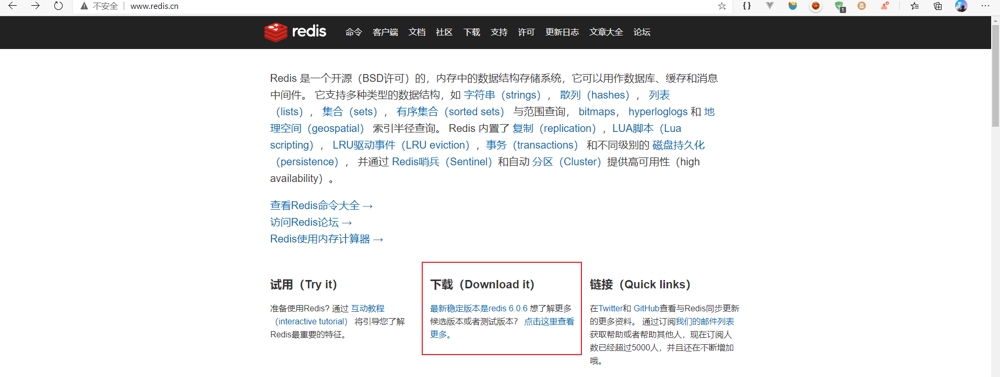

# Centos 安装Redis

## 下载，解压

​		在[redis官网](https://redis.io/)，或者[redis中文网](http://www.redis.cn/)上下载redis



​		下载完成后，将压缩包上传到centos机器上。

```bash
$ rz
```

​		将文件解压

```bash
$ tar -zxvf redis-x.x.x.tar.gz
```

## 编译安装

​		因为redis是C语言写的，所以需要安装gcc：

```bash
$ yum install gcc -y
```

​		进入redis的解压目录：

```bash
$ cd redis-x.x.x
```

​		理论上来讲，我们需要看下README.md 看看该怎么使用这个软件。这里我们直接进行编译安装。

```bash
$ make
$ make install PREFIX=/usr/local/redis
```

## 启动服务

​		前台启动

```bash
$ cd /usr/local/redis/bin/
$ ./redis-server
```

​		后台启动

```bash
# 将源码目录的redis.conf 到 redis 的安装目录
$ cp redis.x.x.x/redis.conf /usr/local/redis/bin
# 	修改 redis.conf 文件，把 daemonize no 改为 daemonize yes
$ vim redis.conf
$ ./redis-server redis.conf
```

​			连接验证：

```bash
$ ./redis-cli
```


## 做成系统服务

​		创建一个.service 文件

```bash
$ vim /etc/systemd/system/redis.service
```

​		内容如下：

```bash
[Unit]
Description=redisserver
After=network.target
[Service]
Type=forking
ExecStart=/usr/local/redis/bin/redis-server /usr/local/redis/bin/redis.conf
PrivateTmp=true
[Install]WantedBy=multi-user.target
```

​		重启下systemctl服务

```bash
$ systemctl daemon-reload
```

​		服务命令：

```bash
systemctl start redis.service   #启动redis服务

systemctl stop redis.service   #停止redis服务

systemctl restart redis.service   #重新启动服务

systemctl status redis.service   #查看服务当前状态

systemctl enable redis.service   #设置开机自启动

systemctl disable redis.service   #停止开机自启动
```

