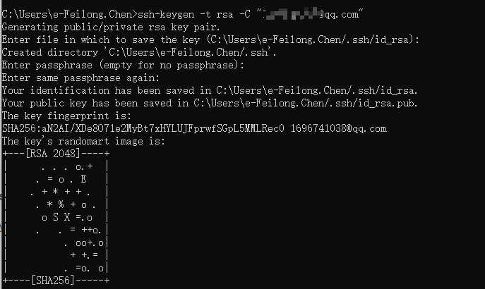
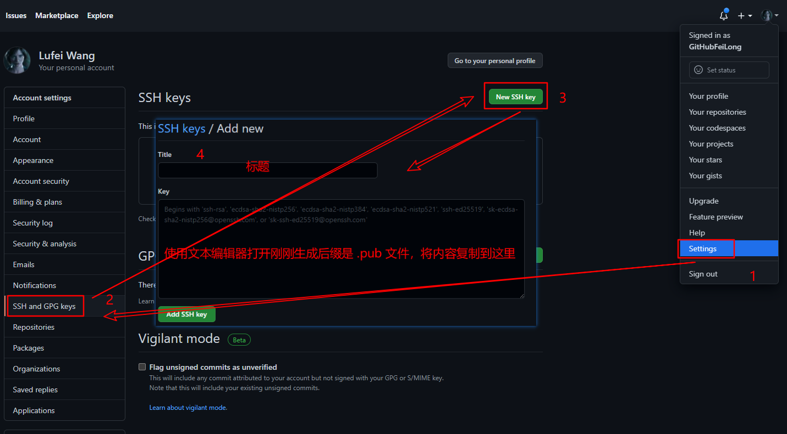
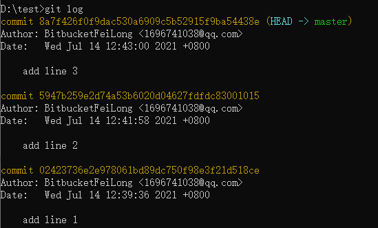
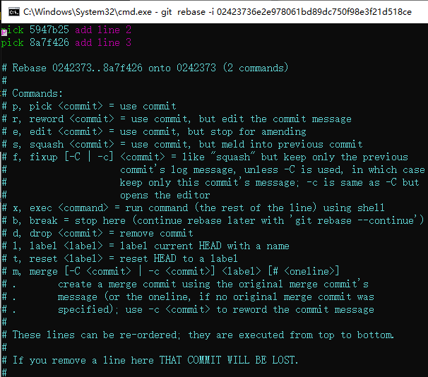
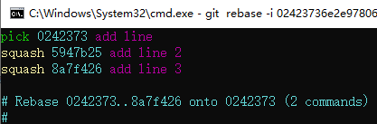
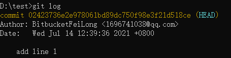
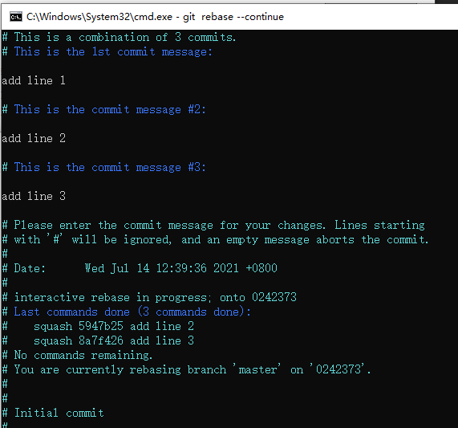
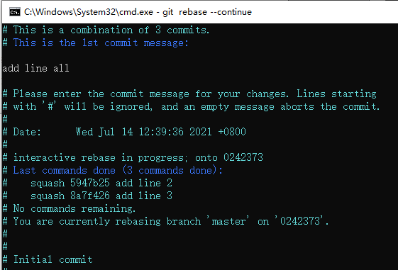
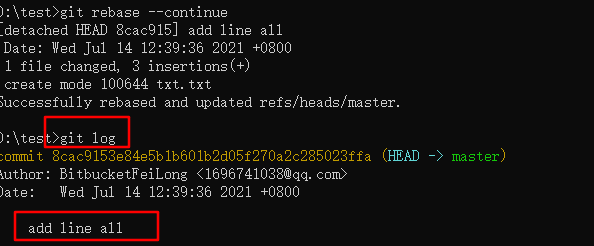

# Git常用命令

## 新建仓库

```bash
# 通过 SSH
git clone ssh://user@domain.com/repo.git

#通过 HTTP
git clone http://domain.com/user/repo.git

# 初始化本地仓库
git init
```

> https 使用很方便（经常403），每次还要输入密码，输入正确的也会403，心态炸了

### ssh使用

1. 创建SSH Key

   ```bash
   $ ssh-keygen -t rsa -C "你的邮箱"
   ```

   期间会让你输入三次设置，也可以都不设置，使用默认值

   + 输入一个文件名，用于保存刚才生成的 SSH key 代码
   + 输入密码，使用key时会提示输入这个密码
   + 重复上面的密码




2. 添加SSH Key到GitHub，步骤如图

   

   成功后，创建key的命令中邮箱会收到成功邮件

3. 测试

   ```bash
   $ ssh -T git@github.com
   C:\Users\e-Feilong.Chen>ssh -T git@github.com
   The authenticity of host 'github.com (52.74.223.119)' can't be established.
   RSA key fingerprint is SHA256:nThbg6kXUpJWGl7E1IGOCspRomTxdCARLviKw6E5SY8.
   Are you sure you want to continue connecting (yes/no)? yes
   Warning: Permanently added 'github.com,52.74.223.119' (RSA) to the list of known hosts.
   Enter passphrase for key 'C:\Users\e-Feilong.Chen/.ssh/id_rsa':
   Hi GitHubFeiLong! You've successfully authenticated, but GitHub does not provide shell access.
   ```

4. 最后使用 ssh方式clone仓库，如果创建key时设置了密码，那么会提示输入密码

   ```bash
   D:\workspace\my-workspace>git clone git@github.com:GitHubFeiLong/goudong-java.git
   Cloning into 'goudong-java'...
   Enter passphrase for key '/c/Users/e-Feilong.Chen/.ssh/id_rsa': #这里就是设置的密码
   ```

### 将HTTPS修改成SSH

将已经使用https方式clone的仓库，修改成ssh方式

```bash
git remote set-url origin git@github.com:你的GitHub账户/仓库名字.git
```

## 添加修改

```bash
# 把指定文件添加到暂存区
$ git add xxx

# 把当前所有修改添加到暂存区
$ git add .

# 把所有修改添加到暂存区
$ git add -A
```


## 提交

```bash
# 提交本地的所有修改
$ git commit -a

# 提交之前已标记的变化
$ git commit

# 附加消息提交
$ git commit -m 'commit message'

# 修改提交的注释
$ git commit --amend
```


## 合并多次提交(高级)

本地提交多次后，可以进行合并后，再提交到远程分支，下面进行一个demo示例：

1. 新建一个文件夹 test，在下面进行git初始化

   ```cmd
   D:\test>git init
   Initialized empty Git repository in D:/test/.git/
   ```

2. 新建文本文件txt.txt,进行编辑,新增一行内容为 `add line 1`，然后保存提交:

   ```cmd
   D:\test>type txt.txt
   add line 1
   
   D:\test>git add .
   
   D:\test>git commit -m "add line 1"
   [master (root-commit) 0242373] add line 1
    1 file changed, 1 insertion(+)
    create mode 100644 txt.txt
   ```

   > type命令是windws的一个命令，用来查看文本内容。

   

3. 继续编辑txt文件，在第二行新增 `add line 2`，然后保存再commit

   ```cmd
   D:\test>type txt.txt
   add line 1
   add line 2
   
   D:\test>git add .
   
   D:\test>git commit -m "add line 2"
   [master 5947b25] add line 2
    1 file changed, 2 insertions(+), 1 deletion(-)
   ```

4. 继续上面的步骤，新增 add line 3 ，然后保存提交：

   ```cmd
   D:\test>type txt.txt
   add line 1
   add line 2
   add line 3
   
   D:\test>git add .
   
   D:\test>git commit -m "add line 3"
   [master 8a7f426] add line 3
    1 file changed, 2 insertions(+), 1 deletion(-)
   ```

5. 查看提交日志记录（三条commit log，按照时间降序排列）：

   

6. 进行rebase（变基），这里的 024237... 就是提交的commitid，这里我们使用的第一次提交的commitid

   ```cmd
   git rebase -i 02423736e2e978061bd89dc750f98e3f21d518ce
   ```

   执行后，会让我们编辑一个文件（输入小写的i，即可进入编辑模式）：

   

   这里，我们将这两个`pick`修改成 `squash`,然后在文件第一行新增一行，然后保存退出（: , wq, 回车），最后结果如下：



> 翻译：
>
> ```txt
> # Commands:
> # p, pick <commit> = use commit
> # r, reword <commit> = use commit, but edit the commit message
> # e, edit <commit> = use commit, but stop for amending
> # s, squash <commit> = use commit, but meld into previous commit
> # f, fixup [-C | -c] <commit> = like "squash" but keep only the previous
> #                    commit's log message, unless -C is used, in which case
> #                    keep only this commit's message; -c is same as -C but
> #                    opens the editor
> # x, exec <command> = run command (the rest of the line) using shell
> # b, break = stop here (continue rebase later with 'git rebase --continue')
> # d, drop <commit> = remove commit
> # l, label <label> = label current HEAD with a name
> # t, reset <label> = reset HEAD to a label
> # m, merge [-C <commit> | -c <commit>] <label> [# <oneline>]
> # .       create a merge commit using the original merge commit's
> # .       message (or the oneline, if no original merge commit was
> # .       specified); use -c <commit> to reword the commit message
> #
> # These lines can be re-ordered; they are executed from top to bottom.
> #
> # If you remove a line here THAT COMMIT WILL BE LOST.
> #
> # However, if you remove everything, the rebase will be aborted.
> ```
>
> ```txt
> #命令:
> # p, pick <commit> = 使用提交
> # r, reword <commit> = 使用提交，但是编辑commit消息
> # e, edit <commit> = 使用提交，但停止修改
> # s, squash <commit> = 使用提交，但合并到之前的commit中 # 合并多次commit使用此命令
> # f, fixup [-C | -C] <commit> = 类似`squash`,但是只保留前一个的提交日志消息，除非使用-C，在这种情况下只保存这个提交信息;-c和-C一样,但-c打开编辑器
> # x, exec <command> = run命令(其余部分行)使用shell
> # b, break = 在这里停止(使用'git rebase -continue'继续rebase)
> # d, drop <commit> = 删除提交
> # l, label <label> = 用名称标记当前HEAD
> # t, reset <label> = reset HEAD to a label
> # m, merge(-C <commit> | -c <commit>]<label> [# < oneline >)
> #。使用原始的合并提交创建一个合并提交消息(或者一行，如果没有指原始的合并提交);使用-c <commit>来重写提交消息
> # 这些行可以重新排序;他们从上到下执行。
> ＃如果你在这里删除了一行，这个提交将会丢失。
> ＃但是，如果你删除了所有内容，rebase将被终止。
> ```
>
> 

7. 此时，重新查看日志,关闭文本文件后重新打开文本查看内容，会发现之前的commit2 和commit3 都不见了，此时不要着急。

   

   ```cmd
   D:\test>type txt.txt
   add line 1
   ```


8. 执行命令：

   ```cmd
   D:\test>git status
   interactive rebase in progress; onto 0242373
   Last command done (1 command done):
      pick 0242373 add line
   Next commands to do (2 remaining commands):
      squash 5947b25 add line 2
      squash 8a7f426 add line 3
     (use "git rebase --edit-todo" to view and edit)
   You are currently rebasing branch 'master' on '0242373'.
     (all conflicts fixed: run "git rebase --continue")
   
   nothing to commit, working tree clean
   ```

   这里提示我们了，可以修改(`git rebase --edit-todo`)也可以继续(`git rebase --continue`)，我们执行继续：

   ```cmd
   git rebase --continue
   ```

   这里显示了三次commit 的 message，我们可以将其编辑：

   

   ​	将提交的message，进行修改如下,然后保存退出：



9. 再次查看提交日志，再次关闭文本文件，然后重新打开查看文件内容以恢复：

   

   ```cmd
   D:\test>type txt.txt
   add line 1
   add line 2
   add line 3
   ```


## 储藏

```bash
# 1. 将修改作为当前分支的草稿保存
$ git stash

# 2. 查看草稿列表
$ git stash list
stash@{0}: WIP on master: 6fae349 :memo: Writing docs.

# 3.1 删除草稿
$ git stash drop stash@{0}

# 3.2 读取草稿
$ git stash apply stash@{0}
```


## 撤销修改

```bash
# 移除缓存区的所有文件（i.e. 撤销上次git add）
$ git reset HEAD

# 将HEAD重置到上一次提交的版本，并将之后的修改标记为未添加到缓存区的修改
$ git reset <commit>

# 将HEAD重置到上一次提交的版本，并保留未提交的本地修改
$ git reset --keep <commit>

# 放弃工作目录下的所有修改
$ git reset --hard HEAD

# 将HEAD重置到指定的版本，并抛弃该版本之后的所有修改
$ git reset --hard <commit-hash>

# 用远端分支强制覆盖本地分支
$ git reset --hard <remote/branch> e.g., upstream/master, origin/my-feature

# 放弃某个文件的所有本地修改
$ git checkout HEAD <file>
```

删除添加`.gitignore`文件前错误提交的文件：

```
$ git rm -r --cached .
$ git add .
$ git commit -m "remove xyz file"
```

撤销远程修改（创建一个新的提交，并回滚到指定版本）：

```
$ git revert <commit-hash>
```

彻底删除指定版本：

```
# 执行下面命令后，commit-hash 提交后的记录都会被彻底删除，使用需谨慎
$ git reset --hard <commit-hash>
$ git push -f
```

## 更新与推送

### 更新

```bash
# 下载远程端版本，但不合并到HEAD中
$ git fetch <remote>

# 将远程端版本合并到本地版本中
$ git pull origin master

# 以rebase方式将远端分支与本地合并
$ git pull --rebase <remote> <branch>
```

### 推送

```bash
# 将本地版本推送到远程端
$ git push remote <remote> <branch>

# 覆盖远程分支
$ git push remote branch --force

# 删除远程端分支
$ git push <remote> :<branch> (since Git v1.5.0)
$ git push <remote> --delete <branch> (since Git v1.7.0)

# 发布标签
$ git push --tags
```

### 查看信息

显示工作路径下已修改的文件：

```bash
$ git status
```

显示与上次提交版本文件的不同：

```bash
$ git diff
```

显示提交历史：

```bash
# 从最新提交开始，显示所有的提交记录（显示hash， 作者信息，提交的标题和时间）
$ git log

# 显示某个用户的所有提交
$ git log --author="username"

# 显示某个文件的所有修改
$ git log -p <file>

# 指定显示最近几条log
$ git log -n 1
```

显示搜索内容：

```bash
# 从当前目录的所有文件中查找文本内容
$ git grep "Hello"

# 在某一版本中搜索文本
$ git grep "Hello" v2.5
```

## 分支

增删查分支：

```bash
# 列出所有的分支
$ git branch -a

# 列出所有的远端分支
$ git branch -r

# 基于当前分支创建新分支
$ git branch new-branch

# 基于远程分支创建新的可追溯的分支
$ git branch --track new-branch remote-branch

# 将本地分支push到github
git push origin new-branch

# 删除github上的分支
$ git push origin :new-branch

# 删除本地分支
$ git branch -d branch

# 强制删除本地分支，将会丢失未合并的修改
$ git branch -D branch
```

切换分支：

```bash
# 切换分支
$ git checkout branch

# 创建并切换到新分支
$ git checkout -b branch
```


## 标签

```bash
# 给当前版本打标签
$ git tag tag-name

# 给当前版本打标签并附加消息
$ git tag -a tag-name
```

## 合并与变基

> merge 与 rebase 虽然是 git 常用功能，但是强烈建议不要使用 git 命令来完成这项工作。
>
> 因为如果出现代码冲突，在没有代码比对工具的情况下，实在太艰难了。
>
> 你可以考虑使用各种 Git GUI 工具。

合并：

```bash
# 将分支合并到当前HEAD中
$ git merge <branch>

# 合并时提示 can not merge
## 先将代码储藏 注：此命令是备份当前的工作区，防止当前工程中已修改的代码出现丢失，同时将工作区中的代码保存到git栈中。
git stash
## 再执行命令：拉取更新 注：此命令是不再解释。
git pull
## 然后执行命令：注：此命令是从git栈中读取命令1保存的内容，恢复工作区
git stash pop
## 最后合并分支
git merge branch
```

变基：

​		使用 rebase 可以使git历史变为完整一条线

```bash
# 将 <branch> 的分支变基到当前分支
$ git rebase <branch>
```


## 将分支合并成一条线

1. 先找到出现分叉前的commit ID，复制下来，然后使用 `reset` 命令，将当前分支回退到指定commitID分支。

   ```bash
   $ git reset 974a75a7
   ```

2. 使用上面的命令后，本地更改的代码不会消失，只会保存在暂存区。此时在正常添加到工作区，然后提交。

## 关联远程仓库

1. 初始化本地git

   ```bash
   $ git init
   ```

2. 添加远程仓库

   ```bash
   $ git remote add origin https://github.com/GitHubFeiLong/spring-security.git
   ```

3. 如果本地有文件的话，先提交，push，然后再pull

   ```bash
   $ git  add .
   $ git commit -m"init"
   $ git push
   $ git pull
   ```

   

## 仓库迁移

本地分支 拉取新的远程分支时报错：`fatal: refusing to merge unrelated histories` 在后部添加 `--allow-unrelated-histories` 完美解决

```bash
git pull origin master --allow-unrelated-histories
```


## 高级教程

### 恢复删除的分支

#### 恢复删除的本地分支

```bash
# 查看历史提交
$ git reflog show --date=iso
```

> ***git reflog用来记录你的每一次命令，--date=iso 表示以标准时间显示。***
> ***不能使用git log ， git log 在分支删除后，log 也无法显示。***

```bash
# 查看指定commit的详情
$ git show commitID
#恢复本地分支
$ git checkout -b  要恢复的分支名  commitId
```

