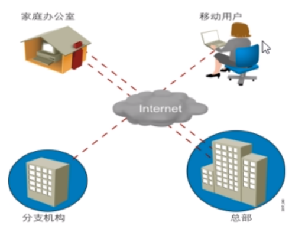

# 网络

## 内容概述

+ 网络概念
+ OSI模型
+ 网络设备
+ TCP/IP
+ IP地址规划
+ 配置网络
+ 多网卡绑定
+ 网桥
+ 测试网络
+ 网络工具

## 1 网络基础

### 1.1 网络概念

网络是一组计算机或网络设备通过有形的线缆或无形的媒介如无线，连接起来，按照一定的规划，进行通信的集合。



网络功能和优点

+ 数据和应用程序
+ 资源
+ 网络存储
+ 备份设备

作用范围分类

+ 广域网（WAN，Wide Area Network）
+ 域域网（MAN， Metropolitan Area Network）
+ 局域网（LAN， Local Area Network）


### 1.2 常见的网络物理组件


### 1.3 网络应用程序

#### 1.3.1 各种网络应用

+ Web 浏览器（Chrmoe、IE等）
+ 即时消息(QQ、 微信、钉钉等)
+ 电子邮件(Outlook. foxmail等)
+ 协作(视频会议、VNC、 Netmeeting. WebEx等)
+ web网络服务(apache, nginx, IIS)
+ 文件网络服务(ftp. nfs, samba)
+ 数据库服务( MySQL, MariaDB. MongoDB)
+ 中间件服务(Tomcat, JBoss)
+ 安全服务(Netfilter)

#### 1.3.2 应用程序对网络的要求

+ 批处理应用程序
  - FTP、TFTP、库存更新
  - 无需直接人工交互
  - 带宽很重要，但非关键性因素

+ 交互式应用程序
  - 库存查询、数据库更新
  - 人机交互
  - 因为用户需等待响应，所以响应时间很重要，但并非关键性因素。除非要等待很长时间

+ 实时应用程序
  - VoIP、视频
  - 人与人的交互
  - 端到端的延时至关重要

### 1.4 网络的特征

网络特性：

+ 速度
+ 成本
+ 安全性
+ 可用性
+ 可扩展性
+ 可靠性
+ 拓扑

#### 1.4.1 速度(带宽)


#### 1.4.2 网络拓扑

拓扑结构一般是指由点和线排列的几何图形

计算机网络的拓扑结构是指一个网络的通信链路和计算机结点相互连接构成的几何图形

**拓扑分类**

+ 物理拓扑描述了物理设备的布线方式
+ 逻辑拓扑描述了信息在网络中流动的方式

**拓扑结构分类**


+ 总线拓扑：所有设备均可接收信号
+ 星型拓扑：通过中心点传输，单一故障点
+ 扩展星型拓扑：比新型拓扑的复原能力更强
+ 环拓扑：信号绕环传输，单一故障点
+ 双环拓扑：信号延相反方向传输，比单环的复原能力更强
+ 全网壮拓扑：容错能力强，实施成本高
+ 部分网状拓扑：在容错能力与成本之间寻求平衡


### 1.5 网络标准

#### 1.5.1 网络标准和分层

旧模型：专有产品，有一个厂商控制应用程序和嵌入的软件
基于标准的模型：多厂商软件，分层方法

**层次划分的必要性**

计算机网络是由许多硬件、软件和协议交织起来的复杂系统。由于网络设计十分复杂，如何设计、组织和实现计算机网络是一个挑战，必须要采用科学有效的方法

**层次划分的方法**

+ 网络的第一层应当具有相对独立的功能
+ 梳理功能之间的关系，是一个功能可以为实现零i个功能提供必要的服务，从而形成系统的层次结构
+ 为提高系统的工作效率，相同或相近的功能仅在一个层次中实现，而且尽可能在较高的层次中实现
+ 每一层只为相邻的上一层提供服务

#### 网络分层

1. **第7层应用层**
   应用层(Application Layer)提供为应用软件而设的接口，以设置与另一应用软件之间的通信。例如: HTTP、HTTPS、FTP、 TELNET、SSH、SMTP、 POP3、 HTML等

2. **第6层表示层**
   表示层(Presentation Layer)把数据转换为能与接收者的系统格式兼容并适合传输的格式。

3. **第5层会话层**
   会话层(Session Layex)负责在数据传输中设置和维护电脑网络中两台电脑之间的通信连接。

4. **第4层传输层**
   传输层(Transport Layer)把传输表头(TH) 加至数据以形成数据包。传输表头包含了所使用的协议等发送信息。例如:传输控制协议(TCP) 等。

5. **第3层网络层**
   网络层(Network Layer)决定数据的路径选择和转寄,将网络表头(NH) 加至数据包，以形成报文。网络表头包含了网络数据。例如:互联网协议(IP)等。

6. **第2层数据链接层**
   数据链路层(Data Link Layer)负责网络寻址、错误侦测和改错。当表头和表尾被加至数据包时，会形成信息框(Data Frame) .数据链表头(OLH) 是包含了物理地址和错误侦测及改错的方法。数据链表尾(DLT) 是一串指示数据包末端的字符串。例如以太网、无线局域网(Wi-Fi) 和通用分组无线服务(GPRS) 等。分为两个子层:逻辑链路控制(logical link control, LLC) 子层和介质访问控制(Media access control, MAC)子层。

7. **第1层物理层**
   物理层(Physical Layer)在局部局域网上传送数据帧(Data Frame)，它负责管理电脑通信设备和网络媒体之间的互通。包括了针脚、电压、线缆规范、集线器、中继器、网卡，主机接口卡等。


#### 三种通讯模式

1. 单播
2. 广播
3. 组播


#### 三种通讯机制


+ 单工通信：只有一个方向
+ 半双工通信：通信双方都可以发送和接收信息，但不能同时发送，也不能同时接收
+ 全双工通信：通信双方可以同时发送和同时接收

范例：

```bash
[root@centos7: ~]#mii-tool ens33
ens33: negotiated 1000baseT-FD flow-control, link ok

[root@centos7: ~]#mii-tool -v ens33
ens33: negotiated 1000baseT-FD flow-control, link ok
  product info: Yukon 88E1011 rev 3
  basic mode:   autonegotiation enabled
  basic status: autonegotiation complete, link ok
  capabilities: 1000baseT-FD 100baseTx-FD 100baseTx-HD 10baseT-FD 10baseT-HD
  advertising:  1000baseT-FD 100baseTx-FD 100baseTx-HD 10baseT-FD 10baseT-HD
  link partner: 1000baseT-HD 1000baseT-FD 100baseTx-FD 100baseTx-HD 10baseT-FD 10baseT-HD
  
[root@centos7: ~]#ethtool  -i ens33
driver: e1000
version: 7.3.21-k8-NAPI
firmware-version: 
expansion-rom-version: 
bus-info: 0000:02:01.0
supports-statistics: yes
supports-test: yes
supports-eeprom-access: yes
supports-register-dump: yes
supports-priv-flags: no
  
  
[root@centos7: ~]#ethtool  ens33
Settings for ens33:
	Supported ports: [ TP ]
	Supported link modes:   10baseT/Half 10baseT/Full 
	                        100baseT/Half 100baseT/Full 
	                        1000baseT/Full 
	Supported pause frame use: No
	Supports auto-negotiation: Yes
	Supported FEC modes: Not reported
	Advertised link modes:  10baseT/Half 10baseT/Full 
	                        100baseT/Half 100baseT/Full 
	                        1000baseT/Full 
	Advertised pause frame use: No
	Advertised auto-negotiation: Yes
	Advertised FEC modes: Not reported
	Speed: 1000Mb/s
	Duplex: Full
	Port: Twisted Pair
	PHYAD: 0
	Transceiver: internal
	Auto-negotiation: on
	MDI-X: off (auto)
	Supports Wake-on: d
	Wake-on: d
	Current message level: 0x00000007 (7)
			       drv probe link
	Link detected: yes

```


## 2 局域网 Local Area Network

### 2.1 概述

#### 2.1.1 特点

+ 网络为一个单位所拥有
+ 地理范围和站点数目均有限

#### 2.1.2主要功能

+ 资源共享和数据通信

#### 2.1.3优点

+ 能方便地共享昂贵的外部设备、主机以及软件、数据。从一个站点可以访问全网
+ 便于系统的扩展和逐渐演变，各设备的位置可灵活的调整和改变
+ 提高系统的可靠性、可用性和易用性

#### 2.1.4标准

IEEE于1980年2月成立了局域网标准委员会(简称EEE802委员会)，专门从事局域网标准化工作,并制定了IEEE802标准。802标准所描述的局域网参考模型只对应OSI参考模型的数据链路层与物理层，它将数据链路层划分为逻辑链路层LLC子层和介质访问控制MAC子层。

LLC子层负责向其上层提供服务：
MAC子层的主要功能包括数据帧的封装/卸装，帧的寻址和识别，帧的接收与发送，链路的管理，帧的差错控制等。MAC子层的存在屏蔽了不同物理链路种类的差异性。

**局域网标准**


### 2.2组网设备


## 网络命令

### netstat 命令

+ 显示网络链接：

  ```bash
  netstat [--tcp| -t] [--udp | -u] [--raw | -w] [--listening | -l] [--all | -a] [--numeric | -n] [--extend | -e] [--program | -p]
  
  #参数解释
  -t:tcp协议相关
  -u:udp协议相关
  -w：raw socket 相关
  -l：处于监听状态
  -a：所有状态
  -n：以数字显示IP和端口
  -e：扩展格式
  -p：显示相关进程及PID
  
  ## 额外命令
  # 查看端口号被哪个应用占用
  lsof -i :22
  ```

+ 常用组合：

  ```bash
  -tan, -uan, -tnl, -unl
  ```

+ 显示路由表：

  ```bash
  netstat {--route|-r}[--numeric|-n]
  
  
  -r:显示内核路由表
  -n：数字格式
  
  ## 下面两个命令等价
  route -n
  netstat -nr
  ```

+ 显示接口统计数据

  ```bash
  netstat {--interfaces|-I|-i} [iface] [--all|-a] [--extend|-e] [--program|-p] [--numeric|-n]
  
  netstat -i #查看所有网卡
  netstat -I=IFACE #只看特定的网卡 netstat -I=eth0
  ifconfig -s eth0 #和上条命令一样作用
  
  
  # 1s一次观察 查看网络吞吐量
  watch -n1 netstat -i
  ## 攻击指定主机网卡资源
  ping -s 65507 192.168.2.100 -f
  ```


### IP命令

+ 配置Linux网络属性：ip命令

+ ```bash
  ip -show / manipulate routing, devices, policy routing and tunnels
  	ip [OPTIONS] OBJECT {COMMAND|help}
  	OBJECT:={link|addr|rout}
  	ip link -network device configuration
  		set dev IFACE
  			可设置属性：
  			up and down：激活或禁用指定接口
  				ifup/ifdown
  
  		show [dev IFACE]:指定接口
  			[up]:仅显示处于激活状态的接口
  ```

  

+ ```bash
  ip addr {add | del} IFADDR dev STRING
  	[label LABEL]:添加地址时指明网卡别名
  	[scope {global | link | host}]:指明作用域
  		global：全局可用
  		link：仅链接可用
  		host：本机可用
  	[broadcast ADDRESS]:指明广播地址
  ```

  

+ ```bash
  ip address show -look at protocol address
  	[dev DEVICE]
  	[label PATTERN]
  	[primary and secondary]
  ```

  

+ ```bash
  ip addr flush 使用格式同show
  	ip addr add 192.168.2.100.100/16 dev ens33 label eth0:0
  	ip addr del 192.168.2.100.100/16 dev ens33 label eth0:0
  	ip addr flush  dev ens33 label eth0:0
  ```

  

+ ```bash
  # 修改网卡名
  ## 停止网卡
  ip link set ens33 down
  ## 设置网卡名
  ip link set eth1 name eth0
  ## 启动网卡
  ip link set eth0 up
  ```


+ ip route -routing table management
  + 添加路由：ip route add
  + ip route add TARGET via GW dev IFACE src SOURCE_IP
    + TARGET:
      + 主机路由：IP
      + 网络路由：NETWORK/MASK
    + ip route add 192.168.0.0/24 via 172.16.0.1
    + ip route add 192.168.1.13 via 172.16.0.1
    + 添加网关：ip route del TARGET
    + 显示路由：ip route show | list
    + 清空路由表：
      + ip route flush [dev IFACE] [via PREFIX]
      + ip route flush dev eth0

范例：

```bash
# 给网卡添加IP地址
ip addr add 1.1.1.1/24 dev ens33

# 删除ens33网卡设备上的ip地址1.1.1.1/24
ip addr del 1.1.1.1/24 dev ens33

# 全删除网卡设备的ip地址
ip a flush dev ens33
```


## SS 命令

### 格式

ss [option]... [filter]

netstat 通过遍历proc来获取socket信息，ss使用netlink与内核tcp_diag模块通信获取socket信息

### 选项

```bash
-t：tcp协议相关
-u：udp协议相关
-w：裸套接字相关
-x：unix sock相关
-l：listen状态的链接
-a：所有
-n：数字格式
-p相关的程序及PID
-e：扩展的信息
-m：内存用量
-o：计时器信息
```


### FILTER：[state TCP-STATE] [EXPRESSION]

### TCP的常见状态：

tcp finite state machine：

+ LISTEN：监听
+ ESTABLISHED：已建立的连接
+ FIN_WAIT_1
+ FIN_WAIT_2
+ SYN_SENT
+ SYN_RECV
+ CLOSED


### EXPRESSION:

+ dport=
+ sport=

+ 示例：'(drop=:ssh or sport=:ssh)'


### 常见组合

-tan, -tanl -tanlp, -uan

### 常见用法

```bash
# 显示本地打开的所有端口
ss -l

# 显示每个进程具体打开的socket
ss -pl

# 显示所有的tcp socket
ss -t -a

# 显示所有的UDP socket
ss -u -a

# 显示所有已建立的ssh链接(注意=号两边的空格)
ss -o state established '( dport = :ssh or sport = :ssh )'


# 显示所有已建立的http链接
ss -o state established '( dport = :http or sport = :http )'

# 列出当前socket详细信息
ss -s 
```


## 网络配置文件

### IP、MASK、GW、DNS相关配置文件：

/etc/sysconfig/network-scripts/ifcfg-IFACE

### 路由相关的配置文件

/etc/sysconfig/network-scripts/route-IFACE

### /etc/sysconfig/network-scripts/ifcfg-IFACE:

说明参考/usr/share/doc/initscripts-9.49.30/sysconfig.txt

​	DEVICE:此配置文件应用到的设备
​	HWADDR：对应的设备的MAC地址
​	BOOTPROTO：激活此设备时使用的地址配置协议，常用的dhcp，static，none，bootp
​	NM_CONTROLLED:NM是NetworkManager的简写，此网卡是否接受NM控制；建议CentOS6 为“no”


### 属性设置

ONBOOT：在系统引导时是否激活此设备

TYPE：接口类型；常见的有Ethernet，Bridge

UUID：设备的唯一标识

IPADDR：指明IP地址

NETMASK：子网掩码

GATEWAY：默认网关

DNS1：第一个DNS服务器指向

DNS2：第二个DNS服务器指向

USERCTL：普通用户是否可控制此设备

PEERDNS：如果BOOTTPROTO的值为“dhcp”，YES将允许dhcp server分配的dns服务器信息直接覆盖至/etc/resolv.conf文件，NO不允许修改resolv.conf


### 设备配置被保存在文本文件中

+ /etc/sysconfig/network-scripts/ifcfg-\<name>

+ 帮助文档列出完整选项列表：/usr/share/doc/initscripts-*/sysconfig.txt


## 主机名和本地解析器

+ 配置当前主机的主机名：
  + hostname [HOSTNAME]
  + /etc/sysconfig/network
    + HOSTNAME=
+ 解析器执行正向和逆向查询
+ /etc/hosts
  + 本地主机名数据库和IP地址的映像
  + 对小型独立网络有用
  + 通常，在使用DNS前检查
  + getent hosts 查看/etc/hosts内容

## DNS名字解析

+ /etc/resolv.conf
  + nameserver DNS_SERVER_IP1
  + nameserver DNS_SERVER_IP2
  + nameserver DNS_SERVER_IP3
  + search magedu.com
+ /etc/nsswitch.conf
  + 与/etc/hosts相比优先于DNS
+ 正向解析：FQDN --> IP
  + dig -t A FQDN
  + host -t A FQDN
+ 反向解析：IP --> FQDN
  + dig -x IP
  + host -t PTR IP


## 网络配置文件

/etc/sysconfig/network-scripts/route-IFACE

注意：需service network restart 生效

两种风格：

+ 1.TARGET via GW

​	如：10.0.0.0/8 via 172.16.0.1

+ 每三行定义一条路由

  - ADDRESS#=TARGET
  - NETMASK#=mask

  - GATEWAY#=GW


## 网卡别名

+ 对虚拟主机有用

+ 将多个IP地址绑定到一个NIC上

  + eth0:1、eth0:2、eth0:3

+ ifconfig命令：

  + ifconfig eth0:0 192.168.1.100/24 up
  + ifconfig eth0:0 down

+ ip命令：

  + ip addr add 172.16.1.2/16 dev eth0
  + ip addr add 172.16.1.1/16 dev eth0 label eth0:0
  + ip addr add 172.16.1.2/16 dev eth0 label eth0:0

  - ip addr del 172.16.1.1/16 dev eth0 label eth0:0
  - ip addr flush dev eth0 label eth0:0


## 设备别名

+ 为每个设备别名生成独立的接口配置文件啊
  + 关闭NetworkManager服务
  + ifcfg-ethX:xxx
  + 必须使用静态联网
    + DEVICE=eth0:0
    + IPADDR=10.10.10.10
    + NETMASK=255.0.0.0
    + ONPARENT=yes
+ 注意：service network restart 生效
+ 参考：/usr/share/doc/initscripts-*/sysconfig.txt


