# Docker 高级

1. docker 镜像制作
2. docker 仓库
3. docker 网络管理
4. 搭建 docker swarm 集群
5. docker compose 编排工具
6. docker 的web可视化管理工具

## 1、Docker 镜像制作

​		构建docker 镜像方式有两种：

1. 使用 docker commit 命令
2. 使用 docker build 和 Dockerfile 文件

### 1.1、docker commit 制作镜像

#### 1.1.1、制作镜像（commit）

​		查看 `commit` 帮助文档

```bash
$ sudo docker commit --help
Usage:	docker commit [OPTIONS] CONTAINER [REPOSITORY[:TAG]]

Create a new image from a container's changes

Options:
  -a, --author string    Author (e.g., "John Hannibal Smith <hannibal@a-team.com>")
  -c, --change list      Apply Dockerfile instruction to the created image
  -m, --message string   Commit message
  -p, --pause            Pause container during commit (default true)
```

​		例如制作新的镜像，将正在运行的 run-container 制作成一个镜像，镜像名叫做new-image-name：

```bash
$ sudo docker commit run-container new-image-name
```

#### 1.1.2、运行容器脚本（exec）

​		查看 `exec` 帮助文档

```bash
$ sudo docker exec --help

Usage:	docker exec [OPTIONS] CONTAINER COMMAND [ARG...]

Run a command in a running container

Options:
  -d, --detach               Detached mode: run command in the background
      --detach-keys string   Override the key sequence for detaching a container
  -e, --env list             Set environment variables
  -i, --interactive          Keep STDIN open even if not attached
      --privileged           Give extended privileges to the command
  -t, --tty                  Allocate a pseudo-TTY
  -u, --user string          Username or UID (format: <name|uid>[:<group|gid>])
  -w, --workdir string       Working directory inside the container
```

​		例如，启动容器中的tomcat服务

```bash
$ sudo docker exec new-containner /usr/local/tomcat/bin/startup.sh
```

#### 1.1.3、镜像打包（save）

​		查看 `save` 使用文档

```bash
$ sudo docker save --help

Usage:	docker save [OPTIONS] IMAGE [IMAGE...]

Save one or more images to a tar archive (streamed to STDOUT by default)

Options:
  -o, --output string   Write to a file, instead of STDOUT
```

​		打包镜像 image-name 到 /root/image-name.tar 文件

```bash
$ sudo docker save -o /root/image-name.tar image-name
```

​		使用`scp`将打包的镜像上传到其他服务器

```bash
$ sudo  scp image-name.tar ip:/root
```

#### 1.1.4、导入镜像（load）

​		查看 `load` 帮助文档

```bash
$ sudo docker load --help

Usage:	docker load [OPTIONS]

Load an image from a tar archive or STDIN

Options:
  -i, --input string   Read from tar archive file, instead of STDIN
  -q, --quiet          Suppress the load output
```

​		例如，导入上面使用 `commit` 的镜像

```bash
$ sudo docker load -i /root/image-name.tar
```


### 1.2、docker 容器制作镜像	

#### 1.2.1、容器打包（export）

​		查看 `export` 帮助文档

```bash
$ sudo docker export --help

Usage:	docker export [OPTIONS] CONTAINER

Export a container's filesystem as a tar archive

Options:
  -o, --output string   Write to a file, instead of STDOUT
```

​		例如将容器 container-name 打包成一个tar文件

```bash
$ sudo docker export -o /root/container-name.tar container-name
```

#### 1.2.2、导入镜像（import）

​		查看 `import` 帮助文档

```bash
$ sudo docker import --help

Usage:	docker import [OPTIONS] file|URL|- [REPOSITORY[:TAG]]

Import the contents from a tarball to create a filesystem image

Options:
  -c, --change list       Apply Dockerfile instruction to the created image
  -m, --message string    Set commit message for imported image
      --platform string   Set platform if server is multi-platform capable
```

 		例如，将上一步容器导出的tar文件，导入进一个新的镜像。

```bash
$ sudo docker import container-name.tar container-name:laster
```


## 2、docker builder

​		Dockerfile 使用基本的基于 DSL 语法的指令来构建一个Docker镜像，之后使用`docker builder`命令基于该Dockerfile 中的指令构建一个新的镜像。

​		docker builder 帮助文档：

```bash
$ sudo docker build --help

Usage:	docker build [OPTIONS] PATH | URL | -

Build an image from a Dockerfile

Options:
      --add-host list           Add a custom host-to-IP mapping (host:ip)
      --build-arg list          Set build-time variables
      --cache-from strings      Images to consider as cache sources
      --cgroup-parent string    Optional parent cgroup for the container
      --compress                Compress the build context using gzip
      --cpu-period int          Limit the CPU CFS (Completely Fair Scheduler) period
      --cpu-quota int           Limit the CPU CFS (Completely Fair Scheduler) quota
  -c, --cpu-shares int          CPU shares (relative weight)
      --cpuset-cpus string      CPUs in which to allow execution (0-3, 0,1)
      --cpuset-mems string      MEMs in which to allow execution (0-3, 0,1)
      --disable-content-trust   Skip image verification (default true)
  -f, --file string             Name of the Dockerfile (Default is 'PATH/Dockerfile')
      --force-rm                Always remove intermediate containers
      --iidfile string          Write the image ID to the file
      --isolation string        Container isolation technology
      --label list              Set metadata for an image
  -m, --memory bytes            Memory limit
      --memory-swap bytes       Swap limit equal to memory plus swap: '-1' to enable unlimited swap
      --network string          Set the networking mode for the RUN instructions during build (default "default")
      --no-cache                Do not use cache when building the image
  -o, --output stringArray      Output destination (format: type=local,dest=path)
      --platform string         Set platform if server is multi-platform capable
      --progress string         Set type of progress output (auto, plain, tty). Use plain to show container output
                                (default "auto")
      --pull                    Always attempt to pull a newer version of the image
  -q, --quiet                   Suppress the build output and print image ID on success
      --rm                      Remove intermediate containers after a successful build (default true)
      --secret stringArray      Secret file to expose to the build (only if BuildKit enabled): id=mysecret,src=/local/secret
      --security-opt strings    Security options
      --shm-size bytes          Size of /dev/shm
      --squash                  Squash newly built layers into a single new layer
      --ssh stringArray         SSH agent socket or keys to expose to the build (only if BuildKit enabled) (format:
                                default|<id>[=<socket>|<key>[,<key>]])
      --stream                  Stream attaches to server to negotiate build context
  -t, --tag list                Name and optionally a tag in the 'name:tag' format
      --target string           Set the target build stage to build.
      --ulimit ulimit           Ulimit options (default [])

```


### 2.1、Dockerfile DSL语法

[Dockerfile](https://docs.docker.com/engine/reference/builder/#usage)

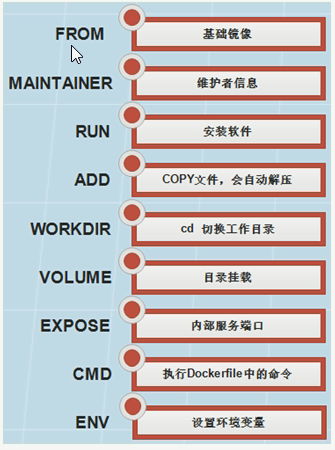

#### FROM 指令（指定基础image）		

​		构建指令，必须指定，且需要在 Dockerfile 其他指令的前面。后续的指令都依赖于该指令指定的image。FROM指令指定的基础image可以是官方远程仓库中的，也可以位于本地仓库。

> FROM命令告诉docker我们构建的镜像是以哪个(发行版)镜像为基础的。

​		第一条指令必须是FROM指令。并且，如果在同一个Dockerfile中创建多个镜像时，可以使用多个 FROM 指令。

​		该指令有两种格式： 

+ `FROM <image> `：指定基础image为该image的最后修改的版本。
+ `FROM <image>:<tag>`：指定基础image为该image的一个tag版本。


#### MAINTAINER 指令（用来指定镜像创建者信息）

​		构建指令，用于将image的制作者相关的信息写入到image中。当我们对该image执行`docker inspect`命令时，输出中有相应的字段记录该信息。

​		该指令格式：

+ `MAINTAINER <name>`


#### RUN 指令（安装软件用）

​		RUN后面接要执行的命令，比如，我们想在镜像中安装 vim，只需在Dockfile中写入 `RUN yum install ‐y vim`构建指令，RUN可以运行任何被基础image支持的命令。如基础image选择了ubuntu，那么软件管理部分只能使用ubuntu的命令。

​		该指令有两种格式：

+ `RUN <command>`
+ `RUN ["executable", "param1", "param2" ... ]`


#### CMD 指令（设置container启动时执行的操作）

​		设置指令，用于container启动时指定的操作。该操作可以是执行自定义脚本，也可以是执行系统命令。该指令只能在文件中存在一次，如果有多个，则只执行最后一条。

​		该指令有三种格式：

+ `CMD ["executable","param1","param2"]`

+ `CMD command param1 param2`

+ `CMD ["param1","param2"]`

  > 注意：
  >
  > 当Dockerfile指定了ENTRYPOINT，那么使用上面的格式
  >
  > 其中，ENTRYPOINT指定的是一个可执行的脚本或者程序的路径，该指定的脚本或者程序将会以param1和param2作为参数执行。所以如果CMD指令使用上面的形式，那么Dockerfile中必须要有配套的ENTRYPOINT。

  

#### ENTRYPOINT 指令（设置container启动时执行的操作）

​		设置指令，指定容器启动时执行的命令，可以多次设置，但是只有最后一个有效。

​		该指令有两种格式:

+ `ENTRYPOINT ["executable", "param1", "param2"]`
+ `ENTRYPOINT command param1 param2`

> 注意：
>
> 该指令的使用分为两种情况，一种是独自使用，另一种和CMD指令配合使用。当独自使用时，如果你还使用了CMD命令且CMD是一个完整的可执行的命令，那么CMD指令和ENTRYPOINT会互相覆盖，只有最后一个CMD或者ENTRYPOINT有效。
>
> 例如：
>
> CMD指令将不会被执行，只有ENTRYPOINT指令被执行
>
> ```dockerfile
> CMD echo “Hello, World!”
> ENTRYPOINT ls ‐l
> ```
>
> 另一种用法和CMD指令配合使用来指定ENTRYPOINT的默认参数，这时CMD指令不是一个完整的可执行命令，仅仅是参数部分；ENTRYPOINT指令只能使用JSON方式指定执行命令，而不能指定参数。
>
> ```dockerfile
> FROM ubuntu
> CMD ["‐l"]
> ENTRYPOINT ["/usr/bin/ls"]
> ```


#### USER 指令（设置container容器的用户）

​		设置指令，设置启动容器的用户，默认是root用户。

例如：指定memcached的运行用户

```dockerfile
ENTRYPOINT ["memcached"]
USER daemon
#或者
ENTRYPOINT ["memcached", "‐u", "daemon"]
```


#### EXPOSE 指令（指定容器需要映射到宿主机器的端口）

​		设置指令，该指令会将容器中的端口映射成宿主机器中的某个端口。当你需要访问容器的时候，可以不是用容器的IP地址而是使用宿主机器的IP地址和映射后的端口。
​		要完成整个操作需要两个步骤

		1. 首先在Dockerfile使用EXPOSE设置需要映射的容器端口。
  		2. 然后在运行容器的时候指定‐p选项加上EXPOSE设置的端口，这样EXPOSE设置的端口号会被**随机**映射成宿主机器中的一个端口号。

> 也可以指定需要映射到宿主机器的那个端口，这时要确保宿主机器上的端口号没有被使用。EXPOSE指令可以一次设置多个端口号，相应的运行容器的时候，可以配套的多次使用‐p选项。
> 格式:
> `EXPOSE <port> [<port>...]`

例：映射一个端口

```dockerfile
EXPOSE port
```

例：相应的运行容器使用的命令

```bash
$ docker run ‐p port image
# 或者（port是主机端口，port1是容器端口号）
$ docker run ‐p port:port1 image
```

​		端口映射是docker比较重要的一个功能，原因在于我们每次运行容器的时候，容器的IP地址不能指定而是在桥接网卡的地址范围内随机生成的。宿主机器的IP地址是固定的，我们可以将容器的端口的映射到宿主机器上的一个端口，免去每次访问容器中的某个服务时都要查看容器的IP的地址。对于一个运行的容器，可以使用docker port 加上容器中需要映射的端口和容器的ID来查看该端口号在宿主机器上的映射端口。

> 例：映射多个端口
>
> ```dockerfile
> EXPOSE port1 port2 port3
> ```
>
> 例：相应的运行容器使用的命令
>
> ```bash
> $ docker run ‐p port1 ‐p port2 ‐p port3 image
> ```
>
> 例：还可以指定需要映射到宿主机器上的某个端口号
>
> ```bash
> $ docker run ‐p host_port1:port1 ‐p host_port2:port2 ‐p host_port3:port3 image
> ```

​		

#### ENV 指令（用于设置环境变量）

​		主要用于设置容器运行时的环境变量

​		指令使用格式:

+ `ENV <key> <value>`

​		设置了后，后续的RUN命令都可以使用，container启动后，可以通过`docker inspect`查看这个环境变量，也可以通过在`docker run ‐‐env key=value`时设置或修改环境变量。

> 例如：
>
> 假如你安装了JAVA程序，需要设置 JAVA_HOME，那么可以在Dockerfile中这样写：
>
> ```dockerfile
> ENV JAVA_HOME /path/to/java/dirent
> ```


#### ADD 指令（从src复制文件到container的dest路径）

​		构建指令，主要用于将宿主机中的文件添加到镜像中，所有拷贝到container中的文件和文件夹权限为0755，uid和gid为0；如果是一个目录，那么会将该目录下的所有文件添加到container中，不包括目录；

​		如果文件是可识别的压缩格式，则docker会帮忙解压缩（注意压缩格式）；如果`<src>`是文件且`<dest>`中不使用斜杠结束，则会将`<dest>`视为文件，`<src>`的内容会写入`<dest>`；如果`<src>`是文件且`<dest>`中使用斜杠结束，则会`<src>`文件拷贝到`<dest>`目录下。

​		该指令的格式:

+ `ADD <src> <dest>`

  > `<src>`: 是相对被构建的源目录的相对路径，可以是文件或目录的路径，也可以是一个远程的文件url;
  > `<dest>`: 是container中的绝对路径


#### VOLUME 指令（指定挂载点）

​		设置指令，使容器中的一个目录具有持久化存储数据的功能，该目录可以被容器本身使用，也可以共享给其他容器使用。**我们知道容器使用的是AUFS，这种文件系统不能持久化数据**，当容器关闭后，所有的更改都会丢失。当容器中的应用有持久化数据的需求时可以在Dockerfile中使用该指令。

​		该指令格式:

+ `VOLUME ["<mountpoint>"]`

例如：

```dockerfile
FROM base
VOLUME ["/tmp/data"]
```

​		运行通过该Dockerfile生成image的容器，/tmp/data目录中的数据在容器关闭后，里面的数据还存在。

​		例如：另一个容器也有持久化数据的需求，且想使用上面容器共享的/tmp/data目录，那么可以运行下面的命令启动一个容器：

```dockerfile
docker run ‐t ‐i ‐rm ‐volumes‐from container1 image2 bash
```

> 注意：
>
> 其中，container1为第一个容器的ID；image2为第二个容器运行image的名字。


#### WORKDIR 指令（切换目录）

​		设置指令，可以多次切换(相当于cd命令)，对RUN,CMD,ENTRYPOINT生效。

​		格式:

+ `WORKDIR /path/to/workdir`

例如：在/p1/p2下执行vim a.txt

```dockerfile
WORKDIR /p1 WORKDIR p2 RUN vim a.txt
```


#### ONBUILD（在子镜像中执行）

​		该指令格式:

+ `ONBUILD <Dockerfile关键字>`
+ `ONBUILD  `  指定的命令在构建镜像时并不执行，而是在它的子镜像中执行。


## 3、docker 仓库

​		Docker仓库（Repository）类似与代码仓库，是Docker集中存放镜像文件的地方。下面简单介绍docker hub、阿里云镜像仓库和怎么搭建私有仓库。

### 3.1、docker hub

1）注册docker hub 账号

[docker hub 官网](https://registry.hub.docker.com/)，注册一个账号。

2）创建仓库（Create Repository）

​		例如我们创建一个 `mytest` 仓库

> 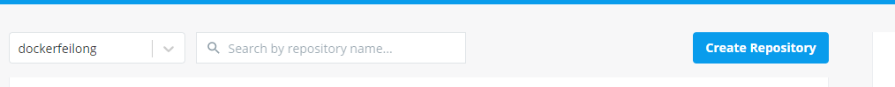

3）docker-cli登录docker hub

```bash
$ docker login
#输入用户名密码
```

4）打包设置标签

```bash
#（设置tag）
$ docker tag local‐image:tagname new‐repo:tagname
# 例如:
$  docker tag nginx:latest dockerfeilong/mytest:v1
```

5）推送镜像到仓库

```bash
$ docker push dockerfeilong/mytest:v1
```

> 推送成功后:
>
> 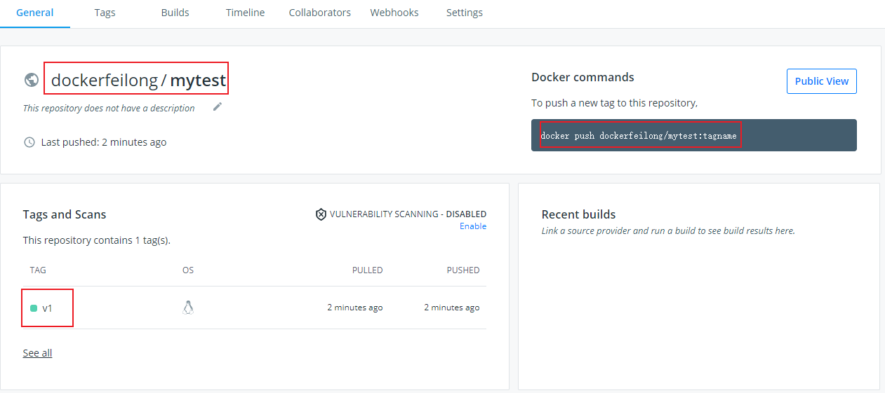

6）拉取仓库的镜像(前提是先登录了docker hub)

```bash
$ docker pull dockerfeilong/test‐hello‐world:v1
```


### 3.2、阿里云

1）登录阿里云

https://cr.console.aliyun.com

2）进入控制台

3）选择容器镜像服务


4）创建命名空间

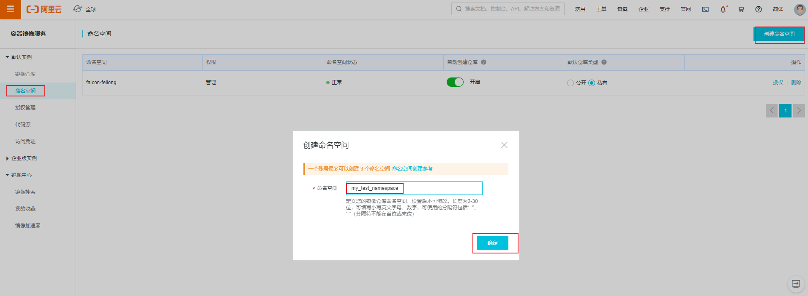

5) 创建镜像仓库 （选择本地代码库）

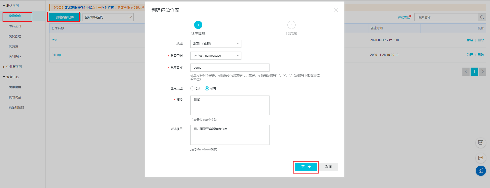

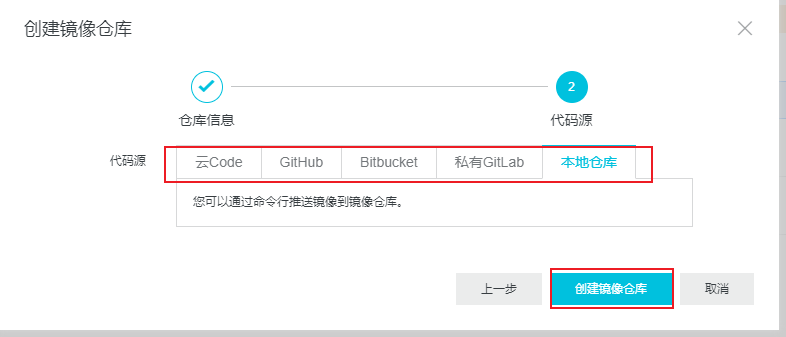

点击创建镜像仓库后，列表显示新建的仓库。点击仓库名称进入里面。


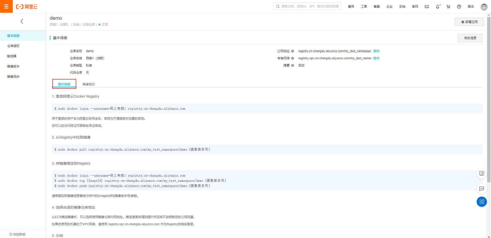

里面有操作指南，跟着操作就好。

> 下面我们做个示例(参考官方文档)：
>
> 1. 登录阿里云容器镜像仓库
>
>    ```bash
>    # 先退出
>    $ docker logout
>    # 登录
>    $ sudo docker login --username=码上有钱1 registry.cn-chengdu.aliyuncs.com
>    ```
>
> 2. 将镜像推送到Registry
>
>    ```bash
>    $ sudo docker login --username=码上有钱1 registry.cn-chengdu.aliyuncs.com
>    $ sudo docker tag nginx registry.cn-chengdu.aliyuncs.com/my_test_namespace/demo:v1
>    $ sudo docker push registry.cn-chengdu.aliyuncs.com/my_test_namespace/demo:v1
>    ```
>
>    
>
> 3. 从Registry中拉取镜像
>
>    ```bash
>    $ sudo docker pull registry.cn-chengdu.aliyuncs.com/my_test_namespace/demo:v1
>    ```


### 3.3、搭建私有仓库

#### 3.3.1、构建私有仓库  

1）启动Docker Registry，使用Docker官方提供的Registry镜像就可以搭建本地私有镜像仓库，具体指令如下。  

```bash
$ sudo docker run -d -p 5000:5000 --restart=always --name registry -v /mnt/registry:/var/lib/registry registry:2
```

>  指令参数说明：
>
> ‐d：表示在后台运行该容器；
> ‐p 5000:5000：表示将私有镜像仓库容器内部默认暴露的5000端口映射到宿主机的5000端口 
> ‐‐restart=always：表示容器启动后自动启动本地私有镜像仓库
> ‐‐name registry：表示为生成的容器命名为registry
> ‐v /mnt/registry:/var/lib/registry：表示将容器内的默认存储位置/var/lib/registry中的数据挂载到宿主机的/mnt/registry目录下，这样当容器销毁后，在容器中/var/lib/registry目录下的数据会自动备份到宿主机指定目录

​		

> 小提示：
> Docker Registry目前有v1和v2两个版本，v2版本并不是v1版本的简单升级，而是在很多功能上都有了改进和优化。v1版本使用的是Python开发的，而v2版本是用go语言开发的；v1版本本地镜像仓库容器中数据默认挂载点是/tmp/registry，而v2版本的本地镜像仓库容器中数据默认挂载点是/var/lib/registry  

2）重命名镜像，之前推送镜像时，都是默认推送到远程镜像仓库，而本次是将指定镜像推送到本地私有镜像仓库。由于推送到本地私有镜像仓库的镜像名必须符合“仓库IP:端口号/repository”的形式，因此需要按照要求修改镜像名称，具体操作指令如下。

```bash
$ sudo docker tag hello‐world:latest localhost:5000/myhellodocker
```

  3）推送镜像，本地私有镜像仓库搭建并启动完成，同时要推送的镜像也已经准备就绪后，就可以将指定镜像推送到本地私有镜像仓库了，具体操作指令如下 。

```bash
$ sudo docker push localhost:5000/myhellodocker
```

> 使用真实ip push时报错：
>
> ```bash
> [root@localhost temp]# docker push 192.168.2.100:5000/mytest
> The push refers to repository [192.168.2.100:5000/mytest]
> Get https://192.168.2.100:5000/v2/: http: server gave HTTP response to HTTPS client
> ```
>
> 解决办法是：在docker server启动的时候，增加启动参数，默认使用HTTP访问：
>
> ```bash
> $ vim /usr/lib/systemd/system/docker.service
> ```
>
> > 在 `ExecStart=/usr/bin/dockerd ...` 末尾追加  ` --insecure-registry 192.168.2.100:5000`
> >
> > ExecStart=/usr/bin/dockerd -H fd:// --containerd=/run/containerd/containerd.sock --insecure-registry 192.168.2.100:5000
>
> 参考：[http: server gave HTTP response to HTTPS client & Get https://192.168.2.119/v2/: dial tcp 192.168.2.119:443: getsockopt: connection refused - 无踪无影 - 博客园 (cnblogs.com)](https://www.cnblogs.com/lkun/p/7990466.html)

4）查看本地仓库镜像  

​		浏览器查看该地址，mytest 是仓库名称

```html
http://localhost:5000/v2/myhellodocker/tags/list 
```

​		由于做了目录挂载，因此可以在本地的该目录下查看 :

```bash
/mnt/registry/docker/registry/v2/repositories
```

#### 3.3.2、配置私有仓库认证  

##### 3.3.2.1、配置私有仓库认证 

1）查看Docker Registry私有仓库搭建所在服务器地址：`ifconfig` ;例如：服务器地址为：192.168.2.100  

2）生成自签名证书（在home目录下执行）  

​		要确保Docker Registry本地镜像仓库的安全性，还需要一个安全认证证书，来保证其他Docker机器不能随意访问该机器上Docker Registry本地镜像仓库，所以需要在搭建Docker Registry本地镜像仓库的Docker主机上先生成自签名证书（如果已购买证书就无需生成），具体操作指令如下。

```bash
$ sudo mkdir -p /usr/local/registry/certs
$ sudo openssl req -newkey rsa:2048 -nodes -sha256 -keyout /usr/local/registry/certs/domain.key -x509 -days 365 -out /usr/local/registry/certs/domain.crt
```

> 指令参数说明：
> openssl req:创建证书签名请求等功能;
> -newkey :创建CSR证书签名文件和RSA私钥
> rsa:2048:指定创建的RSA私钥长度为2048;
> -nodes : 对私钥不进行加密;
> -sha256:使用SHA256算法;
> -keyout :创建的私钥文件名称及位置;
> -x509 :自签发证书格式;
> -days :证书有效期;
> -out:指定CSR输出文件名称及位置;
>
> 通过 openssl 先生成自签名证书，运行命令以后需要填写一些证书信息，里面最关键的部分是：`Common Name (eg, your name or your server's hostname) []:192.168.10.10`，这里填写的是私有仓库的地址。

3）生成用户名和密码  

​		在Docker Registry本地镜像仓库所在的Docker主机上生成自签名证书后，为了确保Docker机器与该Docker Registry本地镜像仓库的交互，还需要生成一个连接认证的用户名和密码，使其他Docker用户只有通过用户名和密码登录后才允许连接到Docker Registry本
地镜像仓库 。

```bash
# 创建存储鉴权密码文件目录
mkdir -p /usr/local/registry/auth
# 如果没有 htpasswd 功能需要安装 httpd
yum install -y httpd
# 创建用户和密码
htpasswd -Bbn root 1234 > /usr/local/registry/auth/htpasswd
```

 4）启动Docker Registry本地镜像仓库服务（将之前创建的容器删除）  

```bash
docker run -di --name registry -p 5000:5000 \
   -v /mydata/docker_registry:/var/lib/registry \
   -v /usr/local/registry/certs:/certs \
   -v /usr/local/registry/auth:/auth \
   -e "REGISTRY_AUTH=htpasswd" \
   -e "REGISTRY_AUTH_HTPASSWD_REALM=Registry Realm" \
   -e REGISTRY_AUTH_HTPASSWD_PATH=/auth/htpasswd \
   -e REGISTRY_HTTP_TLS_CERTIFICATE=/certs/domain.crt \
   -e REGISTRY_HTTP_TLS_KEY=/certs/domain.key \
   registry
```

5）推送镜像 

​		先给镜像设置标签 `docker tag local-image:tagname new-repo:tagname`；
​		再将镜像推送至私有仓库 `docker push new-repo:tagname`。：  

```bash
$ docker tag hello-world:latest 192.168.2.100:5000/test-hello-world:1.0.0
$ docker push 192.168.2.100:5000/test-hello-world:1.0.0
```

​		如果直接 push 镜像肯定会失败，并且出现 `no basic auth credentials` 的错误，这是因为我们没有进行登录认证。

```bash
$ docker push 192.168.2.100:5000/test-hello-world:1.0.0 
The push refers to repository [192.168.2.100:5000/test-hello-world]
9c27e219663c: Preparing 
no basic auth credentials
```

6）登录私有库

```bash
$ docker login 192.168.2.100:5000
# 用户名 root， 密码 1234
```

 由于做了目录挂载，因此可以在本地的该目录下查看 ` /mydata/docker_registry/docker/registry/v2/repositories/  `。 

## 4、docker 网络管理

### 4.1、默认网络

​		1、查看docker网络：

```bash
$ sudo docker network ls
```

​		Docker中默认的三种网络分别为`bridge`、`host`和`none`，其中名为bridge的网络就是默认的bridge驱动网络，也是容器创建时默认的网络管理方式，配置后可以与宿主机通信从而实现与互联网通信功能，而host和none属于无网络，容器添加到这两个网络时不能与外界网络通信。  

​		这里介绍的三种网络`bridge`、`host`和`none`都是在非集群环境下Docker提供的默认网络，而在Docker Swarm集群环境下，除了这三种默认网络外，Docker还提供了`docker_gwbridge`和`ingress`两种默认网络。  

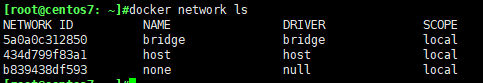

​		2、查看容器使用的网络情况  

```bash
$ sudo docker network inspect bridge
```

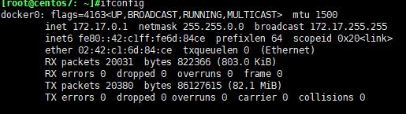

> 创建容器的默认的网络是bridge 网络
>
> 容器通过docker0 网卡(ifconfig)与主机建立桥接网络，进而连接互联网


### 4.2、自定义网络  

​		虽然Docker提供的默认网络的使用比较简单，但是为了保证各容器中应用的安全性，在实际开发中更推荐使用自定义的网络进行容器管理。在Docker中，可以自定义`bridge网络`、`overlay`网络，也可以创建`network plugin`（网络插件）或者远程网络以实现容器网络的完全定制和控制。  

#### 4.2.1、网络类型  

+ Bridge networks（桥接网络）：  

  为了保证容器的安全性，我们可以使用基于bridge的驱动创建新的bridge网络，这种基于bridge驱动的自定义网络可以较好的实现容器隔离。需要说明的是，这种用户自定义的基于bridge驱动的网络对于单主机的小型网络环境管理是一个不错的选择，但是对于大型的网络环境管理（如集群）就需要考虑使用自定义`overlay`集群网络。  

+ Overlay network in swarm mode（Swarm集群中的覆盖网络）  ：

  在Docker Swarm集群环境下可以创建基于overlay驱动的自定义网络。为了保证安全性，Swarm集群使自定义的overlay网络只适用于需要服务的群集中的节点，而不会对外部其他服务或者Docker主机开放 。

+ Custom network plugins（定制网络插件）  ：

  如果前面几种自定义网络都无法满足需求时，就可以使用Docker提供的插件来自定义网络驱动插件。自定义网络插件会在Docker进程所在主机上作为另一个运行的进程。自定义网络驱动插件与其他插件遵循相同的限制和安装规则，所有插件都使用Docker提供的插件API，并且有一个包含安装、启动、停止和激活的生命周期。由于自定义网络插件使用较少，所以只需了解即可。  

#### 4.2.2、自定义网络  

​		1、创建一个基于`bridge`驱动的名称为`isolated_nw`的网络。其中 `‐‐driver`（可简写为‐d）用于指定网络驱动类型`isolated_nw`就是新创建的网络名称。需要说明的是，`‐‐driver bridge`可以省略，省略时Docker会默认使用基于bridge驱动来创建新的网络。  

```bash
$ sudo docker network create ‐‐driver bridge isolated_nw
```

​		2、创建一个名为`nwtest`的容器，指令中的`‐‐network`参数指定了该容器的网络连接为自定义的`isolated_nw`。通过`docker inspect nwtest`指令可以查看启动后的容器详情，来核查其网络管理方式。

```bash
$ sudo docker run ‐itd ‐‐name=nwtest ‐‐network=isolated_nw busybox
```

​		3、为容器`nwtest`另添加一种默认的`bridge`网络管理方式。再次使用`docker inspect nwtest`指令查看该容器网络详情  

```bash
$sudo docker network connect bridge nwtest
```

​		4、断开网络连接的指令与连接网络的指令类似，在使用时也需要指定网络名称和容器名称 ：

```bash
$ sudo docker network disconnect isolated_nw nwtest
```

​	5、移除名称为`isolated_nw`的自定义网络。当网络移除成功后，会返回网络名称。  

```bash
$ sudo docker network rm isolated_nw
```

### 4.3、容器间的网络通信  

​		1、创建两个使用默认的bridge网络的容器  

```bash
$ sudo docker run ‐itd ‐‐name=c1 busybox
$ sudo docker run ‐itd ‐‐name=c2 busybox
```

​		2、创建一个使用自定义的isolated_nw网络（需要预先创建）的容器  

```bash
$ sudo docker network create ‐‐driver bridge isolated_nw
$ sudo docker run ‐‐network=isolated_nw ‐itd ‐‐name=c3 busybox
```

​		3、为c2容器新增一个自定义的isolated_nw网络连接  

```bash
$ sudo docker network connect isolated_nw c2
```

​		4、C1、C2、C3网络分配情况如下：  

| 容器名称 | ip                     | 网络                |
| -------- | ---------------------- | ------------------- |
| c1       | 172.17.0.4             | bridge              |
| c2       | 172.17.0.5、172.19.0.3 | bridge、isolated_nw |
| c3       | 172.19.0.2             | isolated_nw         |

​		5、测试容器间通信：分别登录C1、C2、C3容器，通过ping命令判断是否通信  

```bash
# 进入容器, 查看IP地址（例 c1 的ip地址查看）
$ docker attach c1
$ ifconfig

#ping
ping -w 4 172.17.0.5
```

> c1(bridge) 能ping c2（172.17.0.5 bridge），ping不通 c2（172.19.0.3 isolated_nw）
>
> c1(bridge) 不能ping c3(isolated_nw)
>
> c2(172.17.0.5 bridge) 不能ping c3（isolated_nw），c2(172.19.0.3 isolated_nw) 能ping c3（isolated_nw）
>
> 结论：
>
> 不同容器之间想要相互通信必须在同一个网络环境下；使用默认bridge网络管理的容器可以使用容器IP进行通信，但无法使用容器名称进行通信；而使用自定义网络管理的容器则可以使用容器IP进行通信


## 5、搭建docker swarm集群  

### 5.1、swarm介绍  

​		Swarm这个项目名称特别贴切。在Wiki的解释中，Swarm behavior是指动物的群集行为。比如我们常见的蜂群，鱼群，秋天往南飞的雁群都可以称作Swarm behavior。Swarm项目正是这样，通过把多个Docker Engine聚集在一起，形成一个大docker engine，对外提供容器的集群服务。同时这个集群对外提供Swarm API（命令，docker engine的命令），用户可以像使用Docker Engine一样使用Docker集群。  

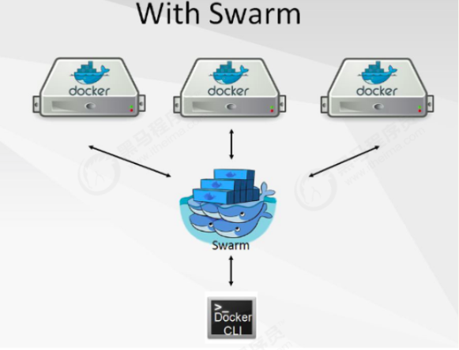

​		Swarm是Docker公司在2014年12月初发布的容器管理工具，和Swarm一起发布的Docker管理工具还有Machine以及Compose。Swarm是一套较为简单的工具，用以管理Docker集群，使得Docker集群暴露给用户时相当于一个虚拟的整体。Swarm将一群Docker宿主机变成一个单一的，虚拟的主机。Swarm使用标准的Docker API接口作为其前端访问入口，换言之，各种形式的Docker Client(docker client in Go, docker_py,docker等)均可以直接与Swarm通信。Swarm几乎全部用Go语言来完成开发,Swarm0.2版本增加了一个新的策略来调度集群中的容器，使得在可用的节点上传播它们，以及支持更多的Docker命令以及集群驱动。		Swarm deamon只是一个调度器（Scheduler）加路由器(router)，Swarm自己不运行容器，它只是接受docker客户端发送过来的请求，调度适合的节点来运行容器，这意味着，即使Swarm由于某些原因挂掉了，集群中的节点也会照常运行，当Swarm重新恢复运行之后，它会收集重建集群信息。

### 5.2、docker swarm特点：  

+ 对外以Docker API接口呈现，这样带来的好处是，如果现有系统使用Docker Engine，则可以平滑将Docker Engine切到Swarm上，无需改动现有系统。
+ Swarm对用户来说，之前使用Docker的经验可以继承过来。非常容易上手，学习成本和二次开发成本都比较低。同时Swarm本身专注于Docker集群管理，非常轻量，占用资源也非常少。简单说，就是插件化机制，Swarm中的各个模块都抽象出了API，可以根据自己一些特点进行定制实现。
+ Swarm自身对Docker命令参数支持的比较完善，Swarm目前与Docker是同步发布的。Docker的新功能，都会第一时间在Swarm中体现。  

### 5.3、docker swarm架构  

​		Swarm作为一个管理Docker集群的工具，首先需要将其部署起来，可以单独将Swarm部署于一个节点。另外，自然需要一个Docker集群，集群上每一个节点均安装有Docker。  

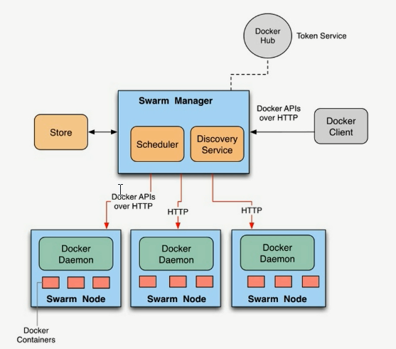

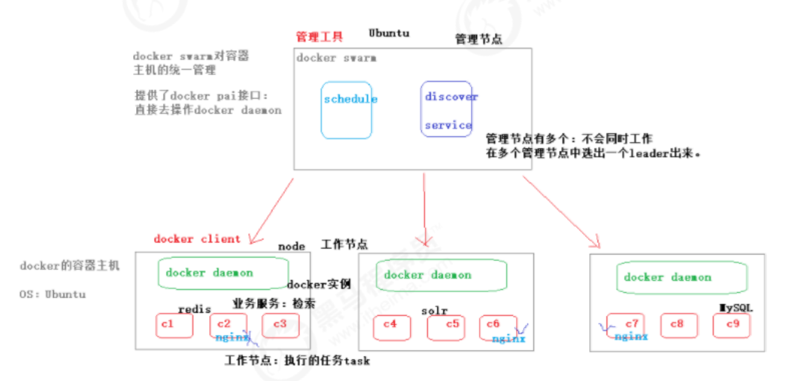

### 5.4、docker swarm 使用

#### 5.4.1、搭建步骤

##### 5.4.1.1、环境准备

1）准备两台已经安装docker engine的centos/Ubuntu系统主机（docker版本必须在1.12以上的版本，老版本不支持swarm）

2）docker容器主机的ip地址固定，集群中所有工作节点必须能访问该管理节点

3）集群管理节点必须使用相应的协议并且保证端口可用。

> 集群管理通信：TCP，端口2377；节点通信：TCP和UDP，端口7946，覆盖型网络(docker网络)：UDP，端口4789 overlay驱动
>
> 说明：两台容器主机的ip地址分别为：
> 192.168.2.100（管理节点）
> 192.168.2.101（工作节点）
> 主机名称分别为：manager1、work1
>
> 修改主机名称 (修改完成后需要重启) 
>
> ```bash
> $ vim /etc/hostname
> # 立即生效
> $ hostname $(cat /etc/hostname)
> ```

##### 5.4.1.2、创建docker swarm

1）在manager1机器上创建docker swarm集群

```bash
$ docker swarm init ‐‐advertise‐addr 192.168.2.100
Swarm initialized: current node (3qvviwe8vg9obryd287fe7zm3) is now a manager.

To add a worker to this swarm, run the following command:

    docker swarm join --token SWMTKN-1-11w2tc8qqebbp4meb6z74tcs6ldcod8xtfm6mm59t1m9lsjmgk-9av3yf65zictvrwx0cxmdova0 192.168.2.100:2377

To add a manager to this swarm, run 'docker swarm join-token manager' and follow the instructions.
```

> ‐‐advertise‐addr:将该IP地址的机器设置为集群管理节点；如果是单节点（机器只有个一网卡驱动），无需该参数

2）查看管理节点集群信息

```bash
$ docker node ls
ID                            HOSTNAME            STATUS              AVAILABILITY        MANAGER STATUS      ENGINE VERSION
3qvviwe8vg9obryd287fe7zm3 *   manager1            Ready               Active              Leader              19.03.14
```

##### 5.4.1.3、向docker swarm中添加工作节点

1）在两个工作节点中分别执行如下命令，ip地址是manager节点ip

```bash
# worker1
$ docker swarm join --token SWMTKN-1-11w2tc8qqebbp4meb6z74tcs6ldcod8xtfm6mm59t1m9lsjmgk-9av3yf65zictvrwx0cxmdova0 192.168.2.100:2377
This node joined a swarm as a worker.
```

> ‐‐token xxx:向指定集群中加入工作节点的认证信息，xxx认证信息是在创建docker swarm时产生的

2）继续查看管理节点集群信息与之前的区别

```bash
$ docker node ls
ID                            HOSTNAME            STATUS              AVAILABILITY        MANAGER STATUS      ENGINE VERSION
3qvviwe8vg9obryd287fe7zm3 *   manager1            Ready               Active              Leader              19.03.14
9bqw0d5vipg55qp8gg4stfjyw     work2               Ready               Active                                  19.03.13
```

#### 5.4.2、部署服务

在manager1主机上执行

```bash
$ docker service create ‐‐replicas 1 ‐‐name helloworld alpine pingdocker.com
```

> docker service create 指令：用于在Swarm集群中创建一个基于alpine镜像的服务
> ‐‐replicas参数：指定了该服务只有一个副本实例
> ‐‐name参数：指定创建成功后的服务名称为helloworld
> ping docker.com指令：表示服务启动后执行的命令

#### 5.4.3、查看docker swarm集群中的服务

1）查看服务列表

```bash
$ docker service ls
ID                  NAME                MODE                REPLICAS            IMAGE               PORTS
3qhgvs0uerhg        helloworld          replicated          1/1                 alpine:latest 
```

2）查看部署具体服务的详细信息(helloworld 服务名称)

```bash
$ docker service inspect helloworld
```

3）查看服务在集群节点上的分配以及运行情况(helloworld 服务名称)

```bash
$ docker service ps helloworld
ID                  NAME                IMAGE               NODE                DESIRED STATE       CURRENT STATE           ERROR               PORTS
f6tg59yk31nm        helloworld.1        alpine:latest       manager1            Running             Running 3 minutes ago
```

#### 5.4.4、修改副本数量

1）在manager1上，更改服务副本的数量（创建的副本会随机分配到不同的节点）

```bash
$ docker service scale helloworld=5
```

2）查看服务在集群上的分布情况

```bash
$ docker service ps helloworld
ID                  NAME                IMAGE               NODE                DESIRED STATE       CURRENT STATE           ERROR               PORTS
f6tg59yk31nm        helloworld.1        alpine:latest       manager1            Running             Running 7 minutes ago                       
19espsw1wwmh        helloworld.2        alpine:latest       work2               Running             Running 2 minutes ago                       
i3wygso9bspl        helloworld.3        alpine:latest       manager1            Running             Running 2 minutes ago                       
ulwko579r5pc        helloworld.4        alpine:latest       work2               Running             Running 2 minutes ago                       
feiwoasd15lh        helloworld.5        alpine:latest       work2               Running             Running 2 minutes ago 
```

#### 5.4.5、删除服务（在管理节点）

1）查看集群上的服务

```bash
$ docker service ls
ID                  NAME                MODE                REPLICAS            IMAGE               PORTS
3qhgvs0uerhg        helloworld          replicated          5/5                 alpine:latest
```

2）删除service

```bash
$ docker service rm helloworld
helloworld
```

#### 5.4.6、访问服务

1）查看集群环境下的网络列表

```bash
$ docker network ls
```

2）在manager1上创建一overlay为驱动的网络（默认使用的网络连接ingress）

```bash
$ docker network create ‐d=overlay my‐multi‐host‐network
```

3）在集群管理节点manager1上部署一个nginx服务

```bash
$ docker service create --replicas 2 --name my-web -p 8081:80 --network my-multi-host-network nginx
```

4）在管理节点查看服务的运行情况：

```bash
ID                  NAME                IMAGE               NODE                DESIRED STATE       CURRENT STATE             ERROR               PORTS
iq4bfqc914j8        my-web.1            nginx:latest        manager1            Running             Running 34 seconds ago                        
s7tmoc12hjzs         \_ my-web.1        nginx:latest        work2               Shutdown            Shutdown 23 seconds ago                       
tig18rz80t5e        my-web.2            nginx:latest        manager1            Running             Running 41 seconds ago         
```


## 6、docker compose编排工具  

### 6.1、docker compose介绍  

​		根据前面所学的知识可知，想要使用Docker部署应用，就要先在应用中编写Dockerfile文件来构建镜像。同样，在微服务项目中，我们也需要为每一个服务编写Dockerfile文件来构建镜像。构建完成后，就可以根据每一个镜像使用`docker run`或者`docker service create`命令创建并启动容器，这样我们就可以访问容器中的服务了。微服务架构中：涉及的服务数量巨多。虽然使用上述方式可以部署微服务项目，但考虑到微服务项目可能有多个子服务组成，并且每个服务启动过程中都需要配置额外的参数（如-e配置环境变量、--network指定网络、磁盘挂载等等）。这种情况下，每次更新微服务后，都要手动运行指令来重新启动容器，这就显得相当麻烦了。针对这种多服务部署的情况，Docker提供了Docker Compose编排工具来对多服务应用进行统一部署。Compose是Docker的服务编排工具，主要用来构建基于Docker的复杂应用，Compose 通过一个配置文件来管理多个Docker容器，非常适合组合使用多个容器进行开发的场景。通过该编排工具，可以使用yml（或yaml）文件来配置应用程序服务，然后只需要一条简单的服务部署指令就可以从配置中创建并启动所有服务。  

### 6.2、docker compose安装与卸载  

1）环境要求

​		Docker Compose是依赖于Docker引擎的，所以在安装Docker Compose之前要确保机器上已经安装了Docker，[查看docker compose版本](https://github.com/docker/compose/releases)

2）下载docker‐compose工具

```bash
# Github 上下载
$ sudo curl -L https://github.com/docker/compose/releases/download/1.16.1/docker-compose-`uname -s`-`uname -m` -o /usr/local/bin/docker-compose
# daocloud 下载
$ sudo curl -L https://get.daocloud.io/docker/compose/releases/download/1.25.1/docker-compose-`uname -s`-`uname -m` -o /usr/local/bin/docker-compose
```

3）设置docker compose可执行文件权限

```bash
$ chmod +x /usr/local/bin/docker‐compose
```

4）查看docker compose版本

```bash
$ docker‐compose ‐‐version
```

5）卸载docker compose

```bash
$ sudo rm /usr/local/bin/docker‐compose  
```

6）docker-compose 具体命令

```bash
[root@manager1 composetest]# docker-compose --help
Define and run multi-container applications with Docker.
#用Docker定义和运行多容器应用程序。

Usage:
  docker-compose [-f <arg>...] [options] [COMMAND] [ARGS...]
  docker-compose -h|--help

Options:
  -f, --file FILE             Specify an alternate compose file
                              (default: docker-compose.yml) #指定一个备用的撰写文件(默认: docker-compose.yml)
                              
  -p, --project-name NAME     Specify an alternate project name
                              (default: directory name) #指定另一个项目名称(默认: directory name)
  --verbose                   Show more output
  --log-level LEVEL           Set log level (DEBUG, INFO, WARNING, ERROR, CRITICAL) #设置日志级别(调试、信息、警告、错误、关键)
  --no-ansi                   Do not print ANSI control characters #不打印ANSI控制字符
  -v, --version               Print version and exit #打印版本并退出
  -H, --host HOST             Daemon socket to connect to #要连接的守护程序套接字

  --tls                       Use TLS; implied by --tlsverify
  --tlscacert CA_PATH         Trust certs signed only by this CA #仅由本认证机构签署的信任证书
  --tlscert CLIENT_CERT_PATH  Path to TLS certificate file #TLS证书文件的路径
  --tlskey TLS_KEY_PATH       Path to TLS key file #TLS密钥文件的路径
  --tlsverify                 Use TLS and verify the remote #使用TLS并验证远程
  --skip-hostname-check       Don't check the daemon's hostname against the
                              name specified in the client certificate #不检查守护进程的主机名在客户端证书中指定的名称
  --project-directory PATH    Specify an alternate working directory 
                              (default: the path of the Compose file)#指定另一个工作目录（默认值:撰写文件的路径）
  --compatibility             If set, Compose will attempt to convert keys
                              in v3 files to their non-Swarm equivalent
  --env-file PATH             Specify an alternate environment file #指定一个备用环境文件

Commands:
  build              Build or rebuild services #构建或重新构建服务
  bundle             Generate a Docker bundle from the Compose file #从撰写文件生成Docker包
  config             Validate and view the Compose file #验证和查看撰写文件
  create             Create services # 创建services
  down               Stop and remove containers, networks, images, and volumes #停止并删除容器、网络、映像和卷
  events             Receive real time events from containers #从容器接收实时事件
  exec               Execute a command in a running container #在运行的容器中执行命令
  help               Get help on a command
  images             List images #列出镜像
  kill               Kill containers # 杀死容器
  logs               View output from containers #查看容器的输出
  pause              Pause services #暂停服务
  port               Print the public port for a port binding #打印端口绑定的公共端口
  ps                 List containers # 列出容器
  pull               Pull service images
  push               Push service images
  restart            Restart services#重新启动服务
  rm                 Remove stopped containers#删除停止容器
  run                Run a one-off command#运行一次性命令
  scale              Set number of containers for a service#为服务设置容器的数量
  start              Start services#启动服务
  stop               Stop services#停止服务
  top                Display the running processes #显示正在运行容器的进程信息
  unpause            Unpause services
  up                 Create and start containers #创建和启动容器
  version            Show the Docker-Compose version information#显示Docker-Compose版本信息
```


### 6.3、docker compose使用  

1）编写一个 `docker-compose.yml` 文件，内容如下：

```yaml
version: '2'
services:
  foomysql:
    image: mysql:5.6
    container_name: foomysql
    restart: always
    volumes:
      - $PWD/mysqldata:/var/lib/mysql
    environment:
      - TZ=Asia/Shanghai
      - MYSQL_ROOT_PASSWORD=root
      - MYSQL_USER=latelee
      - MYSQL_PASSWORD=123456
      - MYSQL_DATABASE=test
    ports:
      - "3333:3306"
    command: ['mysqld', '--character-set-server=utf8mb4', '--collation-server=utf8mb4_unicode_ci', '--explicit_defaults_for_timestamp=false']
    networks:
      - foo-net
  redis:
    image: redis
    container_name: fooredis
    restart: always
    volumes:
      - $PWD/redisdata:/data
    ports:
      - "6379:6379"
    command: ["redis-server", "--appendonly", "yes"]
    networks:
      - foo-net

  mongo:
    image: mongo
    container_name: foomongo
    restart: always
    environment:
      MONGO_INITDB_ROOT_USERNAME: root
      MONGO_INITDB_ROOT_PASSWORD: root
    networks:
      - foo-net
      
  mongo-express:
    image: mongo-express
    container_name: foomongo-express
    restart: always
    ports:
      - 8081:8081
    environment:
      MONGO_INITDB_ROOT_USERNAME: root
      MONGO_INITDB_ROOT_PASSWORD: root
    networks:
      - foo-net
networks:
  foo-net:
    driver: bridge
```

2）启动

```bash
$ docker-compose up
```

3）查看运行的容器

```bash
$ docker-compose ps
```

#### 6.3.1、常用指令如下：

+ version：version通常在一个docker-compose.yml文件的最顶部，用来表示文件内容的约束版本（类似于XML文件约束）（版本越高，支持的指令越多）
+ services：用来声明服务，在services下的所有同缩进的应用名称都代表一个服务，如上面示例中的`foomysql` 、`redis` `mongo` 和 `mongo-express`。在进行多服务部署的时候，有多少个服务需要同时部署，就需要在services参数下面声明并配置多少个服务。
  + image：容器启动需要依赖的镜像（如果本地没有会自动pull）
  + container_name：指定容器名称（容器名，名称是唯一的）
  + restart：服务重启策略
    + restart: "no" #服务默认值为no，即服务失败后没有任何动作
    + restart: always #表示服务会一直重新启动
    + restart: on-failure #表示服务提示失败错误后会重新启动
    + restart: unless-stopped #表示只有服务在停止后才会重启
  + volumes：挂载数据卷，以当前目录上下文
  + environment：用于配置服务启动时需要的环境变量。如上述示例中 MYSQL_ROOT_PASSWORD表示数据库root用户的密码，MYSQL_DATABASE表示数据库启动后自动创建的数据库。
  + ports：指定服务向外暴露的端口
  + command：容器启动时执行的命令
  + networks：指定容器使用的网络
  + depends_on：服务依赖决定了服务的依赖关系
  + deploy：deploy参数是Docker Compose针对Swarm集群部署提供的，子参数专门用于指定与服务部署和运行相关的配置
    + replicas：表示服务实例的副本数量
    + restart_policy：estart_policy参数同前面介绍的restart类似，都是用来配置服务重启策略的，只是该属性配置在deploy参数下，并只在集群环境下生效。该参数包含多个子属性及属性值
      + condition: on-failure #表示服务重启的条件，值有none、on-failure和any
      + delay: 5s #表示重启服务之间等待时间，默认为0
      + max_attempts: 3 #表示失败后尝试重启的次数
      + window: 120s #表示等待多久来确定服务是否启动成功
    + placement：placement用来配置指定位置的约束，当服务在Swarm集群环境下部署时会随机分配到管理节点和其他工作节点上。在上述示例中由于将mysql数据挂载到了本机example-mysql数据卷中，所以使用了placement的子参数constraints: [node.role == manager]指定该服务只在manager管理节点上运行 :
+ networks：网络配置
  + driver ：网卡驱动

其他配置可参考：https://docs.docker.com/compose/compose-file/  

## 7、docker的web可视化管理工具  

### 7.1、常用工具介绍  

​		当 Docker 部署规模逐步变大后，可视化监控容器环境的性能和健康状态将会变得越来越重要。 Docker的图形化管理工具，提供状态显示面板、应用模板快速部署、容器镜像网络数据卷的基本操作（包括上传下载镜像，创建容器等操作）、事件日志显示、容器控制台操作、Swarm集群和服务等集中管理和操作、登录用户管理和控制等功能。常用工具如下  ：

1. docker UI（local）
2. shipyard（停止维护了）
3. portainer
4. daocloud  

### 7.2、工具使用  

#### 7.2.1、docker UI  

**安装docker UI**  

1）拉取docker UI镜像

```bash
docker pull uifd/ui‐for‐docker
```

2）创建容器

```bash
docker run ‐d ‐p 9000:9000 ‐‐privileged ‐v /var/run/docker.sock:/var/run/docker.sock uifd/ui-for‐docker  
```

**特点**

| 优点                                             | 缺点                                                         |
| ------------------------------------------------ | ------------------------------------------------------------ |
| 支持容器管理                                     | 没有登录验证，因为没有登录体系，目前解决办法是，只开放本地访问，或者通过TLS来对权限进行控制。 |
| 支持镜像管理                                     | 无法分配某容器给某用户。                                     |
| 基于docker api，自身也是一个容器；稳定性高       | 不支持多主机                                                 |
| 容器管理，增加端口映射，增加系统变量、映射目录等 | 不支持集群swarm等                                            |
| 可动态显示显示容器之间关系图                     | 功能少                                                       |

#### 7.2.2、portainer  

##### 7.2.2.1、安装portainer  

```bash
$ docker run ‐d ‐p 9001:9000 ‐v /var/run/docker.sock:/var/run/docker.sock
portainer/portainer
```

##### 7.2.2.2、挂载远程节点（修改远程节点配置）  

1）编辑该文件

```bash
$ vim /lib/systemd/system/docker.service
```

2）删除配置文件中内容

```bash
$ ExecStart=/usr/bin/dockerd xxx(删除这部分内容)
```

3）在daemon.json文件中添加如下内容：所有服务器都可以访问

```bash
"hosts":["tcp://0.0.0.0:2375","unix:///var/run/docker.sock"]
```

4）重启docker

```bash
$ systemctl daemon‐reload
$ systemctl restart docker  
```

**特点**

| 优点                                                         | 缺点                               |
| ------------------------------------------------------------ | ---------------------------------- |
| 支持容器管理、镜像管理                                       | 功能不够强大。                     |
| 轻量级，消耗资源少                                           | 容器创建后，无法通过后台增加端口。 |
| 基于docker api，安全性高，可指定docker api端口，支持TLS证书认证。 |                                    |
| 支持权限分配                                                 |                                    |
| 支持集群                                                     |                                    |

#### 7.2.3、daocloud  

```bash
$ curl ‐sSL https://get.daocloud.io/daomonit/install.sh | sh ‐s
24a7c865945f25697fe9255dad8e54eb431d785b
```

**特点**

| 优点                     | 缺点                         |
| ------------------------ | ---------------------------- |
| 支持镜像管理、容器管理。 | 管理平台无法部署到本地服务器 |
| 支持控制台命令           | 部分高级功能收费             |
| 容器资源消耗监控         |                              |
| 支持集群可以随意增加节点 |                              |
| 中文平台                 |                              |
| 镜像下载                 |                              |
| 容器扩容、管理           |                              |

