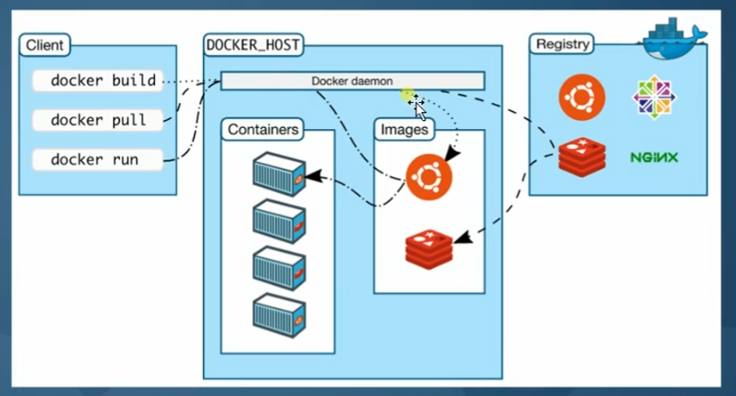
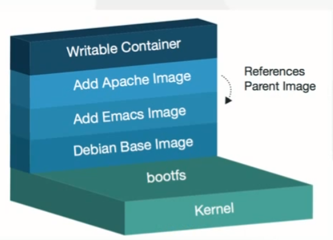

# Docker

## 什么是Docker

+ 使用最广泛的开源容器引擎
+ 一种操作系统级虚拟化技术
+ 依赖于Linux 内核特性：Namespace 和 Cgroups
+ 一个简单的应用程序打包工具

### Docker 设计目标

1. 提供简单的应用程序打包工具
2. 开发人员和运维人员职责逻辑分离
3. 多环境保持一致


### Docker 基本组成

1. Docker Client ： 客户端
2. Ddocker Daemon： 守护进程
3. Docker Images ：镜像
4. Docker Container ：容器
5. Docker Registry：镜像仓库




### 容器 VS 虚拟机

|          | Container                                | VM               |
| -------- | ---------------------------------------- | ---------------- |
| 启动速度 | 秒级                                     | 分钟级           |
| 运行性能 | 接近原生                                 | 5%左右损失       |
| 磁盘占用 | MB                                       | GB               |
| 数量     | 成百上千                                 | 一般几十台       |
| 隔离性   | 进程级别                                 | 系统级（更彻底） |
| 操作系统 | 只支持Linux                              | 几乎所有         |
| 封装程度 | 只打包项目代码和依赖关系，共享宿主机内核 | 完整的操作系统   |


### Docker 应用场景

1. 应用程序打包和发布
2. 应用程序隔离
3. 持续集成
4. 部署微服务
5. 快速搭建测试环境
6. 提供PaaS产品（平台即服务）


## 第二章 Linux 安装 Docker

1. Docker 版本
2. 支持平台
3. CentOS7.x 安装 Docker

### Docker 版本

+ 社区版（Community Edition, CE）
+ 企业版（Enterprise Edition, EE）

### 支持的平台

+ Linux（CentOS,Debian,Fedora,Oracle Linux, RHEL, SUSE 和 Ubuntu）
+ Mac
+ Windows

### CentOS7.x 安装 Docker

https://docs.docker.com/engine/install/centos/

1. 安装Docker Engine和containerd的最新版本，或者进入下一步安装特定版本:

   ```bash
   $ sudo yum install docker-ce
   ```

2. 启动 Docker

   ```bash
   $ sudo systemctl start docker
   ```

   

3. 通过运行hello-world映像，验证Docker引擎已正确安装。

   ```bash
   $ sudo docker run hello-world
   
   ## 如果报错
   [root@centos7: ~]#docker run hello-world
   Unable to find image 'hello-world:latest' locally
   docker: Error response from daemon: Get https://registry-1.docker.io/v2/library/hello-world/manifests/latest: net/http: TLS handshake timeout.
   See 'docker run --help'.
   
   ## 使用国内的Docker仓库 daocloud
   echo "DOCKER_OPTS=\"\$DOCKER_OPTS --registry-mirror=http://f2d6cb40.m.daocloud.io\"" | sudo tee -a /etc/default/docker
   systemctl restart docker
   ```

4. docker 使用命令

   ```bash
   [root@centos7: ~]#docker info
   Client:
    Debug Mode: false
   
   Server:
    Containers: 1
     Running: 0
     Paused: 0
     Stopped: 1
    Images: 1
    Server Version: 19.03.12
    Storage Driver: overlay2
     Backing Filesystem: xfs
     Supports d_type: true
     Native Overlay Diff: true
    Logging Driver: json-file
    Cgroup Driver: cgroupfs
    Plugins:
     Volume: local
     Network: bridge host ipvlan macvlan null overlay
     Log: awslogs fluentd gcplogs gelf journald json-file local logentries splunk syslog
    Swarm: inactive
    Runtimes: runc
    Default Runtime: runc
    Init Binary: docker-init
    containerd version: 7ad184331fa3e55e52b890ea95e65ba581ae3429
    runc version: dc9208a3303feef5b3839f4323d9beb36df0a9dd
    init version: fec3683
    Security Options:
     seccomp
      Profile: default
    Kernel Version: 3.10.0-957.el7.x86_64
    Operating System: CentOS Linux 7 (Core)
    OSType: linux
    Architecture: x86_64
    CPUs: 1
    Total Memory: 1.777GiB
    Name: centos7
    ID: LJNP:WR57:2JO2:YNMH:JULW:45FW:R4PY:Z3QJ:2KFG:CLHR:36KD:WX4V
    Docker Root Dir: /var/lib/docker
    Debug Mode: false
    Registry: https://index.docker.io/v1/
    Labels:
    Experimental: false
    Insecure Registries:
     127.0.0.0/8
    Live Restore Enabled: false
   
   
   [root@centos7: ~]#docker version
   Client: Docker Engine - Community
    Version:           19.03.12
    API version:       1.40
    Go version:        go1.13.10
    Git commit:        48a66213fe
    Built:             Mon Jun 22 15:46:54 2020
    OS/Arch:           linux/amd64
    Experimental:      false
   
   Server: Docker Engine - Community
    Engine:
     Version:          19.03.12
     API version:      1.40 (minimum version 1.12)
     Go version:       go1.13.10
     Git commit:       48a66213fe
     Built:            Mon Jun 22 15:45:28 2020
     OS/Arch:          linux/amd64
     Experimental:     false
    containerd:
     Version:          1.2.13
     GitCommit:        7ad184331fa3e55e52b890ea95e65ba581ae3429
    runc:
     Version:          1.0.0-rc10
     GitCommit:        dc9208a3303feef5b3839f4323d9beb36df0a9dd
    docker-init:
     Version:          0.18.0
     GitCommit:        fec3683
     
     # 创建一个容器
   [root@centos7: ~]#docker run -it nginx
   Unable to find image 'nginx:latest' locally
   latest: Pulling from library/nginx
   bf5952930446: Pull complete 
   cb9a6de05e5a: Pull complete 
   9513ea0afb93: Pull complete 
   b49ea07d2e93: Pull complete 
   a5e4a503d449: Pull complete 
   Digest: sha256:b0ad43f7ee5edbc0effbc14645ae7055e21bc1973aee5150745632a24a752661
   Status: Downloaded newer image for nginx:latest
   /docker-entrypoint.sh: /docker-entrypoint.d/ is not empty, will attempt to perform configuration
   /docker-entrypoint.sh: Looking for shell scripts in /docker-entrypoint.d/
   /docker-entrypoint.sh: Launching /docker-entrypoint.d/10-listen-on-ipv6-by-default.sh
   10-listen-on-ipv6-by-default.sh: Getting the checksum of /etc/nginx/conf.d/default.conf
   10-listen-on-ipv6-by-default.sh: Enabled listen on IPv6 in /etc/nginx/conf.d/default.conf
   /docker-entrypoint.sh: Launching /docker-entrypoint.d/20-envsubst-on-templates.sh
   /docker-entrypoint.sh: Configuration complete; ready for start up
   
   [root@centos7: ~]#docker ps
   CONTAINER ID        IMAGE               COMMAND                  CREATED             STATUS              PORTS               NAMES
   36edfdff24ae        nginx               "/docker-entrypoint.…"   46 seconds ago      Up 45 seconds       80/tcp              pedantic_murdock
   
     
   [root@centos7: ~]#docker inspect 36edfdff24ae
   [
       {
           "Id": "36edfdff24ae967407727e92bf372090ee498dc4a49224823e12719df5d0d5a4",
           "Created": "2020-08-29T09:12:01.776244627Z",
           "Path": "/docker-entrypoint.sh",
           "Args": [
               "nginx",
               "-g",
               "daemon off;"
           ],
           "State": {
               "Status": "running",
               "Running": true,
               "Paused": false,
               "Restarting": false,
               "OOMKilled": false,
               "Dead": false,
               "Pid": 24878,
               "ExitCode": 0,
               "Error": "",
               "StartedAt": "2020-08-29T09:12:02.304529396Z",
               "FinishedAt": "0001-01-01T00:00:00Z"
           },
           "Image": "sha256:4bb46517cac397bdb0bab6eba09b0e1f8e90ddd17cf99662997c3253531136f8",
           "ResolvConfPath": "/var/lib/docker/containers/36edfdff24ae967407727e92bf372090ee498dc4a49224823e12719df5d0d5a4/resolv.conf",
           "HostnamePath": "/var/lib/docker/containers/36edfdff24ae967407727e92bf372090ee498dc4a49224823e12719df5d0d5a4/hostname",
           "HostsPath": "/var/lib/docker/containers/36edfdff24ae967407727e92bf372090ee498dc4a49224823e12719df5d0d5a4/hosts",
           "LogPath": "/var/lib/docker/containers/36edfdff24ae967407727e92bf372090ee498dc4a49224823e12719df5d0d5a4/36edfdff24ae967407727e92bf372090ee498dc4a49224823e12719df5d0d5a4-json.log",
           "Name": "/pedantic_murdock",
           "RestartCount": 0,
           "Driver": "overlay2",
           "Platform": "linux",
           "MountLabel": "",
           "ProcessLabel": "",
           "AppArmorProfile": "",
           "ExecIDs": null,
           "HostConfig": {
               "Binds": null,
               "ContainerIDFile": "",
               "LogConfig": {
                   "Type": "json-file",
                   "Config": {}
               },
               "NetworkMode": "default",
               "PortBindings": {},
               "RestartPolicy": {
                   "Name": "no",
                   "MaximumRetryCount": 0
               },
               "AutoRemove": false,
               "VolumeDriver": "",
               "VolumesFrom": null,
               "CapAdd": null,
               "CapDrop": null,
               "Capabilities": null,
               "Dns": [],
               "DnsOptions": [],
               "DnsSearch": [],
               "ExtraHosts": null,
               "GroupAdd": null,
               "IpcMode": "private",
               "Cgroup": "",
               "Links": null,
               "OomScoreAdj": 0,
               "PidMode": "",
               "Privileged": false,
               "PublishAllPorts": false,
               "ReadonlyRootfs": false,
               "SecurityOpt": null,
               "UTSMode": "",
               "UsernsMode": "",
               "ShmSize": 67108864,
               "Runtime": "runc",
               "ConsoleSize": [
                   0,
                   0
               ],
               "Isolation": "",
               "CpuShares": 0,
               "Memory": 0,
               "NanoCpus": 0,
               "CgroupParent": "",
               "BlkioWeight": 0,
               "BlkioWeightDevice": [],
               "BlkioDeviceReadBps": null,
               "BlkioDeviceWriteBps": null,
               "BlkioDeviceReadIOps": null,
               "BlkioDeviceWriteIOps": null,
               "CpuPeriod": 0,
               "CpuQuota": 0,
               "CpuRealtimePeriod": 0,
               "CpuRealtimeRuntime": 0,
               "CpusetCpus": "",
               "CpusetMems": "",
               "Devices": [],
               "DeviceCgroupRules": null,
               "DeviceRequests": null,
               "KernelMemory": 0,
               "KernelMemoryTCP": 0,
               "MemoryReservation": 0,
               "MemorySwap": 0,
               "MemorySwappiness": null,
               "OomKillDisable": false,
               "PidsLimit": null,
               "Ulimits": null,
               "CpuCount": 0,
               "CpuPercent": 0,
               "IOMaximumIOps": 0,
               "IOMaximumBandwidth": 0,
               "MaskedPaths": [
                   "/proc/asound",
                   "/proc/acpi",
                   "/proc/kcore",
                   "/proc/keys",
                   "/proc/latency_stats",
                   "/proc/timer_list",
                   "/proc/timer_stats",
                   "/proc/sched_debug",
                   "/proc/scsi",
                   "/sys/firmware"
               ],
               "ReadonlyPaths": [
                   "/proc/bus",
                   "/proc/fs",
                   "/proc/irq",
                   "/proc/sys",
                   "/proc/sysrq-trigger"
               ]
           },
           "GraphDriver": {
               "Data": {
                   "LowerDir": "/var/lib/docker/overlay2/37712ba250ae7aebd938048b9d78d6549e953a55cf885ab6f899c1a8cb8f1d8b-init/diff:/var/lib/docker/overlay2/69256ae0d95530ea1eef1a02a531c0bf7510ead9a984f8f86162c12ce0fd0b93/diff:/var/lib/docker/overlay2/35ef00702f3a7553689301fb6468047e7865681141693d2847111edef26c493d/diff:/var/lib/docker/overlay2/fd38b1f4d6c79b37f4f3aa3ba65f1839eacdfb1f796a552641c9e7192526fefa/diff:/var/lib/docker/overlay2/7c834335662ba622d572ff702e9e915625a1c843d7d922e60853e1a0ed73ca40/diff:/var/lib/docker/overlay2/f519a29cc1a624f63d1f75b687a7dffd0cbab0568708ae2b6ce20d74f3bd6795/diff",
                   "MergedDir": "/var/lib/docker/overlay2/37712ba250ae7aebd938048b9d78d6549e953a55cf885ab6f899c1a8cb8f1d8b/merged",
                   "UpperDir": "/var/lib/docker/overlay2/37712ba250ae7aebd938048b9d78d6549e953a55cf885ab6f899c1a8cb8f1d8b/diff",
                   "WorkDir": "/var/lib/docker/overlay2/37712ba250ae7aebd938048b9d78d6549e953a55cf885ab6f899c1a8cb8f1d8b/work"
               },
               "Name": "overlay2"
           },
           "Mounts": [],
           "Config": {
               "Hostname": "36edfdff24ae",
               "Domainname": "",
               "User": "",
               "AttachStdin": true,
               "AttachStdout": true,
               "AttachStderr": true,
               "ExposedPorts": {
                   "80/tcp": {}
               },
               "Tty": true,
               "OpenStdin": true,
               "StdinOnce": true,
               "Env": [
                   "PATH=/usr/local/sbin:/usr/local/bin:/usr/sbin:/usr/bin:/sbin:/bin",
                   "NGINX_VERSION=1.19.2",
                   "NJS_VERSION=0.4.3",
                   "PKG_RELEASE=1~buster"
               ],
               "Cmd": [
                   "nginx",
                   "-g",
                   "daemon off;"
               ],
               "Image": "nginx",
               "Volumes": null,
               "WorkingDir": "",
               "Entrypoint": [
                   "/docker-entrypoint.sh"
               ],
               "OnBuild": null,
               "Labels": {
                   "maintainer": "NGINX Docker Maintainers <docker-maint@nginx.com>"
               },
               "StopSignal": "SIGTERM"
           },
           "NetworkSettings": {
               "Bridge": "",
               "SandboxID": "e74549aed9fcf03a9f8c62da59668c7b4079cccf2d1031cdb459b96c1e42c93d",
               "HairpinMode": false,
               "LinkLocalIPv6Address": "",
               "LinkLocalIPv6PrefixLen": 0,
               "Ports": {
                   "80/tcp": null
               },
               "SandboxKey": "/var/run/docker/netns/e74549aed9fc",
               "SecondaryIPAddresses": null,
               "SecondaryIPv6Addresses": null,
               "EndpointID": "e0a35dd5b7c7cdb3438ddd25cc4b3657f8c9b12bedfef6aaf06ea3a20c9cf194",
               "Gateway": "172.17.0.1",
               "GlobalIPv6Address": "",
               "GlobalIPv6PrefixLen": 0,
               "IPAddress": "172.17.0.2",
               "IPPrefixLen": 16,
               "IPv6Gateway": "",
               "MacAddress": "02:42:ac:11:00:02",
               "Networks": {
                   "bridge": {
                       "IPAMConfig": null,
                       "Links": null,
                       "Aliases": null,
                       "NetworkID": "edf82279c84c722479c5bec849df8d007262bdf4b4031dc35eba8962fa4f582f",
                       "EndpointID": "e0a35dd5b7c7cdb3438ddd25cc4b3657f8c9b12bedfef6aaf06ea3a20c9cf194",
                       "Gateway": "172.17.0.1",
                       "IPAddress": "172.17.0.2",
                       "IPPrefixLen": 16,
                       "IPv6Gateway": "",
                       "GlobalIPv6Address": "",
                       "GlobalIPv6PrefixLen": 0,
                       "MacAddress": "02:42:ac:11:00:02",
                       "DriverOpts": null
                   }
               }
           }
       }
   ]
     
     
   [root@centos7: ~]#docker exec -it 36edfdff24ae bash
   root@36edfdff24ae:/# ls
   bin   dev		   docker-entrypoint.sh  home  lib64  mnt  proc  run   srv  tmp  var
   boot  docker-entrypoint.d  etc			 lib   media  opt  root  sbin  sys  usr
   root@36edfdff24ae:/# 
   
   ```


## 第三章 镜像管理

1. 镜像是什么
2. 镜像与容器联系
3. 管理镜像常用命令

### 镜像是什么？

#### 镜像是什么？

+ 一个分层存储的文件
+ 一个软件的环境
+ 一个镜像可以创建N个容器
+ 一种标准化的交互
+ 一个不包含Linux 内核而又精简的Linux 操作系统

镜像不是一个单一个文件，而是有多层构成。我们可以通过 “docker history <ID/NAME>” 查看镜像中各层内容及大小，每层对应着Dockerfile 中的一条指令。Docker镜像默认存储在 /var/lib/docker/\\<storage-driver\\>中。

#### 镜像从哪里来？

Docker Hub 是由Docker 公司负责维护的公共注册中心，包含大量的容器镜像，Docker 工具默认从这个公共镜像库下载镜像。

地址：https://hub.docker.com/explore

配置镜像加速器：https://www.daocloud.io/mirror

```bash
curl -sSL https://get.daocloud.io/daotools/set_mirror.sh | sh -s http://f1361db2.m.daocloud.io
```

### 镜像与容器联系

​		如图，容器其实是在镜像的最上面加了一层读写层，在运行容器里文件改动时，会先从镜像里要写的文件复制到容器自己的文件系统中（读写层）。

​		如果容器删除了，最上面的读写层也就删除了，改动也就丢失了。所以无论多少个容器共享一个镜像，所做的写操作都是从镜像的文件系统中复制过来操作的，并不会修改镜像的源文件，这种方式提高磁盘利用率。

​		若想持久化这些改动，可以通过docker commit 将容器保存成一个新镜像。




### 管理镜像常用命令

docker image + 指令

| 指令    | 描述                                           |
| ------- | ---------------------------------------------- |
| ls      | 列出镜像                                       |
| build   | 构建镜像来自Dockerfile                         |
| history | 查看镜像历史                                   |
| inspect | 显示一个或多个镜像详细信息                     |
| pull    | 从镜像仓库拉取镜像                             |
| push    | 推送一个镜像到镜像仓库                         |
| rm      | 移出一个或多个镜像                             |
| prune   | 移出未使用的镜像。没有被标记或被任何容器引用的 |
| tag     | 创建一个引用源镜像标记目标镜像                 |
| export  | 导出容器文件系统到tar归档文件                  |
| import  | 导入容器文件系统tar归档文件创建镜像            |
| save    | 保存一个或多个镜像到一个tar归档文件            |
| load    | 加载镜像来自tar归档或标准输入                  |


命令

```bash
[root@centos7: overlay2]#docker images
REPOSITORY          TAG                 IMAGE ID            CREATED             SIZE
nginx               latest              4bb46517cac3        2 weeks ago         133MB
hello-world         latest              bf756fb1ae65        7 months ago        13.3kB

```

