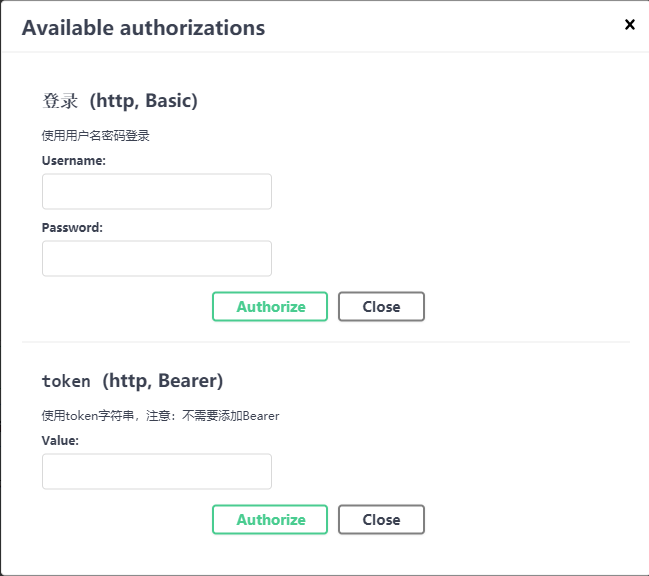

# Swagger2 的简单使用


## 使用前的简单配置swagger 

		1. maven导包

```xml
 <!-- swagger2API文档支持 -->
<dependency>
    <groupId>io.springfox</groupId>
    <artifactId>springfox-swagger2</artifactId>
    <version>2.9.2</version>
    <exclusions>
        <exclusion>
            <groupId>io.swagger</groupId>
            <artifactId>swagger-models</artifactId>
        </exclusion>
        <exclusion>
            <groupId>io.swagger</groupId>
            <artifactId>swagger-annotations</artifactId>
        </exclusion>
    </exclusions>
</dependency>
<dependency>
    <groupId>io.springfox</groupId>
    <artifactId>springfox-swagger-ui</artifactId>
    <version>2.9.2</version>
</dependency>
<dependency>
    <groupId>io.swagger</groupId>
    <artifactId>swagger-models</artifactId>
    <version>1.6.0</version>
    <scope>compile</scope>
</dependency>

<dependency>
    <groupId>io.swagger</groupId>
    <artifactId>swagger-annotations</artifactId>
    <version>1.6.0</version>
    <scope>compile</scope>
</dependency>
```

2. 写一个配置类 Swagger2Config.java

```java
package com.cfl.jd.config;

import org.springframework.beans.factory.InitializingBean;
import org.springframework.beans.factory.annotation.Autowired;
import org.springframework.beans.factory.annotation.Value;
import org.springframework.context.annotation.Bean;
import org.springframework.context.annotation.Configuration;
import org.springframework.core.env.Environment;
import org.springframework.core.io.ClassPathResource;
import org.springframework.http.ResponseEntity;
import org.springframework.stereotype.Controller;
import org.springframework.web.bind.annotation.RequestMapping;
import org.springframework.web.bind.annotation.RequestMethod;
import org.springframework.web.bind.annotation.RequestParam;
import org.springframework.web.bind.annotation.ResponseBody;
import org.springframework.web.servlet.ModelAndView;
import org.springframework.web.servlet.handler.SimpleUrlHandlerMapping;
import org.springframework.web.servlet.resource.PathResourceResolver;
import org.springframework.web.servlet.resource.ResourceHttpRequestHandler;
import org.springframework.web.util.UrlPathHelper;
import springfox.documentation.annotations.ApiIgnore;
import springfox.documentation.builders.ApiInfoBuilder;
import springfox.documentation.builders.OAuthBuilder;
import springfox.documentation.builders.PathSelectors;
import springfox.documentation.builders.RequestHandlerSelectors;
import springfox.documentation.service.*;
import springfox.documentation.spi.DocumentationType;
import springfox.documentation.spi.service.contexts.SecurityContext;
import springfox.documentation.spring.web.DocumentationCache;
import springfox.documentation.spring.web.json.Json;
import springfox.documentation.spring.web.json.JsonSerializer;
import springfox.documentation.spring.web.plugins.Docket;
import springfox.documentation.swagger.web.ApiResourceController;
import springfox.documentation.swagger.web.SecurityConfiguration;
import springfox.documentation.swagger.web.SwaggerResource;
import springfox.documentation.swagger.web.UiConfiguration;
import springfox.documentation.swagger2.annotations.EnableSwagger2;
import springfox.documentation.swagger2.mappers.ServiceModelToSwagger2Mapper;
import springfox.documentation.swagger2.web.Swagger2Controller;

import javax.servlet.ServletContext;
import javax.servlet.http.HttpServletRequest;
import java.util.*;

/**
 * 类描述：
 * 配置 swagger
 * @ClassName Swagger2Config
 * @Author msi
 * @Date 2020/10/17 10:00
 * @Version 1.0
 */
@Configuration
@EnableSwagger2
public class Swagger2Config {

    /**
     * 文档地址
     */
    private static final String DEFAULT_PATH = "/swagger";
    /**
     * api 包
     */
    private static final String API_BASEPACKAGE = "com.cfl.jd";

    /**
     * 是否开启swagger，正式环境一般是需要关闭的
     * 在 application.yml 配置文件设置属性值
     */
    @Value("${swagger.enable}")
    private boolean enableSwagger;
    /**
     * 应用名称
     * 在 application.yml 配置文件设置属性值
     */
    @Value("${swagger.application-name}")
    private String applicationName;
    /**
     * 版本
     * 在 application.yml 配置文件设置属性值
     */
    @Value("${swagger.application-version}")
    private String applicationVersion;
    /**
     * 描述
     * 在 application.yml 配置文件设置属性值
     */
    @Value("${swagger.application-description}")
    private String applicationDescription;

    @Bean
    public Docket createRestApi() {
        return new Docket(DocumentationType.SWAGGER_2)
//                .groupName("考试练习模块")
                .apiInfo(apiInfo())
                //是否开启 (true 开启  false隐藏。生产环境建议隐藏)
                .enable(this.enableSwagger)
                .select()
                //扫描的路径包,设置basePackage会将包下的所有被@Api标记类的所有方法作为api
                .apis(RequestHandlerSelectors.basePackage(API_BASEPACKAGE))
                //指定路径处理PathSelectors.any()代表所有的路径
                .paths(PathSelectors.any())
                .build()
                // 设置Available authorizations  BasicAuth OAuth ApiKey
//                .securitySchemes(securitySchemes())
                .securitySchemes(securitySchemes())
                .securityContexts(securityContexts());
    }

    /**
     * 这里是写允许认证的scope
     */
    private AuthorizationScope[] scopes() {
        return new AuthorizationScope[]{
                new AuthorizationScope("global", "accessAnything")
//                new AuthorizationScope("global", "Grants openid access")
//                , new AuthorizationScope("all", "All scope is trusted!")
        };
    }


    List<SecurityReference> defaultAuth() {
        AuthorizationScope authorizationScope = new AuthorizationScope("global", "accessEverything");
        AuthorizationScope[] authorizationScopes = new AuthorizationScope[1];
        authorizationScopes[0] = authorizationScope;
        List<SecurityReference> securityReferences=new ArrayList<>();
        securityReferences.add(new SecurityReference("Authorization", authorizationScopes));
        return securityReferences;
    }

    /**
     * 这个类决定了你使用哪种认证方式，我这里使用密码模式
     * 其他方式自己摸索一下，完全莫问题啊
     * SecurityScheme 子类 BasicAuth OAuth ApiKey
     */
    private List<SecurityScheme> securitySchemes() {
        List<SecurityScheme> list = new ArrayList<>();

        // OAuth
        // 验证账号密码登录的接口
        GrantType grantType = new ResourceOwnerPasswordCredentialsGrant("/api/user/swaggerlogin");

        OAuth spring_oauth = new OAuthBuilder()
                .name("OAuth2")
                .grantTypes(Collections.singletonList(grantType))
                .scopes(Arrays.asList(scopes()))
                .build();
        // Apikey
//        list.add(new ApiKey("custom-token", "token", "header"));

        // BasicAuth
//        list.add(new BasicAuth("basicAuth"));

        list.add(spring_oauth);
        return list;
    }

    /**
     * swagger 文档的基本信息
     * @return
     */
    private ApiInfo apiInfo() {
        return new ApiInfoBuilder()
                //设置文档标题(API名称)
                .title(this.applicationName)
                //文档描述
                .description(this.applicationDescription)
                //服务条款URL
//                .termsOfServiceUrl("http://127.0.0.1:8080/")
                //版本号
                .version(this.applicationVersion)
                .build();
    }

    /**
     * 这里设置 swagger2 认证的安全上下文
     */
    private List<SecurityContext> securityContexts() {
        List<SecurityContext> securityContextList = new ArrayList<>();

        List<SecurityReference> securityReferenceList = new ArrayList<>();
        securityReferenceList.add(new SecurityReference("custom-token", scopes()));

//        securityContextList.add(SecurityContext
//                .builder()
//                .securityReferences(securityReferenceList)
//                .forPaths(PathSelectors.any())
//                .build()
//        );

        securityContextList.add(
                SecurityContext.builder()
                        .securityReferences(defaultAuth())
                        .forPaths(PathSelectors.regex("^(?!auth).*$"))
                        .build());

//        securityContextList.add(SecurityContext.builder()
//                .securityReferences(Collections.singletonList(new SecurityReference("spring_oauth", scopes())))
//                .forPaths(PathSelectors.any())
//                .build());
        return securityContextList;
    }


    /**
     * SwaggerUI资源访问
     *
     * @param servletContext
     * @param order
     * @return
     * @throws Exception
     */
    @Bean
    public SimpleUrlHandlerMapping swaggerUrlHandlerMapping(ServletContext servletContext,
                                                            @Value("${swagger.mapping.order:10}") int order) throws Exception {
        SimpleUrlHandlerMapping urlHandlerMapping = new SimpleUrlHandlerMapping();
        Map<String, ResourceHttpRequestHandler> urlMap = new HashMap<>();
        {
            PathResourceResolver pathResourceResolver = new PathResourceResolver();
            pathResourceResolver.setAllowedLocations(new ClassPathResource("META-INF/resources/webjars/"));
            pathResourceResolver.setUrlPathHelper(new UrlPathHelper());

            ResourceHttpRequestHandler resourceHttpRequestHandler = new ResourceHttpRequestHandler();
            resourceHttpRequestHandler.setLocations(Arrays.asList(new ClassPathResource("META-INF/resources/webjars/")));
            resourceHttpRequestHandler.setResourceResolvers(Arrays.asList(pathResourceResolver));
            resourceHttpRequestHandler.setServletContext(servletContext);
            resourceHttpRequestHandler.afterPropertiesSet();
            //设置新的路径
            urlMap.put(DEFAULT_PATH + "/webjars/**", resourceHttpRequestHandler);
        }
        {
            PathResourceResolver pathResourceResolver = new PathResourceResolver();
            pathResourceResolver.setAllowedLocations(new ClassPathResource("META-INF/resources/"));
            pathResourceResolver.setUrlPathHelper(new UrlPathHelper());

            ResourceHttpRequestHandler resourceHttpRequestHandler = new ResourceHttpRequestHandler();
            resourceHttpRequestHandler.setLocations(Arrays.asList(new ClassPathResource("META-INF/resources/")));
            resourceHttpRequestHandler.setResourceResolvers(Arrays.asList(pathResourceResolver));
            resourceHttpRequestHandler.setServletContext(servletContext);
            resourceHttpRequestHandler.afterPropertiesSet();
            //设置新的路径
            urlMap.put(DEFAULT_PATH + "/**", resourceHttpRequestHandler);
        }
        urlHandlerMapping.setUrlMap(urlMap);
        //调整DispatcherServlet关于SimpleUrlHandlerMapping的排序
        urlHandlerMapping.setOrder(order);
        return urlHandlerMapping;
    }

    /**
     * SwaggerUI接口访问
     */
    @Controller
    @ApiIgnore
    @RequestMapping(DEFAULT_PATH)
    public static class SwaggerResourceController implements InitializingBean {

        @Autowired
        private ApiResourceController apiResourceController;

        @Autowired
        private Environment environment;

        @Autowired
        private DocumentationCache documentationCache;

        @Autowired
        private ServiceModelToSwagger2Mapper mapper;

        @Autowired
        private JsonSerializer jsonSerializer;

        private Swagger2Controller swagger2Controller;

        @Override
        public void afterPropertiesSet() {
            swagger2Controller = new Swagger2Controller(environment, documentationCache, mapper, jsonSerializer);
        }

        /**
         * 首页
         *
         * @return
         */
        @RequestMapping
        public ModelAndView index() {
            ModelAndView modelAndView = new ModelAndView("redirect:" + DEFAULT_PATH + "/swagger-ui.html");
            return modelAndView;
        }

        @RequestMapping("/swagger-resources/configuration/security")
        @ResponseBody
        public ResponseEntity<SecurityConfiguration> securityConfiguration() {
            return apiResourceController.securityConfiguration();
        }

        @RequestMapping("/swagger-resources/configuration/ui")
        @ResponseBody
        public ResponseEntity<UiConfiguration> uiConfiguration() {
            return apiResourceController.uiConfiguration();
        }

        @RequestMapping("/swagger-resources")
        @ResponseBody
        public ResponseEntity<List<SwaggerResource>> swaggerResources() {
            return apiResourceController.swaggerResources();
        }

        @RequestMapping(value = "/v2/api-docs", method = RequestMethod.GET, produces = {"application/json", "application/hal+json"})
        @ResponseBody
        public ResponseEntity<Json> getDocumentation(
                @RequestParam(value = "group", required = false) String swaggerGroup,
                HttpServletRequest servletRequest) {
            return swagger2Controller.getDocumentation(swaggerGroup, servletRequest);
        }
    }

}
```

> 注意：这里是因为本人使用了全局的token认证，所以添加了一个全局 token。


## 简单使用

### 常用注解

​		Swagger在使用过程中，本人经常使用的注解有以下几个：

| 注解                                                         | 描述                                                         |
| ------------------------------------------------------------ | ------------------------------------------------------------ |
| @EnableSwagger2                                              | 放在swagger配置类上，用于配置swagger                         |
| @Api(value = "", tags = "")                                  | 我通常是放在Controller上，表明这个控制器会被Swagger生成接口文档 |
| @ApiOperation(value = "接口简短说明", notes = "接口详细描述") | 放在控制器中的方法上                                         |
| @ApiImplicitParam(name = "", value = "", required = true, dataType = "", paramType="query") | 描述接口需要的参数说明                                       |
| @ApiImplicitParams({@ApiImplicitParam ...})                  | 描述接口需要的参数说明(多个参数时使用)                       |
| @ApiModel                                                    | 放在实体类上                                                 |
| @ApiModelProperty(name = "", value = "", required = true)    | 放在实体类的属性上                                           |
| @ApiIgnore                                                   | 放在方法上，用于swagger忽略该方法                            |

> 注意
>
> 1. 如果接口的参数是一个自定义对象的话，那么方法就不要使用 @ApiImplicitParam 和 @ApiImplicitParams ，只需要在该对象的类上添加注解 @ApiModel 在 其属性上添加@ApiModelProperty,这样就会生成 详细的接口文档。


### [配置详情](https://github.com/SpringForAll/spring-boot-starter-swagger) ###
##访问地址：http://localhost:9000/swagger-ui.html#/ ##

  # 全局参数
```yaml
swagger.enabled=true

swagger.title=spring-boot-starter-swagger
swagger.description=Starter for swagger 2.x
swagger.version=1.4.0.RELEASE
swagger.license=Apache License, Version 2.0
swagger.licenseUrl=https://www.apache.org/licenses/LICENSE-2.0.html
swagger.termsOfServiceUrl=https://github.com/dyc87112/spring-boot-starter-swagger
swagger.contact.name=didi
swagger.contact.url=http://blog.didispace.com
swagger.contact.email=dyc87112@qq.com
swagger.base-package=com.didispace
swagger.base-path=/**
swagger.exclude-path=/error, /ops/**

swagger.globalOperationParameters[0].name=name one
swagger.globalOperationParameters[0].description=some description one
swagger.globalOperationParameters[0].modelRef=string
swagger.globalOperationParameters[0].parameterType=header
swagger.globalOperationParameters[0].required=true
swagger.globalOperationParameters[1].name=name two
swagger.globalOperationParameters[1].description=some description two
swagger.globalOperationParameters[1].modelRef=string
swagger.globalOperationParameters[1].parameterType=body
swagger.globalOperationParameters[1].required=false

// 取消使用默认预定义的响应消息,并使用自定义响应消息
swagger.apply-default-response-messages=false
swagger.global-response-message.get[0].code=401
swagger.global-response-message.get[0].message=401get
swagger.global-response-message.get[1].code=500
swagger.global-response-message.get[1].message=500get
swagger.global-response-message.get[1].modelRef=ERROR
swagger.global-response-message.post[0].code=500
swagger.global-response-message.post[0].message=500post
swagger.global-response-message.post[0].modelRef=ERROR

```


# Swagger3 配置使用

使用swagger3 更加简洁方便，比如启动类可以不再加注解`@EnableOpenApi`。

1. pom.xml

   ```xml
   <!--swagger-->
   <dependency>
       <groupId>io.springfox</groupId>
       <artifactId>springfox-boot-starter</artifactId>
       <version>3.0.0</version>
       <!--因为配置log4j日志，需要将这里去掉不然有警告-->
       <exclusions>
           <exclusion>
               <groupId>org.slf4j</groupId>
               <artifactId>slf4j-api</artifactId>
           </exclusion>
       </exclusions>
   </dependency>
   ```

2. application.yml

   ```yaml
   springfox:
     documentation:
       swagger-ui:
         enabled: true # 是否激活swagger
   ```


## 代码配置

配置swagger的接口位置和组信息，以及Authorize 信息

```java
package com.goudong.oauth2.config;

import com.goudong.commons.config.Swagger3AuthorizedConfig;
import io.swagger.annotations.ApiOperation;
import org.springframework.context.annotation.Bean;
import org.springframework.context.annotation.Configuration;
import springfox.documentation.builders.ApiInfoBuilder;
import springfox.documentation.builders.OAuthBuilder;
import springfox.documentation.builders.PathSelectors;
import springfox.documentation.builders.RequestHandlerSelectors;
import springfox.documentation.service.*;
import springfox.documentation.spi.DocumentationType;
import springfox.documentation.spi.service.contexts.SecurityContext;
import springfox.documentation.spring.web.plugins.Docket;

import java.util.*;

/**
 * 类描述：
 * 配置 swagger<br>
 * 访问 ip:port/swagger-ui/index.html
 * ip:port/swagger-ui
 *
 * @ClassName Swagger3Config
 * @Author msi
 * @Date 2020/10/17 10:00
 * @Version 1.0
 */
@Configuration
public class Swagger3Config {

    /**
     * 开放接口组
     * @return
     */
    @Bean
    public Docket openDocket() {
        ApiInfo apiInfo =  new ApiInfoBuilder()
                .title("open api")
                .description("开放接口，不需要登录就能访问")
                .version("1.0")
                .contact(new Contact("Evan", "http://www.baidu.com", "123456@qq.com"))
                .build();
        return new Docket(DocumentationType.OAS_30)
                .enable(true)
                .apiInfo(apiInfo)
                .select()
                .apis(RequestHandlerSelectors.basePackage("com.goudong.oauth2.controller.open"))
                //只有标记了@ApiOperation的方法才会暴露出给swagger
                .apis(RequestHandlerSelectors.withMethodAnnotation(ApiOperation.class))
                .paths(PathSelectors.any())
                .build()
                // 支持的通讯协议集合
                .protocols(new LinkedHashSet<>(Arrays.asList("http", "https")))
                .groupName("openApi")
                .securitySchemes(Swagger3AuthorizedConfig.securitySchemes())
                .securityContexts(Swagger3AuthorizedConfig.securityContexts())
                ;
    }

    @Bean
    public Docket qqDocket() {
        ApiInfo apiInfo = new ApiInfoBuilder()
                .title("QQ模块")
                .description("qq相关的认证")
                .version("1.0")
                .contact(new Contact("Evan", "http://www.baidu.com", "123456@qq.com"))
                .build();

        return new Docket(DocumentationType.OAS_30)
                .enable(true)
                .apiInfo(apiInfo)
                .select()
                // 全部扫描
                //.apis(RequestHandlerSelectors.any())
                .apis(RequestHandlerSelectors.basePackage("com.goudong.oauth2.controller.qq"))
                .paths(PathSelectors.any())
                .build()
                // 支持的通讯协议集合
                .protocols(new LinkedHashSet<>(Arrays.asList("http", "https")))
                // 在子模块中使用groupName 可以使用右上的下拉功能
                .groupName("QQ")
                .securitySchemes(Swagger3AuthorizedConfig.securitySchemes())
                .securityContexts(Swagger3AuthorizedConfig.securityContexts())
                ;
    }

    @Bean
    public Docket weChatDocket() {
        ApiInfo apiInfo =  new ApiInfoBuilder()
                .title("WeChat")
                .description("微信OAuth")
                .version("1.0")
                .contact(new Contact("Evan", "http://www.baidu.com", "123456@qq.com"))
                .build();
        return new Docket(DocumentationType.OAS_30)
                .enable(true)
                .apiInfo(apiInfo)
                .select()
                .apis(RequestHandlerSelectors.basePackage("com.goudong.oauth2.controller.wechat"))
                .paths(PathSelectors.any())
                .build()
                // 支持的通讯协议集合
                .protocols(new LinkedHashSet<>(Arrays.asList("http", "https")))
                .groupName("WeChat")
                .securitySchemes(Swagger3AuthorizedConfig.securitySchemes())
                .securityContexts(Swagger3AuthorizedConfig.securityContexts())
                ;

    }
}
```

Swagger3AuthorizedConfig 的代码：

```java
package com.goudong.commons.config;

import springfox.documentation.builders.PathSelectors;
import springfox.documentation.service.AuthorizationScope;
import springfox.documentation.service.HttpAuthenticationScheme;
import springfox.documentation.service.SecurityReference;
import springfox.documentation.service.SecurityScheme;
import springfox.documentation.spi.service.contexts.SecurityContext;

import java.util.ArrayList;
import java.util.List;

/**
 * 类描述：
 * 配置 swagger<br>
 * 访问 ip:port/swagger-ui/index.html#/
 * ip:port/swagger-ui
 * @ClassName Swagger3Config
 * @Author msi
 * @Date 2020/10/17 10:00
 * @Version 1.0
 */
public class Swagger3AuthorizedConfig {

    /**
     * 添加作用域
     * @return
     */
    public static List<SecurityContext> securityContexts() {
        List<SecurityContext> securityContextList = new ArrayList<>();
        List<SecurityReference> securityReferenceList = new ArrayList<>();
        // 将认证方式添加进上下文
        securityReferenceList.add(new SecurityReference("token", scopes()));
        securityReferenceList.add(new SecurityReference("登录", scopes()));

        securityContextList.add(SecurityContext
                .builder()
                .securityReferences(securityReferenceList)
                .forPaths(PathSelectors.any())
                .build()
        );

        return securityContextList;
    }

    /**
     * 范围全局
     * @return
     */
    private static AuthorizationScope[] scopes() {
        return new AuthorizationScope[]{new AuthorizationScope("global", "accessAnything")};
    }

    /**
     * 添加认证方式
     * @return
     */
    public static List<SecurityScheme> securitySchemes() {
        List<SecurityScheme> list = new ArrayList<>();

        // 自动加上"Bearer "。
        HttpAuthenticationScheme jwt = HttpAuthenticationScheme.JWT_BEARER_BUILDER.name("token")
                .description("使用token字符串，注意：不需要添加Bearer ")
                .build();

        // Authorization请求头，值是类似 "Basic YWRtaW46MTIzNDU2" 格式，启动"Basic " 是固定的，后面是Base64格式，解码后是键值对
        HttpAuthenticationScheme basic = HttpAuthenticationScheme.BASIC_AUTH_BUILDER.name("登录")
                .description("使用用户名密码登录")
                .build();

        list.add(jwt);
        list.add(basic);

        return list;
    }
}
```

1. 访问http://ip:port/api/oauth2/swagger-ui/index.html:



> 注意：
>
> 登录验证，最后请求头是 Base64格式，且以"Basic "开头，解码后是 username:password格式。
>
> token，是使用Bearer方式，请求头的值以"Bearer "开头。格式是token。


