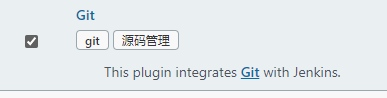
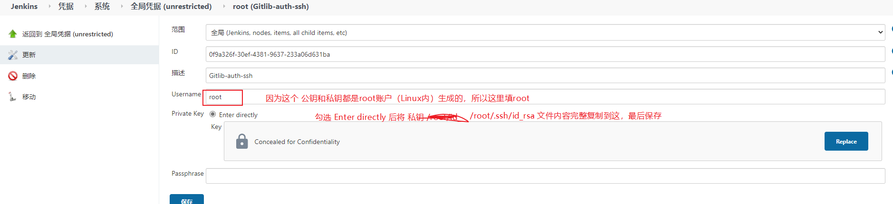
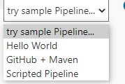

# Jenkins 持续集成入门到精通

## 1、持续集成Jenkins 介绍

### 软件开发生命周期

​		软件开发生命周期又叫做SDLC（Software Development Life Cycle），它是集合了计划、开发、测试和部署过程的集合。如下所示：


+ 需求分析

  这时生命周期的第一阶段，根据项目需求，团队执行一个可行性计划的分析。项目需求可能是公司内部或者客户提出的。这阶段主要是对信息的收集，也有可能是对现有项目的改善和重新做一个新的项目。还要分析项目的预算多长，可以从哪方面受益以及布局，这也是项目创建的目标

+ 设计

  第二阶段就是设计阶段，系统架构和满意状态（就是做成什么样子，有什么功能），和创建一个项目计划可以使用图表，布局设计或者文字的方式呈现。

+ 实现

  第三阶段就是实现阶段，项目经理创建和分配工作给开发者，开发者根据任务和设计阶段定义的目标进行开发代码。依据项目的大小和复杂程度，可以需要数月或更长时间菜能完成。

+ 测试

  测试人员进行代码测试，包括功能测试、代码测试、压力测试等。

+ 进化

  最后阶段就是对产品不断的进化改进和维护阶段，根据用户的使用情况，可能需要对某功能进行修改，bug修复，功能增加等。

### 软件开发瀑布模型

​		瀑布模型是最著名和最常使用的软件开发模型。瀑布模型就是一系列的软件开发过程。它是由制造业繁衍出来的。一个高度化的结构流程在一个方向上流动，有点像生产线一样。在瀑布模型创建之初，没有其它开发的模型，有很多东西全靠开发人员去猜测，去开发。这样的模型仅适用于那些简单的软件开发，但是已经不适合现在的开发了。

​		下图对软件开发模型的一个阐述。


| 优势                                       | 劣势                                                         |
| ------------------------------------------ | ------------------------------------------------------------ |
| 简单易用和理解                             | 各个阶段的划分完全固定，阶段之间产生大量的文档，极大的增加了工作量 |
| 当前一阶段完成后，您只需要去关注后续阶段。 | 由于开发模型是线性的，用户只有等到整个过程的末期才能见到成果，从而增加了开发风险 |
| 为项目提供了按阶段划分的检查节点           | 瀑布模型的突出缺点是不适应用户需求的变化。                   |

### 软件的敏捷开发

#### 什么是敏捷开发？

​		敏捷开发(Agile Deveiopment)的核心是迭代开发(lterative Development)与增量开发(IncrementalDevelopment)。

##### ===何为迭代开发?===

​		对于大型软件项目，传统的开发方式是采用一个大周期(比如一年)进行开发，整个过程就是一次"大开发";迭代开发的方式则不一样，它将开发过程拆分成多个小周期，即一次"大开发"变成多次"小开发"，每次小开发都是同样的流程，所以看上去就好像重复在做同样的步骤。

​		举例来说，SpaceX公司想造一个大推力火箭，将人类送到火星。但是，它不是一开始就造大火箭，而是先造一个最简陋的小火箭Falcon 1。结果，第一次发射就爆炸了，直到第四次发射，才成功进入轨道。然后，开发了中型火箭Falcon 9，九年中发射了70次。最后，才开发Falcon重型火箭。如果SpaceX不采用迭代开发，它可能直到现在还无法上天。

##### ===何为增量开发?===

​		软件的每个版本，都会新增一个用户可以感知的完整功能。也就是说，按照新增功能来划分迭代。

​		举例来说，房产公司开发一个10栋楼的小区。如果采用增量开发的模式，该公司第一个迭代就是交付一号楼，第二个迭代交付二号楼..…….每个迭代都是完成一栋完整的楼。而不是第一个迭代挖好10栋楼的地基，第二个迭代建好每栋楼的骨架，第三个迭代架设屋顶.....

#### 敏捷开发如何迭代？

​		虽然敏捷开发将软件开发分成多个迭代，但是也要求，每次迭代都是一个完整的软件开发周期，必须按照软件工程的方法论，进行正规的流程管理。


#### 敏捷开发有什么好处？

##### ==早期交付==

​		敏捷开发的第一个好处，就是早期交付，从而大大降低成本。

​		还是以上一节的房产公司为例，如果按照传统的"瀑布开发模式"，先挖10栋楼的地基、再盖骨架、然后架设屋顶，每个阶段都等到前一个阶段完成后开始，可能需要两年才能一次性交付10栋楼。也就是说，如果不考虑预售，该项目必须等到两年后才能回款。

​		敏捷开发是六个月后交付一号楼，后面每两个月交付一栋楼。因此，半年就能回款10%，后面每个月都会有现金流，资金压力就大大减轻了。

##### ==降低风险===

​		敏捷开发的第二个好处是，及时了解市场需求，降低产品不适用的风险。

​		请想一想，哪一种情况损失比较小:10栋楼都造好以后，才发现卖不出去，还是造好第一栋楼，就发现卖不出去，从而改进或停建后面9栋楼?


### 什么是持续集成

​		持续集成（Continuous integration，简称Cl ）指的是，频繁地(一天多次）将代码集成到主干。

​		持续集成的目的，就是让产品可以快速迭代，同时还能保持高质量。它的核心措施是，代码集成到主干之前，必须通过自动化测试。只要有一个测试用例失败，就不能集成。

​		通过持续集成，团队可以快速的从一个功能到另一个功能，简而言之，敏捷软件开发很大一部分都要归功于持续集成。

#### ==持续集成的流程==


​		根据持续集成的设计，代码从提交到生产，整个过程有以下几步。

+ 提交：流程的第一步，是开发者向代码仓库提交代码。所有后面的步骤都始于本地代码的一次提交（commit)。
+ 测试(第一轮)：代码仓库对commit操作配置了钩子(hook)，只要提交代码或者合并进主干，就会跑自动化测试。
+ 构建：通过第一轮测试，代码就可以合并进主干，就算可以交付了。交付后，就先进行构建(build)，再进入第二轮测试。所谓构建，指的是将源码转换为可以运行的实际代码比如安装依赖，配置各种资源(样式表、JS脚本、图片)等等。
+ 测试(第二轮)：构建完成，就要进行第二轮测试。如果第一轮已经涵盖了所有测试内容，第二轮可以省略，当然，这时构建步骤也要移到第一轮测试前面。
+ 部署：过了第二轮测试，当前代码就是一个可以直接部署的版本(artifact)。将这个版本的所有文件打包( tar filename.tar * )存档，发到生产服务器。
+ 回滚：一旦当前版本发生问题，就要回滚到上一个版本的构建结果。最简单的做法就是修改一下符号链接，指向上一个版本的目录。

#### 持续集成的组成要素

+ 一个自动构建过程，从检出代码、编译构建、运行测试、结果记录、测试统计等都是自动完成的，无需人工干预。

+ 一个代码存储库，即需要版本控制软件来保障代码的可维护性，同时作为构建过程的素材库，一般使用SVN或Git。

+ 一个持续集成服务器，Jenkins 就是一个配置简单和使用方便的持续集成服务器。


#### 持续集成的好处

1、降低风险，由于持续集成不断去构建，编译和测试，可以很早期发现问题，所以修复的代价就少;

2、对系统健康持续检查，减少发布风险带来的问题;

3、减少重复性工作;

4、持续部署，提供可部署单元包;

5、持续交付可供使用的版本;

6、增强团队信心;

### Jenkins 介绍


​		Jenkins是一款流行的开源持续集成(Continuous Integration)工具，广泛用于项目开发，具有自动化构建、测试和部署等功能。[官网](http://jenkins-ci.org)

Jenkins的特征:

+ 开源的Java语言开发持续集成工具，支持持续集成，持续部署。
+ 易于安装部署配置:可通过yum安装,或下载war包以及通过docker容器等快速实现安装部署，可方便web界面配置管理。
+ 消息通知及测试报告:集成RSS/E-mail通过RSS发布构建结果或当构建完成时通过e-mail通知，生成JUnit/TestNG测试报告。
+ 分布式构建:支持Jenkins能够让多台计算机一起构建/测试。
+ 文件识别:Jenkins能够跟踪哪次构建生成哪些jar，哪次构建使用哪个版本的jar等
+ 丰富的插件支持:支持扩展插件，你可以开发适合自己团队使用的工具，如git，svn，maven，docker等。

## 2、jenkins 安装和持续集成环境配置

### 持续集成流程说明


1）首先，开发人员每天进行代码提交，提交到Git仓库。

2）然后，Jenkins作为持续集成工具，使用Git工具到Git仓库拉取代码到集成服务器，再配合JDK，Maven等软件完成代码编译，代码测试与审查，测试，打包等工作，在这个过程中每一步出错，都重新再执行一次整个流程。

3）最后，Jenkins把生成的jar或war包分发到测试服务器或者生产服务器，测试人员或用户就可以访问应用。

**服务器列表**

本课程虚拟机统—采用CentOS7

| 名称           | IP地址         | 安装的软件                                        |
| -------------- | -------------- | ------------------------------------------------- |
| 代码托管服务器 | 192.168.66.100 | Gitlab-12.4.2                                     |
| 持续集成服务器 | 192.168.66.101 | Jenkins-2.190.3，JDK1.8，Maven3.6.2，GT,SonarQube |
| 应用测试服务器 | 192.168.66.102 | JDK1.8，Tomcat8.5                                 |

### Gitlab代码托管服务器安装

#### Gitlab简介


[官网](https://about.gitlab.coml/)

​		GitLab是一个用于仓库管理系统的开源项目，使用Git作为代码管理工具，并在此基础上搭建起来的web服务。

​		GitLab和GitHub一样属于第三方基于Git开发的作品，免费且开源（基于MIT协议)，与Github类似，可以注册用户，任意提交你的代码，添加SSHKey等等。不同的是，**GitLab是可以部署到自己的服务器上，数据库等一切信息都掌握在自己手上，适合团队内部协作开发**，你总不可能把团队内部的智慧总放在别人的服务器上吧?简单来说可把GitLab看作个人版的GitHub。

#### Gitlab安装

​		1.安装相关依赖

```bash
$ sudo yum -y install policycoreutils openssh-server openssh-clients postfix
```

​		2.启动ssh服务&设置为开机启动

```bash
$ sudo systemctl enable sshd && sudo systemctl start sshd
```

​		3.设置postfix开机自启，并启动，postfix支持gitlab发信功能

```bash
$ sudo systemctl enable postfix && systemctl start postfix
```

​		4.开放ssh以及http服务，然后重新加载防火墙列表

```bash
$ sudo firewall-cmd --add-service=ssh --permanent
$ sudo firewall-cmd --add-service=http --permanent
$ sudo firewall-cmd --reload
```

> 如果关闭防火墙就不需要做以上配置

​		5.下载gitlab包，并且安装

```bash
#在线下载安装包:
$ sudo wget https://mirrors.tuna.tsinghua.edu.cn/gitlab-ce/yum/el8/gitlab-ce-13.6.1-ce.0.el8.x86_64.rpm
#安装
$ sudo rpm -ivh gitlab-ce-13.6.1-ce.0.el8.x86_64.rpm
```

> 注意：
>
> 出现下面的错误，使用`yum install policycoreutils-python`
>
> ```text
> error: Failed dependencies:
> 	policycoreutils-python is needed by gitlab-ce-12.4.2-ce.0.el6.x86_64
> ```
>
> 如果执行还是不行，那么就是操作系统的版本不是centos7
>
> 在 https://mirrors.tuna.tsinghua.edu.cn/gitlab-ce/yum/el8/ 去下载对应centos8的版本。
>
> 参考 [解决policycoreutils-python is needed by问题_没有伞的孩子只能快跑，如若不跑，只有一个结果：超过你的人回头鄙视你-CSDN博客](https://blog.csdn.net/fu18838928050/article/details/107901895)

​		6.修改gitlab配置

```bash
$ sudo vim /etc/gitlab/gitlab.rb
```

> 修改gitlab访问地址和端口，默认为80，我们改为82
>
> ```bash
> external_url 'http://192.168.66.100:82'
> nginx['listen_port'] = 82
> ```

​		7.重载配置及启动gitlab

```bash
$ sudo gitlab-ctl reconfigure
$ sudo gitlab-ctl restart
```

​		8.把端口添加到防火墙

```bash
$ sudo firewall-cmd --zone=public --add-port=82/tcp --permanent
$ sudo firewall-cmd --reload
```

​		启动成功后，浏览器输入` ip:82 `看到以下修改管理员root密码的页面，修改密码后，然后登录即可


> 用户名是 root
>
> 密码就是刚设置的8位密码


#### Gitlab添加组、创建用户、创建项目

​		1）创建组

​		使用管理员root创建组，一个组里面可以有多个项目分支，可以将开发添加到组里面进行设置权限，不同的组就是公司不同的开发项目或者服务模块，不同的组添加不同的开发即可实现对开发设置权限的管理

> 点击Explore groups 进行创建group
>
> 
>
> 

​		2）创建用户

​		创建用户的时候，可以选择Regular或Admin类型。

> 创建：点击菜单栏的Admin Area
>
> 
>
> 
>
> 左边是项目相关，中间是用户相关，右边是组相关，
>
> 
>
> 我们点击中间 Users的New user，需要注意的是，Access 下有个 Access level 单选框，Regular 变时普通用户，只能访问属于他的组和项目；Admin：管理员，可以访问所有组和项目
>
> 
>
> 修改：创建完后，可以在用户列表的后面点击Edit进行修改密码等信息
>
> 


​		3）将用户添加到组中

​		选择某个用户组，进行Members管理组的成员

> 第一步，点击需要添加到的组名称
>
> 
>
> 第二部：点击右侧的Members
>
> 
>
> 第三步：选择用户和权限
>
> 
>
> Gitlab用户在组里面有5种不同权限:
>
> 1. Guest:可以创建issue、发表评论，不能读写版本库。
> 2. Reporter:可以克隆代码，不能提交，QA、PM可以赋予这个权限。
> 3. Developer:可以克隆代码、开发、提交、push，普通开发可以赋予这个权限。
> 4. Maintainer:可以创建项目、添加tag、保护分支、添加项目成员、编辑项目，核心开发可以赋予这个权限。
> 5. Owner:可以设置项目访问权限-Visibility Level、删除项目、迁移项目、管理组成员，开发组组长可以赋予这个权限

​		3）创建项目

​		使用新创建的账号进行创建项目

> 首先使用新用户登录，登陆成功后点击 New project
>
> 创建：
>
> 


### 源码上传到Gitlab仓库

​		下面来到DEA开发工具，我们已经准备好一个简单的Web应用准备到集成部署。我们要把源码上传到Gitlab的项目仓库中。	

​		1）项目结构说明


​		我们建立了一个非常简单的web应用，只有一个index.jsp页面，如果部署好，可以访问该页面就成功啦!

​		2）开启版本控制

​		将项目文件提交到Gitlib上去

> 1. 首先是先初始化Git
>
> 2. 然后是将项目文件commit 提交
>
> 3. 提交过后就需要修改远程仓库
>
>    
>
>    点击右边的 ”+“，新增一个远程仓库地址，地址从Gitlib project 复制
>
>    
>
>    
>
> ​	

### 持续集成环境（1）Jenkins安装

1）安装JDK

​		Jenkins需要依赖JDK，所以先安装JDK1.8

```bash
$ sudo yum install java-1.8.0-openjdk.x86_64 -y
```

> 注意：此时安装后的java -version 查看版本。
>
> 上面安装的是jre，还需要安装
>
> ```bash
> yum list installed | grep openjdk
> ```

2）安装[jenkins]( https://jenkins.io/zh/download/)

```bash
sudo wget -O /etc/yum.repos.d/jenkins.repo \
    https://pkg.jenkins.io/redhat-stable/jenkins.repo
sudo rpm --import https://pkg.jenkins.io/redhat-stable/jenkins.io.key
sudo yum upgrade
sudo yum install jenkins -y
sudo systemctl daemon-reload
```

> 软件包地址：[RedHat Repository for Jenkins](https://pkg.jenkins.io/redhat-rc/)

3)修改Jenkins配置

```bash
vim /etc/syscofig/jenkins
```

> 修改内容如下:
>
> JENKINS_USER="root"
>
> JENKINS_PORT=8888"

```bash
# 查看jenkins安装目录和配置文件的目录（）
$ sudo rpm -ql jenkins
$ sudo cd /var/lib/jenkins
$ sudo vim hudson.model.UpdateCenter.xml
```

> 将url的值改为 `https://mirrors.tuna.tsinghua.edu.cn/jenkins/updates/update-center.json`，然后重启`systemctl restart jenkins`

5),启动Jenkins

```bash
$ sudo systemctl start jenkins
```

6)打开浏览器访问	http://192.168.66.101:8888

> 注意:本服务器把防火墙关闭了，如果开启防火墙，需要在防火墙添加端口

7）获取并输入admin账户密码

```bash
$ sudo cat /var/lib/jenkins/secrets/initialAdminPassword
```

8）跳过插件安装

​		因为Jekins插件需要连接默认官网下载，速度非常慢，而且经过会失败，所以我们暂时先跳过插件安装


> 1. 选择插件来安装
>
> 2. 选择无，然后点击右下角的安装
>
>    
>
> 3. 创建管理员用户(后面就是点击保存完成即可)
>
>    


### 持续集成环境(2) Jenkins插件管理

​		Jenkins本身不提供很多功能，我们可以通过使用插件来满足我们的使用。例如从Gitlab拉取代码，使用Maven构建项目等功能需要依靠插件完成。接下来演示如何下载插件。

#### 修改Jenkins插件下载地址

​		Jenkins国外官方插件地址下载速度非常慢，所以可以修改为国内插件地址。

> Jenkins->Manage jenkins->Manage Plugins，点击Available

​		这样做是为了把Jenkins官方的插件列表下载到本地，接着修改地址文件，替换为国内插件地址

```bash
cd /var/lib/jenkins/updates
sed  -i 's/http:\/\/updates.jenkins-ci.org\/download/https:\/\/mirrors.tuna.tsinghua.edu.cn\/jenkins/g' default.json && sed -i 's/http:\/\/www.google.com/https:\/\/www.baidu.com/g' default.json
```

最后，Manage Plugins点击Advanced，把update Site改为国内插件下载地址 `https://mirrors.tuna.tsinghua.edu.cn/jenkins/updates/update-center.json`


Sumbit后，在浏览器输入: http://192.168.66.101:8888/restart，重启Jenkins。

#### 下载中文汉化插件

​		Jenkins->Manage Jenkins->Manage Plugins，点击Available，搜索"Chinese"


>  注意：第而的一个按钮Download now and install after restart
>
> 表示下载完成，重启后安装（英语太差，没注意....）		

下载安装后：

> 下载完后，可能会出现


### 持续集成环境(3)-Jenkins用户权限管理

​		我们可以利用 `Role-based Authorization Strategy`插件来管理Jenkins用户权限

#### 安装Role-based Authorization Strategy插件

​		跟上面的中文插件一样步骤进行安装

#### 开启权限全局安全配置


**授权策略切换为"Role-Based Strategy"，保存**


**创建角色**

在系统管理页面进入Manage and Assign Roles


点击"Manage Roles"


​	

+ Global roles (全局角色)︰管理员等高级用户可以创建基于全局的角色。
+ Item roles(项目角色):针对某个或者某些项目的角色
+ Node roles(节点角色)︰节点相关的权限

我们添加以下三个角色:

+ baseRole:该角色为全局角色。这个角色需要绑定Overall下面的Read权限，是为了给所有用户绑定最基本的Jenkins访问权限。

  > 注意:如果不给后续用户绑定这个角色，会报错误:`用户名 is missing the Overall/Read permission`

+ role1:该角色为项目角色。使用正则表达式绑定 `itcast.*`，意思是只能操作 itcast 开头的项目。 
+ role2:该角色也为项目角色。绑定 `itheima.*`，意思是只能操作itheima开头的项目。


保存。

#### 创建用户

​		在系统管理页面进入 Manage Users


分别划建两个用户: jack和eric


#### 给用户分配角色

系统管理页面进入Manage and Assign Roles，点击Assign Roles绑定规则如下:

+ eric用户分别绑定baseRole和role1角色
+ jack用户分别绑定baseRole和role2角色


### 持续集成环境(4)-Jenkins凭证管理

​		凭据可以用来存储需要密文保护的数据库密码、Gitlab密码信息、Docker私有仓库密码等，以便jenkins可以和这些第三方的应用进行交互。

#### 安装Credentials Binding插件

​		要在Jenkins使用凭证管理功能，需要安装`Credentials Binding`插件


​		安装插件后，系统管理多了"凭据配置"菜单，在这里管理所有凭证


可以添加的凭证有5种:


+ username with password:用户名和密码
+ SSH Username with private key:使用SSH用户和密钥
+ Secret file:需要保密的文本文件，使用时Jenkins会将文件复制到一个临时目录中，再将文件路径设置到一个变量中，等构建结束后，所复制的Secret file就会被删除。
+ Secret text:需要保存的一个加密的文本串，如钉钉机器人或Github的api token
+ Certificate:通过上传证书文件的方式

**常用的凭证类型有：username with password 和 SSH Username with private key**

> 这里需要注意下，要包括Jenkins 凭据提供者，不然后面配置会告诉没权限。
>
> 

​		接下来以使用Git工具到Gitlab拉取项目源码为例，演示Jenkins的如何管理Gitlab的凭证。

#### 安装Git插件和Git工具

​		为了让Jenkins支持从Gitlab拉取源码，需要安装Git插件以及在CentOS7上安装Git工具。

**Git插件安装:**



**CentoS7上安装Git工具:**

```bash
yum install git -y
git --version
```

#### 用户密码类型

1）创建凭证

Jenkins->凭证->系统->全局凭证->添加凭证


确定。

2）在项目进行源码管理，配置凭证


然后保存

3）测试


#### SSH密钥类型

SSH免密登录示意图


1)使用root用户生成公钥和私钥

```bash
ssh-keygen -t rsa
```

> 此过程是在Jenkins服务器进行处理的（不知道可不可以Gitlib上生成，后面有空进行验证）
>
> 中间使用回车继续执行。

在`/root/.ssh/`目录保存了公钥和使用

```bash
[root@localhost .ssh]# ll /root/.ssh/
total 8
-rw------- 1 root root 1679 Dec  1 22:48 id_rsa
-rw-r--r-- 1 root root  408 Dec  1 22:48 id_rsa.pub
```

+ id_rsa:私钥文件
+ id_rsa.pub:公钥文件

2)把生成的公钥放在Gitlab中


复制后点击Add Key

3）配置




4）测试：

新建一个项目进行测试


可以发现也能正常进行拉取构建。

### 持续集成环境(5)-Maven安装和配置

​		在Jenkins集成服务器上，我们需要安装Maven来编译和打包项目。

#### 安装Maven

​		下载maven

```bash
$ sudo wget https://mirrors.tuna.tsinghua.edu.cn/apache/maven/maven-3/3.6.3/binaries/apache-maven-3.6.3-bin.tar.gz
```

​		移动到 `/usr/local/` 、解压

```bash
$ sudo mv apache-maven-3.6.3-bin.tar.gz /usr/local/
$ sudo cd /usr/local/
$ sudo tar -zxvf apache-maven-3.6.3-bin.tar.gz
```

​		配置环境变量

```bash
$ sudo vim /etc/profile
# 在末尾添加下面的内容
PATH=$PATH:/usr/local/apache-maven-3.6.3/bin
```

​		是配置文件生效，查看maven版本

```bash
$ sudo source /etc/profile
$ sudo mvn -v 
```

#### 全局工具配置关联JDK和Maven

Jenkins->Global Tool Configuration->JDK->新增JDK，配置如下:


#### 添加Jenkins全局变量

Manage Jenkins->Configure System->Global Properties，添加三个全局变量

JAVA_HOM、M2_HOME、PATH+EXTRA


#### 修改Mayen的settings.xml

​		创建本地仓库目录

```bash
$ sudo mkdir /root/repo
```

​		修改本地仓库地址

```bash
vim /usr/local/apache-maven-3.6.3/conf/settings.xml
```

> 本地仓库改为:<localRepository>/root/repol</localRepository>

​		添加阿里云私服地址:

```xml
<mirror>      
	  <id>nexus-aliyun</id>    
	  <name>nexus-aliyun</name>  
	  <url>http://maven.aliyun.com/nexus/content/groups/public</url>    
	  <mirrorOf>central</mirrorOf>      
	</mirror> 
```

#### 测试Maven是否配置成功

1）在代码仓库中，创建一个maven项目。


2）Jenkins创建一个项目，并进行配置


4）构建

### 持续集成环境(6)-Tomcat安装和配置

#### 安装Tomcat8.5

```bash
$ sudo wget https://downloads.apache.org/tomcat/tomcat-8/v8.5.60/bin/apache-tomcat-8.5.60.tar.gz
$ sudo mv apache-tomcat-8.5.60.tar.gz /usr/local/
$ sudo cd /usr/local/
$ sudo tar -xvf apache-tomcat-8.5.60.tar.gz
$ sudo cd apache-tomcat-8.5.60/bin/
$ sudo ./startup.sh 
```


注意:服务器已经关闭了防火墙，所以可以直接访问Tomcat啦地址为: http://192.168.66.102/8080

#### 配置Tomcat用户角色权限

默认情况下Tomcat是没有配置用户角色权限的


添加角色账户

```bash
# 编辑文件 /usr/local/apache-tomcat-8.5.60/conf/tomcat-users.xml
$ sudo vim /usr/local/apache-tomcat-8.5.60/conf/tomcat-users.xml
```

> 添加内容如下：
>
> ```xml
> <role rolename="tomcat"/>
>   <role rolename="role1"/>
>   <role rolename="manager-script"/>
>   <role rolename="manager-gui"/>
>   <role rolename="manager-status"/>
>   <role rolename="admin-gui"/>
>   <role rolename="admin-script"/>
>   <user username="tomcat" password="tomcat" roles="manager-gui,manager-script,tomcat,admin-gui,admin-script"/>
> </tomcat-users>
> ```

用户和密码都是: tomcat

注意:为了能够刚才配置的用户登录到Tomcat，还需要修改以下配置。

```bash
$ sudo vim /usr/local/apache-tomcat-8.5.60/webapps/manager/META-INF/context.xml
```

> 将下面的内容注释
>
> ```xml
> <!-- <Valve className="org.apache.catalina.valves.RemoteAddrValve"
>          allow="127\.\d+\.\d+\.\d+|::1|0:0:0:0:0:0:0:1" />-->
> ```

#### 重启Tomcat，访问测试


## 3、Jenkins 构建Maven项目

### Jenkins项目构建类型(1)-Jenkins构建的项目类型介绍

​		Jenkins中自动构建项目的类型有很多，常用的有以下三种:

+ 自由风格软件项目(Freestyle Project)

+ Maven项目(Maven Project)

+ 流水线项目(Pipeline Project)

  ​	每种类型的构建其实都可以完成一样的构建过程与结果，只是在操作方式、灵活度等方面有所区别，在实际开发中可以根据自己的需求和习惯来选择。(PS:个人推荐使用流水线类型，因为灵活度非常高)

### Jenkins项目构建类型(2)-自由风格项目构建

​		下面演示创建一个自由风格项目来完成项目的集成过程:拉取代码->编译->打包->部署

**拉取代码**

​		创建项目，配置源码管理器，从Gitlib拉取代码


> 创建一个 名为 web_demo_freestyle 的项目，使用Gitlib拉去项目源码

**编译打包**
		构建->添加构建步骤->Executor Shell

```bash
echo "开始编译和打包"
mvn clean package
echo "编译和打包结束"
```

**部署**
		把项目部署到远程的Tomcat里面

1）安装`Deploy to container`插件
		Jenkins本身无法实现远程部署到Tomcat的功能，需要安装`Deploy to container`插件实现。


2）配置项目

配置->构建后操作-> Deploy war/ear to a container


再次构建，构建成功后：


刷新tomcat管理界面：


> 我是使用的SpringBoot打包成war部署的，下main是我的相关配置
>
> 1. pom.xml:使用war包
>
>    
>
> 2. 启动类：继承SpringBootServletInitializer重写configure方法。（不然静态文件访问不了，哈哈）
>
>    ```java
>    @SpringBootApplication
>    public class DemoApplication extends SpringBootServletInitializer {
>    
>        public static void main(String[] args) {
>            SpringApplication.run(DemoApplication.class, args);
>        }
>    
>        @Override
>        protected SpringApplicationBuilder configure(SpringApplicationBuilder builder) {
>            return super.configure(builder);
>        }
>    }
>    ```

### Jenkins项目构建类型(3)-Maven项目构建

1）安装 `Maven Integration`插件


2）创建Maven项目


### Jenkins项目构建类型(4)-Pipeline流水线项目构建(*)

#### Pipeline简介

​		1）概念
​		Pipeline，简单来说，就是一套运行在Jenkins上的工作流框架，将原来独立运行于单个或者多个节点的任务连接起来，实现单个任务难以完成的复杂流程编排和可视化的工作。
​		

​		2）使用Pipeline有以下好处(来自翻译自官方文档)∶

+ 代码: Pipeline以代码的形式实现，通常被检入源代码控制，使团队能够编辑，审查和迭代其传送流程。

+ 持久:无论是计划内的还是计划外的服务器重启，Pipeline都是可恢复的。

+ 可停止: Pipeline可接收交互式输入，以确定是否继续执行Pipeline。

+ 多功能: Pipeline支持现实世界中复杂的持续交付要求。它支持fork/join、循环执行，并行执行任务的功能。

+ 可扩展: Pipeline插件支持其DSL的自定义扩展，以及与其他插件集成的多个选项。

  

  ​	3）如何创建Jenkins Pipeline呢?

+ Pipeline脚本是由Groovy语言实现的，但是我们没必要单独去学习Groovy

+ Pipeline支持两种语法:Declarative(声明式)和Scripted  Pipeline(脚本式)语法

+ Pipeline也有两种创建方法:可以直接在Jenkins的Web UI界面中输入脚本;也可以通过创建一个Jenkinsfile脚本文件放入项目源码库中（一般我们都推荐在Jenkins 中直接从源代码控制(SCM)中直接载入Jenkinsfile Pipeline这种方法)。

#### 安装Pipeline插件

​		Manage Jenkins->Manage Plugins->可选插件->Pipeline


​		安装插件后，创建项目的时候多了“流水线"类型

#### Pipeline语法快速入门

##### 1）Declarative声明式-Pipeline创建项目

创建项目


流水线--> 选择HelloWorld模板




构建


#### 拉取代码

```groovy
stage('pull code') {
            steps {
                checkout([$class: 'GitSCM', branches: [[name: '*/master']], doGenerateSubmoduleConfigurations: false, extensions: [], submoduleCfg: [], userRemoteConfigs: [[credentialsId: '0f9a326f-30ef-4381-9637-233a06d631ba', url: 'git@192.168.2.101:cfl/web_demo.git']]])
            }
        }
```

> 使用代码生成器生成
>
> 
>
> 将生成的代码，复制到具体Declarative(声明式)j脚本 steps 下

#### 编译打包

```groovy
 stage('build project') {
            steps {
                sh 'mvn clean package' 
            }
        }
```

> 1. 使用代码生成器生成steps
>
>    

#### 部署

```groovy
stage('publish project') {
            steps {
                deploy adapters: [tomcat8(credentialsId: '80809bcb-ea1b-4786-ab6c-081b113abd9e', path: '', url: 'http://192.168.2.100:8080/')], contextPath: null, war: 'target/*.war'
            }
        }
```

> 

#### Pipeline Script from SCM

​		刚才我们都是直接在Jenkins的UI 界面编写Pipeline代码，这样不方便脚本维护，建议把Pipeline脚本放在项目中(一起进行版本控制)
1)在项目根目录建立Jenkinsfile文件，把内容复制到该文件中


### Jenkins项目构建细节(1)-常用的构建触发器

#### Jenkins内置4种构建触发器:

+ 触发远程构建
+ 其他工程构建后触发（(Build after other projects are build)
+ 定时构建(Build periodically)
+ 轮询SCM (Poll SCM)

##### 1. 触发远程构建


设置好TOEKN字符串后使用浏览器请求如下地址：

```tex
http://192.168.2.100:8888/job/web_demo_pipeline/build?token=666
```

就可以构建项目。

##### 2.其他工程构建后触发

1)创建pre_job流水线工程


2)配置需要触发的工程


##### 3.定时构建

定时字符串从左往右分别为: 分 时 日 月 周

> 一些定时表达式的例子:H代表形参
>
> 每30分钟构建一次:
> H/30 * * * *    10:02 10:32
>
> 每2个小时构建一次:
> H H/2 * * * 
>
> 每天的8点，12点，22点，一天构建3次:(多个时间点中间用逗号隔开)
> 0 8,12,22 * * *
>
> 每天中午12点定时构建一次
> H 12 * * *
>
> 每天下午18点定时构建一次
> H 18 * * *
>
> 在每个小时的前半个小时内的每10分钟
> H(0-29)/10 * * * *
>
> 每两小时一次，每个工作日上午9点到下午5点(也许是上午10:38，下午12:38，下午2:38，下午4:38)
> H H(9-16)/2 * * 1-5


##### 4.轮询SCM

​		轮询SCM，是指定时扫描本地代码仓库的代码是否有变更，如果代码有变更就触发项目构建。


>  注意:这次构建触发器，Jenkins会定时扫描本地整个项目的代码，增大系统的开销，不建议使用。
>
> 

### Jenkins项目构建细节(2)-Git hook自动触发构建

​		刚才我们看到在Jenkins的内置构建触发器中，轮询SCM可以实现Gitlab代码更新，项目自动构建，但是该方案的性能不佳。那有没有更好的方案呢?有的。就是利用Gitlab的webhook实现代码push到仓库，立即触发项目自动构建。


#### 安装Gitlab Hook插件

​		需要安装两个插件：Gitlab Hook和GitLab


> 注：安装Gitlab Hook 插件后还要安装GitLab 插件

#### Jenkins 设置自动构建

> 勾选后，让它保持默认，记住URL,后面Gitlab上配置用到了。


#### Gitlab 设置

1. 配置Gitlab

> 以下操作，都是使用root账户进行

Admin Area -> Settings -> Network


2. 配置指定项目


添加后，可以点击Test测试


出现下面错误（未授权）


在Jenkin中配置

系统配置，找到将身份验证取消勾选，保存后在重复执行上步操作。


### Jenkins项目构建细节(3)-Jenkins的参数化构建

​		有时在项目构建的过程中，我们需要根据用户的输入动态传入一些参数，从而影响整个构建结果，这时我们可
以使用参数化构建。

​		Jenkins支持非常丰富的参数类型


​		接下来演示通过输入gitlab项目的分支名称来部署不同分支项目。

#### 项目创建分支，井推送到Gitlab上


构建时：


此时的参数名称是branch，默认值是master。现在我们可以在Jenkinsfile使用EL表达式进行使用参数变量`${branch}`

### Jenkins项目构建细节(4)-配置邮箱服务器发送构建结果

#### 安装Email Extension插件

#### Jenkins设置邮箱相关参数

系统配置 -> Extended E-mail Notification


#### 准备邮件内容

#### 编写Jenkinsfile添加构建后发送邮件

#### 测试


### Jenkins+SonarQube代码审查(1) -安装SonarQube

#### SonaQube简介

​		SonarQube是一个用于管理代码质量的开放平台，可以快速的定位代码中潜在的或者明显的错误。目前支持
java,C#,C/C++,Python,PL/SQL,Cobol.JavaScrip,Groovy等二十几种编程语言的代码质量管理与检测。
官网: https://www.sonargube.org/

#### 环境要求

| 软件      | 版本 |
| --------- | ---- |
| JDK       | 1.8  |
| MySQL     | 5.6  |
| SonarQube | 6.5  |

> SonarQube 高版本不支持mysql，安装时注意版本兼容。

#### 安装SonarQube

1)安装MySQL

2）安装SonarQube

下载sonar压缩包:
https://www.sonarqube.org/downloads/

> 注意，高版本的SonarQube将不支持MySQL
>
> [ MySQL: SonarQube和Gitlab放弃支持的原因_知行合一 止于至善-CSDN博客_sonarqube不支持mysql](https://blog.csdn.net/liumiaocn/article/details/102714605)
>
> 安装教程
>
> [Linux下安装sonarQube并配置Mysql数据库_u013111003的博客-CSDN博客](https://blog.csdn.net/u013111003/article/details/82383333)

在MySQL创建sonar数据库

```bash
DROP DATABASE sonar;
 
CREATE DATABASE sonar CHARACTER SET utf8 COLLATE utf8_general_ci;
 
CREATE USER 'sonar' IDENTIFIED BY 'sonar';
 
GRANT ALL ON sonar.* TO 'sonar'@'%' IDENTIFIED BY 'sonar';
 
GRANT ALL ON sonar.* TO 'sonar'@'localhost' IDENTIFIED BY 'sonar';
 
FLUSH PRIVILEGES;
```

##### 解压sonar,并设置权限

```bash
$ sudo wget https://binaries.sonarsource.com/Distribution/sonarqube/sonarqube-7.0.zip
$ sudo mv sonarqube-8.5.1.38104.zip /usr/local/
$ sudo cd /usr/local
$ sudo unzip  sonarqube-7.0.zip
$ sudo mv sonarqube-7.0 sonarqube
$ sudo useradd sonar
$ sudo chown -R sonar /usr/local/sonarqube
```

##### 修改sonar配置文件

```bash
$ sudo vim /usr/local/sonarqube/conf/sonar.properties
```

> #内容如下:
> sonar.jdbc.username=root
> sonar.jdbc.password=123456
> sonar.jdbc.url=jdbc:mysql://localhost:3306/sonar?useUnicode=true&characterEncoding=utf8&rewriteBatchedStatements=true&useConfigs=maxPerformance&useSSL=false
>
> 注意: sonar默认监听9000端口，如果9000端口被占用，需要更改。
>
> ```bash
> #sonar.web.port=9000
> ```

修改wrapper.conf 的JDK的配置

```bash
vim conf/wrapper.conf
```

> 修改JDK内容如下：wrapper.java.command=/usr/local/java/jdk1.8.0_202/bin/java

启动sonar

```bash
#启动
su sonar /usr/local/sonarqube/bin/linux-x86-64/sonar.sh start
#查看状态
su sonar /usr/local/sonarqube/bin/linux-x86-64/sonar.sh status 
#停止
su sonar /usr/local/sonarqube/bin/linux-x86-64/sonar.sh stop
#查看日志
tail -10f logs/sonar.logs 
```

> 启动失败：
>
> `[max virtual memory areas vm.max_map_count [65530\] is too low, increase to at least [262144]](https://www.cnblogs.com/yidiandhappy/p/7714489.html)`
>
> ```bash
> 解决：
> 切换到root用户
> 执行命令：
> sysctl -w vm.max_map_count=262144
> 查看结果：
> sysctl -a|grep vm.max_map_count
> 显示：
> vm.max_map_count = 262144
> 
> 上述方法修改之后，如果重启虚拟机将失效，所以：
> 解决办法：
> 在   /etc/sysctl.conf文件最后添加一行
> vm.max_map_count=262144
> 即可永久修改
> ```
>
> `max file descriptors [4096] for elasticsearch process is too low, increase to at least [65535]`
>
> ```bash
> 编辑 /etc/security/limits.conf，追加以下内容；
> * soft nofile 65536
> * hard nofile 65536
> ```

访问sonar
`http://ip:9000` username:admin password:admin

### Jenkins+SonarQibe代码审查(2)-实现代码审查


#### 安装 SonarQube Scanner 插件


#### 添加SonarQube 凭证


#### Jenkins 添加SonarQube Scanner


#### Jenkins 添加 SonarQube servers


#### 在项目添加SonaQube代码审查(非流水线项目)

添加构建配置：

指定项目-> 配置 -> 构建 -> 增加构建步骤（选择Execute SonarQube Scanner） -> Execute SonarQube Scanner 配置


添加构建步骤(模板):

```properties
#must be unique in a given sonarQube instance
sonar.projectKey=web_demo_freestyle
# this is the name and version displayed in the sonarQube uI. was mandatory prior  to sonarQube 6.1.
sonar.projectName=web_demo
sonar.projectversion=1.0
# Path is relative to the sonar-project.properties file. Replace "\" by " /" on windows.
# This property is optiona1 if sonar.modules is set.
sonar.sources=.
sonar.exclusions=**/test/**,**/target/**
sonar.java.source=1.8
sonar.java.target=1.8
# Encoding of the source code. Default is default system encoding
sonar.sourceEncoding=UTF-8
sonar.java.binaries=target/classes
```

#### 在项目添加SonaQube代码审查（流水线项目)


1)项目根目录下，创建`sonar-project.properties`文件

```properties
#must be unique in a given sonarQube instance
sonar.projectKey=web_demo_pipline
# this is the name and version displayed in the sonarQube uI. was mandatory prior  to sonarQube 6.1.
sonar.projectName=web_demo_pipline
sonar.projectversion=1.0
# Path is relative to the sonar-project.properties file. Replace "\" by " /" on windows.
# This property is optiona1 if sonar.modules is set.
sonar.sources=.
sonar.exclusions=**/test/**,**/target/**
sonar.java.source=1.8
sonar.java.target=1.8
# Encoding of the source code. Default is default system encoding
sonar.sourceEncoding=UTF-8
sonar.java.binaries=target/classes
```

2)修改Jenkins文件，新添加一个stage

```Groovy
stage('code checking') {
            steps {
                script {
                    // 引入SonarQubescanner工具
                    scannerHome = tool 'sonarqube-scanner'
                }
                // 引入sonarQube的服务器环境
                withSonarQubeEnv('sonarqube server') {
                    sh "${scannerHome}/bin/sonar-scanner"
                }
            }
        }
```

## 4、Jenkins+Docker+SpringCloud微服务持续集成(上)


### Jenkins+Docker+SpringCloud持续集成流程说明


大致流程说明：

1）开发人员每天把代码提交到Gitlab代码仓库

2) Jenkins从Gitlab中拉取项目源码，编译并打成jar包，然后构建成Docker镜像，将镜像上传到Harbor私有仓库。

3) Jenkins发送SSH远程命令，让生产部署服务器到Harbor私有仓库拉取镜像到本地，然后创建容器。

4）最后，用户可以访问到容器

**服务列表**

| 服务器名称       | IP地址         | 安装的软件           |
| ---------------- | -------------- | -------------------- |
| 代码托管服务器   | 192.168.66.100 | Gitlab               |
| 持续集成服务器   | 192.168.66.101 | Jenkins,Maven,Docker |
| Docker仓库服务器 | 192.168.66.102 | Docker,Harbor        |
| 生产部署服务器   | 192.168.66.103 | Docker               |


### SpringCloud微服务源码概述

项目架构:前后端分离

后端技术栈: SpringBoot+SpringCloud+SpringDataJpa (Spring全家桶)

微服务项目结构：


### 环境准备(3)-Harbor镜像仓库安装及使用

#### Harbor简介


		Harbor(港口，港湾）是一个用于存储和分发Docker镜像的企业级Registry服务器。

​		除了Harbor这个私有镜像仓库之外，还有Docker官方提供的Registry。相对Registry，Harbor具有很多优势:

1. 提供分层传输机制，优化网络传输
   Docker镜像是是分层的，而如果每次传输都使用全量文件(所以用FTP的方式并不适合)，显然不经济。必须提供识别分层传输的机制，以层的UUID为标识，确定传输的对象。
2. 提供WEB界面，优化用户体验
   只用镜像的名字来进行上传下载显然很不方便，需要有一个用户界面可以支持登陆、搜索功能，包括区公有、私有镜像。
3. 支持水平扩展集群
   当有用户对镜像的上传下载操作集中在某服务器，需要对相应的访问压力作分解。
4. 良好的安全机制
   企业中的开发团队有很多不同的职位，对于不同的职位人员，分配不同的权限，具有更好的安全性。

#### Harbor安装

​		Hakbor需要安装在192.168.66.102上面

1）先安装Docker并启动Docker (已完成)。
参考之前的安装过程
2）先安装docker-compose

```bash
$ sudo cur1 -L https: / /github.com/docker/compose/releases/down1oad/1.21.2/docker-compose-$(uname -s)-$(uname -m) -o /usr/loca1/bin/docker-compose

$ sudo chmod +x /usr/loca1/bin/docker-compose
```

3）给docker-compose添加执行权限

```bash
$ sudo chmod +x /usr/local/bin/docker-compose
```

4)查看docker-compose是否安装成功

```bash
$ docker-compose -version
```

5）下载Harbor的压缩包(本课程版本为: v1.9.2)

```bash
https://github.com/goharbor/harbor/releases
```

6)上传压缩包到linux，并解压

```bash
$ tar -zxvf harbor-offline-installer-v2.1.2-rc1.tgz

$ mv harbor /usr/local/harbor
```

7）修改Harbor的配置，修改hostname和port

```bash
$ vim harbor.yml.tmpl
```

> hostname: 192.168.66.102
> port: 85


8）安装Harbor

```bash
$ cp harbor.yml.tmpl harbor.yml
$ ./prepare
$ ./install.sh
```

9)启动Harbor

```bash
#启动
$ docker-compose up -d
#停止
$ docker-compose stop
#重新启动
$ docker-compose restart
```

10)访问Harbor

http://192.168.66.102:85

> 默认账户密码: admin/Harbor12345

#### 在Harbor创建用户和项目

1)创建项目

​		Harpor的项目分为公开和私有的:

+ 公开项目:所有用户都可以访问，通常存放公共的镜像，默认有一个library公开项目。
+ 私有项目:只有授权用户才可以访问，通常存放项目本身的镜像。
  我们可以为微服务项目创建一个新的项目:

## 6、基于Kubernetes/K8S构建Jenkins持续集成平台(上)

### Jenkins的Master-Slave分布式构建

#### 什么是Master-Slave分布式构建


​		Jenkins的Master-Slave分布式构建，就是通过将构建过程分配到从属Slave节点上，从而减轻Master节点的压力，而且可以同时构建多个，有点类似负载均衡的概念。

#### 如何实现Master-Slave分布式构建

1）开启代理程序的TCP端口
Manage jenkins -> Configure Global Security


2）新建节点
Manage Jenkins—Manage Nodes—新建节点


