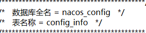

# Spring Cloud

搭建项目时，需要优先兼顾spring cloud的版本（148看完）

[查看官网的cloud版本](https://spring.io/projects/spring-cloud#overview)


找到要使用的cloud版本，查看spring boot版本


## 技术更换

### 服务注册中心

1. Eureka (停更 AP)

2. Zookeeper(CP)

   ```txt
   1. 需要安装软件
   ```

3. Consul(CP)

   ```tet
   1. 下载：https://www.consul.io/downloads
   2. 解压
   3. 启动命令：consul agent -dev
   4. 页面：localhost:8500
   ```

4. Nacos

### 服务调用

1. Ribbon 

2. LoadBalancer(代替Ribbon)

3. Feign(死了)

4. OpenFeign（自带Ribbon，自带负载均衡）

   ```txt
   1. 默认客户端等待1s，超过了就超时报错。
   2. OpenFeign 底层引入了Ribbon
   3. 配置客户端的ribbon超时时间
   ribbon:
     ReadTimeout: 5000 #建立连接所用时间（避免超时）
     ConnectTimeout: 5000 #连接后接口调用时间（避免超时）
   ```

   

### 服务熔断降级

1. Hystrix（停止更新，进入维护）
2. resilience4j
3. sentinel(alibaba)

### 服务网关

1. Zuul（死）
2. gateway

### 服务配置

1. Config(被代替)
2. Nacos

## 服务总线

1. Bus(被代替)
2. Nacos

### Alibaba

## Nacos

> 注意数据库的版本

https://github.com/alibaba/nacos

默认端口是8848 用户名和密码都是nacos

下载：


集群（3个或3个以上构成），MySQL数据库用来持久化数据（默认嵌入式数据库）config目录下脚本：nacos-mysql（创建数据库）

Mysql 集群（主从复制），Nginx 集群

## Sentinel

https://github.com/alibaba/Sentinel/releases/tag/1.8.1 下载

java -jar xxx.jar运行

默认端口号是8080

用户名和密码都是sentinel

## Seata 

处理分布式事务

github:https://github.com/seata/seata/releases/tag/v1.0.0


# 开始搭建

## Nacos

官网：https://nacos.io/en-us/

下载：https://github.com/alibaba/nacos/releases

启动：运行解压后bin目录下的startup脚本

关闭：运行解压后bin目录下的shutdown脚本

访问：http://localhost:8848/nacos

登录：用户名密码初始都是`nacos`

> 1.4.1 中的startup.cmd(startup.sh)脚本，默认是集群启动，需要修改其文件中的`MODE`
>
> ```cmd
> rem set MODE="cluster"
> set MODE="standalone"
> ```


### 数据持久化

将数据库存储到MySQL中（搭建Nacos集群时需要）。

1. 找到`conf`目录里的`nacos-mysql.sql`,根据脚本先创建对应的数据库`nacos_config`。

   

2. 直接复制文件内容，执行脚本。

   

3. 关闭Nacos服务，修改配置文件`application.properties`（先备份一份）

   1. 打开`application.properties`

   2. 找到文字内容：`Config Module Related Configurations`，修改它下面的配置

      ```properties
      spring.datasource.platform=mysql
      
      db.num=1
      db.url.0=jdbc:mysql://11.162.196.16:3306/nacos_devtest?characterEncoding=utf8&connectTimeout=1000&socketTimeout=3000&autoReconnect=true
      db.user=nacos_devtest
      db.password=youdontknow
      ```

      > 以上配置，配置文件中都已经注释好了，只需要删除注释，并适当的修改内容，如数据库url，用户名和密码即可
      >
      > ```properties
      > spring.datasource.platform=mysql
      > 
      > ### Count of DB:
      > db.num=1
      > 
      > ### Connect URL of DB:
      > db.url.0=jdbc:mysql://127.0.0.1:3306/nacos_config?characterEncoding=utf8&connectTimeout=1000&socketTimeout=3000&autoReconnect=true&useUnicode=true&useSSL=false&serverTimezone=UTC
      > db.user.0=yourusername
      > db.password.0=yourpassword
      > 
      > ### Connection pool configuration: hikariCP
      > db.pool.config.connectionTimeout=30000
      > db.pool.config.validationTimeout=10000
      > db.pool.config.maximumPoolSize=20
      > db.pool.config.minimumIdle=2
      > ```

   3. 测试，我们新创建一个用户(用户名和密码都是root)。

      1. 生产密码,官网的原文如下：

         > 1. 生成加密密码， 在`com.alibaba.nacos.console.utils.PasswordEncoderUtil.main`函数中，将 nacos 改成你要改成的密码，运行即可得到加密有算法。注意盐值是随机的，所以生成密码每次可能不一样，请不要担心。

         因为使用的是Spring Security，所以我们也可以自己引入spring security的包，自己生成，如下：

         ```java
         import org.springframework.security.crypto.bcrypt.BCryptPasswordEncoder;
         public class TestDemo {
             public static void main(String[] args) {
                 System.out.println(new BCryptPasswordEncoder().encode("root"));
             }
         }
         // $2a$10$SH8W0WUaiDG4psmZdMRmzOA4hZJxKfohFhhaFEfEBm2XYLxU3a9D6
         ```

      2. 创建用户名或者密码的时候，用指定用户名密码即可

         ```sql
         INSERT INTO users (username, password, enabled) VALUES ('root', '$2a$10$SH8W0WUaiDG4psmZdMRmzOA4hZJxKfohFhhaFEfEBm2XYLxU3a9D6', TRUE);
         INSERT INTO roles (username, role) VALUES ('nacos', 'ROLE_ADMIN');
         ```

      3. 登录测试：

         

         

      4. 成功

> 本次，我的数据库是`MySQL8.0.16`,在之前的Nacos版本，启动是会报错的。
>
> 好了，现在数据持久化我们就解决了，接下来我们需要进行集群的搭建。

### 集群搭建

> 注意：需要将启动脚本文件(startup.cmd/startup.sh)中的MODE修改为集群模式（cluster），单机模式是 ‘standalone’
>
> ```cmd
> set MODE="cluster"
> ```
>
> 或者在启动时指定 `-m` 选项带上参数
>
> ```cmd
> startup.cmd -m cluster
> ```

#### 配置集群配置文件

1. 在nacos的解压目录nacos/的conf目录下，有配置文件cluster.conf，请每行配置成ip:port。（请配置3个或3个以上节点）

> 将文件 `cluster.conf.example` 拷贝一份，改名叫`cluster.conf`, 其文件内容格式如下：
>
> ```tex
> 192.168.16.101:8847
> 192.168.16.101:8848
> 192.168.16.101:8849
> ```
>
> 上面我是在本机测试（资源有限）


2. 将windows的nacos文件复制三份，分别修改其下的application.properties文件的端口号，然后分别启动。（自己尝试了修改脚本，没改好）

3. 使用Nginx进行负载均衡

   ```conf
   upstream nacos_proxy{
       ip_hash; #每个请求按照ip的hash结果分配，同一个ip的访客固定访问一个后端服务器
       server 192.168.0.135:8847;
       server 192.168.0.135:8848;   
       server 192.168.0.135:8849;
   }	
   server {
       listen       8888;
       server_name  localhost;
   
   	location /nacos {
           proxy_pass http://nacos_proxy/nacos;
           proxy_set_header Host $host;
           proxy_set_header X-Forward-For $remote_addr;
       }
   }
   ```

3. 访问：http://127.0.0.1:8888/nacos/

   


