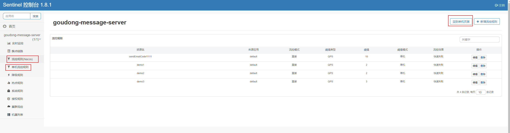

# Sentinel

[官方文档](https://sentinelguard.io/zh-cn/docs/introduction.html)

> 分布式系统的流量防卫兵


## dashboard 控制台

Sentinel 控制台包含如下功能:

- **查看机器列表以及健康情况**：收集 Sentinel 客户端发送的心跳包，用于判断机器是否在线。
- **监控 (单机和集群聚合)**：通过 Sentinel 客户端暴露的监控 API，定期拉取并且聚合应用监控信息，最终可以实现秒级的实时监控。
- **规则管理和推送**：统一管理推送规则。
- **鉴权**：生产环境中鉴权非常重要。这里每个开发者需要根据自己的实际情况进行定制。


### 下载dashboard

从 Sentinel 1.6.0 起，Sentinel 控制台引入基本的**登录**功能，默认用户名和密码都是 `sentinel`。可以参考 [鉴权模块文档](https://sentinelguard.io/zh-cn/docs/dashboard.html#鉴权) 配置用户名和密码。

+ 下载已经发布的 [releases 页面](https://github.com/alibaba/Sentinel/releases) 版本 

  > 注意：
  >
  > 启动时，需要自己指定一系列的参数，如端口号和项目名称等。这些参数都是以`-D` 开头，如下示例：
  >
  > ```bash
  > -Dserver.port=8080 
  > -Dcsp.sentinel.dashboard.server=localhost:8080 
  > -Dproject.name=sentinel-dashboard
  > -Dsentinel.dashboard.auth.username=sentinel
  > -Dsentinel.dashboard.auth.password=123456
  > ```
  >
  > 也可以修改配置，用压缩软件打开jar文件后修改 BOOT-INF\classes\application.properties 文件。
  >
  > ```properties
  > # 端口
  > server.port=8080
  > #用于指定 Spring Boot 服务端 session 的过期时间，如 7200 表示 7200 秒；60m 表示 60 分钟，默认为 30 分钟；
  > server.servlet.session.timeout=7200
  > # 控制台地址，用于客户端连接
  > csp.sentinel.dashboard.server=localhost:8080
  > # 项目名称
  > project.name=sentinel-dashboard
  > # 用于指定控制台的登录用户名为 sentinel； 如果省略这两个参数，默认用户和密码均为 sentinel；
  > auth.username=sentinel
  > # 指定控制台的登录密码为 123456；
  > auth.password=123456
  > ```

  

+ 下载源代码，然后`mvn clean package` 自己构建。 

  > 注意：
  >
  > 下载源代码后，进入 sentinel-dashboard 文件夹下，然后执行命令：`mvn clean package`


### 启动 dashboard

使用下面的命令启动：

```bash
java -Dserver.port=8080 -Dcsp.sentinel.dashboard.server=localhost:8080 -Dproject.name=sentinel-dashboard -jar sentinel-dashboard.jar
```

> 注：若您的应用为 Spring Boot 或 Spring Cloud 应用，您可以通过 Spring 配置文件来指定配置，详情请参考 [Spring Cloud Alibaba Sentinel 文档](https://github.com/spring-cloud-incubator/spring-cloud-alibaba/wiki/Sentinel)。


### 客户端接入控制台

使用两个步骤将应用连接到 dashboard

#### 引入JAR包

根据情况引入下面的jar

```xml
<!--1.使用spring cloud alibaba-->
<dependency>
    <groupId>com.alibaba.cloud</groupId>
    <artifactId>spring-cloud-starter-alibaba-sentinel</artifactId>
    <version>x.y.z</version>
</dependency>

<!--2.单独使用-->
<dependency>
    <groupId>com.alibaba.csp</groupId>
    <artifactId>sentinel-transport-simple-http</artifactId>
    <version>x.y.z</version>
</dependency>
```

####  配置启动参数

方式一：单独使用sentinel，启动时加入 JVM 参数 `-Dcsp.sentinel.dashboard.server=consoleIp:port` 指定控制台地址和端口。若启动多个应用，则需要通过 `-Dcsp.sentinel.api.port=xxxx` 指定客户端监控 API 的端口（默认是 8719）。

>  除了修改 JVM 参数，也可以通过配置文件取得同样的效果。更详细的信息可以参考 [启动配置项](https://sentinelguard.io/zh-cn/docs/startup-configuration.html)。

方式二：使用了spring cloud alibab ，可以直接修改配置文件

> 启动dashboard 控制台时指定了参数: `-Dcsp.sentinel.dashboard.server=localhost:8080`。

```yaml
spring:
  cloud:
     sentinel:
      transport:
        dashboard: localhost:8080 #配置Sentinel dashboard地址
        port: 8719 #默认端口，如果被占用会加一。用于连接dashboard
```

#### 触发客户端初始化

**确保客户端有访问量**，Sentinel 会在**客户端首次调用的时候**进行初始化，开始向控制台发送心跳包。

> 注意：您还需要根据您的应用类型和接入方式引入对应的 [适配依赖](https://sentinelguard.io/zh-cn/docs/open-source-framework-integrations.html)，否则即使有访问量也不能被 Sentinel 统计。


## 基本使用 - 资源与规则

[资源和规则](https://sentinelguard.io/zh-cn/docs/basic-api-resource-rule.html)

### 定义资源

#### 主流框架的默认适配

为了减少开发的复杂程度，我们对大部分的主流框架，例如 Web Servlet、Dubbo、Spring Cloud、gRPC、Spring WebFlux、Reactor 等都做了适配。您只需要引入对应的依赖即可方便地整合 Sentinel。可以参见：[主流框架的适配](https://sentinelguard.io/zh-cn/docs/open-source-framework-integrations.html)。

#### 抛出异常的方式定义资源

`SphU` 包含了 try-catch 风格的 API。用这种方式，当资源发生了限流之后会抛出 `BlockException`。这个时候可以捕捉异常，进行限流之后的逻辑处理。示例代码如下:

```java
// 1.5.0 版本开始可以利用 try-with-resources 特性
// 资源名可使用任意有业务语义的字符串，比如方法名、接口名或其它可唯一标识的字符串。
try (Entry entry = SphU.entry("resourceName")) {
  // 被保护的业务逻辑
  // do something here...
} catch (BlockException ex) {
  // 资源访问阻止，被限流或被降级
  // 在此处进行相应的处理操作
}
```

> **注意：** `SphU.entry(xxx)` 需要与 `entry.exit()` 方法成对出现，匹配调用，否则会导致调用链记录异常，抛出 `ErrorEntryFreeException` 异常。

#### 返回布尔值方式定义资源

`SphO` 提供 if-else 风格的 API。用这种方式，当资源发生了限流之后会返回 `false`，这个时候可以根据返回值，进行限流之后的逻辑处理。示例代码如下:

```java
// 资源名可使用任意有业务语义的字符串
if (SphO.entry("自定义资源名")) {
    // 务必保证finally会被执行
    try {
        /**
      * 被保护的业务逻辑
      */
    } finally {
        SphO.exit();
    }
} else {
    // 资源访问阻止，被限流或被降级
    // 进行相应的处理操作
}
```

#### 注解方式定义资源

Sentinel 支持通过 `@SentinelResource` 注解定义资源并配置 `blockHandler` 和 `fallback` 函数来进行限流之后的处理。示例：

```java
// 原本的业务方法.
@SentinelResource(blockHandler = "blockHandlerForGetUser")
public User getUserById(String id) {
    throw new RuntimeException("getUserById command failed");
}

// blockHandler 函数，原方法调用被限流/降级/系统保护的时候调用
public User blockHandlerForGetUser(String id, BlockException ex) {
    return new User("admin");
}
```

> 注意 `blockHandler` 函数会在原方法被限流/降级/系统保护的时候调用，而 `fallback` 函数会针对所有类型的异常。请注意 `blockHandler` 和 `fallback` 函数的形式要求，更多指引可以参见 [Sentinel 注解支持文档](https://sentinelguard.io/zh-cn/docs/annotation-support.html)。

#### 异步调用支持

Sentinel 支持异步调用链路的统计。在异步调用中，需要通过 `SphU.asyncEntry(xxx)` 方法定义资源，并通常需要在异步的回调函数中调用 `exit` 方法。以下是一个简单的示例：

```java
try {
    AsyncEntry entry = SphU.asyncEntry(resourceName);

    // 异步调用.
    doAsync(userId, result -> {
        try {
            // 在此处处理异步调用的结果.
        } finally {
            // 在回调结束后 exit.
            entry.exit();
        }
    });
} catch (BlockException ex) {
    // Request blocked.
    // Handle the exception (e.g. retry or fallback).
}
```


### 规则 的种类

**流量控制规则 (FlowRule)**、**熔断降级规则(DegradeRule)**、**系统保护规则 (SystemRule)**、**来源访问控制规则 (AuthorityRule)** 和 **热点参数规则(ParamFlowRule)**。

[详细见官网](https://sentinelguard.io/zh-cn/docs/basic-api-resource-rule.html)

## @SentinelResource 注解支持

[@SentinelResource 注解讲解](https://sentinelguard.io/zh-cn/docs/annotation-support.html)

> 注意：注解方式埋点不支持 private 方法。


## Gateway 网关限流

[网关限流](https://sentinelguard.io/zh-cn/docs/api-gateway-flow-control.html)

S从 1.6.0 版本开始，Sentinel 提供了 Spring Cloud Gateway 的适配模块，可以提供两种资源维度的限流：

- route 维度：即在 Spring 配置文件中配置的路由条目，资源名为对应的 routeId
- 自定义 API 维度：用户可以利用 Sentinel 提供的 API 来自定义一些 API 分组

1. 修改pom文件

   ```xml
   <!--sentinel-spring-cloud-gateway-adapter-->
   <dependency>
       <groupId>com.alibaba.csp</groupId>
       <artifactId>sentinel-spring-cloud-gateway-adapter</artifactId>
       <version>x.y.z</version>
   </dependency>
   ```

2. 注入实例

   > 使用时只需注入对应的 `SentinelGatewayFilter` 实例以及 `SentinelGatewayBlockExceptionHandler` 实例即可。比如：

```java
@Configuration
public class GatewayConfiguration {

    private final List<ViewResolver> viewResolvers;
    private final ServerCodecConfigurer serverCodecConfigurer;

    public GatewayConfiguration(ObjectProvider<List<ViewResolver>> viewResolversProvider,
                                ServerCodecConfigurer serverCodecConfigurer) {
        this.viewResolvers = viewResolversProvider.getIfAvailable(Collections::emptyList);
        this.serverCodecConfigurer = serverCodecConfigurer;
    }

    @Bean
    @Order(Ordered.HIGHEST_PRECEDENCE)
    public SentinelGatewayBlockExceptionHandler sentinelGatewayBlockExceptionHandler() {
        // Register the block exception handler for Spring Cloud Gateway.
        return new SentinelGatewayBlockExceptionHandler(viewResolvers, serverCodecConfigurer);
    }

    @Bean
    @Order(-1)
    public GlobalFilter sentinelGatewayFilter() {
        return new SentinelGatewayFilter();
    }

    @PostConstruct
    public void doInit() {
        initCustomizedApis();
        initGatewayRules();
        initBlockHandler();
    }

    /**
     * API 维度
     */
    private void initCustomizedApis() {
        Set<ApiDefinition> definitions = new HashSet<>();
        // 定义一组 api， apiName 就是sentinel的资源名称（goudong-message-server-code）
        ApiDefinition api1 = new ApiDefinition("goudong-message-server-code")
                .setPredicateItems(new HashSet<ApiPredicateItem>() {{
                    add(new ApiPathPredicateItem().setPattern("/api/message/code/**")
                            // 设置匹配方式，下面设置的是路径前缀匹配
                            .setMatchStrategy(SentinelGatewayConstants.URL_MATCH_STRATEGY_PREFIX));
                }});
        definitions.add(api1);
        GatewayApiDefinitionManager.loadApiDefinitions(definitions);
    }

    /**
     * route 维度
     */
    private void initGatewayRules() {

        Set<GatewayFlowRule> rules = new HashSet<>();

        // 资源名称，可以是网关中的 route 名称或者用户自定义的 API 分组名称。goudong-oauth2-server 为网关路由id
        rules.add(new GatewayFlowRule("goudong-oauth2-server")
                // resourceMode：规则是针对 API Gateway 的 route（RESOURCE_MODE_ROUTE_ID）还是用户在 Sentinel 中定义的 API 分组（RESOURCE_MODE_CUSTOM_API_NAME），默认是 route。
                .setResourceMode(SentinelGatewayConstants.RESOURCE_MODE_ROUTE_ID)
                // grade：限流指标维度，同限流规则的 grade 字段。(限流阈值类型，QPS 或线程数模式)
                .setGrade(RuleConstant.FLOW_GRADE_QPS)
                // count：限流阈值
                .setCount(1)
                // intervalSec：统计时间窗口，单位是秒，默认是 1 秒。
                .setIntervalSec(1)
                // controlBehavior：流量整形的控制效果，同限流规则的 controlBehavior 字段，目前支持快速失败和匀速排队两种模式，默认是快速失败。
                .setControlBehavior(RuleConstant.CONTROL_BEHAVIOR_DEFAULT)
                // burst：应对突发请求时额外允许的请求数目。
                .setBurst(2)
                // maxQueueingTimeoutMs：匀速排队模式下的最长排队时间，单位是毫秒，仅在匀速排队模式下生效。默认500ms
                .setMaxQueueingTimeoutMs(500)
                // paramItem：参数限流配置。若不提供，则代表不针对参数进行限流，该网关规则将会被转换成普通流控规则；否则会转换成热点规则。其中的字段：
                .setParamItem(new GatewayParamFlowItem()
                        // parseStrategy：从请求中提取参数的策略，目前支持提取来源 IP(PARAM_PARSE_STRATEGY_CLIENT_IP）、Host（PARAM_PARSE_STRATEGY_HOST）、任意 Header（PARAM_PARSE_STRATEGY_HEADER）和任意 URL 参数（PARAM_PARSE_STRATEGY_URL_PARAM）四种模式。
                        .setParseStrategy(SentinelGatewayConstants.PARAM_PARSE_STRATEGY_CLIENT_IP)
                        // fieldName：若提取策略选择 Header 模式或 URL 参数模式，则需要指定对应的 header 名称或 URL 参数名称。
                        .setFieldName("username")
                        // pattern：参数值的匹配模式，只有匹配该模式的请求属性值会纳入统计和流控；若为空则统计该请求属性的所有值。（1.6.2 版本开始支持）
                        .setPattern("admin")
                        // matchStrategy：参数值的匹配策略，目前支持精确匹配（PARAM_MATCH_STRATEGY_EXACT）、子串匹配（PARAM_MATCH_STRATEGY_CONTAINS）和正则匹配（PARAM_MATCH_STRATEGY_REGEX）。（1.6.2 版本开始支持）
                        .setMatchStrategy(SentinelGatewayConstants.PARAM_MATCH_STRATEGY_EXACT)
                )
        );
        // 手动加载网关规则
        GatewayRuleManager.loadRules(rules);
    }

    /**
     * 自定义限流异常处理
     * ResultSupport 为自定义的消息封装类，代码略
     */
    private void initBlockHandler() {
        GatewayCallbackManager.setBlockHandler(new BlockRequestHandler() {
            @Override
            public Mono<ServerResponse> handleRequest(ServerWebExchange serverWebExchange,
                                                      Throwable throwable) {
                return ServerResponse.status(HttpStatus.OK)
                        .contentType(MediaType.APPLICATION_JSON_UTF8)
                        .body(BodyInserters.fromObject(
                                Result.ofFail("限流")));
            }
        });
    }
}

```


## [动态规则扩展](https://github.com/alibaba/Sentinel/wiki/%E5%8A%A8%E6%80%81%E8%A7%84%E5%88%99%E6%89%A9%E5%B1%95)

### 规则

Sentinel 的理念是开发者只需要关注资源的定义，当资源定义成功后可以动态增加各种流控降级规则。Sentinel 提供两种方式修改规则：

- 通过 API 直接修改 (`loadRules`)
- 通过 `DataSource` 适配不同数据源修改

手动通过 API 修改比较直观，可以通过以下几个 API 修改不同的规则：

```java
FlowRuleManager.loadRules(List<FlowRule> rules); // 修改流控规则
DegradeRuleManager.loadRules(List<DegradeRule> rules); // 修改降级规则
```

手动修改规则（硬编码方式）一般仅用于测试和演示，生产上一般通过动态规则源的方式来动态管理规则。

### DataSource 扩展

上述 `loadRules()` 方法只接受内存态的规则对象，但更多时候规则存储在文件、数据库或者配置中心当中。`DataSource` 接口给我们提供了对接任意配置源的能力。相比直接通过 API 修改规则，实现 `DataSource` 接口是更加可靠的做法。**通过控制台设置规则后将规则推送到统一的规则中心，客户端实现** `ReadableDataSource` **接口端监听规则中心实时获取变更**

`DataSource` 扩展常见的实现方式有:

- **拉模式**：客户端主动向某个规则管理中心定期轮询拉取规则，这个规则中心可以是 RDBMS、文件，甚至是 VCS 等。这样做的方式是简单，缺点是无法及时获取变更；
- **推模式**：规则中心统一推送，客户端通过注册监听器的方式时刻监听变化，比如使用 [Nacos](https://github.com/alibaba/nacos)、Zookeeper 等配置中心。这种方式有更好的实时性和一致性保证。

Sentinel 目前支持以下数据源扩展：

- Pull-based: 动态文件数据源、[Consul](https://github.com/alibaba/Sentinel/tree/master/sentinel-extension/sentinel-datasource-consul), [Eureka](https://github.com/alibaba/Sentinel/tree/master/sentinel-extension/sentinel-datasource-eureka)
- Push-based: [ZooKeeper](https://github.com/alibaba/Sentinel/tree/master/sentinel-extension/sentinel-datasource-zookeeper), [Redis](https://github.com/alibaba/Sentinel/tree/master/sentinel-extension/sentinel-datasource-redis), [Nacos](https://github.com/alibaba/Sentinel/tree/master/sentinel-extension/sentinel-datasource-nacos), [Apollo](https://github.com/alibaba/Sentinel/tree/master/sentinel-extension/sentinel-datasource-apollo), [etcd](https://github.com/alibaba/Sentinel/tree/master/sentinel-extension/sentinel-datasource-etcd)


### 规则管理及推送

Sentinel 控制台同时提供简单的规则管理以及推送的功能。规则推送分为 3 种模式，包括 "原始模式"、"Pull 模式" 和"Push 模式"。

#### [原始模式](https://github.com/alibaba/Sentinel/wiki/在生产环境中使用-Sentinel#原始模式)

说明：API 将规则推送至客户端并直接更新到内存中，扩展写数据源（[`WritableDataSource`](https://github.com/alibaba/Sentinel/wiki/动态规则扩展)）

优点：简单，无任何依赖

缺点：不保证一致性；规则保存在内存中，重启即消失。严重不建议用于生产环境

#### [Pull 模式](https://github.com/alibaba/Sentinel/wiki/在生产环境中使用-Sentinel#Pull模式)

说明：扩展写数据源（[`WritableDataSource`](https://github.com/alibaba/Sentinel/wiki/动态规则扩展)）， 客户端主动向某个规则管理中心定期轮询拉取规则，这个规则中心可以是 RDBMS、文件 等

优点：简单，无任何依赖；规则持久化

缺点：不保证一致性；实时性不保证，拉取过于频繁也可能会有性能问题。

#### **[Push 模式](https://github.com/alibaba/Sentinel/wiki/在生产环境中使用-Sentinel#Push模式)**

说明：扩展读数据源（[`ReadableDataSource`](https://github.com/alibaba/Sentinel/wiki/动态规则扩展)），规则中心统一推送，客户端通过注册监听器的方式时刻监听变化，比如使用 Nacos、Zookeeper 等配置中心。这种方式有更好的实时性和一致性保证。**生产环境下一般采用 push 模式的数据源**

优点：规则持久化；一致性；快速

缺点：引入第三方依赖


## 推模式：使用 Nacos 配置规则

需要修改sentinel dashboard的源代码

### 流控规则

[参考自](https://blog.csdn.net/a1036645146/article/details/107844149?utm_medium=distribute.pc_relevant.none-task-blog-2%7Edefault%7EBlogCommendFromMachineLearnPai2%7Edefault-8.control&depth_1-utm_source=distribute.pc_relevant.none-task-blog-2%7Edefault%7EBlogCommendFromMachineLearnPai2%7Edefault-8.control)

#### 应用配置

应用需要引入jar依赖

```xml
<!--spring cloud Alibaba nacos 服务注册中心-->
<dependency>
    <groupId>com.alibaba.cloud</groupId>
    <artifactId>spring-cloud-starter-alibaba-nacos-discovery</artifactId>
    <optional>true</optional>
</dependency>
<!--spring cloud Alibaba nacos 服务配置中心-->
<dependency>
    <groupId>com.alibaba.cloud</groupId>
    <artifactId>spring-cloud-starter-alibaba-nacos-config</artifactId>
    <optional>true</optional>
</dependency>
<!--sentinel 流量防卫兵-->
<dependency>
    <groupId>com.alibaba.cloud</groupId>
    <artifactId>spring-cloud-starter-alibaba-sentinel</artifactId>
    <optional>true</optional>
</dependency>
<!--动态规则扩展 推模式：使用 Nacos 配置规则-->
<dependency>
    <groupId>com.alibaba.csp</groupId>
    <artifactId>sentinel-datasource-nacos</artifactId>
</dependency>
```

配置文件修改

```yaml
spring:
  application:
    name: goudong-message-server
  cloud:
    nacos:
      discovery:
        server-addr: localhost:8847 # nacos服务集群
#        namespace: 9e509ea9-70c5-40fa-aa00-95e30f4fff4b # 服务注册到该命名空间下，默认是public
      config:
        server-addr: localhost:8847 # nacos服务集群
#        namespace: 9e509ea9-70c5-40fa-aa00-95e30f4fff4b # 从该命名空间下拿配置，默认是public
#        group: DEFAULT_GROUP # 该组下，默认是 DEFAULT_GROUP
#        prefix: goudong-message-server # 配置中心的data-id 前缀，默认是应用名称${spring.application.name}
        file-extension: yml # 配置中心的data-id后缀 （properties | yml）
    sentinel:
      enabled: true #开启sentinel
      eager: true #服务启动直接建立心跳连接
      transport:
        dashboard: localhost:8080 #配置Sentinel dashboard地址
        port: 8719 #默认端口，如果被占用会加一
      datasource:
        # flow 是随意写的
        flow:
          nacos:
            server-addr: localhost:8847 #nacos 服务地址
            dataId: ${spring.application.name}-flow-rules #自定义的dataId
            groupId: SENTINEL_GROUP # 组id，默认是DEFAULT_GROUP
            namespace: sentinel-namespace #命名空间自定义，默认是public
            data-type: json # 数据类型选择json
            # com.alibaba.cloud.sentinel.datasource.RuleType 下的规则
            rule-type: flow # sentinel的规则
```

启动 Nacos ，创建对应的命名空间（sentinel-namespace）、配置。如图：

命名空间：


配置：


> ```properties
> resource：资源名，即限流规则的作用对象
> limitApp：流控针对的调用来源，若为 default 则不区分调用来源
> grade：限流阈值类型（QPS 或并发线程数）；0代表根据并发数量来限流，1代表根据QPS来进行流量控制
> count：限流阈值
> strategy：调用关系限流策略
> controlBehavior：流量控制效果（直接拒绝、Warm Up、匀速排队）
> clusterMode：是否为集群模式
> ```


启动 sentinel dashboard，查看控制台的**流控规则**：


> 可以看到，我们现在做到了将流控规则从 Nacos配置，然后推送给Sentinel 控制台。如需配置其它规则，只需要修改 拷贝再重复写一遍flow 并修改名字，将rule-type 修改成其它规则就可以了


#### Sentinel dashboard 配置

1. 下载源代码 [source code](https://github.com/alibaba/Sentinel/releases)

2. 修改 子工程`sentinel-dashboard` pom文件

   > pom: 注释test作用域
   >
   > ```xml
   > <!-- for Nacos rule publisher sample -->
   > <dependency>
   >     <groupId>com.alibaba.csp</groupId>
   >     <artifactId>sentinel-datasource-nacos</artifactId>
   >     <!--<scope>test</scope>-->
   > </dependency>
   > ```

3. 修改前端页面 `sentinel-dashboard\src\main\webapp\resources\app\scripts\directives\sidebar\sidebar.html`

   >现：（将流控规则的li删除然后复制到对应的位置即可）
   >
   >```html
   ><li ui-sref-active="active" ng-if="!entry.isGateway">
   >    <a ui-sref="dashboard.flow({app: entry.app})">
   >        <i class="glyphicon glyphicon-filter"></i>&nbsp;&nbsp;流控规则(Nacos)</a>
   ></li>
   ><li ui-sref-active="active" ng-if="!entry.isGateway">
   >    <a ui-sref="dashboard.flowV1({app: entry.app})">
   >        <i class="glyphicon glyphicon-filter"></i>&nbsp;&nbsp;单机流控规则</a>
   ></li>
   >```

4. 修改 `sentinel-dashboard`  **nacos** 相关的java 代码

   > a. 将目录`Sentinel-1.8.1\sentinel-dashboard\src\test\java\com\alibaba\csp\sentinel\dashboard\rule\nacos` 整个复制到 `Sentinel-1.8.1\sentinel-dashboard\src\main\java\com\alibaba\csp\sentinel\dashboard\rule\nacos`
   >
   > b. 修改流控控制器 `Sentinel-1.8.1\sentinel-dashboard\src\main\java\com\alibaba\csp\sentinel\dashboard\controller\v2\FlowControllerV2.java`
   >
   > 原：
   >
   > ```java
   > @Autowired
   > @Qualifier("flowRuleDefaultProvider")
   > private DynamicRuleProvider<List<FlowRuleEntity>> ruleProvider;
   > @Autowired
   > @Qualifier("flowRuleDefaultPublisher")
   > private DynamicRulePublisher<List<FlowRuleEntity>> rulePublisher;
   > ```
   >
   > 现：(将Default修改成Nacos，就是将注入的bean 修改成a步骤复制进来的bean)
   >
   > ```java
   > @Autowired
   > @Qualifier("flowRuleNacosProvider")
   > private DynamicRuleProvider<List<FlowRuleEntity>> ruleProvider;
   > @Autowired
   > @Qualifier("flowRuleNacosPublisher")
   > private DynamicRulePublisher<List<FlowRuleEntity>> rulePublisher;
   > ```
   >
   > 注意：
   >
   > - flowRuleNacosProvider，就是实现Nacos的限流规则配置拉取。
   > - flowRuleNacosPublisher，实现Nacos的配置推送。
   >
   > c. 修改Nacos的配置 `sentinel-dashboard\src\main\java\com\alibaba\csp\sentinel\dashboard\rule\nacos\NacosConfigUtil.java`
   >
   > 根据自己应用配置sentinel.datasource 的Nacos的值，进行修改：
   >
   > ```java
   > public final class NacosConfigUtil {
   >     public static final String GROUP_ID = "SENTINEL_GROUP";
   >     public static final String FLOW_DATA_ID_POSTFIX = "-flow-rules";
   > }
   > ```
   >
   > d. 修改`com.alibaba.csp.sentinel.dashboard.rule.nacos.NacosConfig` 配置Nacos服务信息。
   >
   > 原：
   >
   > ```java
   > @Bean
   > public ConfigService nacosConfigService() throws Exception {
   >     return ConfigFactory.createConfigService("localhost");
   > }
   > ```
   >
   > 现：（修改Nacos的服务配置和）
   >
   > ```java
   > @Bean
   > public ConfigService nacosConfigService() throws Exception {
   >     Properties properties = new Properties();
   >     properties.put(PropertyKeyConst.SERVER_ADDR, "127.0.0.1:8847");
   >     properties.put(PropertyKeyConst.NAMESPACE, "sentinel-namespace");
   >     return ConfigFactory.createConfigService(properties);
   > }
   > ```

5. 如果有需要可以修改配置文件再编译打包 `mvn clean package -DskipTests` (须在 sentinel-dashboard 工程目录下执行)

   > 可以配置以下值：
   >
   > ```properties
   > # 端口
   > server.port=8080
   > #用于指定 Spring Boot 服务端 session 的过期时间，如 7200 表示 7200 秒；60m 表示 60 分钟，默认为 30 分钟；
   > server.servlet.session.timeout=7200
   > # 控制台地址，用于客户端连接
   > csp.sentinel.dashboard.server=localhost:8080
   > # 项目名称
   > project.name=sentinel-dashboard
   > # 用于指定控制台的登录用户名为 sentinel； 如果省略这两个参数，默认用户和密码均为 sentinel；
   > auth.username=sentinel
   > # 指定控制台的登录密码为 123456；
   > auth.password=123456
   > ```

6. 启动 `java -jar sentinel-dashboard.jar`


启动后的页面如图：



> 此时，我们在新添加的`流控规则（Nacos）` 页面 新增的流控规则会被同步到Nacos的配置中心里面（命名空间 + dataId + GroupId 我们在Sentinel Dashboard 源代码中进行了配置）。这样就保证了配置的规则不会丢失。
>
> 我们还可以在保留的单机流控规则中进行新增，但是，在单机流控规则 进行新增或编辑规则是不会和Nacos同步！**但是** 在单机流控规则中，进行新增编辑的优先级要高于动态规则，这是测试比较有用。

