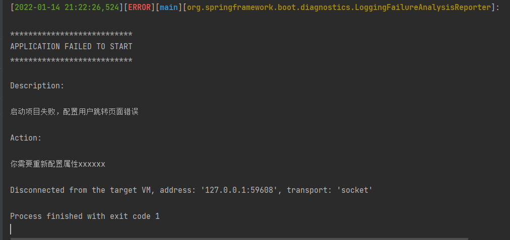

### FailureAnalyzer

[spring 官网](https://docs.spring.io/spring-boot/docs/2.3.12.RELEASE/reference/html/howto.html#howto-failure-analyzer)

我们可以自定义失败分析器，例如在我们配置自动配置时，可以快速的启动失败，并打印出比较友好的日志：



## 具体使用

### 1. 创建自定义异常

我这里只是简单的演示，实际应用中，应该添加一些属性，将其具体原因等信息记录好。

```java
public class UserPageException extends RuntimeException{
    public UserPageException(String message) {
        super(message);
    }
}
```


### 2. 创建自定义FailureAnalyzer

这里继承了AbstractFailureAnalyzer并将上面创建的异常定义成泛型，重写 analyze方法即可。

```java
public class UserPageSettingFailureAnalyzer extends AbstractFailureAnalyzer<UserPageException> {
    @Override
    protected FailureAnalysis analyze(Throwable rootFailure, UserPageException cause) {
        return new FailureAnalysis("启动项目失败，配置用户跳转页面错误", "你需要重新配置属性xxxxxx", cause);
    }
}
```

> 异常定义成方法，当出现UserPageException异常时


### 3. 注册自定义的FailureAnalyzer

必须在 META-INF/spring.factories 中注册 FailureAnalyzer 实现

```prop
org.springframework.boot.diagnostics.FailureAnalyzer=\
  com.goudong.user.analyzer.UserPageSettingFailureAnalyzer
```
