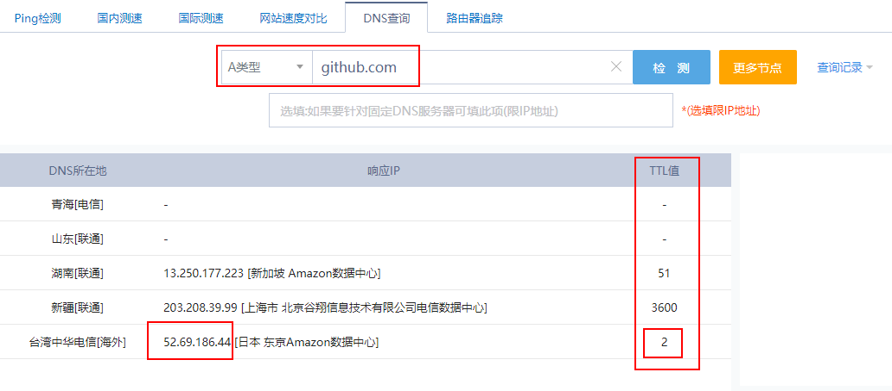

# git常见错误解决

## 10054

具体错误：fatal: unable to access 'https://github.com/GitHubFeiLong/goudong-web-ui.git/': OpenSSL SSL_read: Connection was reset, errno 10054

解决办法(局部仓库)：

```bash
git config http.sslVerify "false"
```

## 443

是由于连接超GitHhb超时了，解决办法就是修改dns：

方法一

1. 打开网站：https://fastly.net.ipaddress.com/

2. 查询两个域名（github.com、github.global.ssl.fastly.net ）分别对应IP地址（140.82.112.3、199.232.69.194）

3. 查询cdn（assets-cdn.github.com）

   ```
   185.199.108.153
   185.199.109.153
   185.199.110.153
   185.199.111.153
   ```

   

4. 编辑hosts文件（C:\Windows\System32\drivers\etc\hosts）

   ```
   199.232.69.194 github.global.ssl.fastly.net
   140.82.112.3 github.com
   185.199.108.153 assets-cdn.github.com
   185.199.109.153 assets-cdn.github.com
   185.199.110.153 assets-cdn.github.com
   185.199.111.153 assets-cdn.github.com
   ```

5. 刷新电脑DNS

   ```bash
   ipconfig/flushdns
   ```

> 注意：hosts文件不能多空格，多空行。
>
> 执行完成后，关闭浏览器重新打开GitHub


方法二

打开网站[Dns检测|Dns查询 - 站长工具](http://tool.chinaz.com/dns)， 查询 github.com



找到TTL值（响应时间）最短的IP地址。

编辑hosts文件

```
13.114.40.48 github.com
```


> 211.88.112.61 www.beian.gov.cn
> 140.82.114.6 api.github.com
> 185.199.108.153 assets-cdn.github.com
> 185.199.108.133 avatars.githubusercontent.com
> 185.199.111.133 avatars0.githubusercontent.com
> 185.199.108.133 camo.githubusercontent.com
> 185.199.108.133 cloud.githubusercontent.com
> 140.82.113.9 codeload.github.com
> 185.199.108.133 favicons.githubusercontent.com
> 140.82.112.3 gist.github.com
> 185.199.109.133 gist.githubusercontent.com
> 140.82.112.3 github.com
> 185.199.111.154 github.githubassets.com
> 185.199.108.133 marketplace-screenshots.githubusercontent.com
> 140.82.112.4 octocaptcha.com
> 185.199.110.133 raw.githubusercontent.com
> 185.199.108.133 repository-images.githubusercontent.com
> 140.82.114.13 uploads.github.com
> 185.199.108.133 user-images.githubusercontent.com