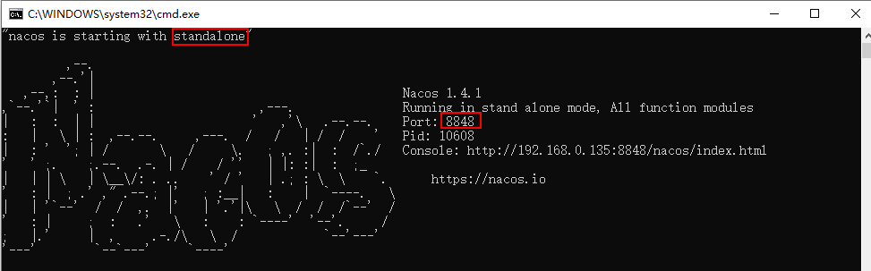

# Nacos

下载：https://github.com/alibaba/nacos/tags


> 集群（3个或3个以上构成），MySQL数据库用来持久化数据（默认嵌入式数据库）config目录下有创建表的sql脚本：nacos-mysql（需要自己创建数据库）
>

## 开始搭建

官网：https://nacos.io/en-us/

下载：https://github.com/alibaba/nacos/releases

启动：运行解压后bin目录下的startup脚本

关闭：运行解压后bin目录下的shutdown脚本

访问：http://localhost:8848/nacos

登录：用户名密码初始都是`nacos` 

> 1.4.1 中的startup.cmd(startup.sh)脚本，默认是集群启动，需要修改其文件中的`MODE`
>
> ```cmd
> rem set MODE="cluster"
> set MODE="standalone"
> ```




### 数据持久化

将数据库存储到MySQL中（搭建Nacos集群时需要）。

1. 找到`conf`目录里的`nacos-mysql.sql`,根据脚本先创建对应的数据库`nacos_config`。

   

2. 直接复制文件内容，执行脚本。

   

3. 关闭Nacos服务，修改配置文件`application.properties`（先备份一份）

   1. 打开`application.properties`

   2. 找到文字内容：`Config Module Related Configurations`，修改它下面的配置

      ```properties
      spring.datasource.platform=mysql
      
      db.num=1
      db.url.0=jdbc:mysql://11.162.196.16:3306/nacos_devtest?characterEncoding=utf8&connectTimeout=1000&socketTimeout=3000&autoReconnect=true
      db.user=nacos_devtest
      db.password=youdontknow
      ```

      > 以上配置，配置文件中都已经注释好了，只需要删除注释，并适当的修改内容，如数据库url，用户名和密码即可
      >
      > ```properties
      > spring.datasource.platform=mysql
      > 
      > ### Count of DB:
      > db.num=1
      > 
      > ### Connect URL of DB:
      > db.url.0=jdbc:mysql://127.0.0.1:3306/nacos_config?characterEncoding=utf8&connectTimeout=1000&socketTimeout=3000&autoReconnect=true&useUnicode=true&useSSL=false&serverTimezone=UTC
      > db.user.0=yourusername
      > db.password.0=yourpassword
      > 
      > ### Connection pool configuration: hikariCP
      > db.pool.config.connectionTimeout=30000
      > db.pool.config.validationTimeout=10000
      > db.pool.config.maximumPoolSize=20
      > db.pool.config.minimumIdle=2
      > ```

   3. 测试，我们新创建一个用户(用户名和密码都是root)。

      1. 生成密码,官网的原文如下：

         > 1. 生成加密密码， 在`com.alibaba.nacos.console.utils.PasswordEncoderUtil.main`函数中，将 nacos 改成你要改成的密码，运行即可得到加密有算法。注意盐值是随机的，所以生成密码每次可能不一样，请不要担心。

         因为使用的是Spring Security，所以我们也可以自己引入spring security的包，自己生成，如下：

         ```java
         import org.springframework.security.crypto.bcrypt.BCryptPasswordEncoder;
         public class TestDemo {
             public static void main(String[] args) {
                 System.out.println(new BCryptPasswordEncoder().encode("root"));
             }
         }
         // $2a$10$SH8W0WUaiDG4psmZdMRmzOA4hZJxKfohFhhaFEfEBm2XYLxU3a9D6
         ```

      2. 创建用户名或者密码的时候，用指定用户名密码即可

         ```sql
         INSERT INTO users (username, password, enabled) VALUES ('root', '$2a$10$SH8W0WUaiDG4psmZdMRmzOA4hZJxKfohFhhaFEfEBm2XYLxU3a9D6', TRUE);
         INSERT INTO roles (username, role) VALUES ('nacos', 'ROLE_ADMIN');
         ```

      3. 登录测试：

         

         

      4. 成功

> 本次，我的数据库是`MySQL8.0.16`,在之前的Nacos版本，启动是会报错的。
>
> 好了，现在数据持久化我们就解决了，接下来我们需要进行集群的搭建。

### 集群搭建

> 注意：需要将启动脚本文件(startup.cmd/startup.sh)中的MODE修改为集群模式（cluster），单机模式是 ‘standalone’
>
> ```cmd
> set MODE="cluster"
> ```
>
> 或者在启动时指定 `-m` 选项带上参数
>
> ```cmd
> startup.cmd -m cluster
> ```

#### 配置集群配置文件

1. 在nacos的解压目录nacos/的conf目录下，有配置文件cluster.conf，请每行配置成ip:port。（请配置3个或3个以上节点）

> 将文件 `cluster.conf.example` 拷贝一份，改名叫`cluster.conf`, 其文件内容格式如下：
>
> ```tex
> 192.168.16.101:8847
> 192.168.16.101:8848
> 192.168.16.101:8849
> ```
>
> 上面我是在本机测试（资源有限）


2. 将windows的nacos文件复制三份，分别修改其下的application.properties文件的端口号，然后分别启动。（自己尝试了修改脚本，没改好）

3. 使用Nginx进行负载均衡

   ```conf
   upstream nacos_proxy{
       ip_hash; #每个请求按照ip的hash结果分配，同一个ip的访客固定访问一个后端服务器
       server 192.168.0.135:8847;
       server 192.168.0.135:8848;   
       server 192.168.0.135:8849;
   }	
   server {
       listen       8888;
       server_name  localhost;
   
   	location /nacos {
           proxy_pass http://nacos_proxy/nacos;
           proxy_set_header Host $host;
           proxy_set_header X-Forward-For $remote_addr;
       }
   }
   ```

3. 访问：http://127.0.0.1:8888/nacos/

   

## 服务注册中心

​		将微服务，注册到nacos，其它微服务，可以通过openfeign进行访问其它服务接口。

### 步骤

1. pom.xml：

   ```xml
   <!--spring cloud Alibaba nacos 服务注册中心-->
   <dependency>
       <groupId>com.alibaba.cloud</groupId>
       <artifactId>spring-cloud-starter-alibaba-nacos-discovery</artifactId>
       <optional>true</optional>
   </dependency>
   ```

2. bootstrap.yml

   ```yaml
   spring:
     application:
       name: goudong-message-server
     cloud:
       nacos:
         discovery:
           server-addr: localhost:8847 # 默认端口是8848，我修改成8847了
   ```

3. 启动nacos：在nacos解压后的bin目录下，双击执行`startup.cmd` 或 `startup.sh`运行即可

4. 访问查看服务列表

   

5. 如果需要调用其他微服务的接口，需要开启服务发现，在启动类上添加注解 @EnableDiscoveryClient

   ```java
   @EnableDiscoveryClient
   @SpringBootApplication
   public class MessageApplication {
       public static void main(String[] args) {
           SpringApplication.run(MessageApplication.class, args);
       }
   }
   ```


## 服务配置中心

​		注意，需要将nacos 配置到resources目录下的`bootstrap.yml` 或 `bootstrap.properties` 文件中。使用配置中心，需要简单了解下命名空间和分组两个概念。

### 命名空间

 		命名空间，即namespace，namespace是nacos针对于企业级开发设计用来针对于不同环境的区分,比如正在企业开发时有测试环境,生产环境,等其他环境,为了保证不同环境配置实现隔离,提出了namespace的概念!
 	
 		nacos中存在一个默认的命名空间public,所有配置以及服务注册，在没有指定命名空间时都会默认从public这个命名空间拉取配置以及注册到该命名空间下的注册表中！！！

> 详细介绍 https://blog.csdn.net/leilei1366615/article/details/111405644

### 分组

​		前边已经划分了各个区域（`namespace`）了,那还来个分组，是啥意思呢？

​		简单！零食区中，薯片是放一个柜的吧！！糖是放一个柜的吧！！鲫鱼与鲫鱼是在一起的吧！！猪排与猪排是在一起的吧！ 这便是分组，实际上也是一个更细微的环境隔离机制罢了！！！

> 详细介绍 https://blog.csdn.net/leilei1366615/article/details/111405644

### 配置选项

```yaml
spring:
  profiles:
    active: dev # 指定运行环境
  application:
    name: goudong-message-server # 应用名称，微服务根据名称来做集群的负载均衡
  cloud:
    nacos:
      discovery:
        server-addr: localhost:8847 # nacos服务
        namespace: 9e509ea9-70c5-40fa-aa00-95e30f4fff4b # 服务注册到该命名空间下，默认是public
      config:
        server-addr: localhost:8847 # nacos服务
        namespace: 9e509ea9-70c5-40fa-aa00-95e30f4fff4b # 从该命名空间下拿配置，默认是public
        group: DEFAULT_GROUP # 该组下，默认是 DEFAULT_GROUP
        prefix: goudong-message-server # 配置中心的data-id 前缀，默认是应用名称,所以一般情况省略
        file-extension: yml # 配置中心的data-id后缀 （properties | yml）
```

### 步骤

1. pom.xml

   ```xml
    <!--spring cloud Alibaba nacos 服务配置中心-->
   <dependency>
       <groupId>com.alibaba.cloud</groupId>
       <artifactId>spring-cloud-starter-alibaba-nacos-config</artifactId>
       <optional>true</optional>
   </dependency>
   ```

2. bootstrap.yml

   ```yaml
   spring:
     application:
       name: goudong-message-server
     cloud:
       nacos:
         discovery:
           server-addr: localhost:8847 # nacos服务集群
         config:
           server-addr: localhost:8847 # nacos服务集群
           file-extension: yml # 配置中心的data-id后缀 （properties | yml）
   nacos:
     config: 1 # 等会需要检测的配置属性，必须要配置，不然启动会报错
   ```

3. ` @RefreshScope` 在需要注入配置属性的类，加上该注解

   ```java
   @RestController
   @RequestMapping("/api/message/code")
   @RefreshScope
   public class CodeController {
       @Value("${nacos.config}")
       private String config;
   
       @RequestMapping("/getValue")
       public String getValue() {
           return this.config;
       }
   }
   ```

4. 此时启动项目，访问该接口，会返回配置文件的 “1”。

5. 在nacos的配置管理中，找到配置列表，并新建一个配置

   

   > 注意：
   >
   > **Data ID** ：
   >
   > 格式：${val1}-${val2}.${val3}
   >
   > ${val1} =${ spring.cloud.nacos.config.prefix} = ${spring.application.name}
   >
   > ${val2} = ${spring.profiles.active}
   >
   > ${val3} = ${spring.cloud.nacos.config.file-extension} 
   >
   > 
   >
   > 例1如：`goudong-message-server-dev.yml`
   >
   > ```yaml
   > spring:
   >   profiles:
   >     active: dev
   >   application:
   >     name: goudong-message-server
   >   cloud:
   >     nacos:
   >       discovery:
   >         server-addr: localhost:8847
   >       config:
   >         server-addr: localhost:8847
   >         file-extension: yml # 配置中心的data-id后缀 （properties | yml）
   > ```
   >
   > 例2如：`goudong-message-server.yml`
   >
   > ```yaml
   > spring:
   >   application:
   >     name: goudong-message-server
   >   cloud:
   >     nacos:
   >       discovery:
   >         server-addr: localhost:8847
   >       config:
   >         server-addr: localhost:8847
   >         file-extension: yml # 配置中心的data-id后缀 （properties | yml）
   > ```
   >
   > 
   >
   > 分析：因为，${spring.application.name} = `goudong-message-server` ,所以可以不用再配置`spring.cloud.nacos.config.prefix`（当不同时，需要再配置）

6. 访问接口返回 `111` ，及完成配置。

> 需要将nacos的配置在 bootstrap.yml中配置好，不然配置中心不起作用
