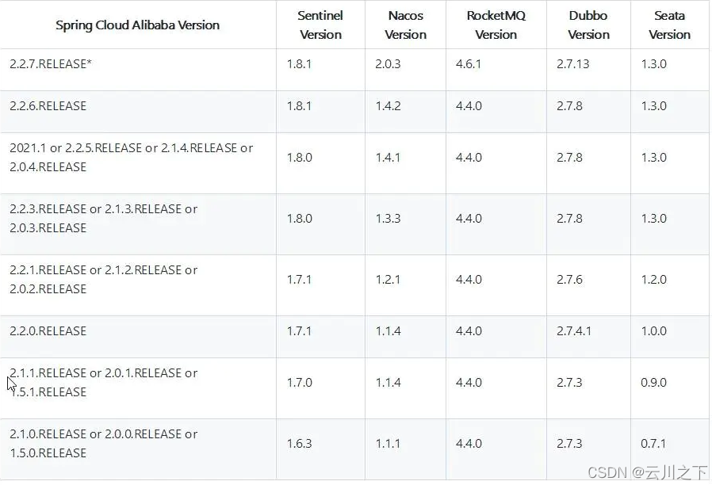

# Seata

[官网文档](https://seata.io/zh-cn/docs/overview/what-is-seata.html)

## 下载

下载时参考版本对照：



> 我这里演示1.8.1

下载地址：[github seata releases](https://github.com/seata/seata/releases)

## Windows安装

下载好指定版本的seata-server-xxx.zip后，将其解压。

### **目录结构**

我们可以使用`tree`命令查看目录结构。

+ bin：存放seata的启动脚本文件
+ conf：存放配置文件的目录
+ lib：存放其它依赖jar包

```cmd
D:\application\seata-server-1.3.0\seata>tree /f
卷 工作 的文件夹 PATH 列表
卷序列号为 09C1-B27D
D:.
│  LICENSE
│
├─bin
│      seata-server.bat
│      seata-server.sh
│
├─conf
│  │  file.conf
│  │  file.conf.example
│  │  logback.xml
│  │  README-zh.md
│  │  README.md
│  │  registry.conf
│  │
│  └─META-INF
│      └─services
│              io.seata.core.rpc.RegisterCheckAuthHandler
│              io.seata.core.store.db.DataSourceProvider
│              io.seata.server.coordinator.AbstractCore
│              io.seata.server.lock.LockManager
│              io.seata.server.session.SessionManager
│
└─lib
    │  animal-sniffer-annotations-1.17.jar
    │  ant-1.10.6.jar
    │  ant-launcher-1.10.6.jar
    │  antlr-2.7.7.jar
    │  antlr-runtime-3.4.jar
    │  aopalliance-1.0.jar
    │  apollo-client-1.1.0.jar
    │  apollo-core-1.1.0.jar
    │  archaius-core-0.7.6.jar
    │  asm-4.2.jar
    │  audience-annotations-0.5.0.jar
    │  bolt-1.4.6.jar
    │  cglib-3.1.jar
    │  checker-qual-2.5.2.jar
    │  commons-codec-1.11.jar
    │  commons-compress-1.19.jar
    │  commons-configuration-1.8.jar
    │  commons-dbcp2-2.7.0.jar
    │  commons-io-2.2.jar
    │  commons-jxpath-1.3.jar
    │  commons-lang-2.6.jar
    │  commons-lang3-3.4.jar
    │  commons-logging-1.2.jar
    │  commons-math-2.2.jar
    │  commons-pool-1.6.jar
    │  commons-pool2-2.4.2.jar
    │  compactmap-1.2.1.jar
    │  config-1.2.1.jar
    │  consul-api-1.4.2.jar
    │  dexx-collections-0.2.jar
    │  druid-1.1.12.jar
    │  error_prone_annotations-2.2.0.jar
    │  eureka-client-1.9.5.jar
    │  failureaccess-1.0.1.jar
    │  fastjson-1.2.60.jar
    │  fst-2.57.jar
    │  grpc-context-1.17.1.jar
    │  grpc-core-1.17.1.jar
    │  grpc-grpclb-1.17.1.jar
    │  grpc-netty-1.17.1.jar
    │  grpc-protobuf-1.17.1.jar
    │  grpc-protobuf-lite-1.17.1.jar
    │  grpc-stub-1.17.1.jar
    │  gson-2.8.2.jar
    │  guava-27.0.1-jre.jar
    │  guice-4.1.0.jar
    │  h2-1.4.181.jar
    │  hessian-3.3.6.jar
    │  hessian-4.0.63.jar
    │  HikariCP-3.4.3.jar
    │  httpclient-4.5.8.jar
    │  httpcore-4.4.11.jar
    │  j2objc-annotations-1.1.jar
    │  jackson-annotations-2.9.4.jar
    │  jackson-core-2.9.10.jar
    │  jackson-databind-2.9.9.jar
    │  javassist-3.21.0-GA.jar
    │  javax.inject-1.jar
    │  jcommander-1.72.jar
    │  jedis-3.2.0.jar
    │  jersey-apache-client4-1.19.1.jar
    │  jersey-client-1.19.1.jar
    │  jersey-core-1.19.1.jar
    │  jetcd-common-0.3.0.jar
    │  jetcd-core-0.3.0.jar
    │  jetcd-resolver-0.3.0.jar
    │  jettison-1.3.7.jar
    │  jline-0.9.94.jar
    │  joda-time-2.3.jar
    │  jsr305-3.0.2.jar
    │  jsr311-api-1.1.1.jar
    │  kryo-4.0.2.jar
    │  kryo-serializers-0.42.jar
    │  listenablefuture-9999.0-empty-to-avoid-conflict-with-guava.jar
    │  log4j-1.2.17.jar
    │  logback-classic-1.2.0.jar
    │  logback-core-1.2.0.jar
    │  lookout-api-1.5.2.jar
    │  minlog-1.3.0.jar
    │  nacos-api-1.2.0.jar
    │  nacos-client-1.2.0.jar
    │  nacos-common-1.2.0.jar
    │  netflix-eventbus-0.3.0.jar
    │  netflix-infix-0.3.0.jar
    │  netty-3.10.6.Final.jar
    │  netty-all-4.1.30.Final.jar
    │  objenesis-2.6.jar
    │  opencensus-api-0.17.0.jar
    │  opencensus-contrib-grpc-metrics-0.17.0.jar
    │  postgresql-42.1.4.jar
    │  proto-google-common-protos-1.0.0.jar
    │  protobuf-java-3.7.1.jar
    │  protobuf-java-util-3.5.1.jar
    │  reflectasm-1.11.3.jar
    │  registry-client-all-5.2.0.jar
    │  seata-common-1.3.0.jar
    │  seata-compressor-7z-1.3.0.jar
    │  seata-compressor-all-1.3.0.jar
    │  seata-compressor-bzip2-1.3.0.jar
    │  seata-compressor-gzip-1.3.0.jar
    │  seata-compressor-zip-1.3.0.jar
    │  seata-config-all-1.3.0.jar
    │  seata-config-apollo-1.3.0.jar
    │  seata-config-consul-1.3.0.jar
    │  seata-config-core-1.3.0.jar
    │  seata-config-etcd3-1.3.0.jar
    │  seata-config-nacos-1.3.0.jar
    │  seata-config-zk-1.3.0.jar
    │  seata-core-1.3.0.jar
    │  seata-discovery-all-1.3.0.jar
    │  seata-discovery-consul-1.3.0.jar
    │  seata-discovery-core-1.3.0.jar
    │  seata-discovery-custom-1.3.0.jar
    │  seata-discovery-etcd3-1.3.0.jar
    │  seata-discovery-eureka-1.3.0.jar
    │  seata-discovery-nacos-1.3.0.jar
    │  seata-discovery-redis-1.3.0.jar
    │  seata-discovery-sofa-1.3.0.jar
    │  seata-discovery-zk-1.3.0.jar
    │  seata-metrics-all-1.3.0.jar
    │  seata-metrics-api-1.3.0.jar
    │  seata-metrics-core-1.3.0.jar
    │  seata-metrics-exporter-prometheus-1.3.0.jar
    │  seata-metrics-registry-compact-1.3.0.jar
    │  seata-serializer-all-1.3.0.jar
    │  seata-serializer-fst-1.3.0.jar
    │  seata-serializer-hessian-1.3.0.jar
    │  seata-serializer-kryo-1.3.0.jar
    │  seata-serializer-protobuf-1.3.0.jar
    │  seata-serializer-seata-1.3.0.jar
    │  seata-server-1.3.0.jar
    │  servlet-api-2.5.jar
    │  servo-core-0.12.21.jar
    │  simpleclient-0.5.0.jar
    │  simpleclient_common-0.6.0.jar
    │  simpleclient_httpserver-0.6.0.jar
    │  slf4j-api-1.7.22.jar
    │  snakeyaml-1.23.jar
    │  sofa-common-tools-1.0.12.jar
    │  spotbugs-annotations-3.1.9.jar
    │  stax-api-1.0.1.jar
    │  stringtemplate-3.2.1.jar
    │  xmlpull-1.1.3.1.jar
    │  xpp3_min-1.1.4c.jar
    │  xstream-1.4.10.jar
    │  xz-1.8.jar
    │  zkclient-0.11.jar
    │  zookeeper-3.4.14.jar
    │
    └─jdbc
            mysql-connector-java-5.1.35.jar
            mysql-connector-java-8.0.19.jar
```

### 重要文件说明


```sql
CREATE TABLE `undo_log` (
  `id` bigint(20) NOT NULL AUTO_INCREMENT,
  `branch_id` bigint(20) NOT NULL,
  `xid` varchar(100) NOT NULL,
  `context` varchar(128) NOT NULL,
  `rollback_info` longblob NOT NULL,
  `log_status` int(11) NOT NULL,
  `log_created` datetime NOT NULL,
  `log_modified` datetime NOT NULL,
  `ext` varchar(100) DEFAULT NULL,
  PRIMARY KEY (`id`),
  UNIQUE KEY `ux_undo_log` (`xid`,`branch_id`)
) ENGINE=InnoDB AUTO_INCREMENT=1 DEFAULT CHARSET=utf8;
```

