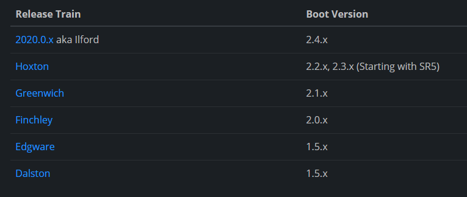
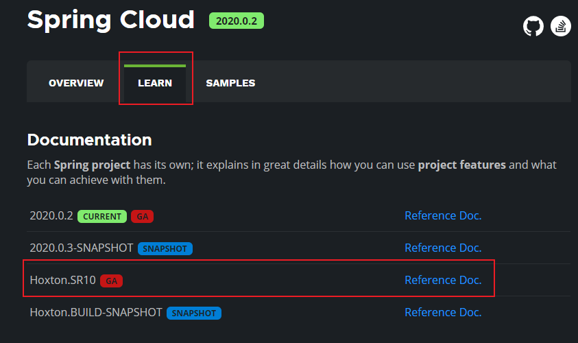
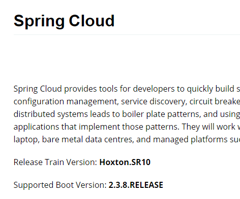

# Spring Cloud 大纲

搭建项目时，需要优先兼顾spring cloud的版本

[查看官网的cloud版本](https://spring.io/projects/spring-cloud#overview)



找到要使用的cloud版本，查看spring boot版本





## spring-cloud-alibaba版本

搭建spring-cloud和spring-cloud-alibaba时可以先看先版本对应[spring-cloud-alibaba/wiki/版本说明]([版本说明 · alibaba/spring-cloud-alibaba Wiki (github.com)](https://github.com/alibaba/spring-cloud-alibaba/wiki/版本说明))

每个 Spring Cloud Alibaba 版本及其自身所适配的各组件对应版本（经过验证，自行搭配各组件版本不保证可用）如下表所示（最新版本用*标记）：

| Spring Cloud Alibaba Version                              | Sentinel Version | Nacos Version | RocketMQ Version | Dubbo Version | Seata Version |
| --------------------------------------------------------- | ---------------- | ------------- | ---------------- | ------------- | ------------- |
| 2021.0.1.0*                                               | 1.8.3            | 1.4.2         | 4.9.2            | 2.7.15        | 1.4.2         |
| 2.2.7.RELEASE                                             | 1.8.1            | 2.0.3         | 4.6.1            | 2.7.13        | 1.3.0         |
| 2.2.6.RELEASE                                             | 1.8.1            | 1.4.2         | 4.4.0            | 2.7.8         | 1.3.0         |
| 2021.1 or 2.2.5.RELEASE or 2.1.4.RELEASE or 2.0.4.RELEASE | 1.8.0            | 1.4.1         | 4.4.0            | 2.7.8         | 1.3.0         |
| 2.2.3.RELEASE or 2.1.3.RELEASE or 2.0.3.RELEASE           | 1.8.0            | 1.3.3         | 4.4.0            | 2.7.8         | 1.3.0         |
| 2.2.1.RELEASE or 2.1.2.RELEASE or 2.0.2.RELEASE           | 1.7.1            | 1.2.1         | 4.4.0            | 2.7.6         | 1.2.0         |
| 2.2.0.RELEASE                                             | 1.7.1            | 1.1.4         | 4.4.0            | 2.7.4.1       | 1.0.0         |
| 2.1.1.RELEASE or 2.0.1.RELEASE or 1.5.1.RELEASE           | 1.7.0            | 1.1.4         | 4.4.0            | 2.7.3         | 0.9.0         |
| 2.1.0.RELEASE or 2.0.0.RELEASE or 1.5.0.RELEASE           | 1.6.3            | 1.1.1         | 4.4.0            | 2.7.3         | 0.7.1         |

## 毕业版本依赖关系(推荐使用)

下表为按时间顺序发布的 Spring Cloud Alibaba 以及对应的适配 Spring Cloud 和 Spring Boot 版本关系（由于 Spring Cloud 版本命名有调整，所以对应的 Spring Cloud Alibaba 版本号也做了对应变化）

| Spring Cloud Alibaba Version      | Spring Cloud Version        | Spring Boot Version |
| --------------------------------- | --------------------------- | ------------------- |
| 2021.0.1.0                        | Spring Cloud 2021.0.1       | 2.6.3               |
| 2.2.7.RELEASE                     | Spring Cloud Hoxton.SR12    | 2.3.12.RELEASE      |
| 2021.1                            | Spring Cloud 2020.0.1       | 2.4.2               |
| 2.2.6.RELEASE                     | Spring Cloud Hoxton.SR9     | 2.3.2.RELEASE       |
| 2.1.4.RELEASE                     | Spring Cloud Greenwich.SR6  | 2.1.13.RELEASE      |
| 2.2.1.RELEASE                     | Spring Cloud Hoxton.SR3     | 2.2.5.RELEASE       |
| 2.2.0.RELEASE                     | Spring Cloud Hoxton.RELEASE | 2.2.X.RELEASE       |
| 2.1.2.RELEASE                     | Spring Cloud Greenwich      | 2.1.X.RELEASE       |
| 2.0.4.RELEASE(停止维护，建议升级) | Spring Cloud Finchley       | 2.0.X.RELEASE       |
| 1.5.1.RELEASE(停止维护，建议升级) | Spring Cloud Edgware        | 1.5.X.RELEASE       |


## 技术更换

### 服务注册中心

1. Eureka (停更 AP)

2. Zookeeper(CP)

   ```txt
   1. 需要安装软件
   ```

3. Consul(CP)

   ```tet
   1. 下载：https://www.consul.io/downloads
   2. 解压
   3. 启动命令：consul agent -dev
   4. 页面：localhost:8500
   ```

4. Nacos(CP|AP)

### 服务调用

1. Ribbon 

2. LoadBalancer(代替Ribbon)

3. Feign(死了)

4. OpenFeign（自带Ribbon，自带负载均衡）

   ```txt
   1. 默认客户端等待1s，超过了就超时报错。
   2. OpenFeign 底层引入了Ribbon
   3. 配置客户端的ribbon超时时间
   ribbon:
     ReadTimeout: 5000 #建立连接所用时间（避免超时）
     ConnectTimeout: 5000 #连接后接口调用时间（避免超时）
   ```

   

### 服务熔断降级

1. Hystrix（停止更新，进入维护）
2. resilience4j
3. sentinel(alibaba)

### 服务网关

1. Zuul（死）
2. gateway

### 服务配置

1. Config(被代替)
2. Nacos

## 服务总线

1. Bus(被代替)
2. Nacos

## Seata 

处理分布式事务

github:https://github.com/seata/seata/releases/tag/v1.0.0

