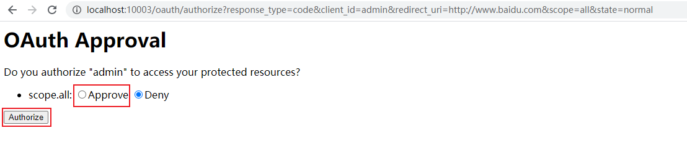
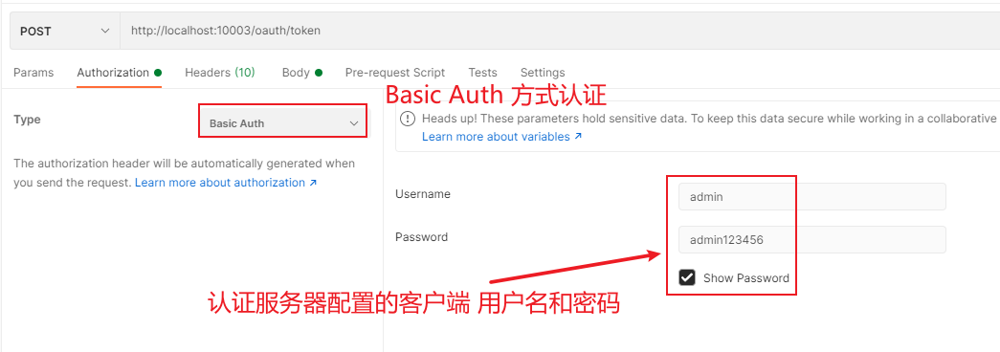
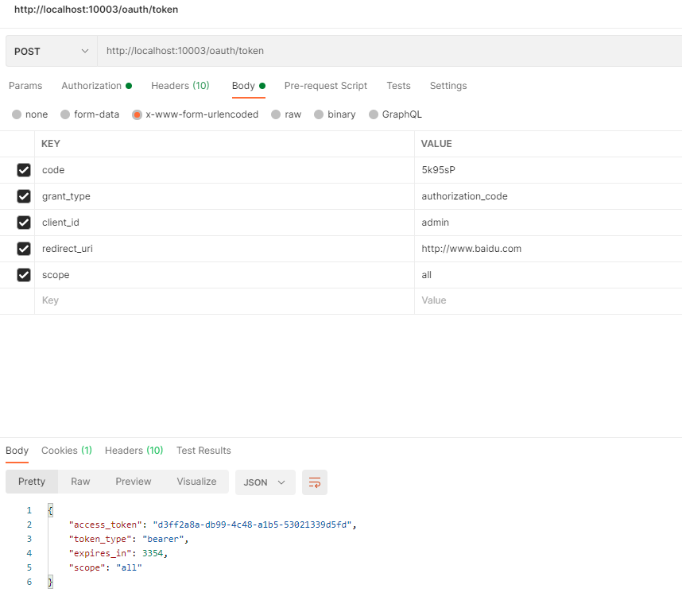
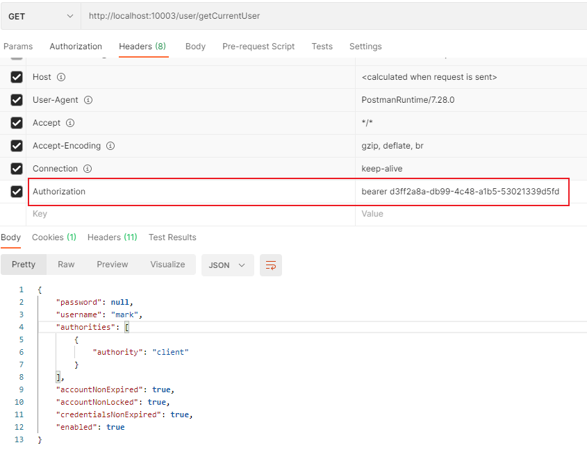

# Spring cloud Oauth2

先只记录下简单使用，因为也是在网上找的入门教程，所以还没太深入了解和使用。但是使用了微服务，打算还是使用它进行鉴权和认证。

## 创建项目

### 步骤一：创建maven项目

### 步骤二：引入maven依赖

```xml
<dependencies>
    <dependency>
        <groupId>org.springframework.boot</groupId>
        <artifactId>spring-boot-starter</artifactId>
    </dependency>
    <dependency>
        <groupId>org.springframework.boot</groupId>
        <artifactId>spring-boot-starter-web</artifactId>
    </dependency>
    <dependency>
        <groupId>org.springframework.cloud</groupId>
        <artifactId>spring-cloud-starter-oauth2</artifactId>
    </dependency>
    <dependency>
        <groupId>com.auth0</groupId>
        <artifactId>java-jwt</artifactId>
        <optional>true</optional>
    </dependency>
    <dependency>
        <groupId>cn.hutool</groupId>
        <artifactId>hutool-all</artifactId>
    </dependency>
</dependencies>
```

> 我使用的spring cloud，所以这些依赖的版本都在父项目内进行了统一管理，不用再定义。

### 步骤三：修改配置文件

```yaml
server:
  port: 10003
spring:
  application:
    name: oauth2-service
```

### 步骤四：创建启动类

```java
@SpringBootApplication
public class OaaApplication {
    public static void main(String[] args) {
        SpringApplication.run(OaaApplication.class, args);
    }
}
```

### 步骤五：创建SecurityConfig

```java
package com.goudong.oaa.config;

import org.springframework.context.annotation.Bean;
import org.springframework.context.annotation.Configuration;
import org.springframework.core.annotation.Order;
import org.springframework.security.authentication.AuthenticationManager;
import org.springframework.security.config.annotation.web.builders.HttpSecurity;
import org.springframework.security.config.annotation.web.configuration.EnableWebSecurity;
import org.springframework.security.config.annotation.web.configuration.WebSecurityConfigurerAdapter;
import org.springframework.security.crypto.bcrypt.BCryptPasswordEncoder;
import org.springframework.security.crypto.password.PasswordEncoder;

/**
 * SpringSecurity配置
 * Created by macro on 2019/10/8.
 */
@Configuration
@EnableWebSecurity
public class SecurityConfig extends WebSecurityConfigurerAdapter {

    @Bean
    public PasswordEncoder passwordEncoder() {
        return new BCryptPasswordEncoder();
    }

    @Bean
    @Override
    public AuthenticationManager authenticationManagerBean() throws Exception {
        return super.authenticationManagerBean();
    }

    @Override
    public void configure(HttpSecurity http) throws Exception {
        http.csrf()
                .disable()
                .authorizeRequests()
                .antMatchers("/oauth/**", "/login/**", "/logout/**")
                .permitAll()
                .anyRequest()
                .authenticated()
                .and()
                .formLogin()
                .permitAll();
    }
}

```

### 步骤六：创建UserService

用户登录时进行比较用户名密码

```java
package com.goudong.oaa.service;

import org.springframework.security.core.authority.AuthorityUtils;
import org.springframework.security.core.userdetails.User;
import org.springframework.security.core.userdetails.UserDetails;
import org.springframework.security.core.userdetails.UserDetailsService;
import org.springframework.security.core.userdetails.UsernameNotFoundException;
import org.springframework.security.crypto.password.PasswordEncoder;
import org.springframework.stereotype.Service;
import org.springframework.util.CollectionUtils;

import javax.annotation.PostConstruct;
import javax.annotation.Resource;
import java.util.ArrayList;
import java.util.List;
import java.util.stream.Collectors;

@Service
public class UserService implements UserDetailsService {
    private List<User> userList;
    @Resource
    private PasswordEncoder passwordEncoder;

    @PostConstruct
    public void initData() {
        String password = passwordEncoder.encode("123456");
        userList = new ArrayList<>();
        userList.add(new User("macro", password, AuthorityUtils.commaSeparatedStringToAuthorityList("admin")));
        userList.add(new User("andy", password, AuthorityUtils.commaSeparatedStringToAuthorityList("client")));
        userList.add(new User("mark", password, AuthorityUtils.commaSeparatedStringToAuthorityList("client")));
    }

    @Override
    public UserDetails loadUserByUsername(String username) throws UsernameNotFoundException {
        List<User> findUserList = userList.stream().filter(user -> user.getUsername().equals(username)).collect(Collectors.toList());
        if (!CollectionUtils.isEmpty(findUserList)) {
            return findUserList.get(0);
        } else {
            throw new UsernameNotFoundException("用户名或密码错误");
        }
    }
}

```

### 步骤七：创建认证服务器

```java
package com.goudong.oaa.config;

import com.goudong.oaa.service.UserService;
import org.springframework.context.annotation.Configuration;
import org.springframework.security.authentication.AuthenticationManager;
import org.springframework.security.crypto.password.PasswordEncoder;
import org.springframework.security.oauth2.config.annotation.configurers.ClientDetailsServiceConfigurer;
import org.springframework.security.oauth2.config.annotation.web.configuration.AuthorizationServerConfigurerAdapter;
import org.springframework.security.oauth2.config.annotation.web.configuration.EnableAuthorizationServer;
import org.springframework.security.oauth2.config.annotation.web.configurers.AuthorizationServerEndpointsConfigurer;

import javax.annotation.Resource;

/**
 * 认证服务器配置
 * Created by macro on 2019/9/30.
 */
@Configuration
@EnableAuthorizationServer
public class AuthorizationServerConfig extends AuthorizationServerConfigurerAdapter {

    @Resource
    private PasswordEncoder passwordEncoder;

    @Resource
    private AuthenticationManager authenticationManager;

    @Resource
    private UserService userService;

    /**
     * 使用密码模式需要配置
     */
    @Override
    public void configure(AuthorizationServerEndpointsConfigurer endpoints) {
        endpoints.authenticationManager(authenticationManager)
                .userDetailsService(userService);
    }

    @Override
    public void configure(ClientDetailsServiceConfigurer clients) throws Exception {
        clients.inMemory()
                .withClient("admin")//配置client_id
                .secret(passwordEncoder.encode("admin123456"))//配置client_secret
                .accessTokenValiditySeconds(3600)//配置访问token的有效期
                .refreshTokenValiditySeconds(864000)//配置刷新token的有效期
                .redirectUris("http://www.baidu.com")//配置redirect_uri，用于授权成功后跳转
                .scopes("all")//配置申请的权限范围
                .authorizedGrantTypes("authorization_code","password");//配置grant_type，表示授权类型
    }
}


```


### 步骤八：创建资源服务器

```java
package com.goudong.oaa.config;

import org.springframework.context.annotation.Configuration;
import org.springframework.security.config.annotation.web.builders.HttpSecurity;
import org.springframework.security.oauth2.config.annotation.web.configuration.EnableResourceServer;
import org.springframework.security.oauth2.config.annotation.web.configuration.ResourceServerConfigurerAdapter;

/**
 * 资源服务器配置
 * Created by macro on 2019/9/30.
 */
@Configuration
@EnableResourceServer
public class ResourceServerConfig extends ResourceServerConfigurerAdapter {

    @Override
    public void configure(HttpSecurity http) throws Exception {
        http.authorizeRequests()
                .anyRequest()
                .authenticated()
                .and()
                .requestMatchers()
                .antMatchers("/user/**");//配置需要保护的资源路径
    }
}

```


### 步骤九：创建控制器

```java
package com.goudong.oaa.controller;

import org.springframework.security.core.Authentication;
import org.springframework.web.bind.annotation.GetMapping;
import org.springframework.web.bind.annotation.RequestMapping;
import org.springframework.web.bind.annotation.RestController;

/**
 * Created by macro on 2019/9/30.
 */
@RestController
@RequestMapping("/user")
public class UserController {
    @GetMapping("/getCurrentUser")
    public Object getCurrentUser(Authentication authentication) {
        return authentication.getPrincipal();
    }
}

```


## 客户端使用

1. 浏览器访问 http://localhost:10003/oauth/authorize?response_type=code&client_id=admin&redirect_uri=http://www.baidu.com&scope=all&state=normal

   > 访问上述地址后，会跳转到登录页面登录。填写UserService中配置用户名和密码登录。

2. 登录成功后会跳转到一个页面，先选择Approve(Approve 批准，Deny 拒绝)，然后点击 Authorize(授权)

   

3. 页面重定向指定的百度首页，并有一个code参数(http://www.baidu.com/?code=1JEpbt&state=normal)

   

4. 复制code，请求接口获取token

   > 1. POST方式访问接口`http://localhost:10003/oauth/token`
   >
   > 2. 添加认证方式，选择Basic Auth 
   >
   >    
   >
   > 3. 添加请求参数
   >
   >    | KEY          | VALUE                |
   >    | ------------ | -------------------- |
   >    | code         | 5k95sP               |
   >    | grant_type   | authorization_code   |
   >    | client_id    | admin                |
   >    | redirect_uri | http://www.baidu.com |
   >    | scope        | all                  |
   >
   > 4. 请求后，获取到token字符串。
   >
   > 
   >
   > 6. 使用Token字符串，进行访问资源
   >
   >    

   

