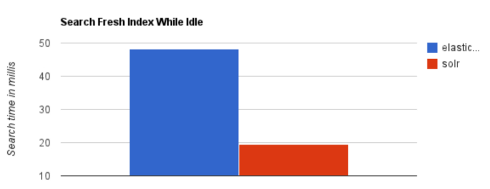
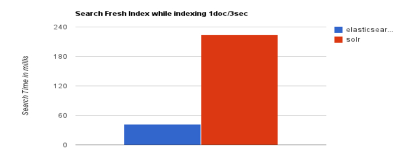

# 42-ElasticSearch快速入门实战

[中文文档](https://www.kancloud.cn/yiyanan/elasticsearch_7_6/1651637)

# 1.ElasticSearch简介

## 1.1 ElasticSearch（简称ES）

Elasticsearch是用Java开发并且是当前最流行的开源的企业级搜索引擎。
能够达到实时搜索，稳定，可靠，快速，安装使用方便。
客户端支持Java、.NET（C#）、PHP、Python、Ruby等多种语言。
官方网站: https://www.elastic.co/
下载地址：https://www.elastic.co/cn/start
创始人:Shay Banon（谢巴农）


**应用场景**


## 1.2 ElasticSearch与Lucene的关系

**Lucene**可以被认为是迄今为止最先进、性能最好的、功能最全的搜索引擎库（框架）但是想要使用Lucene，必须使用Java来作为开发语言并将其直接集成到你的应用中，并且Lucene的配置及使用非常复杂，你需要深入了解检索的相关知识来理解它是如何工作的。

**Lucene缺点：**
1）只能在Java项目中使用,并且要以jar包的方式直接集成项目中。
2）使用非常复杂，创建索引和搜索索引代码繁杂。
3）不支持集群环境，索引数据不同步（不支持大型项目）
4）索引数据如果太多就不行，索引库和应用所在同一个服务器,共同占用硬盘，共用空间少。

**上述Lucene框架中的缺点,ES全部都能解决。**

## 1.3 哪些公司在使用Elasticsearch

```txt
京东
携程
去哪儿
58同城
滴滴
今日头条
小米
哔哩哔哩
联想
GitHub
微软
Facebook
等等...
```

## 1.4 ES vs Solr比较

### 1.4.1 ES vs Solr 检索速度

当单纯的对已有数据进行搜索时，Solr更快。



当实时建立索引时, Solr会产生io阻塞，查询性能较差, Elasticsearch具有明显的优势。



大型互联网公司，实际生产环境测试，将搜索引擎从Solr转到 Elasticsearch以后的平均查询速度有了50倍的提升。


**总结：**
二者安装都很简单。
1、Solr 利用 Zookeeper 进行分布式管理，而Elasticsearch 自身带有分布式协调管理功能。
2、Solr 支持更多格式的数据，比如JSON、XML、CSV，而 Elasticsearch 仅支持json文件格式。
3、Solr 在传统的搜索应用中表现好于 Elasticsearch，但在处理实时搜索应用时效率明显低于 Elasticsearch。
4、Solr 是传统搜索应用的有力解决方案，但 Elasticsearch更适用于新兴的实时搜索应用。

### 1.4.2 ES vs 关系型数据库


# 2. Lucene全文检索框架

## 2.1 什么是全文检索

全文检索是指：

+ 通过一个程序扫描文本中的每一个单词，针对单词建立索引，并保存该单词在文本中的位置、以及出现的次数。
+ 用户查询时，通过之前建立好的索引来查询，将索引中单词对应的文本位置、出现的次数返回给用户，因为有了具体文本的位置，所以就可以将具体内容读取出来了.

## 2.2 分词原理之倒排索引


# 3.Elasticsearch中的核心概念

## 3.1 索引 index

一个索引就是一个拥有几分相似特征的文档的集合。比如说，可以有一个客户数据的索引，另一个产品目录的索引，还有一个订单数据的索引。

一个索引由一个名字来标识（必须全部是小写字母的），并且当我们要对对应于这个索引中的文档进行索引、搜索、更新和删除的时候，都要使用到这个名字。

## 3.2 映射 mapping

**ElasticSearch中的映射（Mapping）用来定义一个文档**
mapping是处理数据的方式和规则方面做一些限制，如某个字段的数据类型、默认值、分词器、是否被索引等等，这些都是映射里面可以设置的

## 3.3 字段Field

相当于是数据表的字段|列

## 3.4 字段类型 Type

每一个字段都应该有一个对应的类型，例如：Text、Keyword、Byte等

## 3.5 文档 document

一个文档是一个可被索引的基础信息单元，类似一条记录。文档以JSON（Javascript Object Notation）格式来表示；

## 3.6 集群 cluster

一个集群就是由一个或多个节点组织在一起，它们共同持有整个的数据，并一起提供索引和搜索功能

## 3.7 节点 node

一个节点是集群中的一个服务器，作为集群的一部分，它存储数据，参与集群的索引和搜索功能。

一个节点可以通过配置集群名称的方式来加入一个指定的集群。默认情况下，每个节点都会被安排加入到一个叫做“elasticsearch”的集群中。

这意味着，如果在网络中启动了若干个节点，并假定它们能够相互发现彼此，它们将会自动地形成并加入到一个叫做“elasticsearch”的集群。

在一个集群里，可以拥有任意多个节点。而且，如果当前网络中没有运行任何Elasticsearch节点，这时启动一个节点，会默认创建并加入一个叫做“elasticsearch”的集群。

## 3.8 分片和副本 shards&replicas

### 3.8.1 分片

+ 一个索引可以存储超出单个结点硬件限制的大量数据。比如，一个具有10亿文档的索引占据1TB的磁盘空间，而任一节点都没有这样大的磁盘空间；或者单个节点处理搜索请求，响应太慢
+ 为了解决这个问题，Elasticsearch提供了将索引划分成多份的能力，这些份就叫做分片。

+ 当创建一个索引的时候，可以指定你想要的分片的数量。
+ 每个分片本身也是一个功能完善并且独立的“索引”，这个“索引”可以被放置到集群中的任何节点上。

+ 分片很重要，主要有两方面的原因。
  1. 允许水平分割/扩展你的内容容量。
  2. 允许在分片之上进行分布式的、并行的操作，进而提高性能/吞吐量。

+ 至于一个分片怎样分布，它的文档怎样聚合回搜索请求，是完全由Elasticsearch管理的，对于作为用户来说，这些都是透明的。

### 3.8.2 副本

+ 在一个网络/云的环境里，失败随时都可能发生，在某个分片/节点不知怎么的就处于离线状态，或者由于任何原因消失了，这种情况下，有一个故障转移机制是非常有用并且是强烈推荐的。为此目的，Elasticsearch允许你创建分片的一份或多份拷贝，这些拷贝叫做副本分片，或者直接叫副本。

+ 副本之所以重要，有两个主要原因
  1) 在分片/节点失败的情况下，提供了高可用性。

  > 注意到复制分片从不与原/主要（original/primary）分片置于同一节点上是非常重要的

2) 扩展搜索量/吞吐量，因为搜索可以在所有的副本上并行运行

  > 每个索引可以被分成多个分片。一个索引有0个或者多个副本，一旦设置了副本，每个索引就有了主分片和副本分片，分片和副本的数量可以在索引创建的时候指定，在索引创建之后，可以在任何时候动态地改变副本的数量，但是不能改变分片的数量

# 4.安装Elasticsearch

## 4.1 安装Elasticsearch

### 4.1.1 创建普通用户

**ES不能使用root用户来启动，必须使用普通用户来安装启动**。这里我们创建一个普通用户，以及定义一些常规目录用于存放我们的数据文件以及安装包等。
**创建一个es专门的用户（必须）**

**使用root用户在服务器执行以下命令**

```bash
# 先创建组, 再创建用户:
# 1）创建 elasticsearch 用户组
[root@localhost ~]# groupadd elasticsearch

# 2）创建用户 tlbaiqi 并设置密码
[root@localhost ~]# useradd tlbaiqi
[root@localhost ~]# passwd tlbaiqi

# 3）# 创建es文件夹，
# 并修改owner为baiqi用户
[root@localhost ~]#mkdir ‐p /usr/local/es

# 4）用户es 添加到 elasticsearch 用户组
[root@localhost ~]# usermod ‐G elasticsearch tlbaiqi
[root@localhost ~]# chown ‐R tlbaiqi /usr/local/es/elasticsearch‐7.6.1

# 5）设置sudo权限
#为了让普通用户有更大的操作权限，我们一般都会给普通用户设置sudo权限，方便普通用户的操作
#三台机器使用root用户执行visudo命令然后为es用户添加权限
[root@localhost ~]# visudo

#在root ALL=(ALL) ALL 一行下面
#添加tlbaiqi用户 如下:
[root@localhost ~]#tlbaiqi ALL=(ALL) ALL

#添加成功保存后切换到tlbaiqi用户操作
[root@localhost ~]# su tlbaiqi
[tlbaiqi@localhost root]$
```

### 4.1.2 上传压缩包并解压

将es的安装包下载并上传到服务器的/user/local/es路径下，然后进行解压,使用tlbaiqi用户来执行以下操作，将es安装包上传到指定服务器，并使用es用户执行以下命令解压。

```bash
# 解压Elasticsearch
$su tlbaiqi
$cd /user/local/
$tar ‐zvxf elasticsearch‐7.6.1‐linux‐x86_64.tar.gz ‐C /usr/local/es/
```

### 4.1.3 修改配置文件

#### 4.1.3.1 修改elasticsearch.yml

**进入服务器使用baiqi用户**来修改配置文件

```bash
$cd /usr/local/es/elasticsearch‐7.6.1/config
$mkdir ‐p /usr/local/es/elasticsearch‐7.6.1/log
$mkdir ‐p /usr/local/es/elasticsearch‐7.6.1/data
$rm ‐rf elasticsearch.yml

$vim elasticsearch.yml
# 内容
cluster.name: baiqi‐es
node.name: node1
path.data: /usr/local/es/elasticsearch‐7.6.1/data
path.logs: /usr/local/es/elasticsearch‐7.6.1/log
network.host: 0.0.0.0
http.port: 9200
discovery.seed_hosts: ["服务器IP"]
cluster.initial_master_nodes: ["节点名"]
bootstrap.system_call_filter: false
bootstrap.memory_lock: false
http.cors.enabled: true
http.cors.allow-origin: "*"
```


#### 4.1.3.2 修改jvm.option

**修改jvm.option配置文件，调整jvm堆内存大小**
node1.baiqi.cn使用baiqi用户执行以下命令调整jvm堆内存大小，每个人根据自己服务器的内存大小来进行调整。

```bash
$cd /usr/local/es/elasticsearch‐7.6.1/config
$vim jvm.options
‐Xms2g
-Xmx2g
```

## 4.2 修改系统配置，解决启动时候的问题

由于现在使用普通用户来安装es服务，且es服务对服务器的资源要求比较多，包括内存大小，线程数等。所以我们需要给普通用户解开资源的束缚

### 4.2.1 普通用户打开文件的最大数限制

**问题错误信息描述：**
**max file descriptors [4096] for elasticsearch process likely too low,**
**increase to at least [65536]**
ES因为需要大量的创建索引文件，需要大量的打开系统的文件，所以我们需要解除linux系统当中打开文件最大数目的限制，不然ES启动就会抛错三台机器使用baiqi用户执行以下命令解除打开文件数据的限制。

**sudo vi /etc/security/limits.conf**
添加如下内容: 注意*不要去掉了

```txt
* soft nofile 65536
* hard nofile 131072
* soft nproc 2048
* hard nproc 4096
```

### 4.2.2 此文件修改后需要重新登录用户，才会生效

**普通用户启动线程数限制**
**问题错误信息描述**
**max number of threads [1024] for user [es] likely too low, increase to at**
**least [4096]**
修改普通用户可以创建的最大线程数
max number of threads [1024] for user [es] likely too low, increase to at
least [4096]原因：无法创建本地线程问题,用户最大可创建线程数太小解决方案：
修改90-nproc.conf 配置文件。
三台机器使用baiqi用户执行以下命令修改配置文件

```txt
Centos6
sudo vi /etc/security/limits.d/90‐nproc.conf
Centos7
sudo vi /etc/security/limits.d/20‐nproc.conf
```

找到如下内容：

```txt
* soft nproc 1024
#修改为
* soft nproc 4096
```

### 4.2.3 普通用户调大虚拟内存

**错误信息描述：**
**max virtual memory areas vm.max_map_count [65530] likely too low,**
**increase to at least [262144]**
调大系统的虚拟内存
原因：最大虚拟内存太小
每次启动机器都手动执行下。
三台机器执行以下命令

```txt
编辑 /etc/sysctl.conf，追加以下内容：vm.max_map_count=262144 保存后，执行：sysctl ‐p
```

> 备注：以上三个问题解决完成之后，重新连接secureCRT或者重新连接xshell生效

## 4.3 启动ES服务

三台机器使用baiqi用户执行以下命令启动es服务

```bash
nohup /usr/local/es/elasticsearch‐7.6.1/bin/elasticsearch 2>&1 &
```

启动成功之后jsp即可看到es的服务进程，并且访问页面

```txt
http://192.168.21.130:9200/?pretty
```

能够看到es启动之后的一些信息

> 注意：如果哪一台机器服务启动失败，那么就到哪一台机器的

```txt
/usr/local/es/elasticsearch‐7.6.1/log
```

这个路径下面去查看错误日志

```txt
关闭Linux防火墙
永久性生效，重启后不会复原
开启： chkconfig iptables on
关闭： chkconfig iptables off
即时生效，重启后复原
开启： service iptables start
关闭： service iptables stop
```

注意:启动ES的时候出现 Permission denied
原因：当前的用户没有对XX文件或目录的操作权限

# 5 客户端Kibana安装

[下载地址](https://www.elastic.co/cn/downloads/kibana)

> 注意版本要与elasticsearch一致

## 5.1客户端可以分为图形界面客户端,和代码客户端.

## 5.2 ES主流客户端Kibana，开放9200端口与图形界面客户端交互

1) 下载Kibana放之/usr/local/es目录中
2) 解压文件：tar -zxvf kibana-X.X.X-linux-x86_64.tar.gz
3) 进入/usr/local/es/kibana-X.X.X-linux-x86_64/config目录
4) 使用vi编辑器：vi kibana.yml

```txt
server.port: 5601
server.host: "服务器IP"
elasticsearch.hosts: ["http://IP:9200"] #这里是elasticsearch的访问地址
```

5）启动Kibana

```txt
/usr/local/es/kibana‐7.6.1‐linux‐x86_64/bin/kibana
```

6）访问Kibana

```txt
http://ip:5601/app/kibana
```


# 6 安装IK分词器

我们后续也需要使用Elasticsearch来进行中文分词，所以需要单独给Elasticsearch
安装IK分词器插件。以下为具体安装步骤：

## 6.1 下载Elasticsearch IK分词器

[ik](https://github.com/medcl/elasticsearch-analysis-ik/releases)

> 注意 es的目录不能出现中文或空格，不然这里要出现错误 
>
> ```txt
> java.security.AccessControlException: access denied
> ```

## 6.2 切换到baiqi用户，并在es的安装目录下/plugins创建ik

```txt
 mkdir ‐p /usr/local/es/elasticsearch‐7.6.1/plugins/ik
```

## 6.3 将下载的ik分词器上传并解压到该目录

```txt
cd /usr/local/es/elasticsearch‐7.6.1/plugins/ik
unzip elasticsearch‐analysis‐ik‐7.6.1.zip
```

## 6.4 重启Elasticsearch

## 6.5 测试分词效果

> `_analyze` 是一个API
>
> _analyze是Elasticsearch一个非常有用的API，它可以帮助你分析每一个field或者某个analyzer/tokenizer是如何分析和索引一段文字。
> 返回结果字段含义：
> token是一个实际被存储在索引中的词
> position指明词在原文本中是第几个出现的
> start_offset和end_offset表示词在原文本中占据的位置
>

```txt
POST _analyze
{
 "analyzer":"standard",
 "text":"我爱你中国"
}
```

> 单字拆分

```txt
POST _analyze
{
  "analyzer" : "whitespace",
  "text" : "床前 明月光"
}
```

> 按照空格拆分

```txt
POST _analyze
{
 "analyzer": "ik_smart",
 "text": "中华人民共和国"
}
#ik_smart:会做最粗粒度的拆分
```

```txt
POST _analyze
{
"analyzer":"ik_max_word",
"text":"我爱你中国"
}
#ik_max_word:会将文本做最细粒度的拆分
```

# 7、指定IK分词器作为默认分词器

ES的默认分词设置是**standard**，这个在中文分词时就比较尴尬了，会单字拆分，比如我搜索关键词“清华大学”，这时候会按“清”，“华”，“大”，“学”去分词，然后搜出来的都是些“清清的河水”，“中华儿女”，“地大物博”，“学而不思则罔”之类的莫名其妙的结果，这里我们就想把这个分词方式修改一下，于是呢，就想到了ik分词器，有两种**ik_smart**和**ik_max_word**。
**ik_smart会将“清华大学”整个分为一个词，而ik_max_word会将“清华大学”分为“清华大学”，“清华”和“大学”，按需选其中之一就可以了。**
修改默认分词方法(这里修改school_index索引的默认分词为：ik_max_word)：

```txt
PUT /school_index
{
  "settings" : {
    "index" : {
      "analysis.analyzer.default.type": "ik_max_word"
    }
  }
}
```

# 8.ES数据管理

## 8.1 ES数据管理概述

ES是面向文档(document oriented)的，这意味着它可以存储整个对象或文档(document)。然而它不仅仅是存储，还会索引(index)每个文档的内容使之可以被搜索。
在ES中，你可以对文档（而非成行成列的数据）进行索引、搜索、排序、过滤。
**ES使用JSON作为文档序列化格式。**
JSON现在已经被大多语言所支持，而且已经成为NoSQL领域的标准格式。
ES存储的一个员工文档的格式示例：

```txt
{
"email": "584614151@qq.com",
"name": "张三",
"age": 30,
"interests": [ "篮球", "健身" ]
}
```

## 8.2 基本操作

1) 创建索引
格式: PUT /索引名称

```txt
 举例: PUT /es_db
```

2) 查询索引
格式: GET /索引名称

```txt
举例: GET /es_db
```

3) 删除索引
格式: DELETE /索引名称

```txt
举例: DELETE /es_db
```

4) 添加文档
格式: PUT /索引名称/类型/id

```txt
举例:
PUT /es_db/_doc/1
{
"name": "张三",
"sex": 1,
"age": 25,
"address": "广州天河公园",
"remark": "java developer"
}

PUT /es_db/_doc/2
{
 "name": "李四",
 "sex": 1,
 "age": 28,
 "address": "广州荔湾大厦",
 "remark": "java assistant"
}

PUT /es_db/_doc/3
{
 "name": "rod",
 "sex": 0,
 "age": 26,
 "address": "广州白云山公园",
 "remark": "php developer"
}

PUT /es_db/_doc/4
{
 "name": "admin",
 "sex": 0,
 "age": 22,
 "address": "长沙橘子洲头",
 "remark": "python assistant"
}

PUT /es_db/_doc/5
{
 "name": "小明",
 "sex": 0,
 "age": 19,
 "address": "长沙岳麓山",
 "remark": "java architect assistant"
}
```

5) 修改文档

```txt
格式: PUT /索引名称/类型/id
举例:
PUT /es_db/_doc/1
{
 "name": "白起老师",
 "sex": 1,
 "age": 25,
 "address": "张家界森林公园",
 "remark": "php developer assistant"
}
```

6) 查询文档

```txt
格式: GET /索引名称/类型/id
举例: GET /es_db/_doc/1
```

7) 删除文档

```txt
格式: DELETE /索引名称/类型/id
举例: DELETE /es_db/_doc/1
```

# 9.Restful认识

Restful是一种面向资源的架构风格，可以简单理解为：使用URL定位资源，用HTTP动词（GET,POST,DELETE,PUT）描述操作。 基于Restful API ES和所有客户端的交互都是使用JSON格式的数据,其他所有程序语言都可以使用RESTful API，通过9200端口的与ES进行通信。
GET查询
PUT添加
POST修改
DELE删除

用户做crud

```txt
Get http://localhost:8080/employee/1

Get http://localhost:8080/employees
put http://localhost:8080/employee
{
}
delete http://localhost:8080/employee/1

Post http://localhost:8080/employee/1
{
}
```

使用Restful的好处：
透明性，暴露资源存在。
充分利用 HTTP 协议本身语义，不同请求方式进行不同的操作

# 10.查询操作

## 10.1 查询当前类型中的所有文档 _search

**格式**: `GET /索引名称/类型/_search`

**举例:** `GET /es_db/_doc/_search`

**对应SQL:**`SQL: select * from student`

## 10.2 条件查询,如要查询age等于28岁的 _search?q=*:***

**格式:** `GET /索引名称/类型/_search?q=*:***`
**举例:** `GET /es_db/_doc/_search?q=age:28`
**SQL:** `select * from student where age = 28`


## 10.3 范围查询,如要查询age在25至26岁之间的 _search?q=***[** TO **] 注意: TO 必须为大写

**格式:** `GET /索引名称/类型/_search?q=***[25 TO 26]`
**举例:** `GET /es_db/_doc/_search?q=age[25 TO 26]`
**SQL:**` select * from student where age between 25 and 26`


## 10.4 根据多个ID进行批量查询 _mget

**格式:** `GET /索引名称/类型/_mget`

**举例:** 

```txt
GET /es_db/_doc/_mget
{
"ids":["1","2"]
}
```

> 中括号内也可以不写双引号：[1,2]`

**SQL:** `select * from student where id in (1,2)`

## 10.5 查询年龄小于等于28岁的 :<=

**格式:** `GET /索引名称/类型/_search?q=age:<=**`

 **举例:** `GET /es_db/_doc/_search?q=age:<=28`

**SQL:**` select * from student where age <= 28`

## 10.6 查询年龄大于27的 :>

**格式:** `GET /索引名称/类型/_search?q=age:>**`
**举例:** `GET /es_db/_doc/_search?q=age:>27`
**SQL:**` select * from student where age > 27`


## 10.7 分页查询 from=*&size=*

**格式:**` GET /索引名称/类型/_search?q=age[25 TO 26]&from=0&size=1`
**举例:**` GET /es_db/_doc/_search?q=age[25 TO 26]&from=0&size=1`
**SQL:**` select * from student where age between 25 and 26 limit 0, 1`


## 10.8 对查询结果只输出某些字段 _source=字段,字段

**格式:** `GET /索引名称/类型/_search?_source=字段,字段`
**举例:**` GET /es_db/_doc/_search?_source=name,age`
**SQL:**` select name,age from student`

## 10.9 对查询结果排序 sort=字段:desc/asc

**格式:** `GET /索引名称/类型/_search?sort=字段:desc`
**举例:**` GET /es_db/_doc/_search?sort=age:desc`
**SQL:**` select * from student order by age desc`

第一天笔记：
文档：01 ElasticSearch笔记.note
链接：http://note.youdao.com/noteshare?id=83ea7925e0a1ae40e037f682b98d9874&sub=07E63083340A409683C3D8B26786C549