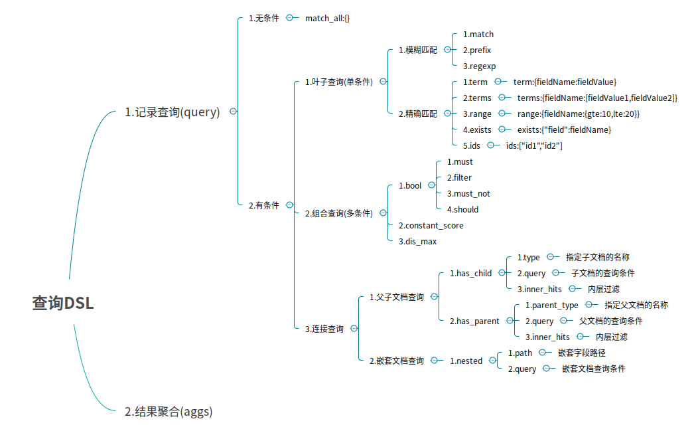
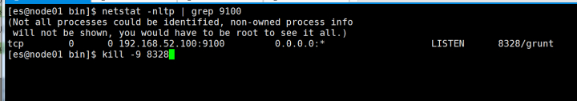

# 43-ElasticSearch核心语法与集群高可用实战演练

# 一、文档批量操作

这里多个文档是指，批量操作多个文档，搜索查询文档将在之后的章节讲解

## 1.批量获取文档数据

批量获取文档数据是通过`_mget`的API来实现的。

> 注意：只能使用`_id`;`_type`新版本可以省略

**(1) 在URL中不指定`index`和`type`**

+ 请求方式：`GET`
+ 请求地址：`_mget`
+ 功能说明 ： 可以通过ID批量获取不同index和type的数据
+ 请求参数：
  + docs : 文档数组参数
    + `_index` : 指定index
    + `_type` : 指定type
    + `_id` : 指定id
    + `_source` : 指定要查询的字段  

```json
GET _mget
{
 "docs": [
   {
     "_index": "es_db",
     "_type": "_doc",
     "_id": 1
   },
   {
     "_index": "es_db",
     "_type": "_doc",
     "_id": 2
    }
  ]
}
```

响应结果如下 ：

```json
{
  "docs": [
    {
      "_index": "es_db",
      "_type": "_doc",
      "_id": "1",
      "_version": 3,
      "_seq_no": 7,
      "_primary_term": 1,
      "found": true,
      "_source": {
        "name": "张三666",
        "sex": 1,
        "age": 25,
        "address": "广州天河公园",
        "remark": "java developer"
      }
    },
    {
      "_index": "es_db",
      "_type": "_doc",
      "_id": "2",
      "_version": 1,
      "_seq_no": 1,
      "_primary_term": 1,
      "found": true,
      "_source": {
        "name": "李四",
        "sex": 1,
        "age": 28,
        "address": "广州荔湾大厦",
        "remark": "java assistant"
      }
    }
  ]
}
```

**(2)在URL中指定index**

+ 请求方式：GET 
+ 请求地址：`/{{indexName}}/_mget`

+ 功能说明 ： 可以通过ID批量获取不同index和type的数据
+ 请求参数：
  + docs : 文档数组参数
    + `_index` : 指定index
    + `_type`: 指定type
    + `_id` : 指定id
    + `_source` : 指定要查询的字段

```json
GET /user/_mget
{
  "docs": [
    {
      "_type": "_doc",
      "_id": 3
    },
    {
      "_type": "_doc",
      "_id": 4
    }
  ]
}
```

**(3)在URL中指定index和type**

+ 请求方式：GET
+ 请求地址：`/{{indexName}}/{{typeName}}/_mget`
+ 功能说明 ： 可以通过ID批量获取不同index和type的数据
+ 请求参数：
  + docs : 文档数组参数
    + `_index` : 指定index
    + `_type` : 指定type
    + `_id` : 指定id
    + `_source` : 指定要查询的字段

```json
GET /es_db/_doc/_mget
{
  "docs": [
    {
      "_id": 1
    },
    {
      "_id": 2
    }
  ]
}
```

## 2.批量操作文档数据

批量对文档进行写操作是通过`_bulk`的API来实现的

+ 请求方式：POST

+ 请求地址：`_bulk`

+ 请求参数：通过`_bulk`操作文档，一般至少有两行参数(或偶数行参数)

  + 第一行参数为指定操作的类型及操作的对象(index,type和id)

  + 第二行参数才是操作的数据
    参数类似于：

    ```json
    {"actionName":{"_index":"indexName", "_type":"typeName","_id":"id"}}
    {"field1":"value1", "field2":"value2"}
    ```

+ actionName：表示操作类型，主要有create,index,delete和update

> 注意：不要使用格式化后的json！！！(不要换行)

**(1)批量创建文档create**

```json
POST _bulk
{"create": {"_index": "article","_type": "_doc","_id": 3}}
{"id": 3,"title": "白起老师1","content": "白起老师666","tags": ["java", "面向对"],"create_time":1554015482530}
{"create": {"_index": "article","_type": "_doc","_id": 4}}
{"id": 4,"title": "白起老师2", "content": "白起老师NB","tags": ["java","面向对像"],"create_time":1554015482530}
```

**(2)普通创建或全量替换index**

```json
POST _bulk
{"index":{"_index":"article", "_type":"_doc", "_id":3}}
{"id":3,"title":"图灵徐庶老师(一)","content":"图灵学院徐庶老师666","tags":["java", "面向对象"],"create_time":1554015482530}
{"index":{"_index":"article", "_type":"_doc", "_id":4}}
{"id":4,"title":"图灵诸葛老师(二)","content":"图灵学院诸葛老师NB","tags":["java", "面向对象"],"create_time":1554015482530}
```

+ 如果原文档不存在，则是创建
+ 如果原文档存在，则是替换(全量修改原文档)

**(3)批量删除delete**

```json
POST _bulk
{"delete":{"_index":"article", "_type":"_doc", "_id":3}}
{"delete":{"_index":"article", "_type":"_doc", "_id":4}}
```

**(4)批量修改update**

```json
POST _bulk
{"update":{"_index":"article", "_type":"_doc", "_id":3}}
{"doc":{"title":"ES大法必修内功"}}
{"update":{"_index":"article", "_type":"_doc", "_id":4}}
{"doc":{"create_time":1554018421008}}
```

# 二.DSL语言高级查询

## 1.Query DSL概述

Domain Specific Language 领域专用语言
Elasticsearch provides a ful1 Query DSL based on JSON to define
queries Elasticsearch提供了基于JSON的DSL来定义查询。
DSL由叶子查询子句和复合查询子句两种子句组成。



## 2.无查询条件

无查询条件是查询所有，默认是查询所有的，或者使用`match_all`表示所有

```json
GET /user/_doc/_search
 {
 "query":{
   "match_all":{}
  }
}
```

## 3.有查询条件

### 3.1 叶子条件查询(单字段查询条件)

#### 3.1.1 模糊匹配

模糊匹配主要是针对文本类型的字段，文本类型的字段会对内容进行分词，对查询时，也会对搜索条件进行分词，然后通过倒排索引查找到匹配的数据，模糊匹配主要通过match等参数来实现

+ `match` : 通过match关键词模糊匹配条件内容
+ `prefix` : 前缀匹配
+ `regexp` : 通过正则表达式来匹配数据

**match的复杂用法**

match条件还支持以下参数：

+ `query` : 指定匹配的值
+ `operator` : 匹配条件类型
  + `and` : 条件分词后都要匹配
  + `or` : 条件分词后有一个匹配即可(默认)
+ `minmum_should_match` : 指定最小匹配的数量

#### 3.1.2 精确匹配

+ `term` : 单个条件相等
+ `terms` : 单个字段属于某个值数组内的值
+ `range` : 字段属于某个范围内的值
+ `exists` : 某个字段的值是否存在
+ `ids` : 通过ID批量查询


### 3.2 组合条件查询(多条件查询)

组合条件查询是将叶子条件查询语句进行组合而形成的一个完整的查询条件。

+ `bool` : 各条件之间有`and`,`or`或`not`的关系
  + `must` : 各个条件都必须满足，即各条件是and的关系
  + `should` : 各个条件有一个满足即可，即各条件是or的关系
  + `must_not` : 不满足所有条件，即各条件是not的关系
  + `filter` : 不计算相关度评分，它不计算`_score`即相关度评分，效率更高
  + `constant_score` : 不计算相关度评分

**must/filter/shoud/must_not** 等的子条件是通过 term/terms/range/ids/exists/match 等叶子条件为参数的

> 注：以上参数，当只有一个搜索条件时，`must`等对应的是一个对象，当是多个条件时，对应的是一个数组 

### 3.3 连接查询(多文档合并查询)

+ 父子文档查询：`parent/child`
+ 嵌套文档查询: `nested`

### 3.4 DSL查询语言中存在两种：查询DSL（query DSL）和过滤DSL（filter DSL）

它们两个的区别如下图：


**query DSL**
在查询上下文中，查询会回答这个问题——“这个文档匹不匹配这个查询，它的相关度高么？”

如何验证匹配很好理解，如何计算相关度呢？ES中索引的数据都会存储一个`_score`分值，分值越高就代表越匹配。另外关于某个搜索的分值计算还是很复杂的，因此也需要一定的时间。

**filter DSL**
在过滤器上下文中，查询会回答这个问题——“这个文档匹不匹配？”

答案很简单，是或者不是。它不会去计算任何分值，也不会关心返回的排序问题，因此效率会高一点。

过滤上下文 是在使用filter参数时候的执行环境，比如在`bool`查询中使用`must_not`或者`filter`

另外，经常使用过滤器，ES会自动的缓存过滤器的内容，这对于查询来说，会提高很多性能。


一些过滤的情况：

### 3.5 Query方式查询:案例

+ 根据名称精确查询姓名 `term`,`term`查询不会对字段进行分词查询，会采用精确匹配

  > 注意: 采用term精确查询, 查询字段映射类型属于为keyword.

  举例:

  ```sql
  POST /es_db/_doc/_search
  {
   "query": {
     "term": {
       "name": "admin"
     }
    }
  }
  ```

  ```sql
  SQL: select * from student where name = 'admin'
  ```

+ 根据备注信息模糊查询 match, match会根据该字段的分词器，进行分词查询
  举例:

  ```json
  POST /es_db/_doc/_search
  {
   "from": 0,
   "size": 2,
   "query": {
      "match": {
         "address": "广州"
       }
    }
  }
  ```

  ```sql
  SQL: select * from user where address like '%广州%' limit 0, 2
  ```

+ 多字段模糊匹配查询与精准查询 `multi_match`

  ```json
  POST /es_db/_doc/_search
  {
   "query":{
   "multi_match":{
     "query":"张三",
     "fields":["address","name"]
    }
   }
  }
  ```

  ```sql
  SQL: select * from student where name like '%张三%' or address like '%张
  三%'
  ```

  

+ 未指定字段条件查询 query_string , 含 AND 与 OR 条件

  ```json
  POST /es_db/_doc/_search
  {
    "query": {
      "query_string": {
        "query": "(广州) OR 长沙"
      }
    }
  }
  ```

+ 指定字段条件查询 query_string , 含 AND 与 OR 条件

  ```json
  POST /es_db/_doc/_search
  {
    "query": {
      "query_string": {
        "query": "admin OR 长沙",
        "fields": [
          "name",
          "address"
        ]
      }
    }
  }
  ```

+ 范围查询

  > 注：json请求字符串中部分字段的含义
  > range：范围关键字
  > gte 大于等于
  > lte 小于等于
  > gt 大于
  > lt 小于
  > now 当前时间

  ```json
  POST /es_db/_doc/_search
  {
    "query": {
      "range": {
        "age": {
          "gte": 25,
          "lte": 28
        }
      }
    }
  }
  ```

  ```sql
  SQL: select * from user where age between 25 and 28
  ```

+ 分页、输出字段、排序综合查询

  ```json
  
  POST /es_db/_doc/_search
  {
    "query": {
      "range": {
        "age": {
          "gte": 25,
          "lte": 28
        }
      }
    },
    "from": 0,
    "size": 2,
    "_source": [
      "name",
      "age",
      "book"
    ],
    "sort": {
      "age": "desc"
    }
  }
  ```

  ### 3.6 Filter过滤器方式查询

  Filter过滤器方式查询，它的查询不会计算相关性分值，也不会对结果进行排序, 因此效率会高一点，查询的结果可以被缓存。

  Filter Context 对数据进行过滤：

  ```json
  POST /es_db/_doc/_search
  {
    "query": {
      "bool": {
        "filter": {
          "term": {
            "age": 25
          }
        }
      }
    }
  }
  ```

  

## 总结:

1. match
match：模糊匹配，需要指定字段名，但是输入会进行分词，比如"hello world"会进行拆分为hello和world，然后匹配，如果字段中包含hello或者world，或者都包含的结果都会被查询出来，也就是说match是一个部分匹配的模糊查询。查询条件相对来说比较宽松。
2. term
term: 这种查询和match在有些时候是等价的，比如我们查询单个的词hello，那么会和match查询结果一样，但是如果查询"hello world"，结果就相差很大，因为这个输入不会进行分词，就是说查询的时候，是查询字段分词结果中是否有"hello world"的字样，而不是查询字段中包含"hello world"的字样。当保存数据"hello world"时，elasticsearch会对字段内容进行分词，"hello world"会被分成hello和world，不存在"hello world"，因此这里的查询结果会为空。这也是term查询和match的区别。
3. match_phase
match_phase：会对输入做分词，但是需要结果中也包含所有的分词，而且顺序要求一样。以"hello world"为例，要求结果中必须包含hello和world，而且还要求他们是连着的，顺序也是固定的，hello that word不满足，world hello也不满足条件。
4. query_string
query_string：和match类似，但是match需要指定字段名，query_string是在所有字段中搜索，范围更广泛。

# 三.文档映射

## 1.ES中映射可以分为动态映射和静态映射

**动态映射：**
在关系数据库中，需要事先创建数据库，然后在该数据库下创建数据表，并创建表字段、类型、长度、主键等，最后才能基于表插入数据。而Elasticsearch中不需要定义Mapping映射（即关系型数据库的表、字段等），在文档写入Elasticsearch时，会根据文档字段自动识别类型，这种机制称之为动态映射。**动态映射规则如下：**


**静态映射：**
静态映射是在Elasticsearch中也可以事先定义好映射，包含文档的各字段类型、分词器等，这种方式称之为静态映射。

## 2 动态映射

### 2.1 删除原创建的索引

```txt
DELETE /es_db
```

### 2.2 创建索引

```txt
PUT /es_db
```

### 2.3 创建文档(ES根据数据类型, 会自动创建映射)

```txt
PUT /es_db/_doc/1
{
  "name": "Jack",
  "sex": 1,
  "age": 25,
  "book": "java入门至精通",
  "address": "广州小蛮腰"
}
```


### 2.4 获取文档映射

```txt
GET /es_db/_mapping
```

## 3 静态映射

### 3.1 删除原创建的索引

```txt
DELETE /es_db
```

### 3.2 创建索引并设置文档映射

```txt

PUT /es_db
{
  "mappings": {
    "properties": {
      "name": {
        "type": "keyword",
        "index": true,
        "store": true
      },
      "sex": {
        "type": "integer",
        "index": true,
        "store": true
      },
      "age": {
        "type": "integer",
        "index": true,
        "store": true
      },
      "book": {
        "type": "text",
        "index": true,
        "store": true
      },
      "address": {
        "type": "text",
        "index": true,
        "store": true
      }
    }
  }
}
```

### 3.3 根据静态映射创建文档

```txt
PUT /es_db/_doc/1
{
  "name": "Jack",
  "sex": 1,
  "age": 25,
  "book": "elasticSearch入门至精通",
  "address": "广州车陂"
}
```

### 3.4 获取文档映射

```txt
GET /es_db/_mapping
```

# 四.核心类型（Core datatype）

+ 字符串：string，string类型包含 **text** 和 **keyword**。

+ text：该类型被用来索引长文本，在创建索引前会将这些文本进行分词，转化为词的组合，建立索引；允许es来检索这些词，text类型不能用来排序和聚合。

+ keyword：该类型不能分词，可以被用来检索过滤、排序和聚合，keyword类型不可用text进行分词模糊检索。

+ 数值型：**long、integer、short、byte、double、float**

+ 日期型：**date**

+ 布尔型：**boolean**

  

# 五.keyword 与 text 映射类型的区别

将 book 字段设置为 keyword 映射 （只能精准查询, 不能分词查询，能聚合、排序）

```txt

POST /es_db/_doc/_search
{
  "query": {
    "term": {
      "book": "elasticSearch入门至精通"
    }
  }
}
```

将 book 字段设置为 text 映射能模糊查询, 能分词查询，不能聚合、排序）

```txt

POST /es_db/_doc/_search{
  "query": {
    "match": {
      "book": "elasticSearch入门至精通"
    }
  }
}
```

# 六.创建静态映射时指定text类型的ik分词器

## 1.设置ik分词器的文档映射

先删除之前的es_db;再创建新的es_db;定义ik_smart的映射

```txt
PUT /es_db
{
  "mappings": {
    "properties": {
      "name": {
        "type": "keyword",
        "index": true,
        "store": true
      },
      "sex": {
        "type": "integer",
        "index": true,
        "store": true
      },
      "age": {
        "type": "integer",
        "index": true,
        "store": true
      },
      "book": {
        "type": "text",
        "index": true,
        "store": true,
        "analyzer": "ik_smart",
        "search_analyzer": "ik_smart"
      },
      "address": {
        "type": "text",
        "index": true,
        "store": true
      }
    }
  }
}
```

## 2.分词查询

```txt

POST /es_db/_doc/_search
{
  "query": {
    "match": {
      "address": "广"
    }
  }
}
POST /es_db/_doc/_search
{
  "query": {
    "match": {
      "address": "广州"
    }
  }
}

```

# 七.对已存在的mapping映射进行修改

**具体方法**
1）如果要推倒现有的映射, 你得重新建立一个静态索引
2）然后把之前索引里的数据导入到新的索引里
3）删除原创建的索引
4）为新索引起个别名, 为原索引名

```txt
POST _reindex
{
  "source": {
    "index": "db_index"
  },
  "dest": {
    "index": "db_index_2"
  }
}

DELETE /db_index

PUT /db_index_2/_alias/db_index
```

**注意: 通过这几个步骤就实现了索引的平滑过渡,并且是零停机**


# 八.Elasticsearch乐观并发控制

在数据库领域中，有两种方法来确保并发更新，不会丢失数据：

## **1、悲观并发控制**

这种方法被关系型数据库广泛使用，它假定有变更冲突可能发生，因此阻塞访问资源以防止冲突。 一个典型的例子是读取一行数据之前先将其锁住，确保只有放置锁的线程能够对这行数据进行修改。

## **2、乐观并发控制**

Elasticsearch 中使用的这种方法假定冲突是不可能发生的，并且不会阻塞正在尝试的操作。 然而，如果源数据在读写当中被修改，更新将会失败。应用程序接下来将决定该如何解决冲突。 例如，可以重试更新、使用新的数据、或者将相关情况报告给用户。

## 3、再以创建一个文档为例 ES老版本

```txt
PUT /db_index/_doc/1
{
  "name": "Jack",
  "sex": 1,
  "age": 25,
  "book": "Spring Boot 入门到精通",
  "remark": "hello world"
}
```

## 4、实现_version乐观锁更新文档

```txt
PUT /db_index/_doc/1?version=1
{
"name": "Jack",
"sex": 1,
"age": 25,
"book": "Spring Boot 入门到精通",
"remark": "hello world"
}
```

# 5、ES新版本不使用version进行并发版本控制 

**`if_seq_no=版本值&if_primary_term=文档位置`**
`_seq_no`：文档版本号，作用同_version
`_primary_term`：文档所在位置

```txt
POST /my_doc/_search
DELETE /my_doc
POST /my_doc/_doc/1
{
  "id": 1,
  "name": "图灵学院",
  "desc": "图灵学院白起老师",
  "create_date": "2021‐02‐24"
}

POST /my_doc/_update/1
{
  "doc": {
    "name": "图灵教育666"
  }
}


POST /my_doc/_update/1/?if_seq_no=5&if_primary_term=1
{
"doc": {
"name": "图灵学院1"
}
}

POST /my_doc/_update/1/?if_seq_no=5&if_primary_term=1
{
"doc": {
"name": "图灵学院2"
}
}
```

# 九.Java API操作ES

参考实际代码讲解

# 十.ES集群环境搭建

## 1.将安装包分发到其他服务器上面

## 2.修改elasticsearch.yml

node1.baiqi.cn 服务器使用baiqi用户来修改配置文件

```txt
mkdir ‐p /usr/local/es/elasticsearch‐7.6.1/log
mkdir ‐p /usr/local/es/elasticsearch‐7.6.1/data
cd /usr/local/es/elasticsearch‐7.6.1/config
rm ‐rf elasticsearch.yml
vim elasticsearch.yml

cluster.name: baiqi‐es
node.name: node1.baiqi.cn
path.data: /usr/local/es/elasticsearch‐7.6.1/data
path.logs: /usr/local/es/elasticsearch‐7.6.1/log
network.host: node1.baiqi.cn
http.port: 9200
discovery.seed_hosts: ["IP1", "IP2", "IP3"]
cluster.initial_master_nodes: ["节点1名称", "节点2名称", "节点3名称"]
bootstrap.system_call_filter: false
bootstrap.memory_lock: false
http.cors.enabled: true
http.cors.allow‐origin: "*"
```

## 3.修改jvm.option

修改jvm.option配置文件，调整jvm堆内存大小
node1.baiqi.cn使用baiqi用户执行以下命令调整jvm堆内存大小，每个人根据自己服务器的内存大小来进行调整。

```txt
cd /usr/local/es/elasticsearch‐7.6.1/config
vim jvm.options
‐Xms2g
‐Xmx2g
```

## 4.node2与node3修改es配置文件

node2.baiqi.cn与node3.baiqi.cn也需要修改es配置文件
node2.baiqi.cn使用baiqi用户执行以下命令修改es配置文件

```txt
1 mkdir ‐p /usr/local/es/elasticsearch‐7.6.1/log
2 mkdir ‐p /usr/local/es/elasticsearch‐7.6.1/data
3
cd /usr/local/es/elasticsearch‐7.6.1/config
 

vim elasticsearch.yml
cluster.name: baiqi‐es
node.name: node2.baiqi.cn
path.data: /usr/local/es/elasticsearch‐7.6.1/data
path.logs: /usr/local/es/elasticsearch‐7.6.1/log
network.host: node2.baiqi.cn
http.port: 9200
discovery.seed_hosts: ["IP1", "IP2", "IP3"]
cluster.initial_master_nodes: ["节点1名称", "节点2名称", "节点3名称"]
bootstrap.system_call_filter: false
bootstrap.memory_lock: false
http.cors.enabled: true
http.cors.allow‐origin: "*"
```

node3.baiqi.cn使用baiqi用户执行以下命令修改配置文件

```txt
mkdir ‐p /usr/local/es/elasticsearch‐7.6.1/log
mkdir ‐p /usr/local/es/elasticsearch‐7.6.1/data

cd /usr/local/es/elasticsearch‐7.6.1/config


vim elasticsearch.yml
cluster.name: baiqi‐es
node.name: node3.baiqi.cn
path.data: /usr/local/es/elasticsearch‐7.6.1/data
path.logs: /usr/local/es/elasticsearch‐7.6.1/log
network.host: node3.baiqi.cn
http.port: 9200
discovery.seed_hosts: ["IP1", "IP2", "IP3"]
cluster.initial_master_nodes: ["节点1名称", "节点2名称", "节点3名称"]
bootstrap.system_call_filter: false
bootstrap.memory_lock: false
http.cors.enabled: true
http.cors.allow‐origin: "*"
```

**查看集群状态：**

```txt
GET _cat/nodes?v
GET _cat/health?v
```

# 十一.Elasticsearch-head插件

由于es服务启动之后，访问界面比较丑陋，为了更好的查看索引库当中的信息，我们可以通过安装`elasticsearch-head`这个插件来实现，这个插件可以更方便快捷的看到es的管理界面。

elasticsearch-head这个插件是es提供的一个用于图形化界面查看的一个插件工具，可以安装上这个插件之后，通过这个插件来实现我们通过浏览器查看es当中的数据。

安装elasticsearch-head这个插件这里提供两种方式进行安装，第一种方式就是自己下载源码包进行编译，耗时比较长，网络较差的情况下，基本上不可能安装成功。第二种方式就是直接使用我已经编译好的安装包，进行修改配置即可。要安装elasticsearch-head插件，需要先安装Node.js

## 1 安装nodejs

Node.js是一个基于 Chrome V8 引擎的 JavaScript 运行环境。
Node.js是一个Javascript运行环境(runtime environment)，发布于2009年5月，由Ryan Dahl开发，实质是对Chrome V8引擎进行了封装。Node.js 不是一个 JavaScript 框架，不同于CakePHP、Django、Rails。Node.js 更不是浏览器端的库，不能与 jQuery、ExtJS 相提并论。Node.js 是一个让 JavaScript 运行在服务端的开发平台，它让 JavaScript 成为与PHP、Python、Perl、Ruby 等服务端语言平起平坐的脚本语言。

### 1.1 下载安装包

node1.baiqi.cn机器执行以下命令下载安装包，然后进行解压

```txt
cd /usr/local/es
wget https://npm.taobao.org/mirrors/node/v8.1.0/node‐v8.1.0‐linuxx64.tar.gz
tar ‐zxvf node‐v8.1.0‐linux‐x64.tar.gz ‐C /usr/local/es/
```

### 1.2 创建软连接

node1.baiqi.cn执行以下命令创建软连接

```txt
sudo ln ‐s /usr/local/es/node‐v8.1.0‐linux‐x64/lib/node_modules/npm/bin/npm‐cli.js /usr/local/bin/npm
sudo ln ‐s /usr/local/es/node‐v8.1.0‐linux‐x64/bin/node /usr/local/bin/node
```

### 1.3 修改环境变量

node1.baiqi.cn服务器添加环境变量

```txt
vi /etc/profile
export NODE_HOME=/usr/local/es/node‐v8.1.0‐linux‐x64
export PATH=:$PATH:$NODE_HOME/bin
```

**修改完环境变量使用source生效** 

```txt
source /etc/profile
```

### 1.4 验证安装成功

node1.baiqi.cn执行以下命令验证安装生效

```txt
node ‐v
npm ‐v
```

## 2 本地安装

### 2.1 上传压缩包到/usr/local/es路径下去

将我们的压缩包 elasticsearch-head-compile-after.tar.gz 上传到服务器的/usr/local/es 路径下面去

### 2.2 解压安装包

在服务器中执行以下命令解压安装包

```txt
cd /usr/local/es/
tar ‐zxvf elasticsearch‐head‐compile‐after.tar.gz ‐C /usr/local/es/
```

### 2.3 node1.baiqi.cn机器修改Gruntfile.js

修改Gruntfile.js这个文件

```bash
cd /usr/local/es/elasticsearch‐head
vim Gruntfile.js
```

找到代码中的93行：hostname: '192.168.100.100', 修改为：node1.baiqi.cn

```json
connect: {
  server: {
    options: {
      hostname: 'node1.baiqi.cn',
      port: 9100,
      base: '.',
      keepalive: true
    }
  }
}
```

### 2.4 node1机器修改app.js

第一台机器修改app.js

```bash
cd /usr/local/es/elasticsearch‐head/_site
vim app.js
```

```txt
在Vim中输入「:4354」，定位到第4354行，修改 http://localhost:9200为http://node1baiqi.cn:9200
```

2.5 启动head服务
node1.baiqi.cn启动elasticsearch-head插件

```bash
cd /usr/local/es/elasticsearch‐head/node_modules/grunt/bin/
```

进程前台启动命令

```cmd
./grunt server
```

进程后台启动命令

```bash
nohup ./grunt server >/dev/null 2>&1 &
```

```bash
Running "connect:server" (connect) taskWaiting forever...Started connect web server on http://192.168.52.100:9100
如何停止：elasticsearch‐head进程
执行以下命令找到elasticsearch‐head的插件进程，然后使用kill ‐9 杀死进程即可
netstat ‐nltp | grep 9100
kill ‐9 8328
```



### 2.6 访问elasticsearch-head界面

打开Google Chrome访问
http://ip:9100/
注意：搭建es集群，启动三个es节点，访问elasticsearch-head时只显示一个master
解决方案：进到节点2、3的/elasticsearch-7.6.1/data/目录下删除nodes文件，之后重启节点2、3的es进程即可
文档：02 ElasticSearch笔记.note
链接：
http://note.youdao.com/noteshare?id=7fffae927f3bc06aab2fdc663ec5cad3&sub=EBC56A5CE227450D9450C517F9841B25