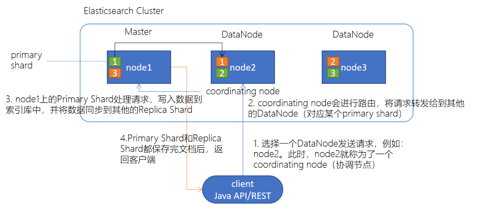
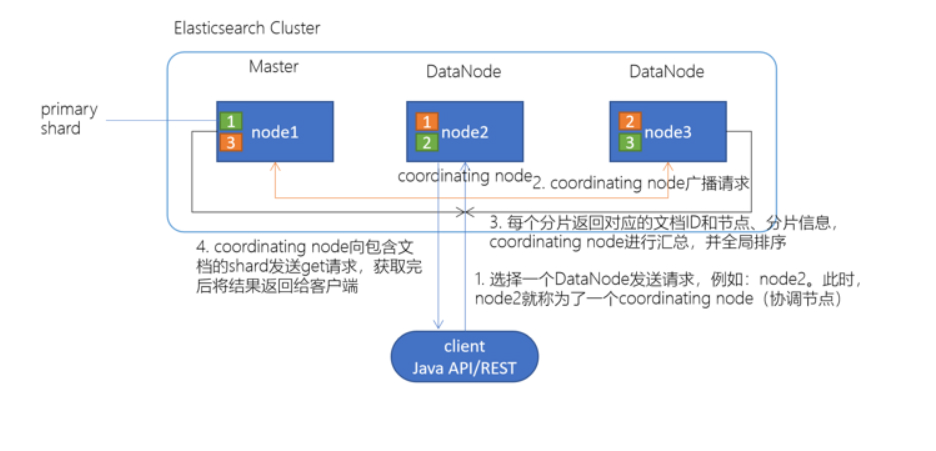
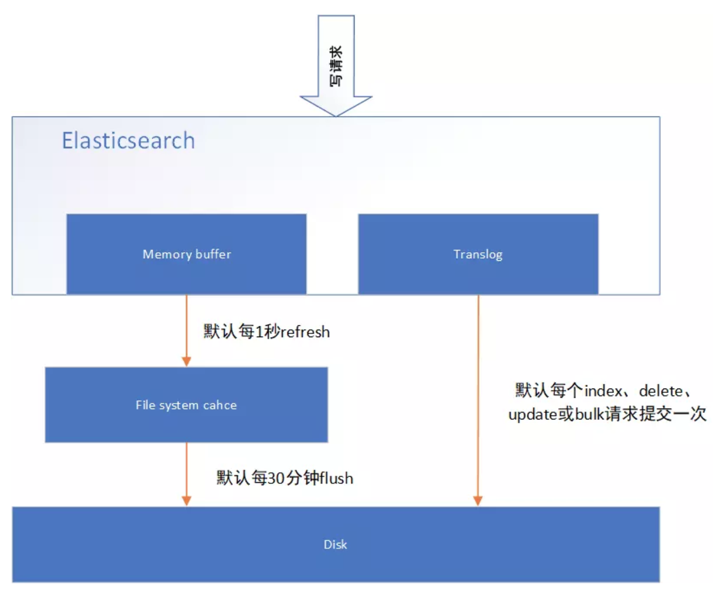

# 44-ElasticSearch集群架构原理与搜索技术深入

## **一.  Elasticsearch架构原理**  

### **1、Elasticsearch的节点类型**

在Elasticsearch主要分成两类节点，一类是Master，一类是DataNode。

#### **1.1  Master节点**

在Elasticsearch启动时，会选举出来一个Master节点。当某个节点启动后，然后使用`Zen Discovery`机制找到集群中的其他节点，并建立连接。

discovery.seed_hosts: ["192.168.21.130", "192.168.21.131", "192.168.21.132"]

并从候选主节点中选举出一个主节点。

cluster.initial_master_nodes: ["node1", "node2","node3"]

**Master节点主要负责：**

1. 管理索引（创建索引、删除索引）、分配分片
2.  维护元数据
3. 管理集群节点状态
4. 不负责数据写入和查询，比较轻量级
5. 一个Elasticsearch集群中，只有一个Master节点。

**在生产环境中，内存可以相对小一点，但机器要稳定。**

#### **1.2  DataNode节点**

在Elasticsearch集群中，会有N个DataNode节点。DataNode节点主要负责：**数据写入、数据检索**。

大部分Elasticsearch的压力都在DataNode节点上

**在生产环境中，内存最好配置大一些**

## **二 、分片和副本机制**

### **2.1  分片（Shard）**

 **Elasticsearch是一个分布式的搜索引擎，索引的数据也是分成若干部分，分布在不同的服务器节点中**

分布在不同服务器节点中的索引数据，就是分片（Shard）。Elasticsearch会自动管理分片，如果发现分片分布不均衡，就会自动迁移

**一个索引（index）由多个shard（分片）组成，而分片是分布在不同的服务器上的**

### **2.2  副本**

为了对Elasticsearch的分片进行容错，假设某个节点不可用，会导致整个索引库都将不可用。所以，需要对分片进行副本容错。每一个分片都会有对应的副本。

在Elasticsearch中，默认创建的索引为1个分片、每个分片有1个主分片和1个副本分片。

每个分片都会有一个Primary Shard（主分片），也会有若干个Replica Shard（副本分片）

**Primary Shard和Replica Shard不在同一个节点上**

### **2.3  指定分片、副本数量**

```txt
// 创建指定分片数量、副本数量的索引
PUT /job_idx_shard_temp
{
"mappings":{
"properties":{
"id":{"type":"long","store":true},
"area":{"type":"keyword","store":true},
"exp":{"type":"keyword","store":true},
"edu":{"type":"keyword","store":true},
"salary":{"type":"keyword","store":true},
"job_type":{"type":"keyword","store":true},
"cmp":{"type":"keyword","store":true},
"pv":{"type":"keyword","store":true},
"title":{"type":"text","store":true},
"jd":{"type":"text"}

}
},
"settings":{
"number_of_shards":3,
"number_of_replicas":2
}
}

// 查看分片、主分片、副本分片
GET /_cat/indices?v
```

## **三、Elasticsearch重要工作流程**

### **3.1  Elasticsearch文档写入原理**



1. 选择任意一个DataNode发送请求，例如：node2。此时，node2就成为一个coordinating node（协调节点）

2. 计算得到文档要写入的分片

   `shard = hash(routing) % number_of_primary_shards`

   routing 是一个可变值，默认是文档的 _id

3. coordinating node会进行路由，将请求转发给对应的primary shard所在的DataNode（假设primary shard在node1、replica shard在node2）

4. node1节点上的Primary Shard处理请求，写入数据到索引库中，并将数据同步到Replica shard

5. Primary Shard和Replica Shard都保存好了文档，返回client

### **3.2  Elasticsearch检索原理**



 client发起查询请求，某个DataNode接收到请求，该DataNode就会成为**协调节点（Coordinating Node）**。

 协调节点（Coordinating Node）将查询请求广播到每一个数据节点，这些数据节点的分片会处理该查询请求每个分片进行数据查询，将符合条件的数据放在一个优先队列中，并将这些数据的文档ID、节点信息、分片信息返回给协调节点。

协调节点将所有的结果进行汇总，并进行全局排序。

协调节点向包含这些文档ID的分片发送get请求，对应的分片将文档数据返回给协调节点，最后协调节点将数据返回给客户端。

## **四、Elasticsearch准实时索引实现**

### **4.1  溢写到文件系统缓存**

当数据写入到ES分片时，会首先写入到内存中，然后通过内存的buffer生成一个**segment**，并刷到**文件系统缓存**中，数据可以被检索（注意不是直接刷到磁盘）

**ES中默认1秒，refresh一次**

### **4.2  写translog保障容错**

在写入到内存中的同时，也会记录**translog**日志，在refresh期间出现异常，会根据translog来进行数据恢复，等到文件系统缓存中的segment数据都刷到磁盘中，清空translog文件

### **4.3  flush到磁盘**

ES默认每隔30分钟会将文件系统缓存的数据刷入到磁盘

### **4.4  segment合并**

Segment太多时，ES定期会将多个segment合并成为大的segment，减少索引查询时IO开销，此阶段ES会真正的物理删除（之前执行过的delete的数据）



## **五.手工控制搜索结果精准度**

### 5.1、下述搜索中，如果document中的remark字段包含java或developer词组，都符合搜索条件。

```txt
GET /es_db/_search
{
"query": {
"match": {
"remark": "java developer"
}
}
}
```

如果需要搜索的document中的remark字段，包含java和developer词组，则需要使用下述语法：

```txt
GET /es_db/_search
{
"query": {
"match": {
"remark": {
"query": "java developer",
"operator": "and"
}
}
}
}
```

上述语法中，如果将`operator`的值改为`or`。则与第一个案例搜索语法效果一致。默认的ES执行搜索的时候，operator就是or。

如果在搜索的结果document中，需要remark字段中包含多个搜索词条中的一定比例，可以使用下述语法实现搜索。其中`minimum_should_match`可以使用百分比或固定数字。百分比代表query搜索条件中词条百分比，如果无法整除，**向下匹配**（如，query条件有3个单词，如果使用百分比提供精准度计算，那么是无法除尽的，如果需要至少匹配两个单词，则需要用67%来进行描述。如果使用66%描述，ES则认为匹配一个单词即可。）。固定数字代表query搜索条件中的词条，至少需要匹配多少个。

```txt
GET /es_db/_search
{
"query": {
"match": {
"remark": {
"query": "java architect assistant",
"minimum_should_match": "68%"
}
}
}
}
```

如果使用`should+bool`搜索的话，也可以控制搜索条件的匹配度。具体如下：下述案例代表搜索的document中的remark字段中，必须匹配java、developer、assistant三个词条中的至少2个。

```txt
GET /es_db/_search
{
"query": {
"bool": {
"should": [
{ 
"match": {
"remark": "java"
} 
},
{
"match": {
"remark": "developer"
}
},
{
"match": {
"remark": "assistant"
}
}
],
"minimum_should_match": 2
}
}
}
```

### **5.2、match 的底层转换**

其实在ES中，执行match搜索的时候，ES底层通常都会对搜索条件进行底层转换，来实现最终的搜索结果。如：

```txt
GET /es_db/_search
{
"query": {
"match": {
"remark": "java developer"
}
}
}

转换后是：
GET /es_db/_search
{
"query": {
"bool": {
"should": [
{
"term": {
"remark": "java"
}
},
{
"term": {
"remark": {
"value": "developer"
}
}
}
]
}
}
}
```

```txt
GET /es_db/_search
{
"query": {
"match": {
"remark": {
"query": "java developer",
"operator": "and"
}
}
}
}

转换后是：
GET /es_db/_search
{
"query": {
"bool": {
"must": [
{
"term": {
"remark": "java"
}
},
{
"term": {
"remark": {
"value": "developer"
}
}
}
]
}
}
}
```

```txt
GET /es_db/_search
{
"query": {
"match": {
"remark": {
"query": "java architect assistant",
"minimum_should_match": "68%"
}
}
}
}

转换后为：
GET /es_db/_search
{
"query": {
"bool": {
"should": [
{
"term": {
"remark": "java"
}
},
{
"term": {
"remark": "architect"
}
},
{
"term": {
"remark": "assistant"
}
}
],
"minimum_should_match": 2
}
}
}
```

建议，如果不怕麻烦，尽量使用转换后的语法执行搜索，效率更高。

如果开发周期短，工作量大，使用简化的写法。

### **5.3、boost权重控制**

搜索document中remark字段中包含java的数据，如果remark中包含developer或architect，则包含architect的document优先显示。（就是将architect数据匹配时的相关度分数增加）。

一般用于搜索时相关度排序使用。如：电商中的综合排序。将一个商品的销量，广告投放，评价值，库存，单价比较综合排序。在上述的排序元素中，广告投放权重最高，库存权重最低。

```txt
GET /es_db/_search
{
"query": {
"bool": {
"must": [
{
"match": {
"remark": "java"
}
}
],
"should": [
{
"match": {
"remark": {
"query": "developer",
"boost" : 1
}
}
},
{
"match": {
"remark": {
"query": "architect",
"boost" : 3
}
}
}
]
}
}
}
```

### **5.4、基于dis_max实现best fields策略进行多字段搜索**

**best fields策略**： 搜索的document中的某一个field，尽可能多的匹配搜索条件。与之相反的是，尽可能多的字段匹配到搜索条件（**most fields策略**）。如百度搜索使用这种策略。

**优点：精确匹配的数据可以尽可能的排列在最前端，且可以通过minimum_should_match来去除长尾数据，避免长尾数据字段对排序结果的影响。**

**长尾数据**比如说我们搜索4个关键词，但很多文档只匹配1个，也显示出来了，这些文档其实不是我们想要的

**缺点：相对排序不均匀。**

**dis_max语法： 直接获取搜索的多条件中的，单条件query相关度分数最高的数据，以这个数据做相关度排序。**

下述的案例中，就是找name字段中rod匹配相关度分数或remark字段中java developer匹配相关度分数，哪个高，就使用哪一个相关度分数进行结果排序。

```txt
GET /es_db/_search
{
"query": {
"dis_max": {
"queries": [
{
"match": {
"name": "rod"
}
},
{
"match": {
"remark": "java developer"
}
}
]
}
}
}
```

**5.5、基于tie_breaker参数优化dis_max搜索效果**

dis_max是将多个搜索query条件中相关度分数最高的用于结果排序，忽略其他query分数，在某些情况下，可能还需要其他query条件中的相关度介入最终的结果排序，这个时候可以使用tie_breaker参数来优化dis_max搜索。tie_breaker参数代表的含义是：将其他query搜索条件的相关度分数乘以参数值，再参与到结果排序中。如果不定义此参数，相当于参数值为0。所以其他query条件的相关度分数被忽略。

```txt
GET /es_db/_search
{
"query": {
"dis_max": {
"queries": [
{
"match": {
"name": "rod"
}
},
{
"match": {
"remark": "java developer"
}
}
],
"tie_breaker":0.5
}
}
}
```

**5.6、使用multi_match简化dis_max+tie_breaker**

ES中相同结果的搜索也可以使用不同的语法语句来实现。不需要特别关注，只要能够实现搜索，就是完成任务！

如：

```txt
GET /es_db/_search
{
"query": {
"dis_max": {
"queries": [
{
"match": {
"name": "rod"
}
},
{
"match": {
"remark": {
"query": "java developer",
"boost" : 2,
"minimum_should_match": 2
}
}
}
],
"tie_breaker": 0.5
}
}
}

#使用multi_match语法为：其中type常用的有best_fields和most_fields。^n代表权重，相当于"boost":n。
GET /es_db/_search
{
"query": {
"multi_match": {
"query": "rod java developer",
"fields": ["name", "remark^2"],
"type": "best_fields",
"tie_breaker": 0.5,
"minimum_should_match" : "50%"
}
}
}
```

**5.7、cross fields搜索**

cross fields ： 一个唯一的标识，分部在多个fields中，使用这种唯一标识搜索数据就称为cross fields搜索。如：人名可以分为姓和名，地址可以分为省、市、区县、街道等。那么使用人名或地址来搜索document，就称为cross fields搜索。

实现这种搜索，一般都是使用most fields搜索策略。因为这就不是一个field的问题。

Cross fields搜索策略，是从多个字段中搜索条件数据。默认情况下，和most fields搜索的逻辑是一致的，计算相关度分数是和best fields策略一致的。一般来说，如果使用cross fields搜索策略，那么都会携带一个额外的参数operator。用来标记搜索条件如何在多个字段中匹配。

当然，在ES中也有cross fields搜索策略。具体语法如下：

```txt
GET /es_db/_search
{
"query": {
"multi_match": {
"query": "java developer",
"fields": ["name", "remark"],
"type": "cross_fields",
"operator" : "and"
}
}
}
```

上述语法代表的是，搜索条件中的java必须在name或remark字段中匹配，developer也必须在name或remark字段中匹配。

**most field策略问题：most fields策略是尽可能匹配更多的字段，所以会导致精确搜索结果排序问题。又因为cross fields搜索，不能使用minimum_should_match来去除长尾数据。**

**所以在使用most fields和cross fields策略搜索数据的时候，都有不同的缺陷。所以商业项目开发中，都推荐使用best fields策略实现搜索。**

**5.8、copy_to组合fields**

京东中，如果在搜索框中输入“手机”，点击搜索，那么是在商品的类型名称、商品的名称、商品的卖点、商品的描述等字段中，哪一个字段内进行数据的匹配？如果使用某一个字段做搜索不合适，那么使用_all做搜索是否合适？也不合适，因为_all字段中可能包含图片，价格等字段。

假设，有一个字段，其中的内容包括(但不限于)：商品类型名称、商品名称、商品卖点等字段的数据内容。是否可以在这个特殊的字段上进行数据搜索匹配？

```txt
{
  "category_name" : "手机",
  "product_name" : "一加6T手机",
  "price" : 568800,
  "sell_point" : "国产最好的Android手机",
  "tags": ["8G+128G", "256G可扩展"],
  "color" : "红色",
  "keyword" : "手机 一加6T手机 国产最好的Android手机"
}
```


copy_to : 就是将多个字段，复制到一个字段中，实现一个多字段组合。copy_to可以解决cross fields搜索问题，在商业项目中，也用于解决搜索条件默认字段问题。

如果需要使用copy_to语法，则需要在定义index的时候，手工指定mapping映射策略。

copy_to语法：

```txt
PUT /es_db/_mapping
{
"properties": {
"provice" : {
"type": "text",
"analyzer": "standard",
"copy_to": "address"
},
"city" : {
"type": "text",
"analyzer": "standard",
"copy_to": "address"
},
"street" : {
"type": "text",
"analyzer": "standard",
"copy_to": "address"
},
"address" : {
"type": "text",
"analyzer": "standard"
}
}
}
```

上述的mapping定义中，是新增了4个字段，分别是provice、city、street、address，其中provice、city、street三个字段的值，会自动复制到address字段中，实现一个字段的组合。那么在搜索地址的时候，就可以在address字段中做条件匹配，从而避免most fields策略导致的问题。在维护数据的时候，不需对address字段特殊的维护。因为address字段是一个组合字段，是由ES自动维护的。类似java代码中的推导属性。在存储的时候，未必存在，但是在逻辑上是一定存在的，因为address是由3个物理存在的属性province、city、street组成的。

**5.9、近似匹配**

前文都是精确匹配。如doc中有数据java assistant，那么搜索jave是搜索不到数据的。因为jave单词在doc中是不存在的。

如果搜索的语法是：

```txt
GET _search
{
"query" : {
"match" : {
"name" : "jave"
}
}
}
```


如果需要的结果是有特殊要求，如：hello world必须是一个完整的短语，不可分割；或document中的field内，包含的hello和world单词，且两个单词之间离的越近，相关度分数越高。那么这种特殊要求的搜索就是近似搜索。包括hell搜索条件在hello world数据中搜索，包括h搜索提示等都数据近似搜索的一部分。

如何上述特殊要求的搜索，使用match搜索语法就无法实现了。

**5.10、match phrase**

短语搜索。就是搜索条件不分词。代表搜索条件不可分割。

如果hello world是一个不可分割的短语，我们可以使用前文学过的短语搜索match phrase来实现。语法如下：

```txt
GET _search
{
"query": {
"match_phrase": {
"remark": "java assistant"
}
}
}
```

**-1)、 match phrase原理 -- term position**

ES是如何实现match phrase短语搜索的？其实在ES中，使用match phrase做搜索的时候，也是和match类似，首先对搜索条件进行分词-analyze。将搜索条件拆分成hello和world。既然是分词后再搜索，ES是如何实现短语搜索的？

这里涉及到了倒排索引的建立过程。在倒排索引建立的时候，ES会先对document数据进行分词，如：

```txt
GET _analyze
{
"text": "hello world, java spark",
"analyzer": "standard"
}
```

分词的结果是：

```txt
{
"tokens": [
    {
      "token": "hello",
      "start_offset": 0,
      "end_offset": 5,
      "type": "<ALPHANUM>",
      "position": 0
    },
    {
      "token": "world",
      "start_offset": 6,
      "end_offset": 11,
      "type": "<ALPHANUM>",
      "position": 1
    },
    {
      "token": "java",
      "start_offset": 13,
      "end_offset": 17,
      "type": "<ALPHANUM>",
      "position": 2
    },
    {
      "token": "spark",
      "start_offset": 18,
      "end_offset": 23,
      "type": "<ALPHANUM>",
      "position": 3
    }
  ]
}
```

从上述结果中，可以看到。ES在做分词的时候，除了将数据切分外，还会保留一个position。position代表的是这个词在整个数据中的下标。当ES执行match phrase搜索的时候，首先将搜索条件hello world分词为hello和world。然后在倒排索引中检索数据，如果hello和world都在某个document的某个field出现时，那么检查这两个匹配到的单词的position是否是连续的，如果是连续的，代表匹配成功，如果是不连续的，则匹配失败。

**-2). match phrase搜索参数 -- slop**

在做搜索操作的是，如果搜索参数是hello spark。而ES中存储的数据是hello world, java spark。那么使用match phrase则无法搜索到。在这个时候，可以使用match来解决这个问题。但是，当我们需要在搜索的结果中，做一个特殊的要求：hello和spark两个单词距离越近，document在结果集合中排序越靠前，这个时候再使用match则未必能得到想要的结果。

ES的搜索中，对match phrase提供了参数slop。slop代表match phrase短语搜索的时候，单词最多移动多少次，可以实现数据匹配。在所有匹配结果中，多个单词距离越近，相关度评分越高，排序越靠前。

这种使用slop参数的match phrase搜索，就称为近似匹配（proximity search）

如：

数据为： hello world, java spark

搜索为： match phrase : hello spark。

slop为： 3  （代表单词最多移动3次。）

执行短语搜索的时候，将条件hello spark分词为hello和spark两个单词。并且连续。

hello  spark

接下来，可以根据slop参数执行单词的移动。

下标 ：	0		1		2		3

doc  ：	hello	        world	      java		spark

搜索 ：     hello	        spark

移动1：	hello			      spark

移动2：	hello					       spark

匹配成功，不需要移动第三次即可匹配。

如果：

数据为： hello world, java spark

搜索为： match phrase : spark hello。

slop为： 5  （代表单词最多移动5次。）

执行短语搜索的时候，将条件hello spark分词为hello和spark两个单词。并且连续。

spark   hello

接下来，可以根据slop参数执行单词的移动。

下标 ：	0		1		2		3

doc  ：	hello	        world	       java	      spark

搜索 ：     spark	        hello

移动1：			spark/hello

移动2：	hello	        spark

移动3：	hello			        spark

移动4：	hello					      spark

匹配成功，不需要移动第五次即可匹配。

如果当slop移动次数使用完毕，还没有匹配成功，则无搜索结果。如果使用中文分词，则移动次数更加复杂，因为中文词语有重叠情况，很难计算具体次数，需要多次尝试才行。

测试案例：

英文：

```json
GET _analyze
{
"text": "hello world, java spark",
"analyzer": "standard"
}

POST /test_a/_doc/3
{
"f" : "hello world, java spark"
}

GET /test_a/_search
{
"query": {
"match_phrase": {
"f" : {
"query": "hello spark",
"slop" : 2
}
}
}
}

GET /test_a/_search
{
"query": {
"match_phrase": {
"f" : {
"query": "spark hello",
"slop" : 4
}
}
}
}
```

中文：

```txt
GET _analyze
{
"text": "中国，一个世界上最强的国家",
"analyzer": "ik_max_word"
}

POST /test_a/_doc/1
{
"f" : "中国，一个世界上最强的国家"
}

GET /test_a/_search
{
"query": {
"match_phrase": {
"f" : {
"query": "中国最强",
"slop" : 5
}
}
}
}

GET /test_a/_search
{
"query": {
"match_phrase": {
"f" : {
"query": "最强中国",
"slop" : 9
}
}
}
}
```


**六.经验分享**

使用match和proximity search实现召回率和精准度平衡。

召回率：召回率就是搜索结果比率，如：索引A中有100个document，搜索时返回多少个document，就是召回率（recall）。

精准度：就是搜索结果的准确率，如：搜索条件为hello java，在搜索结果中尽可能让短语匹配和hello java离的近的结果排序靠前，就是精准度（precision）。

如果在搜索的时候，只使用match phrase语法，会导致召回率底下，因为搜索结果中必须包含短语（包括proximity search）。

如果在搜索的时候，只使用match语法，会导致精准度底下，因为搜索结果排序是根据相关度分数算法计算得到。

那么如果需要在结果中兼顾召回率和精准度的时候，就需要将match和proximity search混合使用，来得到搜索结果。

测试案例：

```txt
POST /test_a/_doc/3
{
"f" : "hello, java is very good, spark is also very good"
}

POST /test_a/_doc/4
{
"f" : "java and spark, development language "
}

POST /test_a/_doc/5
{
"f" : "Java Spark is a fast and general-purpose cluster computing system. It provides high-level APIs in Java, Scala, Python and R, and an optimized engine that supports general execution graphs."
}

POST /test_a/_doc/6
{
"f" : "java spark and, development language "
}

GET /test_a/_search
{
"query": {
"match": {
"f": "java spark"
}
}
}

GET /test_a/_search
{
"query": {
"bool": {
"must": [
{
"match": {
"f": "java spark"
}
}
],
"should": [
{
"match_phrase": {
"f": {
"query": "java spark",
"slop" : 50
}
}
}
]
}
}
}
```

七、前缀搜索 prefix search

使用前缀匹配实现搜索能力。通常针对keyword类型字段，也就是不分词的字段。

语法：

```txt
GET /test_a/_search
{
"query": {
"prefix": {
"f.keyword": {
"value": "J"
}
}
}
}
```

**注意：针对前缀搜索，是对keyword类型字段而言。而keyword类型字段数据大小写敏感。**

前缀搜索效率比较低。前缀搜索不会计算相关度分数。前缀越短，效率越低。如果使用前缀搜索，建议使用长前缀。因为前缀搜索需要扫描完整的索引内容，所以前缀越长，相对效率越高。

**八、通配符搜索**

ES中也有通配符。但是和java还有数据库不太一样。通配符可以在倒排索引中使用，也可以在keyword类型字段中使用。

常用通配符： 

? - 一个任意字符

\* - 0~n个任意字符

```txt
GET /test_a/_search
{
"query": {
"wildcard": {
"f.keyword": {
"value": "?e*o*"
}
}
}
}
```

性能也很低，也是需要扫描完整的索引。不推荐使用。

**九、正则搜索**

ES支持正则表达式。可以在倒排索引或keyword类型字段中使用。

常用符号：

[] - 范围，如： [0-9]是0~9的范围数字

. - 一个字符

\+ - 前面的表达式可以出现多次。

```txt
GET /test_a/_search
{
"query": {
"regexp" : {
"f.keyword" : "[A-z].+"
}
}
}
```

性能也很低，需要扫描完整索引。

**十、搜索推荐**

搜索推荐： search as your type， 搜索提示。如：索引中有若干数据以“hello”开头，那么在输入hello的时候，推荐相关信息。（类似百度输入框）

语法：

```txt
GET /test_a/_search
{
"query": {
"match_phrase_prefix": {
"f": {
"query": "java s",
"slop" : 10,
"max_expansions": 10
}
}
}
}
```

其原理和match phrase类似，是先使用match匹配term数据（java），然后在指定的slop移动次数范围内，前缀匹配（s），max_expansions是用于指定prefix最多匹配多少个term（单词），超过这个数量就不再匹配了。

这种语法的限制是，只有最后一个term会执行前缀搜索。

执行性能很差，毕竟最后一个term是需要扫描所有符合slop要求的倒排索引的term。

因为效率较低，如果必须使用，则一定要使用参数max_expansions。

**十一、fuzzy模糊搜索技术**

搜索的时候，可能搜索条件文本输入错误，如：hello world -> hello word。这种拼写错误还是很常见的。fuzzy技术就是用于解决错误拼写的（在英文中很有效，在中文中几乎无效。）。其中fuzziness代表value的值word可以修改多少个字母来进行拼写错误的纠正（修改字母的数量包含字母变更，增加或减少字母。）。f代表要搜索的字段名称。

```txt
GET /test_a/_search
{
"query": {
"fuzzy": {
"f" : {
"value" : "word",
"fuzziness": 2
}
}
}
}
```

文档：03 ElasticSearch笔记-搜索技术深入与?..

链接：http://note.youdao.com/noteshare?id=5700368270f2702c4fa72c629b6a8562&sub=0C14230336424B7E9BFE0FBF5190C398