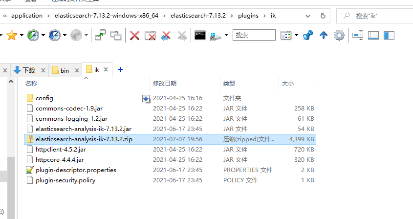

# elasticsearch 安装教程

## 下载

进入网站 [官网下载](https://www.elastic.co/cn/start)，下载:elasticsearch和 Kibana

进入GitHub下载ik分词插件

> 注意：版本都要一致

## Windows下安装配置教程

以下所有软件和插件的解压目录，均不能出现中文和空格！

### 配置elasticsearch

修改`config\elasticsearch.yml`

```yaml
#配置集群名称
cluster.name: cluster-es
#配置节点名称
node.name: node1
#数据目录
path.data: D:\application\elasticsearch-7.13.2-windows-x86_64\elasticsearch-7.13.2\data
#日志输出目录
path.logs: D:\application\elasticsearch-7.13.2-windows-x86_64\elasticsearch-7.13.2\log
network.host: 0.0.0.0
#端口号
http.port: 9200
discovery.seed_hosts: ["localhost"]
cluster.initial_master_nodes: ["node1"]
bootstrap.system_call_filter: false
bootstrap.memory_lock: false
http.cors.enabled: true
http.cors.allow-origin: "*"
```

修改`config\jvm.options`,指定jvm内存大小

```txt
-Xms500m
-Xmx500m
```

启动`bin\elasticsearch.bat`

访问 http://localhost:9200

```json
{
  "name" : "node1",
  "cluster_name" : "cluster-es",
  "cluster_uuid" : "dvYlP0PgSrWF-n3de8Ab4A",
  "version" : {
    "number" : "7.13.2",
    "build_flavor" : "default",
    "build_type" : "zip",
    "build_hash" : "4d960a0733be83dd2543ca018aa4ddc42e956800",
    "build_date" : "2021-06-10T21:01:55.251515791Z",
    "build_snapshot" : false,
    "lucene_version" : "8.8.2",
    "minimum_wire_compatibility_version" : "6.8.0",
    "minimum_index_compatibility_version" : "6.0.0-beta1"
  },
  "tagline" : "You Know, for Search"
}
```

### 配置Kibana

解压文件，修改配置文件`config\kibana.yml`

```yaml
server.port: 5601
server.host: "服务器IP"
elasticsearch.hosts: ["http://IP:9200"] #这里是elasticsearch的访问地址
```

启动 `bin\kibana.bat`，访问 http://localhost:5601

### 配置分词器

1. 在plugins下新建文件夹`ik`

2. 将下载的IK分词器压缩包复制到elasticsearch根目录的`plugins\ik`下。

3. 将压缩文件内容，提取到当前文件下即可,然后删除压缩包。

   

4. 重启elasticsearch 和 kibana。

### 安装 elasticsearch-head

[进入github下载 elasticsearch-head](https://github.com/mobz/elasticsearch-head/releases)

下载完成后，解压进入目录，使用`npm i`命令进行下载包文件，然后使用启动命令`npm run start` 启动即可。当启动完成后，浏览器访问 http://localhost:9100 即可。

> 注意:需要Node环境
