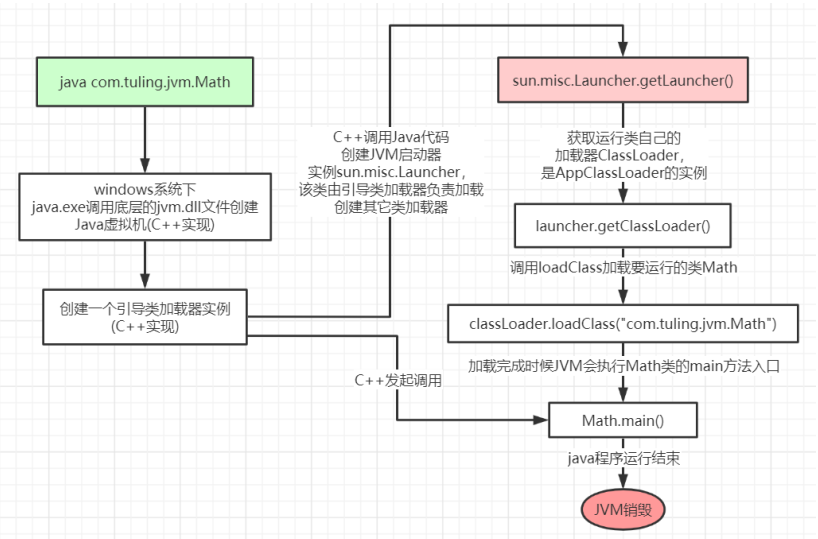
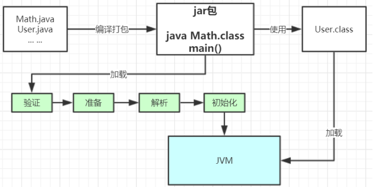
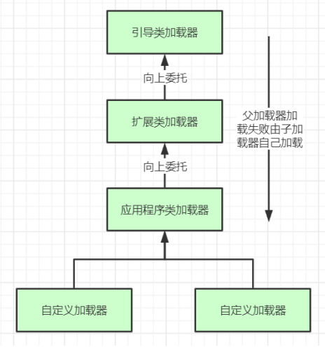
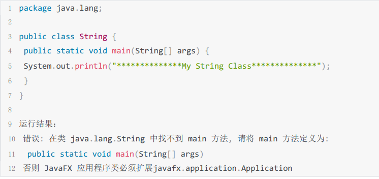
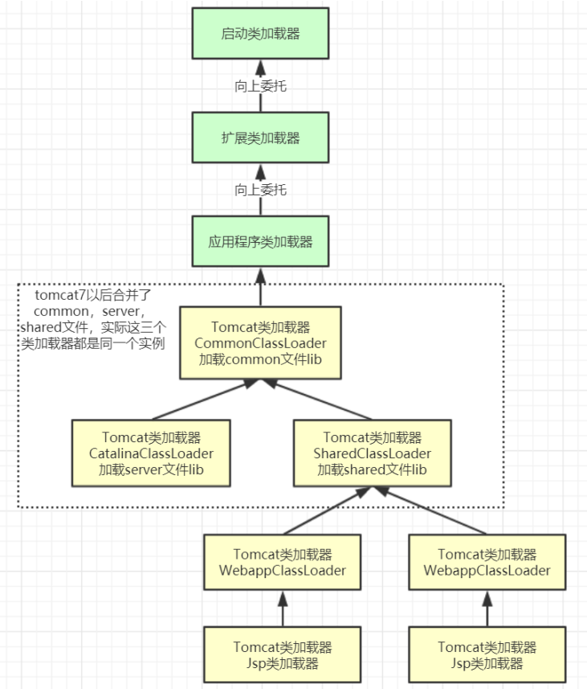

# 1.从JDK源码级别彻底剖析JVM类加载机制

## 类加载运行全过程 

当我们用java命令运行某个类的main函数启动程序时，首先需要通过类加载器把主类加载到JVM。  

```java
public class Math {
    public static final int initData = 666;
    public static User user = new User();

    public int compute() { // 一个方法对应一个栈帧内存区域
        int a = 1;
        int b = 2;
        int c = (a + b) * 10;
        return c;
    }

    public static void main(String[] args) {
        Math math = new Math();
        math.compute();
    }
}
```


通过Java命令执行代码的大体流程如下：  



> java 命令执行com.tuling.jvm.Math.class 字节码文件

其中loadClass的类加载过程有如下几步：  

**加载 >> 验证 >> 准备 >> 解析 >> 初始化** >> 使用 >> 卸载

+ 加载：在硬盘上查找并通过IO读入字节码文件，使用到类时才会加载，例如调用类的main()方法，new对象等等，在加载阶段会在内存中生成一个**代表这个类的java.lang.Class对象**，作为方法区（元空间）这个类的各种数据的访问入口 。
+ 验证：校验字节码文件的正确性。
+ 准备：给类的静态变量分配内存，并赋予默认值。
+ 解析：将**符号引用**替换为直接引用，该阶段会把一些静态方法(符号引用，比如main()方法)替换为指向数据所存内存的指针或句柄等(直接引用)，这是所谓的**静态链接**过程(类加载期间完成)，**动态链接**是在程序运行期间完成的将符号引用替换为直接引用。
+ 初始化：对类的静态变量初始化为指定的值，执行静态代码块。



类被加载到方法区中后主要包含 **运行时常量池、类型信息、字段信息、方法信息、类加载器的引用、对应class实例的引用**等信息。
**类加载器的引用**：这个类到类加载器实例的引用
**对应class实例的引用**：类加载器在加载类信息放到方法区中后，会创建一个对应的Class 类型的对象实例放到堆(Heap)中, 作为开发人员访问方法区中类定义的入口和切入点。

> **注意，**主类在运行过程中如果使用到其它类，会逐步加载这些类。jar包或war包里的类不是一次性全部加载的，是使用到时才加载。  

```java
public class TestDynamicLoad {
    public static void main(String[] args) {
        new A ();
        System.out.println("-====-");
        // B类不会被加载，只有在new B()时才加载
        B b = null;
    }
}
class A {
    static {
        System.out.println("static A");
    }
    public A () {
        System.out.println("Constructor A");
    }
}

class B {
    static {
        System.out.println("static B");
    }
    public B () {
        System.out.println("Constructor B");
    }
}
```

> 运行结果：
>
> ```txt
> static A
> Constructor A
> -====-
> ```

## 类加载器和双亲委派机制 

上面的类加载过程主要是通过类加载器来实现的，Java里有如下几种类加载器:

+ **引导类加载器**：负责加载支撑JVM运行的位于JRE的lib目录下的核心类库，比如 rt.jar、charsets.jar等
+ **扩展类加载器**：负责加载支撑JVM运行的位于JRE的lib目录下的ext扩展目录中的JAR类包
+ **应用程序类加载器**：负责加载ClassPath路径下的类包，主要就是加载你自己写的那些类
+ **自定义加载器**：负责加载用户自定义路径下的类包  

看一个**类加载器**示例：

```java
public class TestJDKClassLoader {
    public static void main(String[] args) {
        // 查看类加载器
        System.out.println(String.class.getClassLoader());
        System.out.println(com.sun.crypto.provider.DESKeyFactory.class.getClassLoader());
        System.out.println(TestJDKClassLoader.class.getClassLoader());

        System.out.println();
        ClassLoader systemClassLoader = ClassLoader.getSystemClassLoader();
        ClassLoader extClassLoader = systemClassLoader.getParent();;
        ClassLoader bootstrapClassLoader = extClassLoader.getParent();
        System.out.println("systemClassLoader = " + systemClassLoader);
        System.out.println("extClassLoader = " + extClassLoader);
        System.out.println("bootstrapClassLoader = " + bootstrapClassLoader);

        System.out.println();
        System.out.println("bootstrapLoader 加载以下文件：");
        URL[] urLs = Launcher.getBootstrapClassPath().getURLs();
        for (int i = 0; i < urLs.length; i++) {
            System.out.println("urLs[i] = " + urLs[i]);
        }

        System.out.println();
        System.out.println("extClassLoader加载以下文件：");
        System.out.println(System.getProperty("java.ext.dirs"));

        System.out.println();
        System.out.println("appClassLoader加载以下文件：");
        System.out.println(System.getProperty("java.class.path"));
    }
}
```

> 运行结果：
>
> ```txt
> null
> sun.misc.Launcher$ExtClassLoader@29453f44
> sun.misc.Launcher$AppClassLoader@18b4aac2
> 
> systemClassLoader = sun.misc.Launcher$AppClassLoader@18b4aac2
> extClassLoader = sun.misc.Launcher$ExtClassLoader@29453f44
> bootstrapClassLoader = null
> 
> bootstrapLoader 加载以下文件：
> urLs[i] = file:/C:/Program%20Files/Java/jdk1.8.0_181/jre/lib/resources.jar
> urLs[i] = file:/C:/Program%20Files/Java/jdk1.8.0_181/jre/lib/rt.jar
> urLs[i] = file:/C:/Program%20Files/Java/jdk1.8.0_181/jre/lib/sunrsasign.jar
> urLs[i] = file:/C:/Program%20Files/Java/jdk1.8.0_181/jre/lib/jsse.jar
> urLs[i] = file:/C:/Program%20Files/Java/jdk1.8.0_181/jre/lib/jce.jar
> urLs[i] = file:/C:/Program%20Files/Java/jdk1.8.0_181/jre/lib/charsets.jar
> urLs[i] = file:/C:/Program%20Files/Java/jdk1.8.0_181/jre/lib/jfr.jar
> urLs[i] = file:/C:/Program%20Files/Java/jdk1.8.0_181/jre/classes
> 
> extClassLoader加载以下文件：
> C:\Program Files\Java\jdk1.8.0_181\jre\lib\ext;C:\Windows\Sun\Java\lib\ext
> 
> appClassLoader加载以下文件：
> C:\Program Files\Java\jdk1.8.0_181\jre\lib\charsets.jar;C:\Program Files\Java\jdk1.8.0_181\jre\lib\deploy.jar;C:\Program Files\Java\jdk1.8.0_181\jre\lib\ext\access-bridge-64.jar;C:\Program Files\Java\jdk1.8.0_181\jre\lib\ext\cldrdata.jar;C:\Program Files\Java\jdk1.8.0_181\jre\lib\ext\dnsns.jar;C:\Program Files\Java\jdk1.8.0_181\jre\lib\ext\jaccess.jar;C:\Program Files\Java\jdk1.8.0_181\jre\lib\ext\jfxrt.jar;C:\Program Files\Java\jdk1.8.0_181\jre\lib\ext\localedata.jar;C:\Program Files\Java\jdk1.8.0_181\jre\lib\ext\nashorn.jar;C:\Program Files\Java\jdk1.8.0_181\jre\lib\ext\sunec.jar;C:\Program Files\Java\jdk1.8.0_181\jre\lib\ext\sunjce_provider.jar;C:\Program Files\Java\jdk1.8.0_181\jre\lib\ext\sunmscapi.jar;C:\Program Files\Java\jdk1.8.0_181\jre\lib\ext\sunpkcs11.jar;C:\Program Files\Java\jdk1.8.0_181\jre\lib\ext\zipfs.jar;C:\Program Files\Java\jdk1.8.0_181\jre\lib\javaws.jar;C:\Program Files\Java\jdk1.8.0_181\jre\lib\jce.jar;C:\Program Files\Java\jdk1.8.0_181\jre\lib\jfr.jar;C:\Program Files\Java\jdk1.8.0_181\jre\lib\jfxswt.jar;C:\Program Files\Java\jdk1.8.0_181\jre\lib\jsse.jar;C:\Program Files\Java\jdk1.8.0_181\jre\lib\management-agent.jar;C:\Program Files\Java\jdk1.8.0_181\jre\lib\plugin.jar;C:\Program Files\Java\jdk1.8.0_181\jre\lib\resources.jar;C:\Program Files\Java\jdk1.8.0_181\jre\lib\rt.jar;D:\workspace\my-workspace\document\图灵学院\tuling\target\classes;C:\Users\e-Feilong.Chen\.m2\repository\org\openjdk\jol\jol-core\0.9\jol-core-0.9.jar;D:\Program Files\IntelliJ IDEA 2021.1.2\lib\idea_rt.jar
> 
> Process finished with exit code 0
> ```


### 类加载器初始化过程：

参见类运行加载全过程图可知其中会创建JVM启动器实sun.misc.Launcher。sun.misc.Launcher初始化使用了单例模式设计，保证一个JVM虚拟机内只有一个sun.misc.Launcher实例。

在Launcher构造方法内部，其创建了两个类加载器，分别是sun.misc.Launcher.ExtClassLoader(扩展类加载器)和sun.misc.Launcher.AppClassLoader(应用类加载器)。

JVM默认使用Launcher的getClassLoader()方法返回的类加载器AppClassLoader的实例加载我们的应用程序。  

Launcher的构造方法：

```java
public Launcher() {
    Launcher.ExtClassLoader var1;
    try {
        //构造扩展类加载器，在构造的过程中将其父加载器设置为null
        var1 = Launcher.ExtClassLoader.getExtClassLoader();
    } catch (IOException var10) {
        throw new InternalError("Could not create extension class loader", var10);
    }

    try {
        //构造应用类加载器，在构造的过程中将其父加载器设置为ExtClassLoader，
        //Launcher的loader属性值是AppClassLoader，我们一般都是用这个类加载器来加载我们自己写的应用程序
        this.loader = Launcher.AppClassLoader.getAppClassLoader(var1);
    } catch (IOException var9) {
        throw new InternalError("Could not create application class loader", var9);
    }

    Thread.currentThread().setContextClassLoader(this.loader);
    String var2 = System.getProperty("java.security.manager");
    if (var2 != null) {
        SecurityManager var3 = null;
        if (!"".equals(var2) && !"default".equals(var2)) {
            try {
                var3 = (SecurityManager)this.loader.loadClass(var2).newInstance();
            } catch (IllegalAccessException var5) {
            } catch (InstantiationException var6) {
            } catch (ClassNotFoundException var7) {
            } catch (ClassCastException var8) {
            }
        } else {
            var3 = new SecurityManager();
        }

        if (var3 == null) {
            throw new InternalError("Could not create SecurityManager: " + var2);
        }
        System.setSecurityManager(var3);
    }
}
```


### 双亲委派机制  

JVM类加载器是有亲子层级结构的，如下图  



这里类加载其实就有一个**双亲委派机制**，加载某个类时会先委托父加载器寻找目标类，找不到再委托上层父加载器加载，如果所有父加载器在自己的加载类路径下都找不到目标类，则在自己的类加载路径中查找并载入目标类。

比如我们的Math类，最先会找应用程序类加载器加载，应用程序类加载器会先委托扩展类加载器加载，扩展类加载器再委托引导类加载器，顶层引导类加载器在自己的类加载路径里找了半天没找到Math类，则向下退回加载Math类的请求，扩展类加载器收到回复就自己加载，在自己的类加载路径里找了半天也没找到Math类，又向下退回Math类的加载请求给应用程序类加载器，应用程序类加载器于是在自己的类加载路径里找Math类，结果找到了就自己加载了。

**双亲委派机制说简单点就是，先找父亲加载，不行再由儿子自己加载**

我们来看下应用程序类加载器AppClassLoader加载类的双亲委派机制源码，**AppClassLoader**的**loadClass**方法最终会调用其父类ClassLoader的loadClass方法，该方法的大体逻辑如下：

1. 首先，检查一下指定名称的类是否已经加载过，如果加载过了，就不需要再加载，直接返回。
2. 如果此类没有加载过，那么再判断一下是否有父加载器；如果有父加载器，则由父加载器加载（即调用parent.loadClass(name, false);或者是调用bootstrap类加载器来加载。
3. 如果父加载器及bootstrap类加载器都没有找到指定的类，那么调用当前类加载器的findClass方法来完成类加载。  

```java
// ClassLoader的loadClass方法，里面实现了双亲委派机制
protected Class<?> loadClass(String name, boolean resolve)
        throws ClassNotFoundException
    {
        synchronized (getClassLoadingLock(name)) {
            // First, check if the class has already been loaded
            // 检查当前类加载器是否已经加载了该类
            Class<?> c = findLoadedClass(name);
            if (c == null) {
                long t0 = System.nanoTime();
                try {
                    //如果当前加载器父加载器不为空则委托父加载器加载该类
                    if (parent != null) {
                        c = parent.loadClass(name, false);
                    } else { //如果当前加载器父加载器为空则委托引导类加载器加载该类
                        c = findBootstrapClassOrNull(name);
                    }
                } catch (ClassNotFoundException e) {
                    // ClassNotFoundException thrown if class not found
                    // from the non-null parent class loader
                }

                if (c == null) {
                    // If still not found, then invoke findClass in order
                    // to find the class.
                    long t1 = System.nanoTime();
                    //都会调用URLClassLoader的findClass方法在加载器的类路径里查找并加载该类
                    c = findClass(name);

                    // this is the defining class loader; record the stats
                    sun.misc.PerfCounter.getParentDelegationTime().addTime(t1 - t0);
                    sun.misc.PerfCounter.getFindClassTime().addElapsedTimeFrom(t1);
                    sun.misc.PerfCounter.getFindClasses().increment();
                }
            }
            //不会执行
            if (resolve) {
                resolveClass(c);
            }
            return c;
        }
    }
```

### 为什么要设计双亲委派机制？

+ 沙箱安全机制：自己写的java.lang.String.class类不会被加载，这样便可以防止核心API库被随意篡改
+ 避免类的重复加载：当父亲已经加载了该类时，就没有必要子ClassLoader再加载一次，保证**被加载类的唯一性**  

看一个类加载示例：  



#### 全盘负责委托机制

**“全盘负责”**是指当一个ClassLoder装载一个类时，除非显示的使用另外一个ClassLoder，该类所依赖及引用的类也由这个ClassLoder载入。  

### 自定义类加载器示例：  

自定义类加载器只需要继承` java.lang.ClassLoader` 类，该类有两个核心方法，一个是loadClass(String, boolean)，实现了**双亲委派机制**，还有一个方法是findClass，默认实现是空方法，所以我们自定义类加载器主要是**重写**findClass**方法**。 

```java
public class MyClassLoaderTest {
    public static void main(String[] args) throws ClassNotFoundException, InstantiationException, IllegalAccessException, NoSuchMethodException, InvocationTargetException {
        // 初始化自定义类加载器，会先初始化父类ClassLoader，其中会把自定义类加载器的父加载器设置为应用程序类加载器AppClassLoader
        MyClassLoader myClassLoader = new MyClassLoader("D:/test");
        // D盘创建 test/com/tuling/jvm/jvm1 几级目录，将User.class丢入该目录
        Class clazz = myClassLoader.loadClass("com.tuling.jvm.jvm1.User1");
        Object obj = clazz.newInstance();
        Method method = clazz.getDeclaredMethod("sout", null);
        method.invoke(obj, null);
        // 类加载打印
        System.out.println(clazz.getClassLoader().getClass().getName());
    }
    static class MyClassLoader extends ClassLoader {
        private String classPath;
        public MyClassLoader(String classPath){
            this.classPath = classPath;
        }

        @Override
        protected Class<?> findClass(String name) throws ClassNotFoundException {
            try {
                byte[] data = loadByte(name);
                return defineClass(name, data, 0, data.length);
            } catch (IOException e) {
                e.printStackTrace();
            }
            return super.findClass(name);
        }


        private byte[] loadByte(String name) throws IOException {
            name = name.replaceAll("\\.", "/");
            FileInputStream fis = new FileInputStream(classPath + "/" + name + ".class");
            int len = fis.available();
            byte[] data = new byte[len];
            fis.read(data);
            fis.close();
            return data;
        }
    }
}
```

> 打印如下：
>
> ```txt
> User111 sout 方法输出
> com.tuling.jvm.jvm1.MyClassLoaderTest$MyClassLoader
> ```
>
> 注意：自定义的类加载器的父类加载器是AppClassLoader
>
> 上面User1.java
> 
> ```java
> package com.tuling.jvm.jvm1;
>
> public class User1 {
>
>  public void sout(){
>     System.out.println("User111 sout 方法输出");
>  }
> }
> ```


### 打破双亲委派机制  

再来一个沙箱安全机制示例，尝试打破双亲委派机制，用自定义类加载器加载我们自己实现的java.lang.String.class

```java
public class MyClassLoaderTest {
    public static void main(String[] args) throws ClassNotFoundException, InstantiationException, IllegalAccessException, NoSuchMethodException, InvocationTargetException {
        // 初始化自定义类加载器，会先初始化父类ClassLoader，其中会把自定义类加载器的父加载器设置为应用程序类加载器AppClassLoader
        MyClassLoader myClassLoader = new MyClassLoader("D:/test");
        // D盘创建 test/com/tuling/jvm/jvm1 几级目录，将User.class丢入该目录
        Class clazz = myClassLoader.loadClass("java.lang.String");
        Object obj = clazz.newInstance();
        Method method = clazz.getDeclaredMethod("sout", null);
        method.invoke(obj, null);
        // 类加载打印
        System.out.println(clazz.getClassLoader().getClass().getName());
    }
    static class MyClassLoader extends ClassLoader {
        private String classPath;
        public MyClassLoader(String classPath){
            this.classPath = classPath;
        }

        /**
         * 重写类加载方法，实现自己的加载逻辑，不委派给双亲加载
         * @param name
         * @param resolve
         * @return
         * @throws ClassNotFoundException
         */
        @Override
        protected Class<?> loadClass(String name, boolean resolve) throws ClassNotFoundException {
            synchronized (getClassLoadingLock(name)) {
                // First, check if the class has already been loaded
                Class<?> c = findLoadedClass(name);
                if (c == null) {
                    long t0 = System.nanoTime();
                    c = findClass(name);
//                    try {
//                        if (parent != null) {
//                            c = parent.loadClass(name, false);
//                        } else {
//                            c = findBootstrapClassOrNull(name);
//                        }
//                    } catch (ClassNotFoundException e) {
//                        // ClassNotFoundException thrown if class not found
//                        // from the non-null parent class loader
//                    }

                    if (c == null) {
                        // If still not found, then invoke findClass in order
                        // to find the class.
                        long t1 = System.nanoTime();
                        c = findClass(name);

                        // this is the defining class loader; record the stats
                        sun.misc.PerfCounter.getParentDelegationTime().addTime(t1 - t0);
                        sun.misc.PerfCounter.getFindClassTime().addElapsedTimeFrom(t1);
                        sun.misc.PerfCounter.getFindClasses().increment();
                    }
                }
                if (resolve) {
                    resolveClass(c);
                }
                return c;
            }
        }

        @Override
        protected Class<?> findClass(String name) throws ClassNotFoundException {
            try {
                byte[] data = loadByte(name);
                return defineClass(name, data, 0, data.length);
            } catch (IOException e) {
                e.printStackTrace();
            }
            return super.findClass(name);
        }


        private byte[] loadByte(String name) throws IOException {
            name = name.replaceAll("\\.", "/");
            FileInputStream fis = new FileInputStream(classPath + "/" + name + ".class");
            int len = fis.available();
            byte[] data = new byte[len];
            fis.read(data);
            fis.close();
            return data;
        }
    }
}
```

> 输出：包名禁止使用
>
> ```txt
> Exception in thread "main" java.lang.SecurityException: Prohibited package name: java.lang
> 	at java.lang.ClassLoader.preDefineClass(ClassLoader.java:662)
> 	at java.lang.ClassLoader.defineClass(ClassLoader.java:761)
> 	at java.lang.ClassLoader.defineClass(ClassLoader.java:642)
> 	at com.tuling.jvm.jvm1.MyClassLoaderTest$MyClassLoader.findClass(MyClassLoaderTest.java:82)
> 	at com.tuling.jvm.jvm1.MyClassLoaderTest$MyClassLoader.loadClass(MyClassLoaderTest.java:47)
> 	at java.lang.ClassLoader.loadClass(ClassLoader.java:357)
> 	at com.tuling.jvm.jvm1.MyClassLoaderTest.main(MyClassLoaderTest.java:20)
> ```
>
> 


### Tomcat打破双亲委派机制

以Tomcat类加载为例，Tomcat 如果使用默认的双亲委派类加载机制行不行？

我们思考一下：Tomcat是个web容器， 那么它要解决什么问题：

1. 一个web容器可能需要部署两个应用程序，不同的应用程序可能会**依赖同一个第三方类库的不同版本**，不能要求同一个类库在同一个服务器只有一份 ，因此要保证每个应用程序的类库都是独立的，保证相互隔离。
2. 部署在同一个web容器中相同的类库相同的版本可以共享。否则，如果服务器有10个应用程序，那么要有10份相同的类库加载进虚拟机。
3. **web容器也有自己依赖的类库，不能与应用程序的类库混淆**。基于安全考虑，应该让容器的类库和程序的类库隔离开来。
4. web容器要支持jsp的修改，我们知道，jsp 文件最终也是要编译成class文件才能在虚拟机中运行，但程序运行后修改jsp已经是司空见惯的事情， web容器需要支持 jsp 修改后不用重启。

再看看我们的问题：Tomcat 如果使用默认的双亲委派类加载机制行不行？
答案是不行的。为什么？

+ 第一个问题，如果使用默认的类加载器机制，那么是无法加载两个相同类库的不同版本的，默认的类加器是不管你是什么版本的，只在乎你的全限定类名，并且只有一份。
+ 第二个问题，默认的类加载器是能够实现的，因为他的职责就是保证唯一性。
+ 第三个问题和第一个问题一样。
+ 我们再看第四个问题，我们想我们要怎么实现jsp文件的热加载，jsp 文件其实也就是class文件，那么如果修改了，但类名还是一样，类加载器会直接取方法区中已经存在的，修改后的jsp是不会重新加载的。那么怎么办呢？我们可以直接卸载掉这jsp文件的类加载器，所以你应该想到了，每个jsp文件对应一个唯一的类加载器，当一个jsp文件修改了，就直接卸载这个jsp类加载器。重新创建类加载器，重新加载jsp文件。  

#### Tomcat自定义加载器详解  



**tomcat的几个主要类加载器：**

+ commonLoader：Tomcat最基本的类加载器，加载路径中的class可以被Tomcat容器本身以及各个Webapp访问；
+ catalinaLoader：Tomcat容器私有的类加载器，加载路径中的class对于Webapp不可见；
+ sharedLoader：各个Webapp共享的类加载器，加载路径中的class对于所有Webapp可见，但是对于Tomcat容器不可见；
+ WebappClassLoader：各个Webapp私有的类加载器，加载路径中的class只对当前Webapp可见，比如加载war包里相关的类，每个war包应用都有自己的WebappClassLoader，实现相互隔离，比如不同war包应用引入了不同的spring版本，这样实现就能加载各自的spring版本；

从图中的委派关系中可以看出：
CommonClassLoader能加载的类都可以被CatalinaClassLoader和SharedClassLoader使用，从而实现了公有类库的共用，而CatalinaClassLoader和SharedClassLoader自己能加载的类则与对方相互隔离。

WebAppClassLoader可以使用SharedClassLoader加载到的类，但各个WebAppClassLoader实例之间相互隔离。而JasperLoader的加载范围仅仅是这个JSP文件所编译出来的那一个.Class文件，它出现的目的就是为了被丢弃：当Web容器检测到JSP文件被修改时，会替换掉目前的JasperLoader的实例，并通过再建立一个新的Jsp类加载器来实现JSP文件的热加载功能。

tomcat 这种类加载机制违背了java 推荐的双亲委派模型了吗？答案是：违背了。很显然，tomcat 不是这样实现，tomcat 为了实现隔离性，没有遵守这个约定，**每个
webappClassLoader加载自己的目录下的class文件，不会传递给父类加载器，打破了双亲委
派机制**。
**模拟实现Tomcat的webappClassLoader加载自己war包应用内不同版本类实现相互共存与隔
离**  

```java
package com.tuling.jvm.jvm1;

import java.io.FileInputStream;
import java.io.FileNotFoundException;
import java.io.IOException;
import java.lang.reflect.InvocationTargetException;
import java.lang.reflect.Method;

/**
 * @author e-Feilong.Chen
 * @version 1.0
 * @description TODO
 * @date 2021/7/1 17:25
 */
public class MyClassLoaderTest {
    public static void main(String[] args) throws ClassNotFoundException, InstantiationException, IllegalAccessException, NoSuchMethodException, InvocationTargetException {
        // 初始化自定义类加载器，会先初始化父类ClassLoader，其中会把自定义类加载器的父加载器设置为应用程序类加载器AppClassLoader
        MyClassLoader myClassLoader = new MyClassLoader("D:/test");
        // D盘创建 test/com/tuling/jvm/jvm1 几级目录，将User.class丢入该目录
        Class clazz = myClassLoader.loadClass("com.tuling.jvm.jvm1.User1");
        Object obj = clazz.newInstance();
        Method method = clazz.getDeclaredMethod("sout", null);
        method.invoke(obj, null);

        MyClassLoader myClassLoader2 = new MyClassLoader("D:/test1");
        Class clazz2 = myClassLoader2.loadClass("com.tuling.jvm.jvm1.User1");
        Object obj2 = clazz2.newInstance();
        Method method2 = clazz2.getDeclaredMethod("sout", null);
        method2.invoke(obj2, null);
        // 类加载打印
        System.out.println(clazz.getClassLoader().getClass().getName());
    }
    static class MyClassLoader extends ClassLoader {
        private String classPath;
        public MyClassLoader(String classPath){
            this.classPath = classPath;
        }

        /**
         * 重写类加载方法，实现自己的加载逻辑，不委派给双亲加载
         * @param name
         * @param resolve
         * @return
         * @throws ClassNotFoundException
         */
        @Override
        protected Class<?> loadClass(String name, boolean resolve) throws ClassNotFoundException {
            synchronized (getClassLoadingLock(name)) {
                // First, check if the class has already been loaded
                Class<?> c = findLoadedClass(name);
                if (c == null) {
                    long t0 = System.nanoTime();
                    if (!name.startsWith("com.tuling.jvm")) {
                        c = this.getParent().loadClass(name);
                    } else {
                        c = findClass(name);
                    }
                }
                if (resolve) {
                    resolveClass(c);
                }
                return c;
            }
        }

        @Override
        protected Class<?> findClass(String name) throws ClassNotFoundException {
            try {
                byte[] data = loadByte(name);
                return defineClass(name, data, 0, data.length);
            } catch (IOException e) {
                e.printStackTrace();
            }
            return super.findClass(name);
        }


        private byte[] loadByte(String name) throws IOException {
            name = name.replaceAll("\\.", "/");
            FileInputStream fis = new FileInputStream(classPath + "/" + name + ".class");
            int len = fis.available();
            byte[] data = new byte[len];
            fis.read(data);
            fis.close();
            return data;
        }
    }
}

```

> 输出打印：
>
> ```txt
> User1-1 sout 方法输出
> User1-2 sout 方法输出
> com.tuling.jvm.jvm1.MyClassLoaderTest$MyClassLoader
> ```
>
> 注意：同一个JVM内，两个相同包名和类名的类对象可以共存，因为他们的类加载器可以不一样，所以看两个类对象是否是同一个，除了看类的包名和类名是否都相同之外，还需要他们的类加载器也是同一个才能认为他们是同一个。


javap命令

```cmd
javap -c Math.class
javap -v Math.class
```

