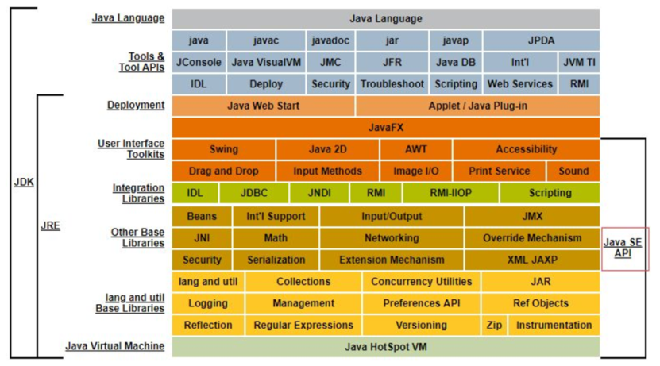
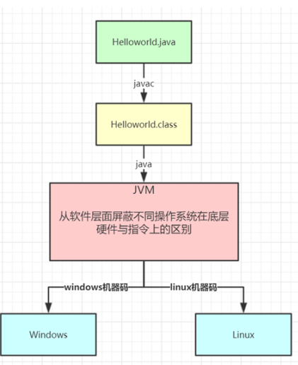
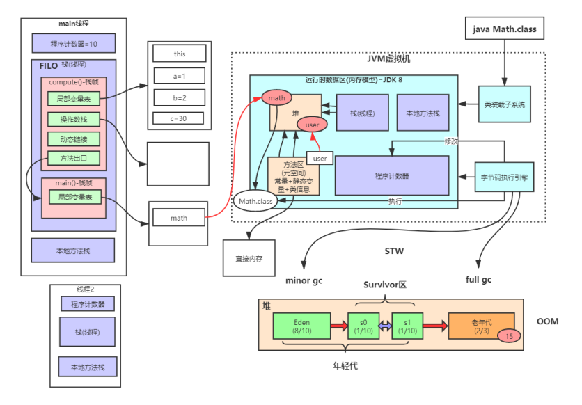
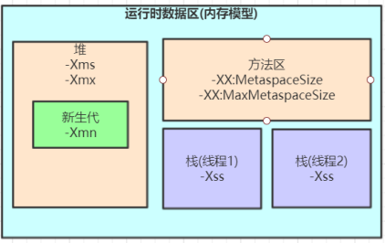
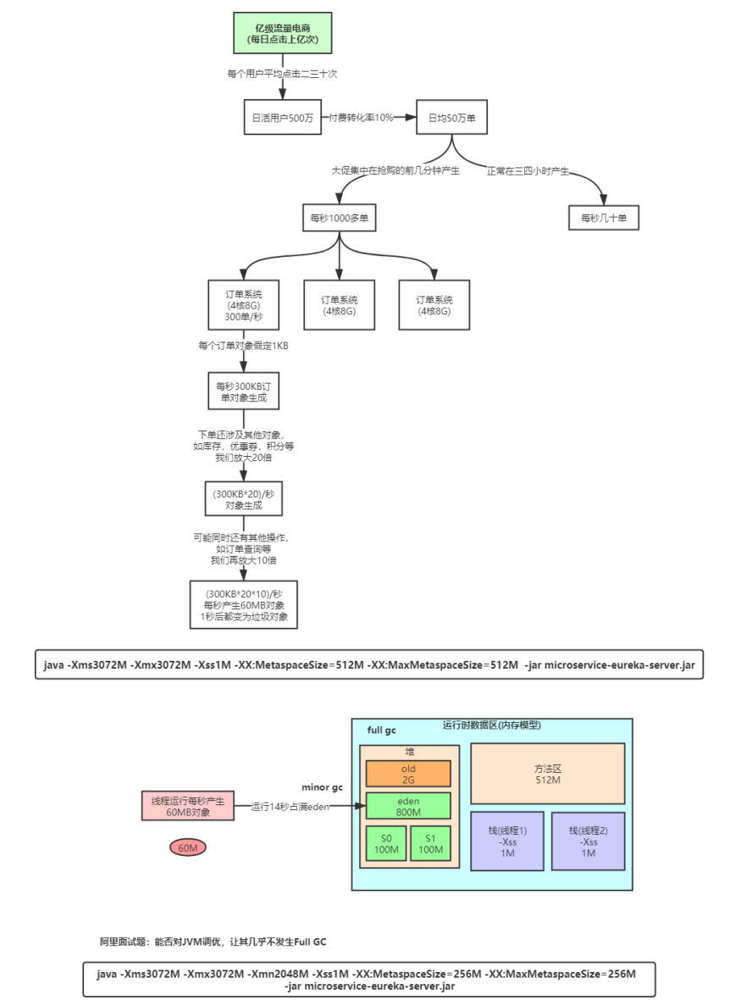
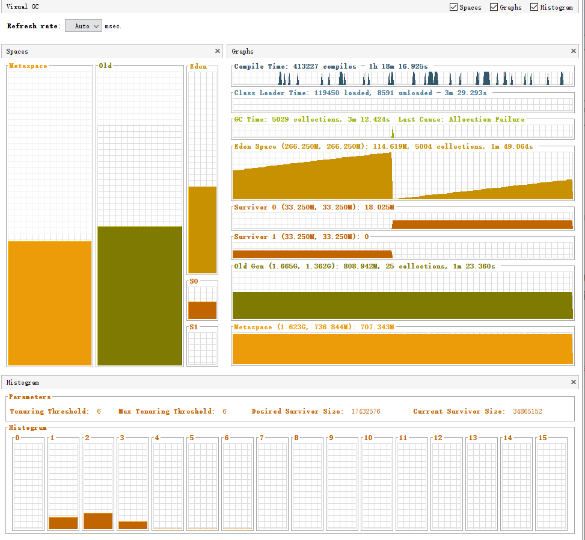

# JVM内存模型深度剖析与优化

## JDK体系结构



## Java语言的跨平台特性  



## JVM整体结构及内存模型  



## 二、JVM内存参数设置  



Spring Boot程序的JVM参数设置格式(Tomcat启动直接加在bin目录下catalina.sh文件里)：  

```bash
java ‐Xms2048M ‐Xmx2048M ‐Xmn1024M ‐Xss512K ‐XX:MetaspaceSize=256M ‐XX:MaxMetaspaceSize=256M ‐jar microservice‐eureka‐server.ja
```

关于元空间的JVM参数有两个：-XX:MetaspaceSize=N和 -XX:MaxMetaspaceSize=N
**-XX：MaxMetaspaceSize**： 设置元空间最大值， 默认是-1， 即不限制， 或者说只受限于本地内存大小。
**-XX：MetaspaceSize**： 指定元空间触发Fullgc的初始阈值(元空间无固定初始大小)， 以字节为单位，默认是21M，达到该值就会触发full gc进行类型卸载， 同时收集器会对该值进行调整： 如果释放了大量的空间， 就适当降低该值； 如果释放了很少的空间， 那么在不超过-XX：MaxMetaspaceSize（如果设置了的话） 的情况下， 适当提高该值。这个跟早期jdk版本的**-XX:PermSize**参数意思不一样，**-XX:PermSize**代表永久代的初始容量。由于调整元空间的大小需要Full GC，这是非常昂贵的操作，如果应用在启动的时候发生大量Full GC，通常都是由于永久代或元空间发生了大小调整，基于这种情况，一般建议在JVM参数中将MetaspaceSize和MaxMetaspaceSize设置成一样的值，并设置得比初始值要大，对于8G物理内存的机器来说，一般我会将这两个值都设置为256M。  

StackOverflowError示例 ：

```java
// JVM设置 ‐Xss128k(默认1M)
public class StackOverflowTest {
    static int count = 0;

    static void redo(){
        count ++;
        redo();
    }

    public static void main(String[] args) {
        try {
            redo();
        } catch (Throwable e) {
            e.printStackTrace();
            System.out.println(count);
        }
    }
}
```

> 运行结果：
>
> java.lang.StackOverflowError
> 	at com.mianshi.jvm.StackOverflowTest.redo(StackOverflowTest.java:17)
> 	at com.mianshi.jvm.StackOverflowTest.redo(StackOverflowTest.java:17)
>
> 1944
>
> 结论：
> -Xss设置越小count值越小，说明一个线程栈里能分配的栈帧就越少，但是对JVM整体来说能开启的线程数会更多。


**JVM内存参数大小该如何设置？**
JVM参数大小设置并没有固定标准，需要根据实际项目情况分析，给大家举个例子
**日均百万级订单交易系统如何设置JVM参数:**  



结论：通过上面这些内容介绍，大家应该对JVM优化有些概念了，就是尽可能让对象都在新生代里分配和回收，尽量别让太多对象频繁进入老年代，避免频繁对老年代进行垃圾回收，同时给系统充足的内存大小，避免新生代频繁的进行垃圾回收。  

文档：02-VIP-JVM内存模型深度剖析与优化  

```bash
http://note.youdao.com/noteshare?id=ad3d29fc27ff8bd44e9a2448d3e2706d&sub=AC12369487BB46F2B3006BB4F3148D01
```

## jvisualvm 介绍

[安装教程](https://blog.csdn.net/qq_42428264/article/details/103030022)


### 区域划分



整个区域分为三部分：**spaces、graphs、histogram**

1. **spaces区域：**代表虚拟机内存分布情况。从图中可以看出，虚拟机被分为Perm（Metaspace）、Old、Eden、S0、S1

   > 注意：如果对每个区域基本概念不是很熟悉的可以先了解下java虚拟机运行时数据区这篇文字。

   1. perm（Metaspace）：英文叫做Permanent Generation，我们称之为永久代。(根据深入java虚拟机作者说明，这里说法不是不是很正确，因为hotspot虚拟机的设计团队选择把GC分代收集扩展至此而已，正确的应该叫做方法区或者非堆)。
      1. 通过VM Args:`-XX:PermSize=128m -XX:MaxPermSize=256m` 设置初始值与最大值
      2. heap：java堆(java heap)。它包括老年代(图中Old区域)和新生代(图中Eden/S0/S1三个统称新生代，分为Eden区和两个Survivor区域)，他们默认是8:1:1分配内存。
         1. 通过VM Args: `-xms512m -Xmx512m -XX:+HeapDumpOnOutofMemoryError -Xmn100m -XX:SurvivorRatio=8` 设置初始堆内存、最大堆内存、内存异常打印dump、新生代内存、新生代内存分配比例(8:1:1)，因为Heap分为新生代跟老年代，所以512M-100M=412M，老年代就是412M(初始内存跟最大内存最好相等，防止内存不够时扩充内存或者Full GC，导致性能降低)
   2. Graphs区域：内存使用详细介绍
      1. Compile Time(编译时间)：413227 compiles 表示编译总数，1h 18m 16.925s 表示编译累计时间。一个脉冲表示一次JIT编译，窄脉冲表示持续时间短，宽脉冲表示持续时间长。
      2. Class Loader Time(类加载时间):119450 loaded表示加载类数量, 8591 unloaded表示卸载的类数量，3m 29.293s表示类加载花费的时间。
      3. GC Time(GC Time)：5029 collections表示垃圾收集的总次数，3m 12.424s 表示垃圾收集花费的时间，last cause表示最近垃圾收集的原因。
      4. Eden Space(Eden 区)：括号内的266.250M表示最大容量，266.250M表示当前容量，后面的114.619M表示当前使用情况，5004 collections表示垃圾收集次数，1m 49.064s表示垃圾收集花费时间。
      5. Survivor 0/Survivor 1(S0和S1区)：括号内的33.250M表示最大容量，33.250M表示当前容量，之后的值是当前使用情况。
      6. Old Gen(老年代)：括号内的1.665G表示最大容量，1.362G表示当前容量，之后的808.942M表示当前使用情况，25 collections表示垃圾收集次数 ，1m 23.360s 表示垃圾收集花费时间。
      7. Perm Gen(永久代 Metaspace)：括号内的1.623G表示最大容量，736.844M表示当前容量，之后的707.343M表示当前使用情况。
   3. Histogram区域：survivor区域参数跟年龄柱状图
      1. Tenuring Threshold：表示新生代年龄大于当前值则进入老年代。
      2. Max Tenuring Threshold：表示新生代最大年龄值。
      3. Tenuring Threshold与Max Tenuring Threshold区别：Max TenuringThreshold是一个最大限定，所有的新生代年龄都不能超过当前值，而Tenuring Threshold是个动态计算出来的临时值，一般情况与Max Tenuring Threshold相等，如果在Suivivor空间中，相同年龄所有对象大小的总和大于Survivor空间的一半，则年龄大于或者等于该年龄的对象就都可以直接进入老年代(如果计算出来年龄段是5，则Tenuring Threshold=5，age>=5的Suivivor对象都符合要求)，它才是新生代是否进入老年代判断的依据。
      4. Desired Survivor Size：Survivor空间大小验证阙值(默认是survivor空间的一半)，用于Tenuring Threshold判断对象是否提前进入老年代。
      5. Current Survivor Size：当前survivor空间大小。
      6. histogram柱状图：表示年龄段对象的存储柱状图。
      7. 如果显示指定-XX:+UseParallelGC --新生代并行、老年代串行收集器 ，则histogram柱状图不支持当前收集器。

引用：
http://www.oracle.com/technetwork/java/visualgc-136680.html
http://www.oracle.com/technetwork/java/javase/tech/vmoptions-jsp-140102.html  
