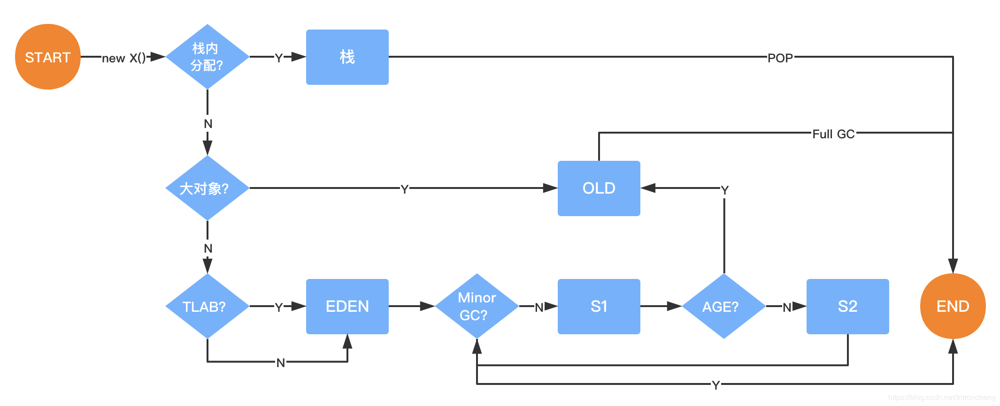

# 3.JVM内存分配机制详解

## 对象的创建

对象创建的主要流程:  


### 1.类加载检查

​		虚拟机遇到一条new指令时，首先将去检查这个指令的参数是否能在常量池中定位到一个类的符号引用，并且检这个符号引用代表的类是否已被加载、解析和初始化过。如果没有，那必须先执行相应的类加载过程。new指令对应到语言层面上讲是，new关键词、对象克隆、对象序列化等。

### 2.分配内存

​		在类加载检查通过后，接下来虚拟机将为新生对象分配内存。对象所需内存的大小在类 加载完成后便可完全确定，为对象分配空间的任务等同于把 一块确定大小的内存从Java堆中划分出来。
这个步骤有两个问题：

+ 如何划分内存。
+ 在并发情况下， 可能出现正在给对象A分配内存，指针还没来得及修改，对象B又同时使用了原来的指针来分配内存的情况。

#### 划分内存的方法：

+ “指针碰撞”（Bump the Pointer）(默认用指针碰撞)
  如果Java堆中内存是绝对规整的，所有用过的内存都放在一边，空闲的内存放在另一边，中间放着一个指针作为分界点的指示器，那所分配内存就仅仅是把那个指针向空闲空间那边挪动一段与对象大小相等的距离。
+ “空闲列表”（Free List）
  如果Java堆中的内存并不是规整的，已使用的内存和空 闲的内存相互交错，那就没有办法简单地进行指针碰撞了，虚拟机就必须维护一个列表，记 录上哪些内存块是可用的，在分配的时候从列表中找到一块足够大的空间划分给对象实例，并更新列表上的记录。

#### 解决并发问题的方法：

+ CAS（compare and swap）
  虚拟机采用CAS配上失败重试的方式保证更新操作的原子性来对分配内存空间的动作进行同步处理。
+ 本地线程分配缓冲（Thread Local Allocation Buffer,TLAB）
  把内存分配的动作按照线程划分在不同的空间之中进行，即每个线程在Java堆中预先分配一小块内存。通过`-XX:+/­-UseTLAB`参数来设定虚拟机是否使用TLAB(JVM会默认开启`­-XX:+UseTLAB`)，`-­XX:TLABSize` 指定TLAB大小。

### 3.初始化

内存分配完成后，虚拟机需要将分配到的内存空间都初始化为零值（不包括对象头）， 如果使用TLAB，这一工作过程也可以提前至TLAB分配时进行。这一步操作保证了对象的实例字段在Java代码中可以不赋初始值就直接使用，程序能访问到这些字段的数据类型所对应的零值。

### 4.设置对象头

初始化零值之后，虚拟机要对对象进行必要的设置，例如这个对象是哪个类的实例、如何才能找到类的元数据信息、对象的哈希码、对象的GC分代年龄等信息。这些信息存放在对象的对象头Object Header之中。在HotSpot虚拟机中，对象在内存中存储的布局可以分为3块区域：对象头（Header）、 实例数据（Instance Data）和对齐填充（Padding）。 HotSpot虚拟机的对象头包括两部分信息，第一部分用于存储对象自身的运行时数据， 如哈希码（HashCode）、GC分代年龄、锁状态标志、线程持有的锁、偏向线程ID、偏向时 间戳等。对象头的另外一部分是类型指针，即对象指向它的类元数据的指针，虚拟机通过这个指针来确定这个对象是哪个类的实例。  


对象头在hotspot的C++源码里的注释如下：  


### 5.执行\<init\>方法

执行\<init\>方法，即对象按照程序员的意愿进行初始化。对应到语言层面上讲，就是为属性赋值（注意，这与上面的赋零值不同，这是由程序员赋的值），和执行构造方法。

#### 对象大小与指针压缩

对象大小可以用 jol­-core包查看，引入依赖 ：

```xml
<dependency>
    <groupId>org.openjdk.jol</groupId>
    <artifactId>jol‐core</artifactId>4
    <version>0.9</version>
</dependency>
```

```java
/**
 * 类描述：
 * 计算对象大小
 * @Author msi
 * @Date 2021-06-30 19:40
 * @Version 1.0
 */
public class JOLSample {
    public static void main(String[] args) {
        ClassLayout layout = ClassLayout.parseInstance(new Object());
        System.out.println("layout.toPrintable() = " + layout.toPrintable());
        ClassLayout layout1 = ClassLayout.parseInstance(new int[]{});
        System.out.println("layout1.toPrintable() = " + layout1.toPrintable());
        ClassLayout layout2 = ClassLayout.parseInstance(new A());
        System.out.println("layout2.toPrintable() = " + layout2.toPrintable());
    }

    // -XX:+UseCompressedOops 默认开启的压缩所有指针
    // ‐XX:+UseCompressedClassPointers 默认开启的压缩对象头里的类型指针Klass Pointer
    // Oops : Ordinary Object Pointers
    public static class A {
        //8B mark word
        //4B Klass Pointer 如果关闭压缩‐XX:‐UseCompressedClassPointers或‐XX:‐UseCompressedOops，则占用8B
        int id; //4B
        String name; //4B 如果关闭压缩‐XX:‐UseCompressedOops，则占用8B
        byte b; //1B
        Object o; //4B 如果关闭压缩‐XX:‐UseCompressedOops，则占用8B
    }
}
```

输出结果：

```txt
layout.toPrintable() = java.lang.Object object internals:
 OFFSET  SIZE   TYPE DESCRIPTION                               VALUE
      0     4        (object header)                           01 00 00 00 (00000001 00000000 00000000 00000000) (1)
      4     4        (object header)                           00 00 00 00 (00000000 00000000 00000000 00000000) (0)
      8     4        (object header)                           e5 01 00 f8 (11100101 00000001 00000000 11111000) (-134217243)
     12     4        (loss due to the next object alignment)
Instance size: 16 bytes
Space losses: 0 bytes internal + 4 bytes external = 4 bytes total

layout1.toPrintable() = [I object internals:
 OFFSET  SIZE   TYPE DESCRIPTION                               VALUE
      0     4        (object header)                           01 00 00 00 (00000001 00000000 00000000 00000000) (1)
      4     4        (object header)                           00 00 00 00 (00000000 00000000 00000000 00000000) (0)
      8     4        (object header)                           6d 01 00 f8 (01101101 00000001 00000000 11111000) (-134217363)
     12     4        (object header)                           00 00 00 00 (00000000 00000000 00000000 00000000) (0)
     16     0    int [I.<elements>                             N/A
Instance size: 16 bytes
Space losses: 0 bytes internal + 0 bytes external = 0 bytes total

layout2.toPrintable() = com.tuling.jvm.jvm3.JOLSample$A object internals:
 OFFSET  SIZE               TYPE DESCRIPTION                               VALUE
      0     4                    (object header)                           01 00 00 00 (00000001 00000000 00000000 00000000) (1)
      4     4                    (object header)                           00 00 00 00 (00000000 00000000 00000000 00000000) (0)
      8     4                    (object header)                           63 cc 00 f8 (01100011 11001100 00000000 11111000) (-134165405)
     12     4                int A.id                                      0
     16     1               byte A.b                                       0
     17     3                    (alignment/padding gap)                  
     20     4   java.lang.String A.name                                    null
     24     4   java.lang.Object A.o                                       null
     28     4                    (loss due to the next object alignment)
Instance size: 32 bytes
Space losses: 3 bytes internal + 4 bytes external = 7 bytes total
```

##### 什么是java对象的**指针压缩**？  

1. jdk1.6 update14 开始，在64bit操作系统中，JVM支持指针压缩
2. jvm配置参数:`UseCompressedOops`，`compressed­­`--压缩、oop(ordinary object pointer)­­--对象指针
3. 启用指针压缩:`-­XX:+UseCompressedOops`(**默认开启**)，禁止指针压缩:`-­XX:­-UseCompressedOops`

##### 为什么要进行指针压缩？

1. 在64位平台的HotSpot中使用32位指针，内存使用会多出1.5倍左右，使用较大指针在主内存和缓存之间移动数据，**占用较大宽带，同时GC也会承受较大压力**。
2. 为了减少64位平台下内存的消耗，启用指针压缩功能
3. 在jvm中，32位地址最大支持4G内存(2的32次方)，可以通过对对象指针的压缩编码、解码方式进行优化，使得jvm只用32位地址就可以支持更大的内存配置(小于等于32G)
4. 堆内存小于4G时，不需要启用指针压缩，jvm会直接去除高32位地址，即使用低虚拟地址空间
5. 堆内存大于32G时，压缩指针会失效，会强制使用64位(即8字节)来对java对象寻址，这就会出现1的问题，所以堆内存不要大于32G为好

#### 对象内存分配

对象内存分配流程图



对象栈上分配
我们通过JVM内存分配可以知道JAVA中的对象都是在堆上进行分配，当对象没有被引用的时候，需要依靠GC进行回收内
存，如果对象数量较多的时候，会给GC带来较大压力，也间接影响了应用的性能。为了减少临时对象在堆内分配的数
量，JVM通过逃逸分析确定该对象不会被外部访问。如果不会逃逸可以将该对象在栈上分配内存，这样该对象所占用的
内存空间就可以随栈帧出栈而销毁，就减轻了垃圾回收的压力。
对象逃逸分析：就是分析对象动态作用域，当一个对象在方法中被定义后，它可能被外部方法所引用，例如作为调用参
数传递到其他地方中。  
