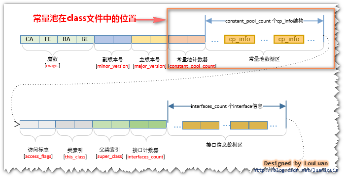
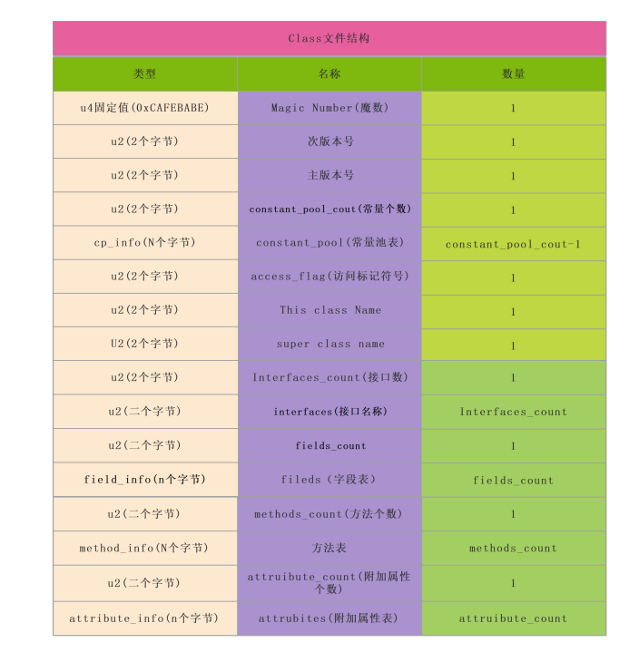
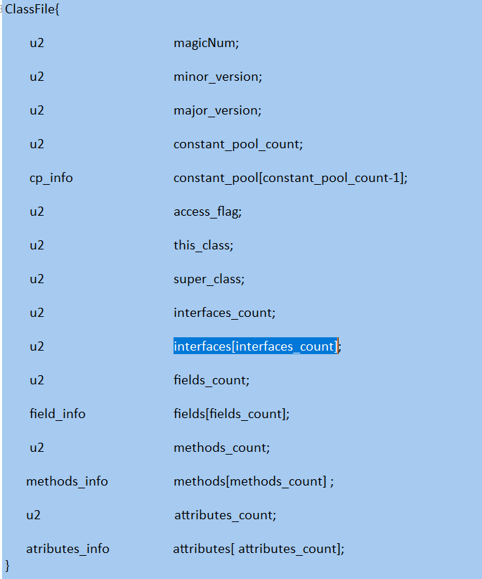
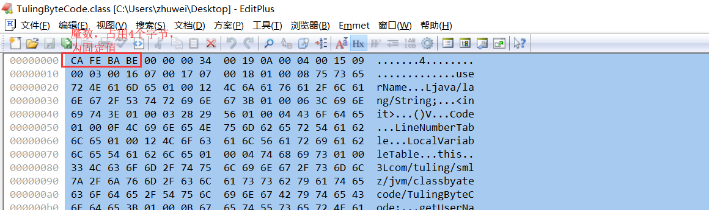
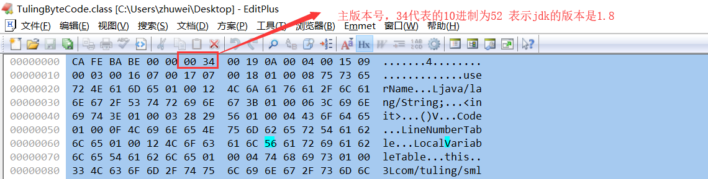
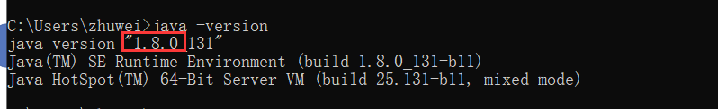

# 4.JVM字节码文件结构深度剖析

**源代码**

```java
public class TulingByteCode {
    private String userName;

    public String getUserName() {
        return userName;
    }

    public void setUserName(String userName) {
        this.userName = userName;
    }
}
```

**通过我们javap -verbose TulingByteCode .class反编译**

```txt
//表示我们通过反编译的来源是哪个字节码文件
Classfile /D:/workspace/my-workspace/document/图灵学院/tuling/target/classes/com/tuling/jvm/jvm4/TulingByteCode.class
//最后修改日期；文件大小
Last modified 2021-7-6; size 569 bytes
//文件的md5值
MD5 checksum 4b809708e279cd1d078048aecd2b482f
//.class文件是通过哪个源文件编译过来的
Compiled from "TulingByteCode.java"
//字节码的详细信息
public class com.tuling.jvm.jvm4.TulingByteCode
//jdk的次版本号
minor version: 0
//jdk的主版本号
major version: 52
//访问权限
flags: ACC_PUBLIC, ACC_SUPER
//常量池
Constant pool:
 #1 = Methodref          #4.#20         // java/lang/Object."<init>":()V
   #2 = Fieldref           #3.#21         // com/tuling/jvm/jvm4/TulingByteCode.userName:Ljava/lang/String;
   #3 = Class              #22            // com/tuling/jvm/jvm4/TulingByteCode
   #4 = Class              #23            // java/lang/Object
   #5 = Utf8               userName
   #6 = Utf8               Ljava/lang/String;
   #7 = Utf8               <init>
   #8 = Utf8               ()V
   #9 = Utf8               Code
  #10 = Utf8               LineNumberTable
  #11 = Utf8               LocalVariableTable
  #12 = Utf8               this
  #13 = Utf8               Lcom/tuling/jvm/jvm4/TulingByteCode;
  #14 = Utf8               getUserName
  #15 = Utf8               ()Ljava/lang/String;
  #16 = Utf8               setUserName
  #17 = Utf8               (Ljava/lang/String;)V
  #18 = Utf8               SourceFile
  #19 = Utf8               TulingByteCode.java
  #20 = NameAndType        #7:#8          // "<init>":()V
  #21 = NameAndType        #5:#6          // userName:Ljava/lang/String;
  #22 = Utf8               com/tuling/jvm/jvm4/TulingByteCode
  #23 = Utf8               java/lang/Object
{
 //构造方法
  public com.tuling.jvm.jvm4.TulingByteCode();
    descriptor: ()V
    flags: ACC_PUBLIC
    Code:
      stack=1, locals=1, args_size=1
         0: aload_0
         1: invokespecial #1                  // Method java/lang/Object."<init>":()V
         4: return
      LineNumberTable:
        line 9: 0
      LocalVariableTable:
        Start  Length  Slot  Name   Signature
            0       5     0  this   Lcom/tuling/jvm/jvm4/TulingByteCode;
  //get方法
  public java.lang.String getUserName();
    descriptor: ()Ljava/lang/String;
    flags: ACC_PUBLIC
    Code:
      stack=1, locals=1, args_size=1
         0: aload_0
         1: getfield      #2                  // Field userName:Ljava/lang/String;
         4: areturn
      LineNumberTable:
        line 13: 0
      LocalVariableTable:
        Start  Length  Slot  Name   Signature
            0       5     0  this   Lcom/tuling/jvm/jvm4/TulingByteCode;
  // set方法
  public void setUserName(java.lang.String);
    descriptor: (Ljava/lang/String;)V
    flags: ACC_PUBLIC
    Code:
      stack=2, locals=2, args_size=2
         0: aload_0
         1: aload_1
         2: putfield      #2                  // Field userName:Ljava/lang/String;
         5: return
      LineNumberTable:
        line 17: 0
        line 18: 5
      LocalVariableTable:
        Start  Length  Slot  Name   Signature
            0       6     0  this   Lcom/tuling/jvm/jvm4/TulingByteCode;
            0       6     1 userName   Ljava/lang/String;
}
SourceFile: "TulingByteCode.java"
```

**class文件通过16进制查看器打开如下:**


我们class文件结构图



Class文件结构参照表:



Class文件结构伪代码



3.1)我们通过javap -verbose来分析一个字节码的时候，将会分析字节
码文件的魔数,主 次版本号,常量池，类信息，类的构造方法，类的中的方
法信息，类变量与成员变量等信息.
魔数: 文件的开头的 四个字节 是固定 值位 0xCAFEBABE



3.2)次版本号(minor version):二个字节00 00 表示jdk的次版本号


3.3)主版本号(major version):二个字节 00 34 表示为jdk的主版本号，34对于10
进制为52
那么52代表的是1.8，51代表的是1.7 等等一直类推下去



所以通过主次版本号来确定我们jdk的版本是1.8.0



3.4)常量池入口，占用二个字节,表示常量池中的个数=00 19 (25)-1=24个, 为啥
需要-1，因为常量池中的第0个位置被我们的jvm占用了表示为null 所以我们通过
编译出来的常量池索引是从1开始的.

